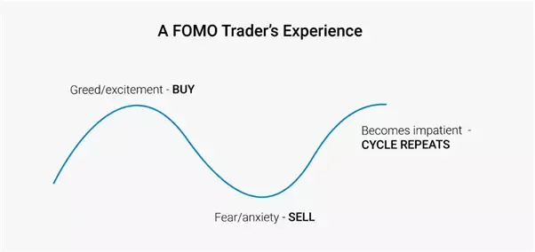

## Table of Contents

## What is FOMO and how does it relate to trading?

FOMO stands for "Fear Of Missing Out." It's a feeling people get when they think others are having fun or doing something cool, and they're not part of it. In everyday life, FOMO can make someone feel left out or anxious about missing a good time.

In trading, FOMO can be really strong. It happens when traders see a stock or cryptocurrency going up in value, and they rush to buy it because they're afraid of missing out on the profits. This can lead to quick, emotional decisions that aren't always smart. Sometimes, this rush to buy can make the price go even higher, but it can also lead to big losses if the price suddenly drops.

## How can FOMO affect a beginner trader's decision-making process?

FOMO can really mess with a beginner trader's head. When they see other people making money on a trade, they might feel like they have to jump in right away. This fear of missing out can make them buy things without thinking it through. They might not even look at important stuff like the company's financial health or market trends. Instead, they just see the price going up and think, "I need to get in now!"

This kind of quick decision-making can lead to big mistakes. Beginner traders might buy at the peak of a price surge, only to see the price drop soon after. They could lose a lot of money because they didn't take the time to do their homework. Plus, the stress of trying to keep up with every hot tip or trend can make trading a lot less fun and a lot more nerve-wracking.

## What are some common signs of FOMO in trading?

When someone is feeling FOMO in trading, they might start buying things really fast. They see a stock or a [cryptocurrency](/wiki/cryptocurrency) going up and they jump in without thinking much. They might not even check if it's a good idea to buy it. They just see others making money and they want to do the same, so they rush to buy without doing their homework.

Another sign is when a trader keeps checking their phone or computer all the time. They're always looking at prices and news, worried they'll miss out on the next big thing. This can make them feel stressed and anxious. They might also start following every hot tip they hear, even if it doesn't make sense, just because they're scared of missing out on a good deal.

## Can you explain the psychological impact of FOMO on traders?

FOMO can make traders feel really stressed and anxious. When they see prices going up and others making money, they get worried that they'll miss out on a good opportunity. This fear can push them to make quick decisions without thinking things through. They might buy something just because everyone else is buying it, even if it doesn't make sense for them. This can lead to a lot of stress because they're always worried about missing the next big thing.

Over time, this constant worry and stress can wear traders down. They might start to feel like they're always chasing the next big win, which can make trading feel more like a stressful job than something fun or exciting. This can also lead to burnout, where they get so tired and stressed that they don't want to trade anymore. In the end, FOMO can make trading a lot less enjoyable and a lot more nerve-wracking.

## What strategies can traders use to manage FOMO?

One good way to manage FOMO is to make a trading plan and stick to it. This means deciding ahead of time what you want to buy, when you want to buy it, and when you want to sell it. If you have a plan, you won't feel so rushed to jump into every hot trade you see. You'll feel more in control because you're following your own rules, not just following what everyone else is doing.

Another helpful strategy is to take breaks from looking at the markets all the time. It's easy to get caught up in checking prices every few minutes, but that can make FOMO worse. Try setting specific times to check your trades and then do something else in between. This can help you relax and not feel like you have to be glued to your screen all the time. It's also good to talk to other traders or a mentor about how you're feeling. They can give you advice and help you see that it's okay to miss out on some trades.

## How does FOMO influence market trends and volatility?

FOMO can make the market go up and down a lot. When a lot of people see a stock or cryptocurrency going up, they get scared of missing out on making money. So, they all start buying it at the same time. This can make the price go up even faster because so many people are trying to buy it. But then, if the price gets too high too fast, it might suddenly drop. This is because some people might start selling to take their profits, and others might get scared and sell too. This rush to buy and then sell can make the market really unpredictable and volatile.

Sometimes, FOMO can start a trend where a lot of people buy the same thing, making its price go up a lot. This can create what people call a "bubble." A bubble happens when the price of something goes way up because of hype, not because it's actually worth that much. When the bubble pops, the price can fall really fast, and a lot of people can lose money. So, FOMO doesn't just affect individual traders; it can make the whole market move in big, unexpected ways.

## What are the long-term effects of trading based on FOMO?

Trading based on FOMO can lead to big problems over time. If traders keep buying things just because they're scared of missing out, they might end up losing a lot of money. They might buy at the top of a price surge and then see the price drop, leaving them with losses. This can happen again and again, making their trading account smaller and smaller. Plus, always chasing the next big thing can make them feel tired and stressed out, which can lead to burnout. They might start to hate trading because it feels like a never-ending race they can't win.

In the long run, FOMO can also mess up a trader's ability to make good decisions. If they keep making quick, emotional choices, they might forget how to think things through and do their homework before buying something. This can make them worse at trading over time because they're not using their brain to make smart choices. Instead, they're just following the crowd, which can lead to more losses and less success in the market.

## How can experienced traders identify and avoid FOMO-driven trades?

Experienced traders can spot FOMO-driven trades by watching how they feel when they see prices going up fast. If they feel a rush to buy something just because others are buying it, that's a sign of FOMO. They can also look at the market and see if a lot of people are suddenly buying the same thing without any good reason. If the price is going up really fast because of hype, not because the thing is actually worth more, it might be a FOMO-driven trend.

To avoid making trades based on FOMO, experienced traders should stick to their trading plan. They need to decide ahead of time what they want to buy and sell, and why. If a trade doesn't fit their plan, they should skip it, even if it looks like everyone else is making money. It's also helpful to take breaks from the market and not check prices all the time. This can help them stay calm and make better decisions, instead of rushing into trades because they're scared of missing out.

## What role does social media play in exacerbating FOMO among traders?

Social media can make FOMO a lot worse for traders. When people see posts about others making big profits on a trade, they start to feel like they're missing out. These posts can spread really fast, making it seem like everyone is getting rich except them. This can push traders to jump into a trade without thinking, just because they're scared of being left behind.

The constant stream of updates and tips on social media can also make traders feel like they need to check their phones all the time. They might see a tweet or a post about a stock going up and feel like they have to buy it right away. This rush to act can lead to bad decisions, as they're not taking the time to do their research. In the end, social media can make the fear of missing out even stronger, causing traders to make choices based on emotions instead of facts.

## How can traders use FOMO to their advantage in certain market conditions?

Traders can use FOMO to their advantage by understanding how it affects the market. When a lot of people start buying something because they're scared of missing out, it can push the price up really fast. If traders can spot this happening early, they can buy before the price goes up too much and then sell when the FOMO-driven buying reaches its peak. This means they can make money from the rush of other people trying to get in on the action.

But using FOMO to make money can be tricky. Traders need to be careful and not get caught up in the same FOMO they're trying to use. They should stick to their trading plan and make sure they're not just following the crowd. If they can stay calm and think clearly, they can take advantage of the market movements caused by FOMO without letting it control their own decisions.

## What are some case studies or examples of FOMO impacting major market events?

One big example of FOMO impacting the market was the GameStop stock surge in early 2021. A lot of people on social media, especially on Reddit, started talking about buying GameStop stock because they thought it was undervalued. As more and more people joined in, the price of the stock went up really fast. People who saw this happening got scared of missing out on the profits, so they bought the stock too, even if they didn't really understand it. This FOMO-driven buying made the price go even higher, but it also made the market really volatile. When the price finally dropped, a lot of people lost money.

Another example is the Bitcoin boom in late 2017. Bitcoin's price started going up, and more and more people heard about it. They saw others making money and got scared they would miss out, so they started buying Bitcoin too. This FOMO made the price go up even more, reaching almost $20,000 by the end of the year. But then, the price crashed in 2018, and a lot of people who bought in at the top lost a lot of money. This shows how FOMO can create big market bubbles that eventually pop, causing big losses for those caught up in the hype.

## How can trading platforms and tools help mitigate the effects of FOMO?

Trading platforms and tools can help traders manage FOMO by giving them the information they need to make smart choices. Many platforms have features like real-time data, charts, and analysis tools that help traders see the bigger picture. Instead of just seeing prices go up and feeling the need to buy right away, traders can use these tools to check if a trade makes sense for them. They can look at trends, see how the stock has done in the past, and even set alerts for certain price points. This can help them take a step back and think before they act, instead of just jumping in because they're scared of missing out.

Some trading platforms also let traders set up their own trading plans and stick to them. They can set rules for when to buy and sell, and the platform will remind them of these rules. This can help traders stay disciplined and not get carried away by FOMO. By following their own plan, traders can feel more in control and less likely to make quick, emotional decisions. Overall, the right tools can help traders stay calm and focused, making it easier to avoid the pitfalls of FOMO.

## References & Further Reading

[1]: Endow, N. P. (2001). ["The Emotional Trading Trap: Overcoming Influence and Bias."](https://www.paulekman.com/blog/emotional-bias/) Taylor & Francis.

[2]: Hirshleifer, D. (2001). ["Investor Psychology and Asset Pricing."](https://onlinelibrary.wiley.com/doi/abs/10.1111/0022-1082.00379) Journal of Finance, 56(4), 1533-1597.

[3]: Schumaker, R. P., & Chen, H. (2008). ["Textual Analysis of Stock Market Prediction Using Breaking Financial News: The AZFinText System."](https://dl.acm.org/doi/10.1145/1462198.1462204) Journal of the American Society for Information Science and Technology, 59(12), 2010-2018.

[4]: Barber, B. M., & Odean, T. (1999). ["The Courage of Misguided Convictions."](https://faculty.haas.berkeley.edu/odean/Papers%20current%20versions/FAJ%20NovDec99%20Barber%20and%20Odean.pdf) Financial Analysts Journal, 55(6), 41-55.

[5]: Hoffmann, A. O. I., & Shefrin, H. (2014). ["Behavioral Portfolio Analysis of Individual Investors."](https://papers.ssrn.com/sol3/papers.cfm?abstract_id=1629786) Journal of Behavioral Finance, 15(1), 1-21.