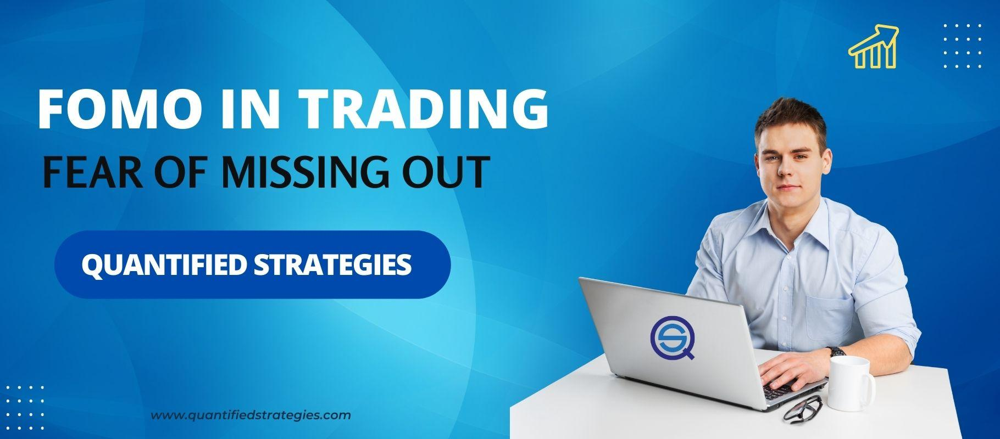

Fear of Missing Out (FOMO) in trading is a behavioral finance phenomenon that significantly influences traders' behavior and decision-making processes. It is characterized by the anxiety that others are gaining from trades while one is not participating, often resulting in irrational and hasty trading decisions. In an environment like the stock market, where volatility and rapid price changes are common, these emotional impulses can have severe consequences.

Traders often encounter FOMO due to the accessibility of real-time information and the constant updates provided through various platforms, including social media. This immediacy creates pressures that may lead traders to deviate from their planned strategies, aiming instead for short-term gains without proper risk assessment. Understanding FOMO is essential for traders who seek to make thoughtful and informed decisions, minimizing emotional influences that undermine their long-term profitability and increasing the likelihood of success.



Algorithmic trading represents an innovative approach to managing FOMO. By utilizing computer programs to execute trades based on predefined criteria and data analytics, traders can remove emotional components from their trading strategies. This systematic methodology helps ensure consistent adherence to trading plans, thus promoting discipline and reducing the susceptibility to emotional biases like FOMO. As algorithmic trading continues to rise, particularly with advancements in artificial intelligence and machine learning, tackling these emotional biases becomes a critical element in enhancing overall trading performance and outcomes.

## Table of Contents

## Understanding FOMO in Trading

Fear of Missing Out (FOMO) in trading is defined as the heightened anxiety and distress that traders experience when they perceive a risk of missing out on potentially lucrative trading opportunities. This emotional response can trigger traders to make impulsive decisions, bypassing thorough analysis, and adhering more to emotions than rationality, often resulting in suboptimal trading outcomes.

In the context of trading, FOMO manifests when traders observe rapid market movements or significant gains by other traders, causing them to fear being left behind. This fear can lead traders to enter or exit positions without adequate research or strategy, primarily motivated by short-term gains rather than long-term financial health and market principles.

The advent of the digital age has significantly intensified the FOMO effect in trading environments. The proliferation of real-time financial news, online trading platforms, and pervasive social media channels contribute to a constant influx of information. Platforms like Twitter, Reddit, and investor chat groups can amplify market trends and opinions, often resulting in accelerated decision-making pressures. For instance, witnessing posts about soaring asset prices can compel traders to act hastily, driven by the assumption that if they don’t participate immediately, the opportunity will vanish.

Moreover, social media often highlights the successes of other traders, selectively omitting their failures, thereby presenting a skewed perception of trading that fosters FOMO. This curated image can exaggerate the sense of urgency and potential for loss, leading traders to diverge from their established strategies.

In summary, FOMO in trading is a psychological phenomenon intensified by the immediacy and breadth of information available in today's digital era. It drives impulsive decisions based more on emotional reactions to market stimuli than on calculated financial strategies, representing a significant challenge to achieving consistent trading success.

## Characteristics of a FOMO Trader

FOMO traders display distinct characteristics that often hinder effective trading practices. One primary trait is impatience, reflecting a tendency to prioritize short-term gains over long-term strategic planning. This impatience can lead to hastily executed trades that ignore critical market analysis. For example, a FOMO trader might rush into a trade due to a rapidly rising price without conducting a thorough technical or [fundamental analysis](/wiki/fundamental-analysis), resulting in increased exposure to market [volatility](/wiki/volatility-trading-strategies).

Greed is another hallmark of FOMO-driven traders. This excessive desire for profit can skew risk assessment, prompting traders to allocate larger portions of their capital to single trades without considering the potential downside. Such behavior often culminates in significant losses when the market does not move as anticipated. Greed fuels the FOMO cycle, compelling traders to react to every market surge or decline rather than patiently assessing opportunities.

High expectations also characterize FOMO traders, perpetuating the belief that every market movement could be a lucrative opportunity. This mindset often clouds judgment, leading traders to expect substantial returns from minimal inputs, which is statistically unlikely and contradicts successful trading principles that emphasize calculated risk-taking and long-term growth.

Further exacerbating these traits is the tendency to follow the herd mentality. FOMO traders are prone to copying the actions of others, entering trades based on popular sentiment rather than independent analysis. This lack of original strategy makes it challenging to predict outcomes based on personal assessments or unique market perspectives, as illustrated by numerous cases where market bubbles burst after widespread speculative trading.

Behaviorally, FOMO traders frequently enter positions impulsively, driven by emotional reactions rather than comprehensive analytical evaluations. Such actions are usually observed in responses to fear of losing out on potential market moves, leading to an overreliance on speculative actions, typically at the expense of a well-structured strategy. Consequently, this increases the probability of engaging in high-risk trades and potential financial losses.

These characteristics underscore the necessity for FOMO traders to cultivate patience, seek financial education to manage greed, set realistic expectations, and develop independent analyses to counteract herd mentality influences, thus promoting more disciplined and strategic trading decisions.

## How FOMO Impacts Trading Decisions

Fear of Missing Out (FOMO) significantly influences trading decisions, often leading traders to make impulsive and irrational choices. This psychological phenomenon can result in actions driven by anxiety, rather than strategic thinking, which may adversely affect trading performance over time.

The primary impact of FOMO on trading decisions is the tendency for traders to make rapid, uninformed trades without conducting thorough risk assessments. This urgency often causes them to overlook critical factors and variables that should be considered before entering a trade. For example, important elements like market volatility, asset [liquidity](/wiki/liquidity-risk-premium), and potential market reversals might be disregarded in the rush to capitalize on perceived opportunities. 

FOMO can cloud judgment and lead traders to deviate from their pre-established plans and strategies. Traders might enter positions late in a trend or at an inopportune time, driven by the emotional fear of missing profits that others might be realizing. This deviation from strategy usually occurs because FOMO can make traders focus more on short-term gains rather than their long-term financial goals. 

In the longer term, decisions driven by FOMO can undermine both the success and profitability of trading endeavors. Consistently succumbing to FOMO often results in capital erosion and increased transaction costs, as traders habitually enter and [exit](/wiki/exit-strategy) positions reactively rather than proactively. Over time, this approach leads to poor trading performance and potentially significant financial losses. Furthermore, it can erode the psychological well-being of traders, intensifying the cycle of fear and impulsive behavior.

To simulate this in Python, one might use a model that tracks the performance of a trading strategy impacted by FOMO versus one that strictly adheres to a predefined strategy:

```python
import numpy as np

def trading_simulation(days, fomo_influence):
    capital = 100000  # Starting capital
    capital_fomo = capital
    capital_disciplined = capital

    for day in range(days):
        market_return = np.random.normal(loc=0.001, scale=0.02)  # Simulating daily market returns

        # FOMO-influenced trading
        if np.random.rand() < fomo_influence:
            trade_return = market_return * np.random.choice([-2, 1])  # Higher variability due to FOMO
        else:
            trade_return = market_return

        capital_fomo += capital_fomo * trade_return

        # Disciplined trading
        trade_return_disciplined = market_return
        capital_disciplined += capital_disciplined * trade_return_disciplined

    return capital_fomo, capital_disciplined

fomo_result, disciplined_result = trading_simulation(days=252, fomo_influence=0.2)
print(f'Capital with FOMO influence: ${fomo_result:.2f}')
print(f'Capital with disciplined trading: ${disciplined_result:.2f}')
```

This model assumes daily trade decisions over one year (252 trading days), reflecting the potential disparity between FOMO-driven trading and disciplined trading. The results demonstrate the potential for reduced capital growth and increased variability when decisions are made under the influence of FOMO.

## Algorithmic Trading: A Solution to FOMO

Algorithmic trading offers a robust solution to combating Fear of Missing Out (FOMO) in trading by systematically eliminating emotional biases from the decision-making process. These systems operate on predefined rules and data analytics, thus ensuring a disciplined, methodical approach to market participation. 

At its core, [algorithmic trading](/wiki/algorithmic-trading) involves the use of computer algorithms to automatically make trading decisions, submit orders, and manage portfolios. This setup helps maintain consistency, as trades are executed based on established criteria rather than emotional impulses, which tend to skew judgment during volatile market conditions.

Algorithms, guided by quantifiable trading plans, help traders adhere to these strategies with accuracy. For instance, algorithms execute trades only when specific market conditions, defined by measurable metrics such as moving averages or market depth, are met. This structured methodology minimizes human errors linked to emotional decision-making and enhances strategic discipline.

Moreover, algorithmic systems are designed to continuously monitor financial markets. Utilizing real-time data feeds, they can assess and respond to market conditions within milliseconds, far quicker than human traders. This capability allows for trades to be executed at optimal times, optimizing the risk-return profile without succumbing to the fear and urgency typically driven by FOMO.

For example, consider a simple moving average crossover strategy implemented in Python, which automatically buys or sells an asset when the short-term moving average crosses above or below a long-term moving average:

```python
import pandas as pd

def simple_moving_average(prices, window):
    return prices.rolling(window=window).mean()

data = pd.DataFrame({'Prices': [120, 121, 122, 123, 124, 125, 126]})
short_window = 2
long_window = 4

data['Short_MA'] = simple_moving_average(data['Prices'], short_window)
data['Long_MA'] = simple_moving_average(data['Prices'], long_window)

data['Signal'] = 0
data['Signal'][short_window:] = \
    np.where(data['Short_MA'][short_window:] > data['Long_MA'][short_window:], 1, 0)

data['Position'] = data['Signal'].diff()

print(data)
```

This code snippet demonstrates a basic algorithm used to identify potential buy or sell signals without emotional influences. By codifying trading rules, algorithmic systems ensure trades are purely data-driven, thus mitigating the psychological drivers, such as FOMO, that frequently lead to impulsive decision-making.

In summary, algorithmic trading stands as a valuable tool for maintaining emotional detachment in trading, providing a strategic framework that safeguards traders from the cognitive biases inherent in manual trading, and ultimately fostering a disciplined approach to market engagement.

## Strategies to Mitigate FOMO

Implementing a well-defined trading plan with clear criteria for trade entries and exits is essential for mitigating the effects of Fear of Missing Out (FOMO) in trading. A comprehensive trading plan serves as a roadmap, helping traders make decisions based on predefined strategies rather than emotional impulses. This plan should include specific indicators, price levels, and risk-reward ratios that guide decision-making processes, enabling traders to maintain objectivity and consistency in their actions.

Practicing mindfulness and emotional regulation can significantly enhance traders' focus and decision-making capabilities. Mindfulness techniques, such as meditation and deep-breathing exercises, can reduce anxiety and increase awareness of emotional responses. By cultivating a mindful approach, traders can better recognize when emotions like FOMO are influencing their judgment and can take conscious steps to return to their rational trading strategies. Emotional regulation techniques can involve setting regular reflection periods to assess trades impartially, promoting a habit of introspection and adjustment.

Diversification is another effective strategy to counteract the psychological impacts of FOMO. By spreading investments across various asset classes and sectors, traders can reduce the anxiety associated with missing out on particular market trends. Diversification minimizes the dependency on the performance of a single investment, thus decreasing emotional distress when certain market opportunities are bypassed. 

Risk management strategies are also crucial in mitigating FOMO. Employing tools such as stop-loss orders and position-sizing rules can limit potential losses and provide a sense of security, which is important in reducing impulsive, FOMO-driven decisions. For example, a stop-loss order automatically closes a position at a predetermined loss level, preventing further losses and allowing traders to remain calm even during market volatility.

Furthermore, incorporating algorithmic solutions can assist in maintaining discipline. Algorithms execute trades based on data-driven insights and existing market conditions, adhering to consistent strategies without emotional bias. By relying on algorithmic trading systems, traders can focus on long-term profitability rather than short-term fluctuations and emotional triggers.

In conclusion, by establishing a structured trading plan, practicing mindfulness, employing diversification, and implementing robust risk-management techniques, traders can significantly reduce the influence of FOMO on their trading decisions.

## Conclusion

Fear of Missing Out (FOMO) poses a significant barrier to trading success due to its potential to derail disciplined decision-making. Recognizing and managing FOMO is crucial for any trader aiming to achieve consistent profitability. One effective solution to combat emotional trading is algorithmic trading, which leverages technology to execute trades based on predefined rules and data analysis, thereby eliminating emotional interference.

Algorithmic trading systems maintain trading discipline by adhering strictly to a set trading plan. These systems are designed to operate without succumbing to psychological pressures, ensuring that trades are conducted with precision and within the outlined risk parameters. The consistency that algorithmic trading provides can not only minimize the adverse effects of FOMO but also enhance overall trading performance by ensuring that trades are made from a position of calculated strategy rather than emotional impulse.

Moreover, traders who embrace technological tools and adopt strategic measures to manage FOMO can significantly improve their decision-making process. By implementing well-defined strategies, such as maintaining a diverse portfolio and setting clear entry and exit criteria, traders can mitigate the psychological effects of FOMO. Practices like mindfulness and emotional regulation further contribute to improved focus and rational decision-making.

In conclusion, managing FOMO is essential for trading success. By acknowledging the impact of emotional biases and integrating algorithmic trading into their strategies, traders can foster a more disciplined approach. This blend of technological advantage and personal strategy enables traders to navigate the market with greater confidence and attain better trading outcomes.

## References & Further Reading

[1]: Endow, N. P. (2001). ["The Emotional Trading Trap: Overcoming Influence and Bias."](https://www.paulekman.com/blog/emotional-bias/) Taylor & Francis.

[2]: Hirshleifer, D. (2001). ["Investor Psychology and Asset Pricing."](https://onlinelibrary.wiley.com/doi/abs/10.1111/0022-1082.00379) Journal of Finance, 56(4), 1533-1597.

[3]: Schumaker, R. P., & Chen, H. (2008). ["Textual Analysis of Stock Market Prediction Using Breaking Financial News: The AZFinText System."](https://dl.acm.org/doi/10.1145/1462198.1462204) Journal of the American Society for Information Science and Technology, 59(12), 2010-2018.

[4]: Barber, B. M., & Odean, T. (1999). ["The Courage of Misguided Convictions."](https://faculty.haas.berkeley.edu/odean/Papers%20current%20versions/FAJ%20NovDec99%20Barber%20and%20Odean.pdf) Financial Analysts Journal, 55(6), 41-55.

[5]: Hoffmann, A. O. I., & Shefrin, H. (2014). ["Behavioral Portfolio Analysis of Individual Investors."](https://papers.ssrn.com/sol3/papers.cfm?abstract_id=1629786) Journal of Behavioral Finance, 15(1), 1-21.