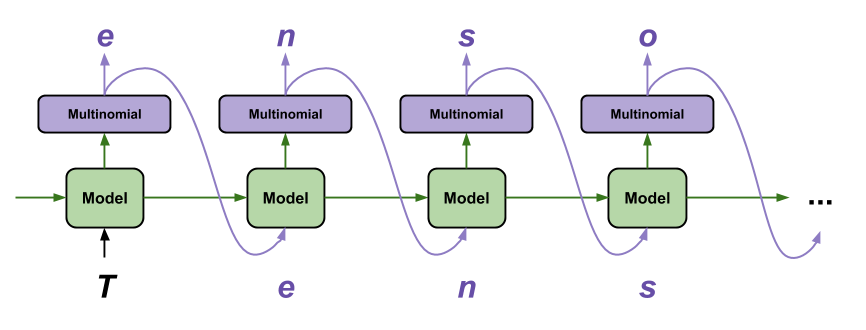

## Table of Contents

## What is a Font Generation Model in machine learning?

A Font Generation Model in machine learning is a type of artificial intelligence system that creates new fonts or modifies existing ones. It learns patterns and styles from a collection of font examples and then generates new fonts that look similar to the ones it has learned from. This is useful for designers who need a variety of fonts quickly or for creating personalized fonts for specific projects.

These models often use techniques like Generative Adversarial Networks (GANs) or Variational Autoencoders (VAEs). In a GAN, for example, there are two parts: a generator that creates fonts and a discriminator that judges if the generated fonts look real or fake. They work together, with the generator trying to fool the discriminator by making better and better fonts. This back-and-forth helps the model improve over time.

## How do Font Generation Models differ from traditional font design?

Font Generation Models and traditional font design are different in how they make fonts. Traditional font design is done by people who are good at drawing and designing. They spend a lot of time making each letter look just right, thinking about the style and how all the letters will look together. It's a careful and slow process where the designer has full control over every detail.

On the other hand, Font Generation Models use computers and [machine learning](/wiki/machine-learning) to create fonts. These models learn from a lot of existing fonts and then make new ones that look similar. It's much faster than traditional design because the computer does most of the work. But, the fonts made by these models might not have the same personal touch or unique style that a human designer can give.

Both ways have their good points. Traditional design gives you very special and detailed fonts, while Font Generation Models can make a lot of fonts quickly. It's like choosing between a handmade gift and something made by a machine; both can be useful, but they feel different.

## What are the basic components of a Font Generation Model?

The basic components of a Font Generation Model include a dataset of fonts, a [neural network](/wiki/neural-network) architecture, and a training process. The dataset is a collection of existing fonts that the model uses to learn from. These fonts are broken down into individual characters, and the model analyzes the shapes, styles, and features of these characters. The neural network architecture is the brain of the model, designed to understand and generate new fonts. It can be a Generative Adversarial Network (GAN) or a Variational Autoencoder (VAE), both of which are good at creating new data that looks like the data they were trained on.

The training process is how the model learns to make new fonts. During training, the model looks at the font dataset and tries to find patterns and rules that it can use to create new fonts. If the model is a GAN, it has two parts: a generator that makes new fonts and a discriminator that checks if they look real. They work together, with the generator trying to fool the discriminator by making better fonts. This back-and-forth helps the model get better over time. Once trained, the model can generate new fonts that look like the ones in the dataset but are unique.

## Can you explain the concept of Attribute2Font in Font Generation Models?

Attribute2Font is a way to make new fonts by using specific styles or characteristics, called attributes. In this method, a Font Generation Model learns from a collection of fonts, each labeled with different attributes like "bold," "italic," or "serif." The model then figures out how to change a basic font to match these attributes. For example, if you want a font to look "bold," the model will use what it learned to make the font thicker and stronger.

This approach is useful because it gives you control over the kind of font you want to create. Instead of just making random fonts, you can tell the model to make a font with certain features. This makes it easier for designers to get the exact look they need for their projects. By using Attribute2Font, the model can mix and match different attributes to come up with new and interesting fonts that fit specific needs.

## What types of data are typically used to train Font Generation Models?

Font Generation Models are trained using a large collection of fonts. These fonts are broken down into individual characters, like letters and numbers. Each character is represented as a digital image or a set of coordinates that describe its shape. The model looks at these images or coordinates to learn the patterns and styles of different fonts. For example, it might see that some fonts have thick lines and others have thin lines, or that some have fancy curves while others are more straight.

The data used to train these models also includes labels or tags that describe the fonts' attributes, like "bold," "italic," or "serif." These labels help the model understand the specific characteristics of each font. By learning from this labeled data, the model can later generate new fonts with the same attributes. This means that when someone wants a font that is both bold and italic, the model can use what it learned to create a new font that matches those descriptions.

## How does the training process work for Font Generation Models?

The training process for Font Generation Models starts with a big collection of fonts. These fonts are broken down into individual characters, like letters and numbers. Each character is turned into a digital image or a set of coordinates that describe its shape. The model looks at these images or coordinates to learn the patterns and styles of different fonts. It also sees labels or tags that describe the fonts' attributes, like "bold," "italic," or "serif." These labels help the model understand the specific characteristics of each font.

During training, the model uses a neural network, like a Generative Adversarial Network (GAN) or a Variational Autoencoder (VAE), to learn from the font data. If it's a GAN, there are two parts: a generator that makes new fonts and a discriminator that checks if they look real. The generator tries to fool the discriminator by making better and better fonts. They work together, with the generator improving over time as it learns to create fonts that the discriminator can't tell apart from real ones. This back-and-forth process helps the model get better at making new fonts that look like the ones it was trained on.

## What are some common challenges faced when developing Font Generation Models?

One common challenge when developing Font Generation Models is getting enough good data to train the model. You need a lot of different fonts with clear labels to teach the model what different styles look like. If the data is not good or there's not enough of it, the model might not learn well and make fonts that don't look right. Also, making sure the data is clean and well-organized takes a lot of time and work.

Another challenge is making the model work well and fast. Training a Font Generation Model can take a long time because it needs to look at a lot of data and learn from it. The model also needs to be able to make new fonts quickly and accurately. This can be hard because the model has to understand and copy the small details that make fonts look good. If the model is too slow or doesn't make good fonts, it won't be very useful.

## How can Font Generation Models be evaluated for performance and accuracy?

To evaluate Font Generation Models, we look at how well they can make new fonts that look real and match the styles they were trained on. One way to do this is by using human judges who look at the generated fonts and say if they look good and if they match the style they were supposed to have. Another way is by using other computer programs that can compare the generated fonts to real fonts and see how similar they are. These programs can check things like the shape of the letters, how thick or thin the lines are, and other small details.

Another important part of evaluating Font Generation Models is to see how well they can make fonts with specific attributes, like "bold" or "italic." This can be done by asking the model to make fonts with these attributes and then checking if the fonts really have them. For example, if the model is asked to make a "bold" font, we can see if the letters are thicker and stronger than normal. By doing these kinds of tests, we can tell if the model is working well and if it can make the kinds of fonts that people need.

## What are the applications of Font Generation Models in the real world?

Font Generation Models have many useful applications in the real world. One big use is in graphic design and branding. Designers can use these models to quickly create a lot of different fonts for their projects. This is helpful when they need to make logos, posters, or websites that need a special look. Instead of spending a lot of time drawing each letter, they can use a Font Generation Model to make fonts that fit their needs. This saves time and helps them try out many different styles easily.

Another application is in the creation of personalized fonts. People might want fonts that match their personality or style. Font Generation Models can take a few examples of someone's handwriting or a favorite font and then make a whole new font that looks similar. This is great for making things like custom greeting cards, personal stationery, or even unique gifts. It gives people a way to have fonts that are special and different from what everyone else is using.

Font Generation Models can also be used in education and accessibility. For example, they can help create fonts that are easier to read for people with dyslexia or other reading difficulties. By learning from fonts that are known to be helpful for these readers, the models can generate new fonts that might work even better. This can make reading and learning easier and more enjoyable for many people.

## How do advanced techniques like GANs enhance Font Generation Models?

Advanced techniques like Generative Adversarial Networks (GANs) help Font Generation Models make better and more realistic fonts. In a GAN, there are two parts: a generator that makes new fonts and a discriminator that checks if they look real. They work together, with the generator trying to fool the discriminator by making better and better fonts. This back-and-forth process helps the model learn to create fonts that are hard to tell apart from real ones. By using GANs, the model can capture the small details and styles of different fonts, making the new fonts look more like what a human designer might create.

GANs also make it possible to create fonts with specific attributes, like "bold" or "italic," more accurately. The model can learn what these attributes look like from a lot of examples and then use that knowledge to make new fonts that match those descriptions. This means designers can tell the model exactly what kind of font they need, and the model can make it quickly. By using GANs, Font Generation Models become more useful and flexible, helping people create the exact fonts they need for their projects.

## What is the role of style transfer in Font Generation Models?

Style transfer in Font Generation Models helps create new fonts by mixing the style of one font with the content of another. Imagine you have a simple font that you like, but you want it to look like a fancy, old-fashioned font. With style transfer, the model can take the simple font and change it to look fancy, keeping the shapes of the letters but making them look different in style. This is useful because it lets designers easily create new fonts that fit their projects without starting from scratch.

The process of style transfer involves using neural networks to learn the features of both the source font (the one you want to copy the style from) and the target font (the one you want to change). The model then applies the learned style to the target font, creating a new font that blends the two. This can be done with techniques like neural style transfer, which is good at capturing and applying the small details that make fonts unique. By using style transfer, Font Generation Models become more versatile, helping designers get the exact look they need quickly and easily.

## What future developments can we expect in the field of Font Generation Models?

In the future, we can expect Font Generation Models to become even better at making fonts that look like they were made by human designers. They might use new kinds of machine learning techniques, like more advanced versions of Generative Adversarial Networks (GANs) or other new ideas, to capture the small details and styles of different fonts more accurately. This could mean that the fonts they make will be hard to tell apart from real ones, even to expert designers. Also, these models might learn to make fonts faster and with less data, making them easier and cheaper to use.

Another thing we might see is Font Generation Models becoming more personalized. They could learn from just a few examples of someone's handwriting or a favorite font and then make a whole new font that looks just like it. This would be great for people who want to make things like custom greeting cards, personal stationery, or unique gifts. The models might also get better at understanding what people want and making fonts that fit their needs perfectly, making them even more useful for designers and anyone who needs special fonts.

## References & Further Reading

[1]: Goodfellow, I., Pouget-Abadie, J., Mirza, M., Xu, B., Warde-Farley, D., Ozair, S., Courville, A., & Bengio, Y. (2014). ["Generative Adversarial Networks."](https://arxiv.org/abs/1406.2661) arXiv preprint arXiv:1406.2661.

[2]: Kingma, D. P., & Welling, M. (2013). ["Auto-Encoding Variational Bayes."](https://arxiv.org/abs/1312.6114) arXiv preprint arXiv:1312.6114.

[3]: Azadi, S., Fisher, M., Kim, V., Wang, Z., Shechtman, E., & Darrell, T. (2018). ["Multi-Content GAN for Few-Shot Font Style Transfer."](https://arxiv.org/abs/1712.00516) Advances in Neural Information Processing Systems, 31.

[4]: Odena, A., Olah, C., & Shlens, J. (2017). ["Conditional Image Synthesis with Auxiliary Classifier GANs."](https://dl.acm.org/doi/10.5555/3305890.3305954) Proceedings of the 34th International Conference on Machine Learning, PMLR 70.

[5]: Yang, Z., Zhang, Y., & Jin, Z. (2019). ["FontRNN: Generating Large-scale Fonts via Multi-stage Visual Coherence."](https://onlinelibrary.wiley.com/doi/abs/10.1111/cgf.13861) Pattern Recognition, 96.