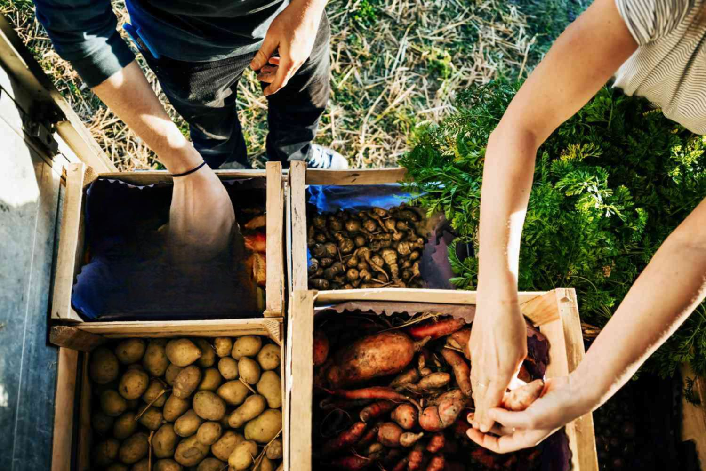

The global agricultural landscape is continually evolving, influenced by technological innovations, shifting policy frameworks, and dynamic market forces. As a critical entity within this landscape, the Food and Agriculture Organization (FAO) of the United Nations plays a pivotal role in spearheading initiatives to confront hunger and promote sustainable agricultural practices. Established in 1945, the FAO is dedicated to enhancing nutrition, ensuring food security, and fostering the development of agriculture, forestry, and fisheries worldwide. It coordinates efforts across its 194 member nations to implement sustainable food systems and operational practices through public-private partnerships.

A notable emerging trend in agriculture is the integration of algorithmic trading (algo trading) to optimize commodity markets. Algorithmic trading leverages computer algorithms to automate trading decisions, thereby enhancing market efficiency by speeding up transactions and minimizing human errors. In the agricultural sector, this technology is employed to stabilize commodity prices and manage the risks associated with supply and demand fluctuations, offering new avenues for sustainable market practices.



This article examines how the FAO's initiatives align with the advancements in algorithmic trading to foster sustainable agricultural practices globally. Exploring this synergy reveals opportunities to bolster food security and agricultural sustainability by leveraging technology and innovation. The integration of algo trading into FAO's strategic objectives holds promise for refining global food systems, ensuring they are resilient, efficient, and better equipped to handle future challenges.

## Table of Contents

## Understanding FAO's Role in Global Agriculture

The Food and Agriculture Organization (FAO) is a specialized agency of the United Nations dedicated to eradicating hunger and enhancing nutrition and food security globally. Established in 1945, the FAO has grown to serve 194 member nations, collaborating on an international scale to foster the development of agriculture, forestry, and fisheries. This mission is pivotal as the global population continues to rise, necessitating sustainable and efficient food systems.

Rather than directly providing aid, the FAO operates through public-private partnerships, focusing on establishing sustainable food sources and operational systems worldwide. This approach supports the creation of resilient agricultural infrastructure, tailored to the needs of individual countries and communities.

Among the FAO's primary strategies is the promotion of sustainable consumption and production patterns. This involves encouraging practices that reduce environmental impact while simultaneously ensuring that food systems can meet the nutritional needs of the population. The organization also emphasizes achieving food security by improving access to nutritious foods. This goal is pursued through initiatives aimed at enhancing agricultural productivity and ensuring that diverse and balanced diets are accessible to all.

Through its coordinated efforts, the FAO plays a crucial role in guiding nations towards creating sustainable and secure agri-food systems. By fostering collaboration and innovation, the FAO is helping to address some of the most pressing challenges in global agriculture today.

## Key Initiatives of the FAO

The Food and Agriculture Organization (FAO) of the United Nations has outlined a robust Strategic Framework for 2022-2031, emphasizing the pillars of better production, nutrition, environment, and life. This framework guides the organization's efforts to address global challenges in agriculture and food security.

One of the cornerstones of the FAO's initiatives is improving smallholder agriculture, which is essential in many developing regions where small-scale farmers make up a significant portion of the agricultural workforce. The FAO provides technical assistance, training, and resources to enhance productivity and sustainability among these farmers. By focusing on sustainable farming practices, the FAO aims to increase crop yields while minimizing environmental impact, ensuring that smallholders can contribute effectively to local and global food supplies.

The FAO also leverages public-private partnerships to promote sustainable trade. These collaborations aim to facilitate the exchange of knowledge, technology, and resources between governments, private sector entities, and civil society. By encouraging investment in sustainable practices and technologies, these partnerships help build resilient food systems that can withstand economic and environmental shocks.

Moreover, the FAO has established mechanisms to monitor global food systems, critical for providing timely information on food production, availability, and risks. Through initiatives like the Global Information and Early Warning System (GIEWS), the FAO gathers and disseminates data that helps countries make informed decisions about their food policies and practices. This supports efforts to prevent food shortages and stabilize markets, ultimately contributing to global food security.

Furthermore, the FAO assists member countries in achieving self-sufficiency in food production and participating in international trade. By promoting policies and strategies aligned with local cultures and economies, the organization ensures that agri-food systems are diversified and inclusive. This approach not only boosts economic development but also strengthens food sovereignty and nutritional outcomes across different regions.

In conclusion, the FAO's commitment to strengthening agricultural systems globally is reflected in its comprehensive approach to improving production, nutrition, environment, and quality of life. By empowering smallholder farmers, fostering sustainable trade partnerships, and enhancing global food system monitoring, the FAO helps build a more secure and equitable food future for all.

## The Rise of Algorithmic Trading in Agriculture

Algorithmic trading, commonly referred to as algo trading, has revolutionized the commodity markets by leveraging computer algorithms to execute trades quickly and efficiently. This technological advancement is particularly significant in the agricultural sector, where market dynamics are frequently influenced by unpredictable factors like weather conditions, geopolitical events, and fluctuating supply and demand. 

Algo trading achieves enhanced market efficiency in several ways. Firstly, it allows for rapid transaction times, which is beneficial in markets where timing is pivotal. The ability to analyze market data and execute trades in fractions of a second reduces the lag that normally accompanies human decision-making processes. This speed diminishes the opportunity for [arbitrage](/wiki/arbitrage) and reduces the likelihood of significant price discrepancies between markets. 

Additionally, algo trading minimizes human error, a critical advantage given the complexity of large datasets and the fast-paced nature of commodity trading. By relying on predefined algorithms, traders can eliminate emotional biases that might impair decision-making. For example, [momentum](/wiki/momentum)-based algorithms, which track trends and execute trades aligned with the direction of the market, can consistently apply a trading strategy devoid of human impulse reactions.

In agriculture, algo trading is increasingly used to stabilize prices and manage risks. Agricultural commodities are subject to high [volatility](/wiki/volatility-trading-strategies) due to factors such as crop yield variations and international trade policies, which can have drastic effects on supply and demand. Algorithms can be designed to account for these variables by incorporating diverse data sources, ranging from meteorological data to economic indicators, which can predict potential market shifts and adjust trading strategies accordingly. 

Consider a simplified Python example illustrating a basic momentum algorithm:

```python
import numpy as np

def momentum_strategy(prices, window=5):
    """
    A simple momentum-based algorithm.
    :param prices: List of commodity prices.
    :param window: Look-back period for the momentum calculation.
    :return: List of buy (1), hold (0), sell (-1) signals.
    """
    signals = np.zeros(len(prices))
    for i in range(window, len(prices)):
        if prices[i] > prices[i-window:i].mean():
            signals[i] = 1  # Buy signal
        elif prices[i] < prices[i-window:i].mean():
            signals[i] = -1  # Sell signal
    return signals

# Example usage with hypothetical prices
commodity_prices = [100, 102, 101, 105, 107, 106, 108, 110]
signals = momentum_strategy(commodity_prices)
```

This script generates buy, hold, or sell signals based on the momentum of commodity prices over a specified window. While basic, such algorithms can be expanded with more complex predictive analytics to manage volatility and navigate uncertainties, leading to more stabilized agricultural markets.

In summary, the rise of algo trading in agriculture offers mechanisms to enhance the efficiency, accuracy, and stability of commodity trading. This evolution not only benefits traders but also contributes to more predictable pricing models, which can ultimately support the wider goals of food security and sustainable development within the sector.

## How FAO Initiatives Align with Algo Trading

The Food and Agriculture Organization (FAO) plays a crucial role in promoting transparency and efficiency in agricultural markets, setting the stage for a natural synergy with [algorithmic trading](/wiki/algorithmic-trading). The FAO's commitment to data-driven decision-making aligns with the core principles of algo trading, which relies on accurate and timely data to optimize trading strategies.

The Global Information Early Warning System (GIEWS), an FAO initiative, is instrumental in this alignment. GIEWS monitors food supply and demand worldwide, providing early warnings about impending food crises. This system generates a wealth of critical data, including price trends, weather forecasts, and crop conditions, which can be invaluable for constructing algorithmic models. By feeding GIEWS data into algorithms, traders can make informed decisions that help stabilize agricultural markets, reduce price volatility, and manage risks associated with unforeseen events such as natural disasters or sudden supply shortages.

Additionally, the FAO's support for public-private partnerships enhances the potential for leveraging algorithmic trading in agriculture. These partnerships bring together diverse stakeholders, including governments, private enterprises, and international organizations, to collaborate on sustainable agricultural practices. Through these collaborations, resources and expertise can be pooled to develop advanced trading platforms that utilize algorithms for sustainable development. Algorithmic trading can optimize supply chain operations, improve market access for smallholder farmers, and promote equitable trade practices. This aligns with the FAO's broader objectives of fostering resilience in food systems and supporting sustainable agricultural development.

By integrating FOA data initiatives like GIEWS with algorithmic trading platforms, there is an opportunity to enhance the resilience and efficiency of global food systems. This collaboration can lead to more stable prices, reduced food insecurity, and a more sustainable approach to meeting the growing global demand for food. The synergy between FAO initiatives and algo trading demonstrates how strategic use of technology and data can contribute to achieving sustainable agricultural goals.

## Challenges and Opportunities

While algorithmic trading (algo trading) in agriculture holds immense promise, it also presents several challenges that must be addressed to maximize its benefits. One primary challenge is ensuring equitable access to this advanced technology. Many smallholder farmers, particularly in developing countries, may lack the necessary resources and technological infrastructure to leverage algo trading, potentially exacerbating existing inequalities within agricultural markets. Bridging this digital divide is crucial to ensuring that all stakeholders can benefit from the efficiencies and risk management capabilities of algo trading.

Another significant concern is the potential for market volatility. While algo trading can enhance [liquidity](/wiki/liquidity-risk-premium) and price discovery, it can also contribute to rapid and extreme fluctuations in commodity prices. This volatility poses risks not only to traders but also to farmers and consumers, who may experience sudden changes in their income and costs, respectively. Developing robust risk management strategies and appropriate regulatory mechanisms is essential to mitigate these effects and ensure that the benefits of algo trading are widely distributed.

To manage these challenges, there is a pressing need for comprehensive regulatory frameworks. These frameworks should address the ethical implications of algo trading, such as ensuring fairness and preventing market manipulation. Regulatory agencies must work closely with technology providers and market participants to monitor and enforce compliance, protecting smaller players and maintaining market stability.

Opportunities abound in integrating algo trading with initiatives by organizations like the Food and Agriculture Organization (FAO). By harnessing the power of data analytics and automation, these efforts can significantly enhance global food security. For instance, algo trading can facilitate better prediction and management of agricultural supply and demand, allowing for more efficient distribution of resources and reduction of food wastage.

Moreover, the integration of algo trading into FAO initiatives aligns with sustainable development goals, promoting innovation in agricultural practices and enhancing resilience in food systems. By leveraging algo trading, stakeholders can optimize resource allocation, reduce environmental impact, and support sustainable agricultural practices, ultimately contributing to a more stable and secure global food system.

In summary, while the challenges of algo trading in agriculture are significant, they are not insurmountable. With thoughtful regulation and a focus on inclusivity, the integration of this technology with global initiatives can pave the way for a more equitable and sustainable future.

## Conclusion

The synergy between the Food and Agriculture Organization's (FAO) initiatives and the advancement of algorithmic trading holds significant promise for the future of global food systems. This collaboration has the potential to create more resilient and efficient agricultural markets by leveraging data-driven insights and technological innovation. Algorithmic trading can offer enhanced market stability through its capacity to manage risks and fluctuations in supply and demand in real-time. By integrating advanced trading algorithms with the FAO's initiatives for sustainable agriculture, countries can better navigate the complexities of global trade and food security.

The continuous promotion of innovation and collaboration is essential for maximizing the benefits of this synergy. The FAO's commitment to fostering partnerships with both public and private entities serves to amplify the impact of algorithmic solutions, making it possible for member countries to better harness these technologies. This approach can lead to improved food security, as countries will be better equipped to anticipate and react to market changes.

As the global agricultural landscape continues to evolve, it is imperative that ongoing research and policy-making efforts remain aligned with both technological advancements and sustainable development goals. By doing so, these advancements can be steered in a manner that ensures they contribute positively to global development. Establishing robust regulatory frameworks will be essential to address ethical considerations and to mitigate the risks of market abuse and inequalities in technology access. This proactive and inclusive approach will help ensure that the integration of these technologies into agriculture serves to enhance global food systems sustainably and equitably.

## References & Further Reading

[1]: FAO. (2021). ["The State of Food and Agriculture 2021: Making agrifood systems more resilient to shocks and stresses."](https://openknowledge.fao.org/server/api/core/bitstreams/de94dc0f-2274-46df-ba17-d5ff10d19e07/content/cb4476en.html) Food and Agriculture Organization of the United Nations.

[2]: FAO. ["Global Information and Early Warning System (GIEWS)."](https://www.fao.org/giews/en/)

[3]: Lopez de Prado, M. (2018). ["Advances in Financial Machine Learning."](https://www.amazon.com/Advances-Financial-Machine-Learning-Marcos/dp/1119482089) John Wiley & Sons.

[4]: Aronson, D. R. (2006). ["Evidence-Based Technical Analysis: Applying the Scientific Method and Statistical Inference to Trading Signals."](https://www.amazon.com/Evidence-Based-Technical-Analysis-Scientific-Statistical/dp/0470008741) John Wiley & Sons.

[5]: Chan, E. P. (2008). ["Quantitative Trading: How to Build Your Own Algorithmic Trading Business."](https://github.com/ftvision/quant_trading_echan_book) John Wiley & Sons.

[6]: Jansen, S. (2020). ["Machine Learning for Algorithmic Trading."](https://github.com/stefan-jansen/machine-learning-for-trading) Packt Publishing.