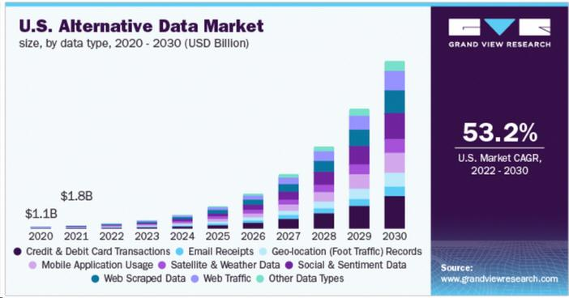

## Table of Contents

## What is alternative data in the context of food and beverage?

Alternative data in the food and beverage industry refers to information that comes from non-traditional sources. Instead of using common data like sales figures or customer surveys, companies look at things like social media posts, satellite images of parking lots, or even weather patterns. This kind of data helps businesses understand what people are eating, where they are eating, and how external factors might affect their choices.

By using alternative data, food and beverage companies can make better decisions. For example, if a company sees a lot of people posting about a new type of food on social media, they might decide to add it to their menu. Or, if satellite images show more cars at a competitor's location, a business might try new marketing strategies to attract more customers. This type of data gives a fresh view of the market and helps companies stay ahead of trends.

## How can alternative data be sourced for the food and beverage industry?

Alternative data for the food and beverage industry can be sourced from many places. One common source is social media. Companies can look at what people are posting about food and drinks on platforms like Instagram, X (formerly Twitter), and TikTok. This helps them see what's popular and what people are talking about. Another source is satellite imagery. By looking at pictures from space, businesses can see how busy parking lots are at different restaurants and stores. This can tell them how well their competitors are doing.

Another way to get [alternative data](/wiki/best-alternative-data) is by using credit card transactions. Companies can look at where people are spending their money on food and drinks. This information can show which places are popular and what kinds of food people are buying. Weather data is also useful. By knowing the weather, companies can predict what people might want to eat. For example, on hot days, people might want cold drinks and ice cream. All these different sources help food and beverage companies understand the market better and make smarter decisions.

## What types of alternative data are relevant to food and beverage companies?

Alternative data for food and beverage companies comes from many different places. One type is social media data. This is when companies look at what people are posting about food and drinks on platforms like Instagram, X (formerly Twitter), and TikTok. By checking these posts, companies can see what's popular and what people are talking about. Another type is satellite imagery. Companies can use pictures from space to see how busy parking lots are at different restaurants and stores. This helps them understand how well their competitors are doing.

Credit card transaction data is also important. Companies can look at where people are spending their money on food and drinks. This information shows which places are popular and what kinds of food people are buying. Weather data is another useful type of alternative data. By knowing the weather, companies can predict what people might want to eat. For example, on hot days, people might want cold drinks and ice cream. All these different types of data help food and beverage companies make better decisions and understand the market better.

## How can food and beverage companies use alternative data to gain a competitive edge?

Food and beverage companies can use alternative data to learn more about what customers like and what's popular. For example, by looking at social media posts, they can see which foods and drinks people are talking about and sharing. If they notice a lot of people posting about a new type of smoothie, they might decide to add it to their menu. This helps them stay ahead of trends and offer what people want before their competitors do. They can also use satellite images to see how busy their competitors' parking lots are. If they see more cars at a rival's location, they might try new marketing strategies to bring more customers to their own stores.

Another way alternative data helps is by looking at credit card transactions. Companies can see where people are spending their money on food and drinks. This tells them which places are popular and what kinds of food people are buying. If they find out that a certain type of food is selling well at another store, they might start offering it too. Weather data is also useful. By knowing the weather, companies can predict what people might want to eat. On hot days, they might push cold drinks and ice cream more. Using all this information, food and beverage companies can make better choices and stay ahead of the competition.

## What are the challenges of using alternative data in the food and beverage sector?

Using alternative data in the food and beverage sector can be tricky. One big challenge is getting the data. It's not always easy to find good, reliable information from places like social media or satellite images. Sometimes, the data can be messy or hard to understand. Companies need special tools and skills to collect and make sense of it all. This can be expensive and take a lot of time.

Another challenge is making sure the data is right and useful. Just because a lot of people are talking about a new food on social media doesn't mean it will be a hit everywhere. The data might not show the whole picture. For example, weather data can help predict what people might want to eat, but it doesn't tell you if they will actually buy it. Companies need to be careful not to make decisions based on data that might not be completely accurate or relevant to their specific situation.

Lastly, there are privacy concerns. When companies use data from credit card transactions or social media, they have to be careful about people's privacy. They need to follow rules about how they can use this information. If they don't, they could get in trouble or lose customers' trust. Balancing the use of alternative data with respecting privacy is a big challenge for food and beverage companies.

## Can you provide examples of how alternative data has been used successfully in food and beverage?

A popular restaurant chain wanted to know what new foods to add to their menu. They looked at social media to see what people were talking about. They saw a lot of people posting about a new type of avocado toast. The chain decided to add it to their menu, and it became a big hit. By using social media data, they were able to give customers what they wanted and stay ahead of other restaurants.

Another example is a fast-food company that used satellite images to see how busy their competitors' parking lots were. They noticed that one of their rivals had a lot more cars on weekends. So, they started special weekend deals to attract more customers. This helped them increase their sales and compete better. Using satellite data helped them understand their market and make smart decisions.

A beverage company used weather data to predict what drinks people might want. They saw that on hot days, people were more likely to buy cold drinks. So, they made sure to have plenty of iced teas and cold coffees ready during hot weather. This helped them sell more drinks and keep their customers happy. By using weather data, they could plan better and meet their customers' needs.

## How does alternative data help in understanding consumer behavior in the food and beverage industry?

Alternative data helps food and beverage companies understand what people like to eat and drink by looking at information from places like social media, satellite images, and credit card transactions. For example, if a lot of people are posting about a new type of smoothie on Instagram, companies can see that it's popular and might decide to add it to their menu. This way, they can offer what people want before their competitors do. Also, by checking satellite images of parking lots, companies can see how busy their competitors' stores are. If they see more cars at a rival's location, they might try new ways to attract more customers to their own stores.

Another way alternative data helps is by looking at credit card transactions to see where people are spending their money on food and drinks. This tells companies which places are popular and what kinds of food people are buying. If they find out that a certain type of food is selling well at another store, they might start offering it too. Weather data also plays a role. By knowing the weather, companies can predict what people might want to eat. For example, on hot days, they might push cold drinks and ice cream more. Using all this information, food and beverage companies can better understand what their customers like and make smarter decisions to meet their needs.

## What role does technology play in collecting and analyzing alternative data for food and beverage?

Technology is super important for collecting and understanding alternative data in the food and beverage world. Special tools and software help companies gather information from places like social media, satellite images, and credit card transactions. For example, they use programs to look at what people are posting about food on Instagram or X (formerly Twitter). This helps them see what's popular and what people are talking about. They also use technology to look at satellite pictures of parking lots to see how busy other restaurants are. It's like having a big eye in the sky that helps them understand their competition.

Once they have all this data, technology helps them make sense of it. Computers and special programs can sort through tons of information quickly and find patterns. For example, if a lot of people are buying a certain type of food at a certain time, the technology can spot that trend. This helps companies decide what to sell and when. Without technology, it would be really hard to collect and understand all this information. It makes it easier for food and beverage companies to know what their customers like and stay ahead of the game.

## How can alternative data be integrated with traditional data sources in food and beverage analytics?

Alternative data can be mixed with traditional data to give food and beverage companies a fuller picture of what's going on. Traditional data, like sales numbers and customer surveys, tells them what people are buying and what they say they like. Alternative data, like social media posts and satellite images, shows them what people are talking about and how busy other places are. By putting these two kinds of data together, companies can see not just what people are doing, but also why they might be doing it. For example, if sales of a certain drink go up and social media shows a lot of people talking about it, the company knows it's a trend they should keep an eye on.

Using both types of data helps companies make better decisions. They can see if what people say they like matches what they're actually buying. If credit card data shows people spending more money at a competitor's store and satellite images show more cars in their parking lot, the company might look at their own sales data to see where they can improve. By combining traditional data with alternative data, food and beverage companies can understand their customers better and make smarter choices about what to sell and how to market it.

## What ethical considerations should be taken into account when using alternative data in the food and beverage industry?

When food and beverage companies use alternative data, they need to think about privacy. They often get information from places like social media or credit card transactions. This means they're looking at what people are doing and buying. It's important for companies to follow rules about how they can use this information. They need to make sure they're not sharing or using people's data in ways that could harm them or break the law. If they don't respect people's privacy, they could lose trust and get in trouble.

Another thing to consider is being fair and honest. Companies should be clear about how they're using alternative data. They shouldn't trick people or use the data to do things that aren't fair, like making prices higher for certain people. Also, they need to make sure the data they're using is right and not biased. If the data only shows what some people are doing, it might not tell the whole story. Companies need to be careful and use the data in a way that helps everyone, not just a few.

## How do regulatory environments affect the use of alternative data in food and beverage?

The rules and laws in different places can change how food and beverage companies use alternative data. In some countries, there are strict rules about privacy and how companies can use information from social media or credit card transactions. These rules mean that companies have to be very careful about collecting and using alternative data. If they don't follow the rules, they could get in trouble or have to pay big fines. This can make it harder for them to use alternative data to learn about what people like and what's popular.

On the other hand, some places have fewer rules about using alternative data. This can make it easier for companies to gather and use information from different sources. But even in these places, companies need to think about being fair and honest. They should make sure they're not using the data in ways that could hurt people or make things unfair. So, the rules in different places can affect how much and what kind of alternative data food and beverage companies can use to understand their customers and stay ahead of trends.

## What future trends can we expect in the use of alternative data within the food and beverage industry?

In the future, we can expect food and beverage companies to use even more types of alternative data. They might start using things like smartphone location data to see where people are eating and drinking. This can help them understand where to open new stores or what kinds of food to offer in different areas. They might also use more advanced technology, like [artificial intelligence](/wiki/ai-artificial-intelligence), to look at social media posts and find out what people are talking about even faster. This can help them spot new trends and add popular items to their menus before their competitors do.

Another trend could be more focus on real-time data. Companies might want to know what's happening right now, not just what happened last week or last month. They could use live data from social media or even from smart kitchen appliances to see what people are cooking and eating at home. This can help them make quick changes to their menus or marketing plans. But, as they use more data, they'll also need to be very careful about privacy and making sure they follow all the rules about how they can use people's information.

## How can alternative data be integrated into algorithmic trading?

Integrating alternative data into [algorithmic trading](/wiki/algorithmic-trading), particularly food and beverage metrics, involves deploying advanced data analytics and [machine learning](/wiki/machine-learning) techniques to derive actionable trading insights. Unlike traditional data sources that often suffer from latency and lack of granularity, alternative data provides real-time, high-frequency information that can be leveraged to forecast market movements and enhance decision-making processes.

To achieve this integration, traders utilize algorithms capable of processing vast quantities of data from diverse sources. These algorithms ingest real-time data streams, such as credit card transactions or point-of-sale information, and analyze them to detect shifts in consumer behavior or sentiment that might influence stock prices. By employing machine learning models, traders can capture subtle patterns and correlations that would be challenging to identify through conventional data analysis approaches.

A common approach in this context is the use of supervised learning models, where historical alternative data labeled with known market outcomes train the algorithm. For instance, a regression model could predict a company's quarterly earnings based on recent consumer spending trends gathered from food and beverage data. The model aims to minimize the error between predicted and actual earnings, refining its parameters using a loss function, typically the mean squared error:

$$
L(\theta) = \frac{1}{n} \sum_{i=1}^{n} (y_i - \hat{y}_i)^2
$$

where $y_i$ represents the actual earnings, $\hat{y}_i$ denotes the predicted earnings, and $\theta$ are the model parameters being optimized.

Traders also develop complex algorithms to automate the trading process based on insights drawn from alternative data. Such algorithms can execute trades with minimal delay, thereby capitalizing on short-lived opportunities in the market. High-frequency trading ([HFT](/wiki/high-frequency-trading-strategies)) strategies often incorporate alternative data to make split-second decisions, taking advantage of price discrepancies that are imperceptible to human traders.

The integration of alternative data has been shown to enhance predictive accuracy significantly, offering a competitive edge over reliance on traditional datasets. By capturing a more comprehensive view of market dynamics, traders can anticipate potential market movements, optimize risk management strategies, and ultimately improve portfolio performance. The reliance on machine learning models ensures continuous learning and adaptation to changing market conditions, strengthening the trader's ability to forecast future trends.

## References & Further Reading

[1]: ["Alternative Data in Asset Management: Finding Your Competitive Edge"](https://builtin.com/articles/alternative-data) by JPMorgan

[2]: ["Satellite Imagery and the Future of Alternative Data"](https://news.berkeley.edu/2021/07/20/a-machine-learning-breakthrough-using-satellite-images-to-improve-human-lives/) by CNBC

[3]: ["The Role of Alternative Data in Today's Markets"](https://www.investopedia.com/what-is-alternative-data-6889002) by Bloomberg Professional Services

[4]: ["From Big Data to Big Profits: Success with Data and Analytics"](https://academic.oup.com/book/6005) by Russell Walker

[5]: ["The Use of Alternative Data to Assess Consumers' Finances"](https://www.forbes.com/councils/forbestechcouncil/2019/08/14/alternative-data-the-great-equalizer-to-lending-inequalities/) by the Federal Reserve

[6]: ["Understanding Machine Learning: From Theory to Algorithms"](https://www.cs.huji.ac.il/~shais/UnderstandingMachineLearning/understanding-machine-learning-theory-algorithms.pdf) by Shai Shalev-Shwartz and Shai Ben-David