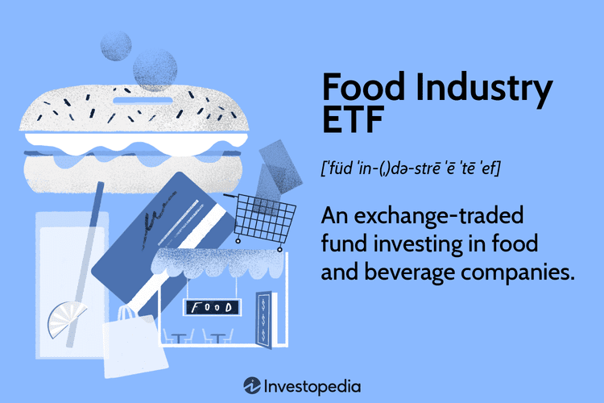

The COVID-19 pandemic has brought about significant changes across various industries, with the food industry being notably affected. This article seeks to explore the complex relationship between the changes induced by the pandemic within the food industry and their impact on Food Industry Exchange-Traded Funds (ETFs). Food Industry ETFs represent a diverse and compelling segment of the investment market, primarily due to their exposure to companies encompassing restaurants, grocery stores, and food manufacturers. 

The pandemic-induced shifts in the food industry have had profound implications for these ETFs. For instance, global supply chain disruptions and a marked change in consumer behavior resulted in unprecedented volatility within the sector. While grocery chains experienced heightened demand as consumers sought essential goods during lockdowns, restaurants faced significant hurdles due to enforced closures and reduced foot traffic. Investors in Food Industry ETFs were challenged to navigate these dynamics, balancing opportunities in consumer staples with the risks in restaurant holdings.



Moreover, the article examines the role of algorithmic trading systems in shaping investment strategies during such uncertain times. Algorithmic trading has become increasingly significant in managing ETF portfolios as they enhance trading speed and accuracy, analyze market data efficiently, and help mitigate risks in volatile environments. The merging of algorithmic strategies with ETF investments offers investors the ability to adapt swiftly to market changes, ensuring both cost-effectiveness and precision in trade execution.

In addition, understanding the dynamics of investing in these ETFs during periods of market shifts presents an opportunity for investors to adapt and potentially profit. By recognizing and analyzing the interactions between pandemic impacts, algorithmic trading, and Food Industry ETFs, investors are positioned to make informed decisions. This awareness is essential in the fast-evolving landscape of ETF investments, especially as the market continues to adjust to the long-term effects of the pandemic. Through this exploration, the article aims to provide valuable insights that can guide investors in making strategic choices to enhance their portfolios' resilience and growth potential.

## Table of Contents

## Understanding Food Industry ETFs

Food Industry ETFs, or Exchange-Traded Funds, offer investors comprehensive exposure to the diverse companies operating in the food sector. This sector includes a broad range of entities such as restaurants, grocery stores, and food manufacturers. By investing in Food Industry ETFs, investors hold a diversified portfolio that spans across consumer staples, beverages, and food commodities, providing a buffer against the volatility typically associated with individual stocks.

The primary advantage of Food Industry ETFs is the balance they provide between risk and reward. Unlike investing in a single stock, which exposes investors to the idiosyncratic risks of a particular company, ETFs spread the risk across multiple firms within the food industry. This diversification reduces the potential impact of a poor performance by any single company. For instance, while one restaurant chain might experience a downturn, grocery stores or food manufacturers included in the same ETF may perform better, thereby stabilizing the overall returns of the investment.

Moreover, the food sector is characterized by its relative stability, underpinned by constant consumer demand for food products. This makes ETFs focused on this sector appealing, as they can capture both the growth potential and consistent demand in a single investment vehicle. The incorporation of consumer staples, such as packaged foods and household products, ensures that Food Industry ETFs remain anchored even during economic fluctuations. This stability makes them attractive options for investors seeking resilience against market [volatility](/wiki/volatility-trading-strategies).

In summary, Food Industry ETFs effectively aggregate the growth opportunities and stability of the food sector into a single, manageable investment product. By offering diversification across a wide array of food-related companies, these ETFs help mitigate risks while capitalizing on the fundamental and essential nature of the food industry.

## Pandemic Impact on the Food Sector

The COVID-19 pandemic has caused significant disruption in global supply chains and consumer behavior, leading to notable volatility within the food sector. Grocery chains and supermarkets, considered essential services, experienced increased demand as consumers prioritized stocking up on essentials. Panic buying and stocking behaviors led to sales surges, impacting inventory management and creating supply chain challenges. Companies had to adapt quickly to fluctuations in demand, leading to innovations in logistics and restocking processes.

In contrast, the restaurant industry faced significant adversity due to lockdowns and decreased consumer footfall. Social distancing measures and government-imposed closures heavily impacted in-person dining, forcing many establishments to shift towards take-out and delivery models. This sudden change required rapid adaptation, including updating digital infrastructure for online orders and partnering with delivery services, yet revenues for many remained significantly lower than pre-pandemic levels.

These divergent impacts influenced the performance of food-related companies and, subsequently, Food Industry ETFs. Grocery-focused companies generally saw stable or increased valuations as they capitalized on the surge in demand for consumer staples. This stability translated to consumer staples ETFs, which exhibited resilience in maintaining their performance even amidst broader market sell-offs.

Despite the challenges faced by restaurants, some Food Industry ETFs with diversified holdings, including exposure to consumer staples, managed to hedge against the dips in the food sector. This diversification highlights the role of consumer staple stocks and their critical contribution to [ETF](/wiki/etf-trading-strategies) resilience in turbulent economic conditions. Their consistent demand, tied to indispensable food products, served as a buffer against the more volatile components of the food industry, underlining the strategic value of consumer staples within investment portfolios focused on the food sector.

Overall, the pandemic-induced volatility in the food sector illuminated the contrasting fortunes of various food-related businesses and underscored the importance of strategic diversification in Food Industry ETFs.

## Types of Food Industry ETFs and Their Components

Food Industry ETFs encompass a variety of fund types that provide investors with exposure to diverse aspects of the food sector. These types include Consumer Staples ETFs, Food and Beverage ETFs, Commodities ETFs, and Restaurant ETFs. Each type focuses on specific components of the food industry, catering to different investment preferences and risk appetites.

Consumer Staples ETFs are designed to track the performance of companies that produce essential products, including food. Key players in this category often include multinational giants like Proctor & Gamble, known for its extensive range of household and food products. These ETFs offer stability due to the consistent demand for essential items, even during economic downturns.

Food and Beverage ETFs target companies involved in the production, distribution, and retail of food and drink products. This segment includes a broad array of businesses, from food manufacturers to beverage companies. These ETFs allow investors to capitalize on general growth trends in the food and beverage market.

Commodities ETFs focus on the raw materials and agricultural products that constitute the food supply chain. These funds may include holdings in agricultural commodities such as wheat, corn, and soybeans. As the prices of these commodities fluctuate based on factors like weather conditions and global demand, investors have the opportunity to profit from these movements.

Restaurant ETFs invest in companies operating in the dining sector. Major holdings frequently include prominent chains such as McDonald's, which is a leader in the fast-food industry. With the shift in consumer dining habits, restaurant ETFs can offer both growth opportunities and exposure to consumer trend dynamics.

An emerging trend in this sphere is the development of socially responsible ETFs that prioritize companies committed to organic practices and environmental sustainability. These ETFs cater to investors who wish to align their portfolios with ethical considerations, supporting businesses that adhere to sustainable and eco-friendly practices. 

This diversification across different ETF types allows investors to tailor their exposure to specific sectors within the food industry, thereby achieving a balanced mix of stability and growth potential.

## Algorithmic Trading in ETF Investments

Algorithmic trading has become increasingly significant in the management of Exchange Traded Fund (ETF) portfolios, offering numerous advantages that are particularly pertinent in today's dynamic and volatile markets. By employing complex algorithms, traders can systematically analyze vast sets of market data to identify opportunities and execute trades with enhanced precision and speed. 

The fundamental process of [algorithmic trading](/wiki/algorithmic-trading) involves the use of predefined rules and mathematical models to make trading decisions. Algorithms can process multiple indicators such as price movements, trading volumes, and other relevant market metrics to identify optimal buying or selling points. For instance, moving averages, Bollinger Bands, and other technical indicators can be programmatically implemented to streamline decision-making processes.

One of the primary advantages of algorithmic trading in ETF management is the reduction of costs. By automating the trading process, these algorithms minimize the need for manual intervention, significantly reducing human errors and associated costs. Additionally, the ability to execute trades at high speeds—often within milliseconds—enables the capture of favorable market conditions that might otherwise be missed in manual trading scenarios.

Moreover, algorithmic trading facilitates effective risk management. Algorithms are capable of continuously monitoring market conditions and adjusting portfolios in real-time to hedge against potential losses. This feature is crucial for ETFs, as it allows for the preservation of capital during adverse market movements while also capitalizing on favorable trends.

The benefits of algorithmic trading are further amplified by its capacity for high-frequency trading ([HFT](/wiki/high-frequency-trading-strategies)), allowing investors to take advantage of short-lived opportunities in the market. HFT strategies often rely on statistical [arbitrage](/wiki/arbitrage), [market making](/wiki/market-making), and [trend following](/wiki/trend-following), which can be particularly beneficial for ETFs by improving [liquidity](/wiki/liquidity-risk-premium) and narrowing spreads.

In Python, for instance, traders can utilize libraries such as `pandas` for data manipulation, `numpy` for numerical calculations, and `[backtrader](/wiki/backtrader)` for [backtesting](/wiki/backtesting) strategies. A simple implementation could involve calculating moving averages to generate buy/sell signals, as shown in the following snippet:

```python
import pandas as pd
import numpy as np

# Example price data
prices = pd.Series([...])

# Calculate moving average
short_window = 40
long_window = 100
signals = pd.DataFrame(index=prices.index)
signals['signal'] = 0.0
signals['short_mavg'] = prices.rolling(window=short_window, min_periods=1, center=False).mean()
signals['long_mavg'] = prices.rolling(window=long_window, min_periods=1, center=False).mean()

# Generate signals
signals['signal'][short_window:] = np.where(signals['short_mavg'][short_window:] > signals['long_mavg'][short_window:], 1.0, 0.0)   
signals['positions'] = signals['signal'].diff()

```

This example computes a short and long moving average of price data, generates signals when short-term trends cross long-term ones, and records these in a DataFrame. Such strategies form the backbone of algorithmic trading in ETFs, enabling traders to react swiftly to market dynamics and improve the overall performance and stability of their portfolios.

In summary, algorithmic trading has heralded a new era of efficiency in ETF investments, providing tools that are capable of optimizing trade execution and risk management. Its relevance continues to grow as investors seek greater precision and reliability in uncertain markets.

## Investment Strategies for Food Industry ETFs

Investing in Food Industry ETFs requires a strategic approach to maximize returns and minimize risks. Among the strategies investors might consider, buy-and-hold, sector rotation, and [momentum](/wiki/momentum) trading stand out as prominent options.

**Buy-and-Hold Strategy**

The buy-and-hold strategy involves purchasing Food Industry ETFs and holding onto them for an extended period, regardless of market fluctuations. This approach can be beneficial due to the inherent stability and continuous demand for food commodities and consumer staples, which are key components of these ETFs. A long-term investment horizon allows investors to ride out short-term volatility and benefit from the steady growth of the food sector over time.

**Sector Rotation**

Sector rotation entails shifting investments among various sectors within the food industry based on economic cycles or market forecasts. Investors can capitalize on the relative strengths of different sectors—such as moving from restaurants to grocery chains depending on consumer trends. Given the cyclicality of certain sub-sectors in the food industry, this strategy can enhance returns by aligning investments with prevailing economic conditions.

**Momentum Trading**

Momentum trading involves buying ETFs that have shown a rising trend and selling those on a downward trajectory. This short-term strategy relies on technical analysis and market sentiment to identify Food Industry ETFs that are likely to perform well in the near term. It necessitates active monitoring of market indicators and developments in the food industry, such as changing consumer preferences or supply chain disruptions.

**Diversification and Risk Mitigation**

Diversification plays a pivotal role in minimizing risk and enhancing portfolio resilience, particularly during economic downturns. By holding a mix of Food Industry ETFs with exposure to various sub-sectors, investors can reduce the impact of sector-specific risks. This can be achieved by spreading investments across consumer staples, food commodities, and restaurant ETFs, thereby stabilizing returns and cushioning against losses in any single segment.

**Selecting the Right Financial Institution or Broker**

Choosing the right financial institution or broker is crucial for optimizing ETF investments. Key considerations include assessing the fee structure, which can significantly impact net returns, and ensuring access to advanced trading tools and resources. Brokers with low transaction fees and a strong reputation for reliability and service quality are preferable. Additionally, investors should evaluate the platform's user experience, research capabilities, and availability of educational resources to support informed decision-making.

By employing these strategies, investors can navigate the food industry ETF landscape effectively, positioning themselves to achieve consistent returns while managing risk.

## Why Consider Food Industry ETFs?

Food Industry ETFs (Exchange-Traded Funds) serve as a robust investment option owing to the consistent demand for food commodities and consumer staples across diverse economic conditions. These ETFs are structured to encompass a wide range of companies within the food sector, from manufacturers to retail giants, thereby ensuring that the investment remains resilient during economic fluctuations.

One key advantage of Food Industry ETFs is their potential recession-proof nature. Since consumer staples and food commodities are essentials, the demand remains relatively stable even during economic downturns. This characteristic renders ETFs in these sectors less susceptible to the dramatic swings often seen in more cyclical industries. As a result, they provide a stable foundation for investors looking for consistent returns.

The stability offered by these ETFs is complemented by potential growth opportunities, particularly evident during periods of economic upheaval such as the COVID-19 pandemic. During such times, although certain segments like restaurants might experience downturns, others, particularly grocery stores and food manufacturers, witness increased demand. This divergent performance within the sector can be mitigated through the diversified nature of ETFs, which spread investments across various sub-sectors to balance risks and returns effectively.

Moreover, Food Industry ETFs can be an essential component for investors aiming to diversify their portfolios. Diversification minimizes risk by spreading investments across a broad array of assets. By including Food Industry ETFs, investors gain exposure to a stable sector that complements more volatile investments, thus enhancing overall portfolio resilience.

The inclusion of Food Industry ETFs can be a strategic move for portfolio diversification and exposure to a traditionally stable sector. These ETFs not only offer a safeguard against economic volatility but also enable participation in the steady growth trends of the food industry, creating balanced and resilient investment portfolios.

## The Role of Food Industry ETFs in an Investment Portfolio

Food Industry ETFs serve as a cornerstone in fortifying investment portfolios against the backdrop of economic uncertainties. Their inherent diversification mitigates sector-specific risks, offering a balanced approach to portfolio management. By encompassing a broad spectrum of companies within the food sector, these ETFs enhance an investor's ability to weather financial storms.

The diversification benefits of Food Industry ETFs stem from their investment across various sub-sectors, including consumer staples, restaurants, and food commodities. This wide-ranging exposure minimizes the impact of adverse events affecting any single company or sub-sector. As different components of the food sector react uniquely to economic changes, the portfolio's overall volatility is reduced.

Furthermore, Food Industry ETFs provide investors with the opportunity to engage with the long-term growth potential of the food industry. Given the essential nature of food, demand remains relatively stable regardless of economic fluctuations. This consistency offers a safeguard for investment portfolios, particularly during market downturns, when other sectors might experience more pronounced volatility.

The stability provided by consumer staples, a significant component of Food Industry ETFs, is particularly noteworthy. These staple products benefit from sustained demand due to their essential nature, thus supporting steady revenue streams even during economic slowdowns. As a result, investing in these ETFs aligns with risk-averse strategies favoring enduring growth.

In conclusion, Food Industry ETFs are instrumental in achieving a balanced investment portfolio. By reducing risk through diversification and providing exposure to a resilient sector, they enable investors to maintain stability while capitalizing on the growth potential inherent in the food industry.

## Conclusion

The conclusion emphasizes the unique opportunities arising from the interplay between the pandemic's impact on the food sector, food industry ETFs, and algorithmic trading. Despite the disruptions caused by the COVID-19 pandemic, the food industry has demonstrated significant resilience, underscoring the potential benefits for investors who include Food Industry ETFs in their portfolios. These ETFs not only provide exposure to a critical sector but also leverage the stability and growth potential inherent in food-related businesses.

Algorithmic trading has further enhanced the appeal of investing in Food Industry ETFs by offering increased speed, accuracy, and cost-efficiency in trade executions. This technological advancement allows investors to better manage risks and take advantage of market trends, particularly in volatile conditions. As markets continue to evolve, staying informed and employing sound investment strategies will remain crucial for investors seeking to capitalize on these opportunities.

By incorporating Food Industry ETFs into their investment portfolios, investors can balance risk and potentially enjoy steady returns, even amidst economic fluctuations. The food sector's consistent demand, regardless of broader economic conditions, provides a solid foundation for long-term growth. Therefore, as investors navigate the continuously shifting landscape, understanding these elements and adopting strategic approaches will be key to unlocking the full potential of Food Industry ETF investments.

## References & Further Reading

[1]: Ellinger, Tom. (2021). ["Food Industry ETFs: Navigating Growth and Stability"](https://etfdb.com/etfs/industry/food--beverage/). Forbes.

[2]: Baldwin, Richard. (2020). ["Supply Chain Contagion Waves: Thinking Ahead on Manufacturing 'Contagion and Reinfection' from the COVID Concussion"](https://cepr.org/voxeu/columns/supply-chain-contagion-waves-thinking-ahead-manufacturing-contagion-and-reinfection). VoxEU.

[3]: Gormsen, Niels J., and Ravn, Morten O. (2020). ["The Stock Market’s Assessment of the COVID-19 Impact"](https://academic.oup.com/raps/article/10/4/574/5904278). Journal of the European Economic Association.

[4]: Ludwig, Linda. (2020). ["Investing in Consumer Staples ETFs: A Pandemic Review"](https://money.usnews.com/investing/articles/best-consumer-staples-etfs). The Wall Street Journal.

[5]: Zhou, Z., Han, Y., & Lu, Z. (2021). ["Impact of COVID-19 on the IT Sector: Evidence from Food Industry ETFs"](https://www.sciencedirect.com/science/article/abs/pii/S1364032121003142). International Review of Financial Analysis.