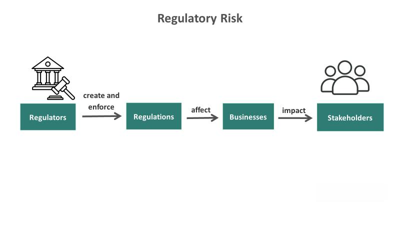

## Table of Contents

## What is food insecurity?

Food insecurity is when people don't have enough food or can't get the right kinds of food they need to stay healthy. It happens when they don't have enough money to buy food or when they can't get to places where food is sold. This problem can affect anyone, but it's more common in poor families and in certain areas of the world.

When people are food insecure, they might feel hungry a lot, not eat enough, or eat food that isn't good for them. This can make them sick or weak and can make it hard for them to work or go to school. It's a big problem that needs help from governments, communities, and other groups to make sure everyone has enough healthy food.

## How is food insecurity measured?

Food insecurity is measured using surveys that ask people about their experiences with food. These surveys might ask if people worried about running out of food, if they had to cut back on the amount of food they ate, or if they went hungry because they couldn't afford enough food. Organizations like the United States Department of Agriculture (USDA) use these surveys to understand how many people are affected by food insecurity in different areas.

The results from these surveys help create a food insecurity rate, which is a percentage that shows how many people in a certain area are food insecure. This rate can be used to compare different places or to see if the problem is getting better or worse over time. By measuring food insecurity, governments and other groups can decide where to focus their efforts to help people get enough healthy food.

Sometimes, other ways of measuring food insecurity are used, like looking at how much money people have or how easy it is for them to get to stores with healthy food. These methods help give a fuller picture of the problem and can show different reasons why people might not have enough food.

## What are the basic causes of food insecurity?

Food insecurity happens because of a few main reasons. One big reason is not having enough money. When people don't have enough money, they can't buy the food they need. This can happen because of losing a job, not making enough money at work, or having to spend money on other important things like medicine or rent. Another reason is when food is hard to get. This can be because stores with healthy food are far away or because there's not enough food being grown or brought to an area.

Another cause of food insecurity is when there are big problems like wars, natural disasters, or bad weather. These events can destroy farms, roads, and stores, making it hard for people to grow or get food. Also, when countries fight or have bad relationships, it can stop food from being sent from one place to another. These big problems can make food insecurity even worse, especially in places where people were already struggling to get enough to eat.

## How does food insecurity affect individuals and families?

Food insecurity can make life hard for individuals and families. When people don't have enough food, they might feel hungry all the time. This can make them tired and weak, which can make it hard to work or go to school. Kids who don't get enough food might not grow and learn as well as they should. Adults might have a harder time staying healthy and doing their jobs. When families don't have enough food, it can cause stress and worry, making it tough for everyone to feel happy and safe.

On top of physical problems, food insecurity can also hurt people's feelings and minds. When people are always worried about where their next meal will come from, it can make them feel sad, anxious, or even ashamed. Families might feel embarrassed to ask for help, even when they really need it. This can lead to arguments and tension at home, which can make the whole family feel upset. Over time, these feelings can affect how well people get along with others and how they see themselves.

## What is the relationship between food insecurity and poverty?

Food insecurity and poverty are closely linked. When people are poor, they often don't have enough money to buy the food they need. This means they might have to skip meals or eat less than they should. Poverty can make it hard for people to get to stores with healthy food, especially if they live far away from these places. When families are struggling to make ends meet, they might have to choose between buying food and paying for other important things like rent or medicine.

Because of this, food insecurity is often a sign that someone is living in poverty. When people can't afford enough food, it can make their lives even harder. They might not be able to work as well or go to school, which can keep them stuck in poverty. This creates a cycle where being poor makes it hard to get enough food, and not having enough food makes it hard to get out of poverty. Breaking this cycle is important for helping people live healthier and happier lives.

## How does food insecurity impact the economy at a local level?

Food insecurity can hurt the local economy. When people don't have enough food, they might not be able to work as well or go to school. This means they might not earn as much money or learn the skills they need for good jobs. When a lot of people in a community are food insecure, it can slow down the whole economy. Businesses might not do as well because people don't have money to spend on things other than food. This can lead to fewer jobs and less money moving around in the local area.

On the other hand, trying to fix food insecurity can help the local economy. When people get help with food, they can focus on working and learning. This can lead to more people [earning](/wiki/earning-announcement) money and spending it in the community. Programs that give out food or help people buy it can also create jobs and support local farmers and stores. By making sure everyone has enough to eat, a community can become stronger and more prosperous.

## What are the national economic consequences of widespread food insecurity?

Widespread food insecurity can hurt a country's economy. When a lot of people don't have enough food, they might not be able to work as well or go to school. This means they might not earn as much money or learn the skills they need for good jobs. When many people in a country are food insecure, it can slow down the whole economy. Businesses might not do as well because people don't have money to spend on things other than food. This can lead to fewer jobs and less money moving around in the country.

On the other hand, trying to fix food insecurity can help the national economy. When people get help with food, they can focus on working and learning. This can lead to more people earning money and spending it in the country. Programs that give out food or help people buy it can also create jobs and support farmers and stores. By making sure everyone has enough to eat, a country can become stronger and more prosperous.

## How do government policies influence food insecurity?

Government policies can make a big difference in whether people have enough food or not. When governments make good rules about farming and food, they can help make sure there's enough food for everyone. For example, if the government helps farmers by giving them money or teaching them new ways to grow food, there will be more food to go around. Also, if the government gives money to poor families or makes programs that give out free or cheap food, it can help people who can't afford to buy food on their own. These kinds of policies can make food insecurity less of a problem.

But sometimes, government policies can make food insecurity worse. If the government doesn't help farmers or if it makes it hard for them to sell their food, there might not be enough food for everyone. Also, if the government doesn't do enough to help poor people, like not giving them enough money or support, more people might struggle to buy food. Wars, bad relationships with other countries, and not spending enough money on food programs can also make it harder for people to get the food they need. So, what the government does, or doesn't do, can have a big impact on whether people have enough to eat.

## What role do international trade and food prices play in food insecurity?

International trade and food prices can make food insecurity better or worse. When countries trade food with each other, it can help make sure there's enough food everywhere. If one country doesn't grow enough food, it can buy food from another country that has extra. But if countries have problems with each other or if it's hard to move food from one place to another, it can make food harder to get. This can lead to food insecurity in places that need to buy food from other countries.

Food prices also matter a lot. When the price of food goes up, people who don't have much money might not be able to buy enough food. This can happen because of many reasons, like bad weather that hurts crops, or when a lot of people start buying more food. When food prices are high, more people can become food insecure. But if governments and other groups work together to keep food prices stable and make sure food can move easily between countries, it can help stop food insecurity from getting worse.

## How can economic development strategies address food insecurity?

Economic development strategies can help fight food insecurity by making sure people have jobs and earn enough money to buy food. When countries focus on growing their economy, they can create more jobs and help people earn more money. This means families can afford to buy enough food and don't have to worry about going hungry. Also, when the economy grows, the government can have more money to spend on programs that help poor people get food, like food stamps or free meals for kids at school. By making the economy stronger, countries can make sure everyone has enough to eat.

Another way economic development can help is by supporting farmers and making it easier to grow and sell food. When governments help farmers with money, new technology, or better ways to farm, they can grow more food. This means there will be more food available for everyone, which can make food cheaper and easier to get. Also, if the government builds better roads and transportation systems, it can be easier to move food from farms to stores and to people who need it. By helping farmers and making it easier to get food to people, economic development can make food insecurity less of a problem.

## What are some successful case studies of interventions that have reduced food insecurity?

One successful case of reducing food insecurity happened in Brazil. The government started a program called "Bolsa Família," which gives money to poor families to help them buy food and other things they need. This program helped a lot of people because it made sure they had enough money to eat well. It also helped families send their kids to school and get health care. Because of Bolsa Família, fewer people in Brazil were food insecure, and the country became a good example of how giving money to poor families can make a big difference.

Another good example is in Ethiopia, where the government and other groups worked together on a program called the "Productive Safety Net Programme" (PSNP). This program gives food or money to people who work on projects that help their communities, like building roads or planting trees. It helps people get food right away and also helps the community in the long run. The PSNP has helped a lot of people in Ethiopia have enough to eat and has made the country's food situation better overall. It shows how working together and helping people help themselves can fight food insecurity.

## What are the future economic projections related to food insecurity and how might they be mitigated?

Future economic projections suggest that food insecurity could become a bigger problem if we don't do something about it. As the world's population grows, there will be more people who need food. At the same time, climate change might make it harder to grow food in some places. If more people are poor and can't afford food, and if food prices go up, food insecurity could get worse. This could slow down economies because people who are hungry can't work or learn as well. It's important for countries to plan ahead and work together to make sure everyone has enough to eat.

To mitigate these problems, countries can focus on making their economies stronger so more people have jobs and can afford food. They can also help farmers grow more food by giving them money, new technology, and better ways to farm. It's important to keep food prices stable and make sure food can move easily between countries. Governments can also start programs that give money or food to poor families, like the ones in Brazil and Ethiopia. By working together and planning for the future, we can make sure that food insecurity doesn't get worse and that everyone has enough to eat.

## References & Further Reading

[1]: Barrett, C. B., Reardon, T., & Webb, P. (2001). ["Nonfarm Income Diversification and Household Livelihood Strategies in Rural Africa: Concepts, Dynamics, and Policy Implications."](https://www.sciencedirect.com/science/article/pii/S0306919201000148) Food Policy, 26(4), 315-331.

[2]: FAO, IFAD, UNICEF, WFP and WHO. (2021). ["The State of Food Security and Nutrition in the World 2021."](https://www.fao.org/publications/home/fao-flagship-publications/the-state-of-food-security-and-nutrition-in-the-world/2021/en) Transforming food systems for food security, improved nutrition, and affordable healthy diets for all. FAO.

[3]: Lopez de Prado, M. (2018). ["Advances in Financial Machine Learning."](https://www.amazon.com/Advances-Financial-Machine-Learning-Marcos/dp/1119482089) Wiley.

[4]: Lal, R. (2010). ["Enhancing Ecosystem Services with No-till."](https://www.cambridge.org/core/journals/renewable-agriculture-and-food-systems/article/abs/enhancing-ecosystem-services-with-notill/473BDB85051FA3A712AAB7F026309644) Agronomy Journal, 60(2), 34-37.

[5]: Sen, Amartya. (1981). ["Poverty and Famines: An Essay on Entitlement and Deprivation."](https://academic.oup.com/book/32827) Oxford University Press.

[6]: Schutt, R., & O'Neil, C. (2013). ["Doing Data Science: Straight Talk from the Frontline."](https://www.oreilly.com/library/view/doing-data-science/9781449363871/) O'Reilly Media.

[7]: Chandy, L., Ledlie, N., & Penciakova, V. (2013). ["The Final Countdown: Prospects for Ending Extreme Poverty by 2030."](https://www.brookings.edu/articles/the-final-countdown-prospects-for-ending-extreme-poverty-by-2030-report/) Brookings Institution. 

[8]: Battersby, J., & Watson, V. (2019). ["Addressing food security in African cities."](https://www.nature.com/articles/s41893-018-0051-y) Nature Sustainability, 2, 755–756.