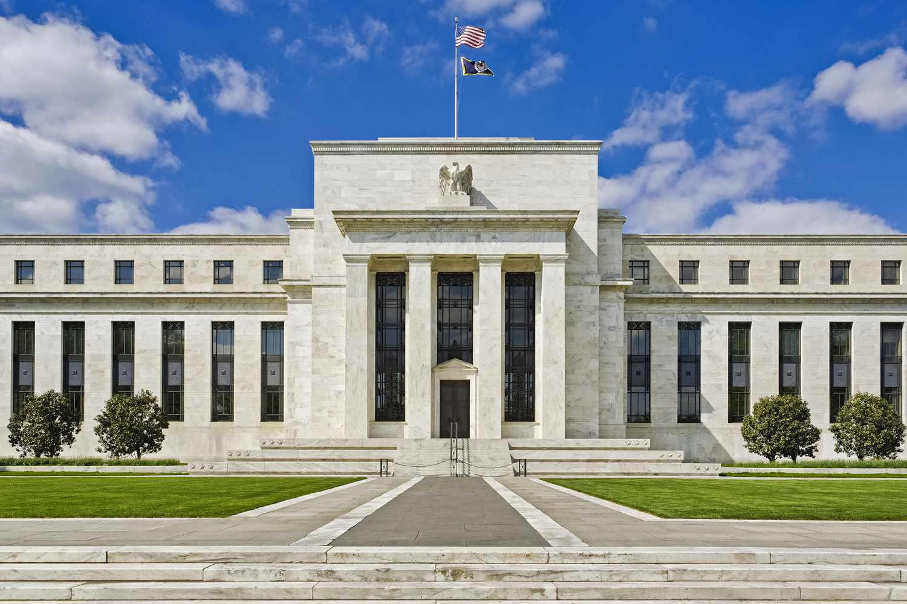

In economics and financial markets, a rich tapestry of knowledge is woven from intersecting terms and theories. Among these are the concepts of 'fool in the shower,' monetary policy, economic theory, and algorithmic trading. This article explores the interplay between these concepts, emphasizing how traditional economic theories inform both modern monetary policy and advanced trading technologies.

The metaphor of 'fool in the shower,' introduced by Nobel laureate Milton Friedman, serves as a pivotal point of exploration. It sheds light on potential pitfalls in economic policymaking, a topic still pertinent in today's economic landscape. The metaphor provides a lens through which we can understand the importance of measured reactions to economic indicators, warning against the risks of overcompensation.



Further, as financial markets have evolved, algorithmic trading has emerged as an influential force, leveraging economic theory to optimize trading strategies. In particular, monetarist principles, which emphasize the role of money supply in determining economic stability and growth, are crucial. These principles not only guide monetary policy but also influence the development and deployment of sophisticated trading algorithms. Such algorithms are designed to process vast amounts of data and execute trades at speeds beyond human capability, aligning with monetarist insights into how financial markets respond to changes in monetary policy.

By examining these intersections, the article aims to provide insights into the evolving role of economics in shaping financial markets. Understanding these interactions highlights the importance of integrating economic theory with technological advancements to create sustainable and efficient financial systems. Through this analysis, readers can appreciate the complexity and dynamism of financial markets and the enduring relevance of economic theories in guiding both policy and practice.

## Table of Contents

## Understanding 'Fool in the Shower' Metaphor

Originating from Milton Friedman's critique of economic policy-making, the 'fool in the shower' metaphor offers a vivid illustration of the dangers posed by hasty adjustments in economic policy. Milton Friedman introduced this metaphor to critique the tendency of policymakers, particularly in central banks, to overreact to short-term economic fluctuations. Much like a person adjusting the temperature in a shower, policymakers might respond excessively to immediate economic data without allowing time to assess the impact of prior actions.

The metaphor uses the imagery of a person in a shower who experiences an abrupt change in water temperature. In a bid to correct the temperature—be it too hot or too cold—the individual might quickly crank the tap, only to find that the water temperature becomes too extreme in the opposite direction. Similarly, central banks might make rapid changes in monetary policy, leading to economic conditions swinging dramatically, akin to the oscillation between icy and scalding shower water.

This over-correction can lead to significant [volatility](/wiki/volatility-trading-strategies) in the economy. When central banks adjust interest rates or change the money supply too swiftly or frequently, they might inadvertently contribute to economic instability. The metaphor underscores the necessity for policymakers to adopt a more measured approach, implementing changes gradually and allowing time to evaluate their effects before implementing further alterations.

The 'fool in the shower' metaphor serves as a cautionary tale against the pitfalls of reactive policy-making, emphasizing the need for thoughtful consideration and strategic planning in economic governance. By avoiding hasty actions, policymakers can better manage the delicate balance necessary to maintain economic stability and prevent disruptive economic oscillations.

## Monetary Policy: Lags and Impacts

Monetary policy is a crucial instrument used by central banks to regulate the supply of money in an economy, thereby achieving macroeconomic goals such as controlling inflation, stabilizing currency, managing employment levels, and fostering economic growth. The primary tools of monetary policy include open market operations, setting reserve requirements, and adjusting interest rates.

A significant aspect of monetary policy is the lag time between the implementation of a policy and its observable effects on the economy. This delay can be attributed to several factors:

1. **Recognition Lag**: The time taken to recognize the need for policy changes based on economic indicators.
2. **Implementation Lag**: The period required to design and implement the policy measures.
3. **Impact Lag**: The duration it takes for the implemented measures to influence economic variables such as output, employment, and prices.

The 'fool in the shower' metaphor, introduced by Milton Friedman, illustrates the potential pitfalls if policymakers react too quickly without considering these lags. Just as a person in a shower may over-adjust the tap in response to delayed temperature changes, leading to extreme fluctuations, economic policymakers may also risk inducing instability if they do not account for these lags.

Understanding and accounting for these time lags are critical for effective policy-making. For instance, if a central bank anticipates inflationary pressures, it may raise interest rates to curb borrowing and spending. However, if the effects of this rate hike are delayed, it could inadvertently stifle growth once the economic condition warrants expansion. Conversely, delayed responses to an economic slowdown could prolong periods of unemployment and low output.

Effective policy measures require anticipating the economy's trajectory and the potential time delays in responses. This strategic foresight helps stabilize markets by preventing over-correction and minimizing economic volatility. Central banks often rely on economic forecasts and models to predict these effects and time their actions appropriately.

## Algorithmic Trading and Economic Theory

Algorithmic trading, a technology-driven method, leverages sophisticated computer algorithms to execute trades far more rapidly and efficiently than any human trader could ever manage. These algorithms are designed to follow specific sets of instructions, thus enabling systematic and high-frequency trading. The integration of robust economic theories, especially monetarism, plays a crucial role in guiding these algorithms toward making informed, data-driven decisions.

Monetarism, a macroeconomic concept primarily associated with Milton Friedman, emphasizes the importance of money supply in determining economic performance and inflation levels. This theory posits that changes in the money supply have significant short-term and long-term impacts on economic activity. The integration of monetarist principles into [algorithmic trading](/wiki/algorithmic-trading) strategies therefore allows traders to anticipate and respond promptly to shifts in monetary policy and economic conditions.

Algorithms embedded with monetarist insights are programmed to monitor indicators such as interest rates, inflation rates, and changes in central bank policies. By analyzing these indicators, the algorithms can predict market trends and adjust trading strategies accordingly. For instance, a sudden change in interest rates might signal an alteration in monetary policy, leading the algorithm to adapt its trading actions to minimize risks and maximize returns.

The adaptation of these algorithms to anticipate policy changes can involve advanced predictive modeling techniques. Using Python, traders can develop models to estimate the potential impact of monetary policy shifts on various financial instruments. A simple example might be using Python's pandas and NumPy libraries to analyze historical [interest rate](/wiki/interest-rate-trading-strategies) changes and their effects on asset prices.

```python
import pandas as pd
import numpy as np

# Example: Analyzing interest rates and asset price returns
interest_data = pd.read_csv('interest_rates.csv')
asset_prices = pd.read_csv('asset_prices.csv')

# Calculate historical returns
asset_returns = asset_prices.pct_change().dropna()

# Analyzing the correlation between interest rates and asset returns
correlation_matrix = interest_data.corrwith(asset_returns)
print(correlation_matrix)
```

This script would enable traders to comprehend the historical interplay between interest rate variations and asset price movements, forming the basis for more refined trading strategies.

The application of monetarism within algorithmic trading exemplifies the fusion of economic theory with technological advancement. By incorporating these principles, algorithmic trading does not merely automate trade executions but enhances strategic decision-making processes. This empowers traders to proactively manage financial risks while capitalizing on economic developments, ultimately contributing to more stable and efficient financial markets.

## Integration of Monetarism in Algorithmic Trading

Monetarist principles, primarily focusing on the role of money supply in determining economic activity, have found significant application in the development of algorithmic trading strategies. These principles offer a structured approach to understanding macroeconomic trends and market behaviors, which are crucial for the advancement and optimization of algorithm-driven trading systems. By employing monetarist concepts, algorithms can be designed to anticipate changes in monetary policy and adjust trading strategies in real-time, enhancing the responsiveness and effectiveness of financial instruments under rapidly changing market conditions.

One core tenet of monetarism is the relationship between money supply and inflation, often expressed through the equation of exchange, MV = PQ, where M represents money supply, V is the velocity of money, P is the price level, and Q is the output of goods and services. In the context of algorithmic trading, this equation can be utilized to predict inflationary trends by analyzing variations in money supply metrics, consequently allowing traders to adjust their portfolios to hedge against inflationary or deflationary pressures.

Algorithmic trading systems leverage large datasets and complex statistical models grounded in monetarist theory to forecast economic trends. For example, Python could be used to develop an algorithm that incorporates time series analysis to predict market reactions to anticipated policy shifts. Here's a simple Python snippet that highlights how historical monetary supply data might be processed:

```python
import pandas as pd
from statsmodels.tsa.arima_model import ARIMA
import matplotlib.pyplot as plt

# Load historical money supply data
data = pd.read_csv('monetary_supply.csv', index_col='Date', parse_dates=True)

# Fit ARIMA model to predict future money supply changes
model = ARIMA(data['M1'], order=(5,1,0))
model_fit = model.fit(disp=0)

# Forecast future money supply
forecast, stderr, conf_int = model_fit.forecast(steps=5)

# Plot results
plt.plot(data.index, data['M1'], label='Historic')
plt.plot(pd.date_range(start=data.index[-1], periods=6, freq='M')[1:], forecast, label='Forecast')
plt.fill_between(pd.date_range(start=data.index[-1], periods=6, freq='M')[1:], conf_int[:, 0], conf_int[:, 1], color='gray', alpha=0.2)
plt.legend()
plt.show()
```

This fusion of economic theory and cutting-edge technologies enables traders to achieve more precise risk assessments and improves their ability to make informed decisions under various economic scenarios. By structuring algorithms to apply monetarist principles, the scope for predicting policy impacts on markets widens, contributing to the development of more resilient and adaptable trading strategies. As financial markets continue to evolve, the integration of monetarist theory into algorithmic trading will likely persist, shaping the future landscape of automated trading systems and offering enhanced strategic frameworks for financial risk management.

## Challenges and Criticisms

Monetarism, a core component of modern economic thought, has been influential in shaping economic policies and financial theories. However, it is often critiqued for its perceived oversimplification of economic dynamics and an overemphasis on the role of money supply as a determinant of economic performance. Critics argue that monetarism does not adequately account for the complexities of fiscal policy, political influences, and real economic variables such as productivity and technological advancements, which play a significant role in influencing economic outcomes [1][6]. 

Algorithmic trading, which efficiently incorporates economic theories like monetarism into its frameworks, likewise faces scrutiny. One of the major concerns regarding algorithmic trading is its potential to exacerbate market volatility. The 2010 Flash Crash is a notable example, where high-frequency trading was identified as a key [factor](/wiki/factor-investing) in the dramatic, albeit brief, plunge in U.S. stock indices [2]. Moreover, the automation and speed associated with algorithmic trading can sometimes result in unintended consequences, where minor errors in algorithms might trigger large-scale sell-offs or purchases, thereby destabilizing markets.

Ethical considerations also arise with algorithmic trading. The use of sophisticated algorithms can lead to practices that may be deemed unfair, such as front-running—where a trading firm uses advanced knowledge of pending orders to trade ahead of an investor, potentially disadvantaging slower participants. These practices raise questions about market fairness and transparency, prompting discussions on the need for regulatory frameworks to ensure ethical standards are upheld.

Addressing these challenges requires both theoretical and technological adaptations. For monetarism, integrating a broader spectrum of economic variables and considering the interplay between fiscal and monetary policies could enrich its analytical capabilities. On the technological front, continuous monitoring and updating of algorithms, along with robust ethical guidelines, can help mitigate risks associated with algorithmic trading. Regulatory bodies can play a pivotal role in establishing rules that ensure fair trading practices while allowing the benefits of technological advancements to be realized in financial markets.

## Conclusion

The interaction between economic theories, particularly monetarism, and modern technologies like algorithmic trading illustrates a significant transformation in financial markets. Monetarism, with its emphasis on the money supply's impact on economic stability and inflation, provides a theoretical foundation that can be effectively utilized by algorithmic trading systems. These systems capitalize on economic data, applying sophisticated algorithms to make quick, informed decisions that can significantly influence market dynamics.

The 'fool in the shower' metaphor offers a critical perspective on monetary policy. By warning against overreactive adjustments, it highlights the need for gradual and cautious economic strategies to prevent unnecessary volatility. Such caution is vital for maintaining equilibrium in markets that are increasingly governed by rapid technological advancements. In this context, the metaphor underscores the importance of allowing time for policy impacts to manifest before implementing additional measures.

The evolution of financial markets is further characterized by the ongoing integration of economic theory with trading technology. As these elements converge, they contribute to the development of sustainable and efficient financial systems. Algorithms that incorporate monetarist principles can predict and react to policy changes, offering more stable market conditions and improved risk management. This synergy between theory and technology not only enhances the functionality of markets but also ensures their resilience and adaptability in a continuously changing economic landscape.

## References & Further Reading

[1]: Friedman, M. (1968). The Role of Monetary Policy. The American Economic Review, 58(1), 1-17. This seminal paper by Milton Friedman discusses the fundamental aspects of monetary policy, examining its influence on economic stability and growth. It introduces key concepts such as the 'fool in the shower' metaphor, emphasizing the importance of cautious policy adjustments to avoid economic volatility.

[2]: Findings Regarding the Market Events of May 6, 2010. U.S. Commodity Futures Trading Commission and Securities & Exchange Commission, 2010. This report analyzes the causes and consequences of the 'Flash Crash' of 2010, a significant event in the financial markets that underscored the potential risks associated with algorithmic trading, including market volatility and ethics in automated trading mechanisms.

[3]: Capitalism and Freedom by Milton Friedman. This book outlines Friedman’s economic theories, advocating for free markets and limited government intervention. These perspectives provide a foundation for understanding how monetarism can influence both policy-making and trading strategies.

[4]: Free to Choose: A Personal Statement by Milton and Rose Friedman. In this volume, the Friedmans expand on their economic philosophies, addressing the intersections between personal freedom, government policy, and economic efficiency, relevant to comprehending the broader implications of economic theories like monetarism.

[5]: Algorithmic Trading: Winning Strategies and Their Rationale by Ernie Chan. This book investigates into the techniques and strategies involved in algorithmic trading, offering insights into how economic theories can be incorporated into algorithm design to enhance trading efficiency and effectiveness.

[6]: Monetary History of the United States, 1867-1960 by Milton Friedman and Anna J. Schwartz. This comprehensive work examines the role of monetary policy throughout American history, illustrating key trends and lessons that inform current economic theory and practice, particularly for algorithmic trading frameworks.