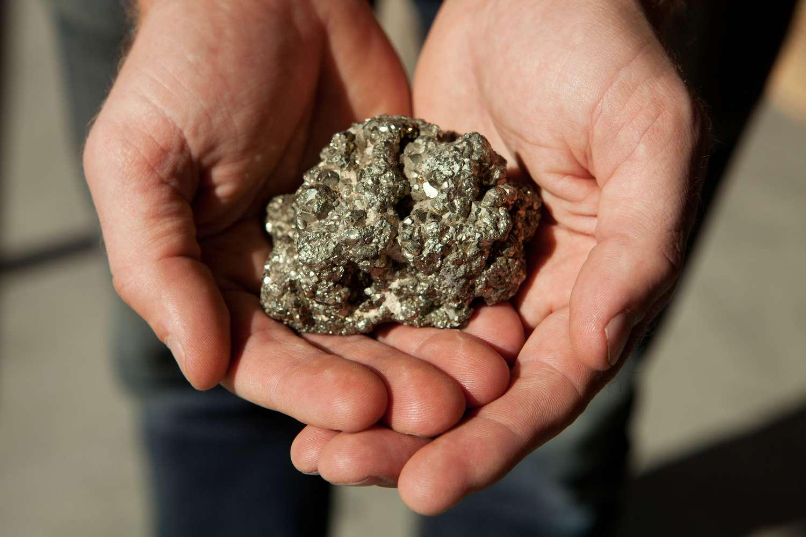

## Table of Contents

## What is Fool's Gold and why is it called that?

Fool's Gold is another name for a mineral called iron pyrite. It is a shiny, gold-colored rock that looks a lot like real gold. People who were searching for gold sometimes thought they found it when they saw iron pyrite, but they were tricked because it wasn't really gold.

That's why it's called Fool's Gold. The name comes from the fact that it fools people into thinking they have found real gold. It's a common mistake because the two look similar, but iron pyrite is much less valuable than gold.

## How can you identify Fool's Gold visually?

You can spot Fool's Gold by looking at its color and how it shines. Fool's Gold, or iron pyrite, has a brassy yellow color, not the bright, rich yellow of real gold. When you look closely, you might see that it has a more greenish or brownish tint than real gold. Also, Fool's Gold often has a metallic shine that can look a bit dull or tarnished, while real gold always looks bright and shiny.

Another way to tell them apart is by looking at the surface. Fool's Gold often has sharp edges and flat surfaces that look like little cubes or crystals. Real gold, on the other hand, usually has smoother, rounded edges because it is softer and gets worn down more easily. If you see a rock that looks like it's made up of tiny, shiny cubes, it's probably Fool's Gold and not real gold.

## What are the common geological environments where Fool's Gold is found?

Fool's Gold, or iron pyrite, is often found in places where there used to be a lot of water, like old river beds or lake bottoms. These places have a lot of sediment, which is tiny bits of rock and dirt that settle at the bottom of water. Over time, the sediment can turn into rock, and sometimes, iron pyrite forms inside these rocks. You can find Fool's Gold in sedimentary rocks like shale, limestone, and coal.

Another place to find Fool's Gold is in areas with volcanic activity. When volcanoes erupt, they can leave behind hot liquids and gases that cool down and turn into minerals. Iron pyrite can form in these volcanic rocks. Miners often find Fool's Gold in places where they are looking for other minerals like copper or zinc, because these minerals can form together in the same kinds of rocks.

So, if you're looking for Fool's Gold, check out old river beds, lake bottoms, and places where there has been volcanic activity. These are the most common spots where you might find this shiny mineral that looks like gold but isn't.

## What are the main differences between Fool's Gold and real gold?

Fool's Gold, or iron pyrite, looks a lot like real gold because it is shiny and yellow. But there are some big differences. Fool's Gold has a more brassy color, sometimes with a greenish or brownish tint, while real gold is a bright, rich yellow. Also, Fool's Gold can look dull or tarnished, but real gold always looks bright and shiny. Another way to tell them apart is by looking at their shapes. Fool's Gold often has sharp edges and flat surfaces that look like little cubes or crystals. Real gold, on the other hand, usually has smoother, rounded edges because it is softer and gets worn down more easily.

The places where you find Fool's Gold and real gold are different too. Fool's Gold is often found in sedimentary rocks like shale, limestone, and coal, which form in places where there used to be a lot of water, like old river beds or lake bottoms. It can also be found in volcanic rocks where hot liquids and gases have cooled down and turned into minerals. Real gold, however, is usually found in places where there has been a lot of movement in the earth, like near fault lines or in areas where rocks have been broken and moved around. This movement can help gold get out of the rocks it is in and collect in places where miners can find it.

## How has Fool's Gold been used historically, and what are its current uses?

In the past, people used Fool's Gold in many ways. One big use was making sparks. People would hit Fool's Gold with a hard rock to make sparks to start fires. This was really important before matches were invented. Fool's Gold was also used in making ink because it has a lot of iron in it. Some cultures even thought Fool's Gold had special powers and used it in ceremonies or as part of their religious beliefs.

Today, Fool's Gold still has some uses, but they are different from the past. It is used in making sulfuric acid, which is used in lots of things like batteries and cleaning products. Fool's Gold can also be used to make some kinds of jewelry, but not as much as real gold because it is not as valuable. Scientists use Fool's Gold in research too, especially to learn more about how minerals form and how they can be used in new ways.

## What are the potential investment risks associated with Fool's Gold?

Investing in Fool's Gold can be risky because it is not worth much money. Real gold is valuable because it is rare and used in many things like jewelry and electronics. Fool's Gold, or iron pyrite, looks like gold but is not rare or valuable. If you buy Fool's Gold thinking it will go up in price like real gold, you could lose money because it will not be worth much to anyone else.

Another risk is that some people might try to trick you by selling Fool's Gold and saying it is real gold. This is called a scam. If you do not know how to tell the difference between Fool's Gold and real gold, you could end up paying a lot of money for something that is not worth much. It is important to be careful and learn how to spot the differences before you buy anything that looks like gold.

## Can Fool's Gold have any value in the market, and if so, under what conditions?

Fool's Gold, or iron pyrite, usually does not have much value in the market because it is not rare or used in many important things like real gold. But, there are some special cases where it can have a bit of value. For example, if someone wants to use it for making jewelry that looks like gold but costs less, they might pay a small amount for Fool's Gold. Also, collectors who like minerals and rocks might be willing to pay for nice-looking pieces of Fool's Gold to add to their collections.

Another situation where Fool's Gold can have some market value is in the world of science and industry. Scientists might buy Fool's Gold to use in experiments or to study how minerals form. In industry, Fool's Gold can be used to make sulfuric acid, which is important for making batteries and cleaning products. So, even though Fool's Gold is not as valuable as real gold, it can still be worth something to the right people in the right situations.

## What scientific methods can be used to distinguish Fool's Gold from real gold?

One way scientists tell Fool's Gold apart from real gold is by using a magnet. Fool's Gold, or iron pyrite, has iron in it, so it can stick to a magnet. Real gold does not have iron, so it will not stick. This is a simple test that anyone can do. Another way is by looking at how hard the material is. Scientists use something called the Mohs hardness scale to check this. Fool's Gold is harder than real gold. If you scratch it with a knife, Fool's Gold will not get scratched easily, but real gold will.

Scientists can also use a test called a streak test. When you rub Fool's Gold on a piece of unglazed porcelain, it leaves a black or dark brown streak. Real gold leaves a yellow streak. This is because the color of the powder that comes off when you rub the mineral is different. Another method is to use acid. If you put a drop of nitric acid on Fool's Gold, it will not react much. But if you put it on real gold, the gold will not react either. However, if you use a different acid, like hydrochloric acid, Fool's Gold will react and make a smell like rotten eggs, but real gold will not react at all.

## How do economic factors influence the perceived value or interest in Fool's Gold?

Economic factors can change how people see Fool's Gold. When the price of real gold goes up a lot, people start looking for gold more. Sometimes, they might find Fool's Gold instead and think it is worth more because they are hoping to find real gold. But when the price of real gold goes down, people are not as excited about looking for gold, so they do not care as much about Fool's Gold either. Also, if the economy is not doing well, people might try to sell Fool's Gold as if it were real gold to make some money, which can make others think Fool's Gold has more value than it really does.

Another way economic factors can affect Fool's Gold is through the demand for the things it is used to make. For example, if there is a big need for sulfuric acid, which is made from Fool's Gold, then the value of Fool's Gold might go up a little bit. But this is not very common because there are other ways to make sulfuric acid that are usually cheaper. So, while economic factors can make people more interested in Fool's Gold, it is still not very valuable compared to real gold.

## What are some notable cases where Fool's Gold has led to significant financial losses?

One famous case where Fool's Gold caused big money losses happened during the California Gold Rush in the 1800s. Many people went to California to find gold, but some of them found Fool's Gold instead. They thought they were rich, but when they tried to sell it, they found out it was not worth much. Some people lost a lot of money because they spent time and money looking for gold and ended up with nothing.

Another case happened more recently in the 1990s in Australia. Some miners found what they thought was a huge amount of gold. They got very excited and started telling everyone about their find. But when they tried to sell it, they learned it was Fool's Gold. They had spent a lot of money on mining equipment and time digging, and in the end, they lost a lot of money because Fool's Gold is not worth much.

## How does the regulation of mineral sales impact the trade of Fool's Gold?

Rules about selling minerals can affect how Fool's Gold is traded. Governments might have laws that say you need to be honest about what you are selling. This means you cannot say Fool's Gold is real gold. If you do, you could get in trouble. These rules help stop people from tricking others into buying Fool's Gold thinking it is real gold. But, if the rules are not strong or not followed well, some people might still try to sell Fool's Gold as real gold and cause problems.

In some places, the rules might be different. For example, some countries might not have strict rules about selling minerals. This can make it easier for people to sell Fool's Gold without saying what it really is. But in places with good rules, it can be harder to sell Fool's Gold because you have to be clear about what you are selling. So, the rules can change how much Fool's Gold is traded and how it is sold.

## What advanced techniques are used in the industry to detect and avoid investment in Fool's Gold?

In the industry, people use special machines to tell the difference between Fool's Gold and real gold. One common machine is called an X-ray fluorescence (XRF) analyzer. This machine can look at the minerals and tell what they are made of. When you use an XRF analyzer on Fool's Gold, it shows that it has a lot of iron and sulfur. Real gold does not have these things, so the machine can easily tell them apart. Another tool is a scanning electron microscope (SEM). This tool can look at the tiny details of the mineral and help people see if it is Fool's Gold or real gold.

Companies also use other ways to make sure they do not invest in Fool's Gold. They hire experts who know a lot about minerals. These experts can look at the minerals and use their knowledge to tell if it is Fool's Gold or real gold. Sometimes, companies send samples of the minerals to special labs where scientists can do more tests. These labs can use things like chemical analysis to check what the minerals are made of. By using these advanced techniques, companies can avoid wasting money on Fool's Gold and make better investments.

## How can one avoid Fool's Gold in algorithmic trading?

Avoiding pitfalls in algorithmic trading requires a comprehensive approach, beginning with meticulous research and a solid understanding of the underlying assets. By thoroughly evaluating historical data, market fundamentals, and the specific characteristics of the securities involved, traders can develop strategies that are rooted in concrete evidence rather than mere speculation.

Diversification is crucial in mitigating risks associated with algo trading. By allocating capital across various asset classes—such as equities, bonds, commodities, and foreign exchange—investors can reduce the impact of adverse movements in any single market. The diversification principle can be mathematically represented by the formula for portfolio variance:

$$
\sigma_p^2 = \sum_{i=1}^{N} w_i^2 \sigma_i^2 + \sum_{i=1}^{N} \sum_{j \neq i} w_i w_j \sigma_i \sigma_j \rho_{ij}
$$

where $\sigma_p^2$ is the portfolio variance, $w_i$ is the weight of asset $i$, $\sigma_i$ is the standard deviation of asset $i$, and $\rho_{ij}$ is the correlation coefficient between assets $i$ and $j$. This model illustrates how spreading investments across negatively correlated assets can lower the overall risk.

Implementing clear stop-loss and take-profit orders is another key strategy. These orders automatically close a trade once an asset reaches a specified price, functioning as a safety net in volatile markets. For instance, in Python, setting up a stop-loss order in an automated trading system might look like this:

```python
def set_stop_loss(current_price, stop_loss_percent):
    stop_loss_price = current_price * (1 - stop_loss_percent / 100)
    return stop_loss_price

# Example usage
current_price = 100
stop_loss_percent = 5
stop_loss_price = set_stop_loss(current_price, stop_loss_percent)
print(f"Stop-loss price set at: {stop_loss_price}")
```

Regularly reviewing and adapting strategies to changing market conditions is vital to maintaining their effectiveness. This involves continuous monitoring of market trends, economic indicators, and the performance of the algorithm itself. Adjustments might include recalibrating parameters to account for new data or altering the algorithm's structure to better handle unforeseen market dynamics. By treating algorithmic strategies as dynamic solutions requiring frequent tweaks and optimization, traders can stay resilient against ever-evolving challenges.

In summary, avoiding fool's gold in algorithmic trading hinges on rigorous research, careful diversification, strategic risk management, and a commitment to continual improvement. By adhering to these principles, investors can enhance the robustness and success of their algo-trading endeavors.

## References & Further Reading

[1]: Bergstra, J., Bardenet, R., Bengio, Y., & Kégl, B. (2011). ["Algorithms for Hyper-Parameter Optimization."](https://dl.acm.org/doi/10.5555/2986459.2986743) Advances in Neural Information Processing Systems 24.

[2]: ["Advances in Financial Machine Learning"](https://www.amazon.com/Advances-Financial-Machine-Learning-Marcos/dp/1119482089) by Marcos Lopez de Prado

[3]: ["Evidence-Based Technical Analysis: Applying the Scientific Method and Statistical Inference to Trading Signals"](https://books.google.com/books/about/Evidence_Based_Technical_Analysis.html?id=MeoJAQAAMAAJ) by David Aronson

[4]: ["Machine Learning for Algorithmic Trading"](https://github.com/stefan-jansen/machine-learning-for-trading) by Stefan Jansen

[5]: ["Quantitative Trading: How to Build Your Own Algorithmic Trading Business"](https://github.com/LucindaYa/quant-resources/blob/master/Quantitative%20Trading%20How%20to%20Build%20Your%20Own%20Algorithmic%20Trading%20Business.pdf) by Ernest P. Chan