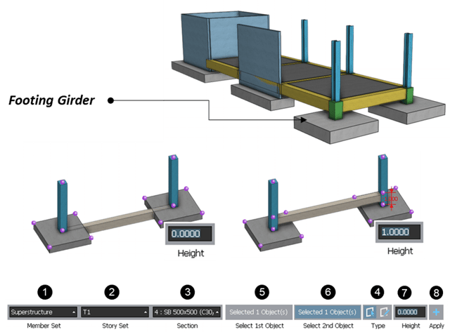

## Table of Contents

## What is a footing in construction?

A footing is a part of a building's foundation that helps spread the weight of the building evenly across the ground. It is usually made of concrete and is placed below the ground level. The main job of a footing is to stop the building from sinking or moving by providing a stable base. 

Footings are important because they help keep the building strong and safe. They are designed based on the type of soil and the weight of the building. If the soil is soft, the footing needs to be bigger to support the building better. This way, the building stays steady and does not get damaged over time.

## What are the primary functions of footings?

The main job of footings is to spread the weight of a building over a larger area of soil. This helps to keep the building stable and prevents it from sinking into the ground. Without footings, the weight of the building would be concentrated on a small area, which could cause the soil to shift or collapse.

Footings also help to keep the building from moving or tilting. They act like anchors that hold the building in place, even during events like earthquakes or heavy storms. By providing a solid base, footings ensure that the building stays level and safe for people to live or work in.

In addition, footings can help to distribute any uneven forces that might act on the building. This is important because buildings can experience different pressures from wind, soil movement, or other external factors. By balancing these forces, footings help to maintain the structural integrity of the building over time.

## How do footings distribute the load of a structure?

Footings help spread the weight of a building over a larger area of soil. When a building is built, it puts a lot of weight on the ground. If this weight is only on a small spot, it can make the soil sink or move. Footings make the weight spread out more, so the soil can handle it better. This is like how you can stand on soft sand without sinking if you use a big board to spread your weight out.

Footings also help keep the building from moving or tilting. They act like big, strong bases that hold the building steady. Even if there are earthquakes or heavy storms, the footings keep the building from shifting. By making sure the building's weight is evenly spread out, footings help keep everything stable and safe.

## What are the different types of footings commonly used in construction?

There are several types of footings used in construction, and each type is chosen based on the building's needs and the ground it sits on. One common type is the spread footing, which is a wide, flat base made of concrete. It's used for smaller buildings and helps spread the weight over a larger area of soil. Another type is the strip footing, which is a long, narrow strip of concrete used under walls to support the weight of the building evenly.

Another type of footing is the pad footing, which is a square or rectangular block of concrete used to support isolated columns. Pad footings are good for buildings with heavy columns because they can handle a lot of weight in a small area. Then there's the raft footing, which is a large slab of concrete that covers the entire area under the building. Raft footings are used when the soil is weak and needs extra support to stop the building from sinking.

Lastly, there are pile footings, which are used when the soil near the surface is very soft. Piles are long, thin columns of concrete or steel that go deep into the ground until they reach a stronger layer of soil or rock. These piles then support the building from underneath. Each type of footing has its own job, and choosing the right one depends on the building and the ground it's built on.

## What materials are typically used in the construction of footings?

The most common material used to make footings is concrete. Concrete is strong and can handle a lot of weight. It is made by mixing cement, sand, and gravel with water. When this mix is poured into a hole in the ground and left to dry, it becomes hard and solid, making a good base for a building. Sometimes, steel bars called rebar are added to the concrete to make it even stronger. The rebar helps the concrete resist bending and breaking under the weight of the building.

In some cases, other materials like stone or brick can be used for footings, but this is less common. Stone and brick footings are usually found in older buildings or in places where concrete is hard to get. These materials can be strong, but they need more work to put them together properly. No matter what material is used, the main goal is to make sure the footing can support the building well and keep it stable on the ground.

## How does the soil type affect the design of footings?

The type of soil where a building is going to be built really matters when designing footings. Some soils are strong and can handle a lot of weight without moving much. These soils, like rock or dense sand, might need smaller footings because they can support the building well. But other soils are soft and can shift or sink under weight. Soils like clay or loose sand need bigger or deeper footings to spread the building's weight over a larger area and keep it stable.

When the soil is weak, engineers might choose to use different types of footings. For example, if the soil near the surface is very soft, they might use pile footings that go deep into the ground to reach stronger soil or rock. Or they might use a raft footing, which is a big slab of concrete that covers the whole area under the building to spread the weight evenly. By understanding the soil, engineers can design footings that keep the building safe and steady.

## What is the difference between shallow and deep footings?

Shallow footings are used when the soil near the ground surface is strong enough to support a building. They are usually placed just a few feet below the ground. Types of shallow footings include spread footings, strip footings, and pad footings. These are good for smaller buildings or when the soil is firm. Shallow footings spread the weight of the building over a wider area of soil, which helps keep the building stable.

Deep footings are used when the soil near the surface is too weak to support a building. They go much deeper into the ground, sometimes reaching down to stronger layers of soil or rock. Pile footings and caisson footings are examples of deep footings. These are used for bigger buildings or in areas with soft soil. Deep footings help to anchor the building more securely and prevent it from sinking or moving.

## How are footings designed to prevent settlement and failure?

Footings are designed to stop buildings from sinking into the ground by spreading the building's weight over a larger area. Engineers first check the soil to see how strong it is. If the soil is firm, they might use shallow footings like spread or strip footings. These footings make the weight of the building less heavy on any one spot, so the soil doesn't sink. If the soil is soft, they use bigger or deeper footings to reach stronger soil or rock. This way, the building stays steady and doesn't settle or sink.

To prevent the footings from failing, engineers also think about how much weight the building will have and what forces might push or pull on it, like wind or earthquakes. They use strong materials like concrete and sometimes add steel bars to make the footings even stronger. The design makes sure the footings can handle all these forces without breaking or moving. By carefully planning the size, depth, and strength of the footings, engineers keep the building safe and stable for a long time.

## What are the key considerations in the placement of footings?

When deciding where to put footings, it's important to look at the soil. The soil needs to be strong enough to hold up the building. If the soil is soft, the footings might need to be bigger or go deeper into the ground to reach stronger soil or rock. Engineers also need to think about where the building's weight will be heaviest. They put footings under these heavy spots to make sure the building stays level and doesn't sink.

Another thing to consider is how close the footings are to each other and to the edges of the building. They need to be spaced out just right so they can support the building evenly. If the footings are too close together, they might not spread the weight out enough. If they're too far apart, the building might not be stable. Also, footings should be placed away from things like trees or pipes that could cause problems later. By thinking about all these things, engineers can make sure the footings keep the building safe and steady.

## How do you calculate the size and depth of a footing?

To figure out the size and depth of a footing, you need to know how heavy the building is and what kind of soil it's sitting on. Engineers start by doing tests on the soil to see how strong it is. If the soil is strong, the footing can be smaller because it doesn't need to spread the weight out as much. But if the soil is weak, the footing needs to be bigger or deeper to reach stronger soil or rock. They also look at how the building's weight is spread out and where the heaviest parts are, so they can put the footings in the right spots.

Once they know about the soil and the building's weight, engineers use math to calculate the right size and depth for the footings. They use formulas that take into account the building's total weight, the type of soil, and how much the soil can hold without moving. The goal is to make sure the footing spreads the weight evenly so the building stays level and doesn't sink. By doing these calculations carefully, engineers can design footings that keep the building safe and stable for a long time.

## What are some advanced techniques used in the design of footings for high-rise buildings?

For high-rise buildings, engineers use special techniques to make sure the footings can handle the heavy weight and keep the building stable. One technique is using deep pile footings. These are long, thin columns of concrete or steel that go deep into the ground until they reach strong soil or rock. This helps to anchor the building and stop it from sinking or moving. Engineers also use computer programs to do complex math and figure out the best size and placement for the footings. These programs can test different designs to see which one works best for the building and the soil it's on.

Another technique is using mat or raft footings, which are big slabs of concrete that cover the whole area under the building. This spreads the weight of the high-rise over a large area of soil, which is important when the soil is weak. Engineers also add steel bars, called rebar, to the concrete to make it stronger. This helps the footings handle the heavy loads and any forces like wind or earthquakes. By using these advanced techniques, engineers can design footings that keep high-rise buildings safe and stable for a long time.

## Can you provide case studies of innovative footing designs used in challenging environments?

In Dubai, the Burj Khalifa, the tallest building in the world, needed a strong foundation to support its massive weight. Engineers used a special type of footing called a piled raft foundation. They dug deep into the ground and put in 192 piles, each going down 50 meters to reach strong rock. On top of these piles, they built a huge concrete raft that covered the whole area under the building. This design helped spread the building's weight evenly and kept it stable, even in the hot and sandy desert soil of Dubai.

Another example is the Transbay Transit Center in San Francisco, which had to deal with soft soil and the risk of earthquakes. Engineers used a technique called soil improvement to make the ground stronger before building the footings. They mixed the soil with cement to create a solid base. Then, they built deep pile footings that went down to bedrock, which is very strong and stable. This design helped the building stay safe during earthquakes and made sure it wouldn't sink into the soft soil. By using these innovative methods, the Transbay Transit Center could be built in a challenging environment.

## References & Further Reading

[1]: Bergstra, J., Bardenet, R., Bengio, Y., & Kégl, B. (2011). ["Algorithms for Hyper-Parameter Optimization."](https://dl.acm.org/doi/10.5555/2986459.2986743) Advances in Neural Information Processing Systems 24.

[2]: ["Advances in Financial Machine Learning"](https://www.amazon.com/Advances-Financial-Machine-Learning-Marcos/dp/1119482089) by Marcos Lopez de Prado

[3]: ["Foundation Design: Principles and Practices"](https://www.amazon.com/Foundation-Design-Principles-Practices-3rd/dp/0133411893) by Donald P. Coduto

[4]: ["Mastering Shiny"](https://mastering-shiny.org/) by Hadley Wickham

[5]: ["Evidence-Based Technical Analysis: Applying the Scientific Method and Statistical Inference to Trading Signals"](https://www.amazon.com/Evidence-Based-Technical-Analysis-Scientific-Statistical/dp/0470008741) by David Aronson

[6]: ["The Intelligent Investor: The Definitive Book on Value Investing"](https://www.amazon.com/Intelligent-Investor-3rd-Ed/dp/0063356724) by Benjamin Graham

[7]: ["Quantitative Trading: How to Build Your Own Algorithmic Trading Business"](https://www.amazon.com/Quantitative-Trading-Build-Algorithmic-Business/dp/1119800064) by Ernest P. Chan