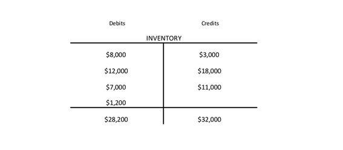

In an era driven by digital innovation and technological advancement, industries are constantly evolving to stay competitive. One of the most fascinating areas is the intersection of construction and finance, particularly in the way algorithms and AI are used in trading strategies. This article will explore the concepts of footings in construction and foundational algorithms in trading, illustrating how both contribute to creating robust structures — be it buildings or investment portfolios.

In construction, footings are essential components that ensure the stability and strength of the edifices they support. They distribute the load from the building evenly across the ground, maintaining structural integrity. Similarly, in the world of finance, algorithmic trading lays the groundwork for successful investment strategies. These algorithms analyze markets, identify patterns, and execute trades with precision, much like footings provide stability to withstand environmental stresses.

This comparison highlights the fundamental role that a strong base plays in both fields. By examining the intricacies of footings in construction and algorithms in trading, even novice and experienced enthusiasts can gain a better understanding of the synergy between these industries. Both require a deep understanding of foundational principles to ensure long-term stability and performance.

As we continue to explore these concepts, it becomes evident how these foundational elements contribute significantly to their respective domains, shaping the future of both physical and financial structures. Whether through the careful selection of footing types based on soil conditions or the strategic design of trading algorithms to adapt to market dynamics, the importance of a solid foundation remains a constant theme across disciplines.

## Table of Contents

## Understanding Footings in Construction

Footings are a fundamental aspect of construction, playing a crucial role in ensuring that the weight of a building is evenly distributed across the underlying ground. This distribution is essential to maintain the structural integrity and stability of any built structure. The primary purpose of a footing is to provide a level base for a foundation and to sustain the loads imposed by the building or infrastructure above it. When designed and implemented correctly, footings can prevent serious structural issues such as soil failure, cracking, or differential settlement, which could lead to safety hazards.

The different types of footings are tailored to accommodate various soil conditions and architectural requirements. Shallow footings are typically used for smaller, lighter structures where the load is minimal, and the soil is of good quality. These include pad footings, which are square or rectangular and used under individual columns; strip footings, which are long and narrow, serving continuous walls or closely spaced rows of columns; and raft or mat footings, which cover a large area and are beneficial when dealing with weaker soils to distribute the load over a wider area and reduce pressure on the soil.

For more challenging conditions, pile footings may be employed. These are deep foundation systems that transfer loads to deeper, more stable soil layers or rock. Pile footings can be advantageous in projects involving heavy, extensive structures or unstable surface soils. Each type of footing has its pros and cons, which depend largely on the nature of the soil and load requirements. An inadequate footing choice can lead to soil heaving or differential settlement, where parts of a building settle differently, leading to structural imbalance or failure.

Footings can thus be seen as the foundation's foundation, providing a stable base that absorbs environmental stresses and supports the longevity of a structure. The importance of selecting and implementing the correct type of footing cannot be overstated, as it forms the first defense against potential structural failures. This concept of starting with a solid base resonates beyond construction, offering metaphorical insights into any process requiring stability and resilience—whether it involves physical structures or financial systems.

Overall, footings exemplify the foundational principles that underpin successful and sustainable design, providing a model for stable processes across diverse fields.

## Algorithmic Trading: A New Financial Foundation

Algorithmic trading, also known as algo-trading, involves the use of computer algorithms to execute trading orders with precision and speed far beyond human capabilities. This form of trading has revolutionized financial markets by leveraging technology to identify and capitalize on patterns, trends, and signals that occur in the market. At its core, [algorithmic trading](/wiki/algorithmic-trading) employs mathematical models and statistical analyses to make quick, data-driven decisions, distinguishing between potential profits and losses in a highly dynamic trading environment.

These algorithms operate by scanning the financial markets for predefined sets of criteria, such as price movements, trade [volume](/wiki/volume-trading-strategy), and historical patterns, to determine the optimal times to buy or sell. The speed at which these algorithms process and react to data provides a significant advantage, as they can execute trades in fractions of a second, capturing opportunities that human traders might miss due to physiological limitations. 

In a manner akin to footings in construction providing stability to structures, algorithmic trading offers a robust foundation for crafting informed investment decisions. By incorporating algorithms into their trading strategies, investors can minimize risks while maximizing returns. This is achieved by operating within a framework of logic and rules that ensure consistency and diligence that are often challenging for human traders to maintain over long periods.

The scope of algorithmic trading spans from straightforward rule-based strategies to complex models employing [machine learning](/wiki/machine-learning) techniques. Rule-based strategies might include moving average crossovers or other technical indicators, which are relatively simple to implement and understand. On the other hand, complex strategies may utilize machine learning models, such as neural networks, which learn and evolve from vast datasets, adapting to market changes over time. These sophisticated algorithms can identify intricate patterns that static models might overlook, providing traders with a dynamic and adaptive approach to asset management.

By appreciating algorithmic trading as a fundamental element in modern financial markets, investors can better exploit the efficiencies and opportunities it offers. Properly implemented, algorithmic trading systems can enhance portfolio management by enabling timely, objective, and evidence-based decision-making processes, crucial for effective and efficient handling of assets in today’s fast-paced trading world.

## Parallels Between Construction and Trading Foundations

There are significant parallels between constructing physical buildings and developing trading strategies, with both disciplines relying heavily on a robust foundation to ensure success. In construction, the selection of appropriate footings is crucial to the stability and longevity of a structure. Various footing types such as shallow, pad, strip, raft, and pile are chosen based on soil conditions and load requirements, ensuring that the building can withstand environmental stresses.

Similarly, in algorithmic trading, selecting the right foundational algorithms is crucial to building a resilient trading strategy. These algorithms are designed to analyze market patterns, trends, and signals, allowing them to make informed decisions even under volatile market conditions. Just as diverse soil conditions necessitate different footings in construction, varying market environments require adaptable and comprehensive trading algorithms to optimize performance and mitigate risks.

Both fields necessitate a profound understanding of the underlying principles and the foresight to anticipate potential challenges. In construction, this involves assessing soil mechanics, structural load dynamics, and environmental factors. In trading, this involves understanding market behaviors, economic indicators, and statistical models. This deep understanding allows for the development of robust foundations, be it the physical groundwork of a building or the mathematical models in algorithmic trading.

The integration of technology and traditional practices marks a forward-thinking approach in both construction and trading. In construction, advances in materials science and engineering techniques enhance the capabilities of traditional building practices. In trading, the adoption of machine learning and [artificial intelligence](/wiki/ai-artificial-intelligence) augments traditional financial analysis, providing more sophisticated and adaptive strategies. This fusion of advanced technology with established methods is essential for future advancements, ensuring that structures and strategies alike are more resilient and adaptable to change.

## The Future of Construction and Algorithmic Trading

Looking forward, both the construction and financial industries are expected to evolve significantly with technological innovations and the integration of artificial intelligence (AI). In the construction sector, the development of advanced methods and materials promises to revolutionize how footings contribute to overall structural integrity. These advancements in construction materials are geared towards enhancing performance and sustainability, potentially incorporating smart materials capable of responding to environmental changes or stresses. Such innovation could lead to footings that not only provide stability but also improve energy efficiency and reduce environmental impact.

Parallelly, the financial industry is witnessing rapid advancements in AI and machine learning, leading to the development of more sophisticated and adaptive algorithmic trading strategies. These strategies are increasingly capable of handling complex market dynamics, thanks to their ability to process vast volumes of data and adapt to changing market conditions in real time. The integration of AI in trading allows for improved risk assessment and decision-making processes, significantly minimizing human error and emotional bias.

Collaboration and interdisciplinary research between construction and finance could pave the way for breakthroughs that improve the operational fundamentals of both industries. For instance, concepts from construction regarding stability and force distribution may inspire risk management strategies in trading, while algorithmic optimization from finance could enhance the efficiency of resource allocation in construction projects.

By embracing these technological advancements while preserving the integrity of foundational principles, both industries can ensure that their practices remain robust and resilient. In construction, this means maintaining safety and stability standards while integrating new technologies. In finance, it involves leveraging AI to enhance decision-making without compromising ethical standards.

The strategic implementation of these technologies presents opportunities for industries to innovate and adapt in an ever-changing environment. As these sectors continue to progress, the interplay between technological innovation and foundational reliability will dictate their success and sustainability in the future.

## Conclusion

The parallels between footings in construction and foundational algorithms in trading underscore the critical importance of establishing a robust base in any discipline, whether it pertains to physical structures or financial systems. In construction, footings ensure the structural integrity and stability of a building, distributing loads effectively to prevent failure. Similarly, in trading, algorithms form the basis for sophisticated trade strategies that aim to manage risks and capitalize on market opportunities.

Both construction and trading emphasize the need for a well-planned foundation, crucial for enhancing both functionality and sustainability. In construction, this involves selecting the appropriate type of footing based on soil conditions and load requirements—be it shallow, pad, strip, raft, or pile footings. Such considerations ensure the building’s longevity and safety. In trading, a well-developed algorithm can assess market conditions, analyze patterns, and execute trades with speed and precision, adapting to fluctuating market dynamics to optimize returns.

By examining these similarities, we can glean valuable insights into how foundational principles transcend industries, enabling innovations and advancements across diverse fields. Both sectors benefit from integrating traditional knowledge with modern technology, fostering resilience and adaptability. For instance, advancements in construction technology, such as the introduction of new materials and methods, can improve footing designs. Concurrently, developments in AI and machine learning promise increasingly sophisticated and adaptive trading algorithms capable of navigating complex market environments.

As industries continue to advance, the merging of age-old expertise with cutting-edge advancements is set to redefine both construction and algorithmic trading. Understanding these fundamental elements empowers individuals and organizations to lay the groundwork for a more secure and prosperous future in their respective arenas, ensuring that both physical structures and financial strategies remain robust, innovative, and sustainable.

## References & Further Reading

[1]: Bergstra, J., Bardenet, R., Bengio, Y., & Kégl, B. (2011). ["Algorithms for Hyper-Parameter Optimization."](https://dl.acm.org/doi/10.5555/2986459.2986743) Advances in Neural Information Processing Systems 24.

[2]: ["Advances in Financial Machine Learning"](https://www.amazon.com/Advances-Financial-Machine-Learning-Marcos/dp/1119482089) by Marcos Lopez de Prado

[3]: ["Foundation Design: Principles and Practices"](https://www.amazon.com/Foundation-Design-Principles-Practices-3rd/dp/0133411893) by Donald P. Coduto

[4]: ["Mastering Shiny"](https://mastering-shiny.org/) by Hadley Wickham

[5]: ["Evidence-Based Technical Analysis: Applying the Scientific Method and Statistical Inference to Trading Signals"](https://www.amazon.com/Evidence-Based-Technical-Analysis-Scientific-Statistical/dp/0470008741) by David Aronson

[6]: ["The Intelligent Investor: The Definitive Book on Value Investing"](https://www.amazon.com/Intelligent-Investor-3rd-Ed/dp/0063356724) by Benjamin Graham

[7]: ["Quantitative Trading: How to Build Your Own Algorithmic Trading Business"](https://www.amazon.com/Quantitative-Trading-Build-Algorithmic-Business/dp/1119800064) by Ernest P. Chan