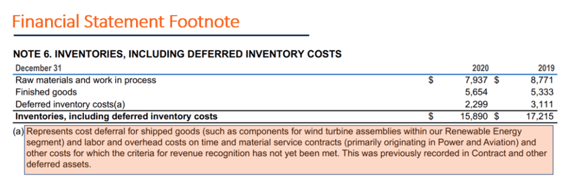

## Table of Contents

## What are footnotes to financial statements?

Footnotes to financial statements are additional information that companies include at the end of their financial reports. They provide more details about the numbers and data shown in the main financial statements, like the balance sheet, income statement, and cash flow statement. This helps people understand the company's financial situation better.

These footnotes can explain things like accounting methods, how the company values its assets, or any big events that happened during the year. They are important because they give a clearer picture of the company's financial health and help investors make better decisions. Without footnotes, the financial statements might be hard to understand or could be misleading.

## Why are footnotes important in financial reporting?

Footnotes are really important in financial reporting because they help explain the numbers in the main financial statements. They give more details about how the company does its accounting, how it values its stuff, and any big events that happened during the year. This extra information helps people understand the company's financial health better. Without footnotes, the financial statements might be confusing or even misleading.

For example, if a company changes how it calculates its profits, the footnotes will explain why and how this change affects the numbers. This is important for investors because it helps them see the real financial situation of the company. Footnotes also tell about things like lawsuits, new laws, or other risks that might affect the company's future. So, they are a key part of making sure the financial reports are clear and honest.

## What types of information are typically included in footnotes?

Footnotes in financial statements include a lot of important details that help explain the numbers in the main reports. They tell you about the accounting methods the company uses, like how it calculates its profits or values its assets. For example, if a company decides to change how it counts its inventory, the footnotes will explain this change and why it happened. They also give details about any big events that happened during the year, like buying another company or selling off part of the business.

Another thing you'll find in footnotes is information about any risks or legal issues the company is facing. This can include details about lawsuits, new laws that might affect the business, or other things that could impact the company's future. Footnotes also break down complex items in the financial statements, like pensions or stock options, to help you understand them better. This extra information is crucial for investors and others who want to get a clear picture of the company's financial health.

## How do footnotes enhance the transparency of financial statements?

Footnotes make financial statements more transparent by giving more details about the numbers in the main reports. They explain how the company does its accounting, like how it counts its profits or values its stuff. This helps people understand the financial statements better. Without footnotes, the numbers might be confusing or even misleading. For example, if a company changes how it calculates its inventory, the footnotes will explain this change and why it happened. This way, everyone can see the real financial situation of the company.

Footnotes also tell about any big events or risks that happened during the year. This can include things like buying another company, selling off part of the business, or facing lawsuits. By sharing this information, footnotes help investors and others see the full picture of the company's financial health. They break down complex items, like pensions or stock options, into simpler terms. This extra information makes the financial statements clearer and more honest, which is important for making good decisions.

## Can you explain the different types of footnotes found in financial statements?

Footnotes in financial statements come in different types, each serving a specific purpose. One type of footnote explains the accounting policies the company uses. This includes how the company calculates its profits, values its assets, and handles things like depreciation or inventory. These details are important because they help people understand the numbers in the main financial statements better. If the company changes any of these policies, the footnotes will explain the change and why it happened.

Another type of footnote gives details about significant events or transactions that happened during the year. This can include things like mergers, acquisitions, or selling off parts of the business. Footnotes also tell about any legal issues or risks the company is facing, like lawsuits or new laws that might affect the business. By sharing this information, the company helps investors and others see the full picture of its financial health.

The third type of footnote breaks down complex items in the financial statements into simpler terms. This can include things like pensions, stock options, or other employee benefits. These footnotes help explain how these items are calculated and what they mean for the company's finances. By providing this extra information, footnotes make the financial statements clearer and more honest, which is crucial for making good decisions.

## What is the difference between a footnote and an endnote in financial documents?

In financial documents, a footnote is a note at the bottom of a page that gives more details about the information on that page. It's used to explain things like accounting methods or big events that happened during the year. Footnotes help make the financial statements easier to understand by giving extra information right where it's needed. They are important because they help people see the full picture of a company's financial health without having to flip through the document.

An endnote, on the other hand, is a note at the end of the document, usually grouped together in a section called "Notes to the Financial Statements." Endnotes also give more details about the financial statements, but they are all collected at the end rather than spread out across the pages. This can be useful for keeping the main part of the document clean and easy to read, but it means readers have to go to the end of the document to find the extra information. Both footnotes and endnotes are important for understanding financial documents, but they are placed differently within the document.

## How should footnotes be formatted according to accounting standards?

Footnotes in financial statements should follow certain rules set by accounting standards to make sure they are clear and useful. They should be numbered in order, starting from 1, and placed at the bottom of each page where the information is mentioned. The text in the footnotes should be smaller than the main text but still easy to read. Each footnote should start with the number that matches the number in the main text, followed by the explanation. This helps readers quickly find the extra information they need.

Accounting standards also say that footnotes should be written in a way that everyone can understand. They should explain things like accounting methods, big events, and any risks the company faces in simple terms. The language should be clear and not too technical, so even people who are not experts in finance can understand the information. By following these rules, footnotes help make financial statements more transparent and easier to understand for everyone.

## What are some common errors to avoid when preparing footnotes?

When preparing footnotes, it's important to avoid some common mistakes. One big mistake is not being clear enough. Footnotes should explain things in simple terms so everyone can understand them. If they are too technical or confusing, people might not get the important information they need. Another mistake is not putting the right number on the footnote. Each footnote should have a number that matches the number in the main text. If the numbers don't match, it can be hard for readers to find the extra information.

Another common error is leaving out important details. Footnotes should include all the key information about accounting methods, big events, and any risks the company faces. If something important is missing, the financial statements might not give a full picture of the company's health. Also, make sure the footnotes are in the right place. They should be at the bottom of the page where the information is mentioned, not at the end of the document. This helps readers find the extra information easily without having to flip through the pages.

## How do regulatory bodies like the SEC use footnotes in their analysis?

Regulatory bodies like the SEC use footnotes to get a better understanding of a company's financial health. They look at the footnotes to see how the company does its accounting, like how it calculates profits or values its stuff. This helps them check if the company is following the rules and if the financial statements are honest. If they find anything strange or missing in the footnotes, they might ask the company for more information or even start an investigation.

Footnotes also help the SEC see if the company is telling the whole story about its finances. They look for details about big events, like buying or selling parts of the business, or any risks like lawsuits. By reading the footnotes, the SEC can make sure the company is not hiding anything important from investors. This helps them protect people who put their money into the company and make sure the financial markets are fair and honest.

## What role do footnotes play in the audit process?

Footnotes play a big role in the audit process. Auditors use them to check if the company is following the right accounting rules. They look at the footnotes to see how the company calculates its profits or values its stuff. If the footnotes explain things clearly, it helps auditors make sure the financial statements are honest and correct. If they find anything missing or confusing in the footnotes, they might ask the company for more information or even start a deeper investigation.

Footnotes also help auditors understand the big events or risks that happened during the year. They look for details about things like mergers, acquisitions, or lawsuits. By reading the footnotes, auditors can see if the company is telling the whole story about its finances. This helps them make sure the financial statements give a full and fair picture of the company's health. If the footnotes are missing important details, the auditors might not be able to give a clean opinion on the financial statements.

## How can investors use footnotes to make better financial decisions?

Investors can use footnotes to get a clearer picture of a company's financial health. Footnotes explain the numbers in the main financial statements, like how the company counts its profits or values its stuff. By reading the footnotes, investors can see if the company is using different accounting methods than other companies. This helps them compare companies more fairly and make better decisions about where to put their money. If a company changes how it does its accounting, the footnotes will explain why, which can be important for understanding the real financial situation.

Footnotes also tell investors about big events or risks that happened during the year. This can include things like buying another company, selling off part of the business, or facing lawsuits. By knowing about these events, investors can see how they might affect the company's future. Footnotes break down complex items, like pensions or stock options, into simpler terms. This extra information helps investors understand the company's financial statements better and make smarter choices about investing their money.

## What advanced techniques can be used to analyze the data presented in footnotes?

One advanced technique to analyze the data in footnotes is to use text analysis tools. These tools can help you find important words or phrases that might show up a lot in the footnotes. For example, if the word "lawsuit" comes up often, it might mean the company is facing legal problems. By looking at these patterns, investors can understand more about the risks the company is dealing with. Text analysis can also help compare the footnotes of different companies to see if one company is more open about its financial details than others.

Another technique is to use data visualization. This means turning the information in the footnotes into charts or graphs. For example, you can make a chart that shows how the company's accounting methods have changed over time. This can help investors see trends that might be hard to spot just by reading the text. Data visualization can also show how different parts of the company, like pensions or stock options, affect the overall financial health. By using these visual tools, investors can make better decisions about where to put their money.

## References & Further Reading

[1]: ["Understanding Financial Statements"](https://online.hbs.edu/blog/post/how-to-read-financial-statements) by Lyn M. Fraser and Aileen Ormiston

[2]: ["Financial Statement Analysis and Security Valuation"](https://archive.org/details/financialstateme0000penm_r9u4) by Stephen H. Penman

[3]: ["Footnotes or Main Text? A Natural Experiment of the Effects of Expanded Regulatory Disclosure on Individual Investors’ and Professionals’ Evaluations"](https://jstor.org/stable/20869093) by Amy Hutton, Marcus Radin, and Susan Stocken

[4]: SEC Filings and Forms (EDGAR): [U.S. Securities and Exchange Commission](https://www.sec.gov/search-filings)

[5]: ["Applied Corporate Finance"](https://www.amazon.com/Applied-Corporate-Finance-Aswath-Damodaran/dp/1118808932) by Aswath Damodaran

[6]: ["Financial Accounting and Reporting"](https://www.investopedia.com/terms/f/financialaccounting.asp) by Barry Elliott and Jamie Elliott

[7]: ["Algorithmic Trading and DMA: An Introduction to Direct Access Trading Strategies"](https://archive.org/details/algorithmictradi0000john) by Barry Johnson