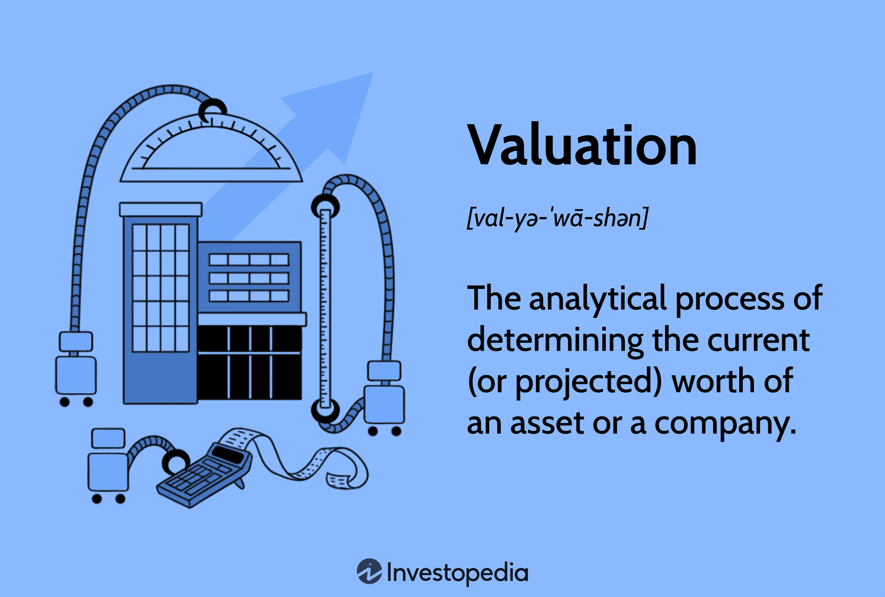

In the rapidly evolving world of finance, the prevalence of algorithmic trading continues to expand as technology and data analytics become more advanced and accessible. Algorithmic trading employs complex algorithms to execute trades at speeds and frequencies that are impossible for human traders, thereby optimizing the decision-making process. Central to the efficacy of these algorithms is a profound understanding of valuation mechanisms, which are essential in determining the true worth of assets and making informed trading decisions.

Among these mechanisms is the concept of FVO, or "For Valuation Only." This is a crucial tool in the assessment of securities pricing, as it allows traders and market participants to evaluate the value of a security without the immediate intention to execute a trade. FVO notations provide informational pricing that facilitates the understanding of a security's market position. This information is pivotal for algorithmic trading systems that depend on precise valuation to develop and adapt trading strategies.



Algorithmic trading systems utilize these valuations to guide their operations—deciding when to initiate trades, which securities to target, and how to manage risk. Accurate valuation is more than a financial checklist; it forms the backbone of creating robust and competitive trading algorithms. This article examines how FVO as a financial mechanism, coupled with reliable valuation practices, contributes to the success of algorithmic trading. Understanding these elements is vital for traders seeking to harness technology for greater financial success in today's fast-paced markets.

## Table of Contents

## Understanding For Valuation Only (FVO)

FVO, or "For Valuation Only," is a critical notation used within financial markets, particularly in the context of nominal quotes. This notation serves as a tool for establishing the valuation of securities without necessitating an active trading commitment from the market maker. By providing informational pricing, FVO quotes play a crucial role in the assessment and determination of a security's margin position, which is vital for traders when firm quotes are not available.

The primary function of FVO quotes is to offer a reference point for the valuation of financial instruments. They facilitate the understanding of an asset's worth based on current market conditions without binding the entity providing the quote to execute a trade. This distinction is significant as it allows market participants to make informed decisions about asset pricing and value assessments while managing risk exposure.

When trading conditions are uncertain or when [liquidity](/wiki/liquidity-risk-premium) is low, FVO quotes become even more valuable. They provide traders with a mechanism to evaluate the value of assets when market-driven quotes are sparse or unreliable. By doing so, FVO helps maintain a level of price transparency and valuation continuity in markets that might otherwise be prone to stagnation or volatility.

The practical applications of FVO are multi-faceted. Traders can use these notations to benchmark or model potential trades, seeking to optimize their strategies under varying market conditions. Additionally, FVO can aid in the calculation of an asset's required margin, as it informs the potential risk and reward scenarios intrinsic to holding certain positions.

In conclusion, the FVO mechanism offers a structured approach to understanding and determining asset value in trading environments where definitive pricing might be scarce. Its application facilitates improved decision-making, risk management, and strategic planning in financial operations.

## Key Valuation Methods in Algo Trading

Valuation methods are integral to the framework of [algorithmic trading](/wiki/algorithmic-trading), underpinning the strategies that guide the buy and sell decisions within these automated systems. Three primary valuation techniques—Market Capitalization, Earnings Multiplier, and Discounted Cash Flow (DCF)—play critical roles in determining a company's economic worth, which in turn informs trading strategies.

Market Capitalization represents the simplest form of valuation and is calculated by multiplying a company's current share price by its total number of outstanding shares. This method provides a quick snapshot of a company's size but lacks depth in assessing intrinsic value since it is influenced by market sentiment and external factors.

The Earnings Multiplier, or Price-to-Earnings (P/E) ratio, provides a more nuanced approach by comparing the company's current share price to its per-share earnings. This ratio serves as an indicator of the market's expectations of a company's future prospects. A higher P/E ratio might indicate anticipated growth, yet it can also suggest overvaluation. For algorithmic traders, incorporating P/E ratios allows models to balance current market prices against profitability expectations, enhancing the strategic depth of trading algorithms.

Discounted Cash Flow (DCF) analysis stands out for its rigorous approach to valuation. The DCF method seeks to estimate the present value of a company based on its projected future cash flows, discounted back to their present value using a discount rate, usually the company's weighted average cost of capital (WACC). The formula is expressed as:

$$

DCF = \sum_{t=1}^{n} \frac{CF_t}{(1 + r)^t}
$$

where $CF_t$ represents the cash flow in year $t$, $r$ is the discount rate, and $n$ is the number of years into the future. Python-based models often use this method due to its ability to provide a comprehensive view of intrinsic stock value. Python libraries such as NumPy and pandas offer robust tools to implement and automate DCF calculations, thereby facilitating the development of precise trading algorithms capable of identifying undervalued securities.

Accurate valuation methodologies enhance the precision of trading algorithms by enabling them to identify discrepancies between a security's market price and its intrinsic value. By leveraging these valuation methods, algorithmic models can dynamically adjust trading strategies to capitalize on market opportunities, optimizing both the timing and direction of trades. This analytical rigor ensures that algorithmic trading systems maintain a competitive edge, supporting traders in their pursuit of maximizing returns in volatile and complex financial markets.

## Intersection of Valuation and Algorithmic Trading

Valuation models play an essential role in algorithmic trading by enhancing the accuracy and efficiency of trading decisions. These models are crucial for identifying mispriced securities, which can be either undervalued or overvalued, thereby facilitating optimized trading strategies. Key valuation methodologies such as Market Capitalization, Earnings Multiplier, and Discounted Cash Flow (DCF) analysis provide the foundation for such assessments. Integrating these models with algorithmic trading systems empowers traders to fine-tune their buy/sell decisions based on detailed financial analysis.

Machine learning introduces an advanced layer of capability to valuation and trading systems by utilizing vast datasets to improve market predictions. Machine learning algorithms analyze patterns and trends in historical and real-time data to forecast future price movements. The integration of [machine learning](/wiki/machine-learning) with valuation data allows for more adaptive and responsive trading strategies. This synergy enhances the predictive power of algorithmic trading systems, enabling them to react swiftly to changing market conditions.

Python, due to its extensive libraries and user-friendly syntax, is frequently used to develop models calculating intrinsic stock value. Libraries such as NumPy, pandas, and SciPy facilitate efficient data manipulation and analytical computations necessary for valuation. A Python-based model might look like this, estimating the intrinsic value of a stock based on expected dividend growth:

```python
def intrinsic_value(dividend, growth_rate, required_rate_of_return):
    return dividend * (1 + growth_rate) / (required_rate_of_return - growth_rate)

expected_dividend = 3.0  # in dollars
growth_rate = 0.05  # 5% expected growth
required_rate_of_return = 0.08  # 8% required return

value = intrinsic_value(expected_dividend, growth_rate, required_rate_of_return)
print(f"Intrinsic Value: ${value:.2f}")
```

This script calculates a stock's intrinsic value using a simplified model that assumes consistent dividend growth—a core principle of the Gordon Growth Model.

The application of these valuation models in trading systems promotes not only the efficiency but also the potential for increased returns. By systematically analyzing financial data to discern underlying value differentials, traders can exploit market inefficiencies. The combination of thorough valuation techniques with powerful algorithmic capabilities ensures that traders can navigate markets with informed, data-driven strategies, ultimately enhancing their competitiveness and financial performance.

## Case Studies and Real-World Applications

Real-world examples offer compelling insights into the role of valuation in algorithmic trading. Companies like Renaissance Technologies and Berkshire Hathaway showcase how informed valuation is crucial for financial success.

Renaissance Technologies, known for its Medallion Fund, has gained prominence for its use of mathematical models and predictive algorithms in trading [1]. One key tool in its arsenal is the Discounted Cash Flow (DCF) model. By forecasting future cash flows and discounting them to their present value, Renaissance Technologies is able to determine the intrinsic value of securities. This method facilitates the detection of price discrepancies between a security's market price and its projected intrinsic value, thus guiding profitable trading decisions.

Berkshire Hathaway, under the leadership of Warren Buffett, exemplifies a different approach but with a similar emphasis on detailed valuation assessments. While not strictly algorithmic in nature, the company’s acquisition strategy extensively relies on understanding the intrinsic value of businesses. Each potential acquisition is evaluated based on comprehensive valuation metrics, ranging from the price-to-earnings ratio to the intrinsic value calculated through future cash flows. This dedication to precise valuation ensures that Berkshire Hathaway's investments are made at favorable terms, contributing to its sustained success [2].

Industry-specific valuation preferences reflect the unique challenges and opportunities within different sectors. For instance, technology companies might prioritize growth projections and user base metrics, while energy companies might focus on commodity prices and regulatory considerations. The tailored use of valuation models across industries highlights the flexible yet pivotal role valuation plays in strategic trading and investment decisions.

These examples underscore the importance of informed valuation in achieving financial success. Whether through quantitative algorithms or [fundamental analysis](/wiki/fundamental-analysis), the ability to accurately assess the value of securities enables firms to identify market opportunities and manage risks effectively. This practice not only enhances trading outcomes but also solidifies the strategic foundation for long-term profitability in the competitive financial markets.

References:
1. Zuckerman, G. (2009). "The Man Who Solved the Market: How Jim Simons Launched the Quant Revolution". Penguin Books.
2. Cunningham, L.A. (2014). "The Essays of Warren Buffett: Lessons for Investors and Managers". The Cunningham Group.

## Challenges and Limitations

Valuation processes in algorithmic trading confront several challenges and limitations that affect their reliability and accuracy. One significant challenge is market [volatility](/wiki/volatility-trading-strategies), which can cause rapid and unpredictable changes in asset prices. This volatility introduces uncertainty in valuations, as models struggle to keep pace with fluctuating market conditions. As a result, the outputs of valuation models can vary significantly in turbulent markets, potentially leading to suboptimal trading decisions.

Another challenge arises from the subjective assumptions that underpin many valuation methods. Valuation often involves projections about future cash flows, growth rates, and discount rates — each requiring assumptions that are inherently subjective. These assumptions can vary widely depending on the evaluator's perspective and expertise. When assumptions are overly optimistic or pessimistic, the resulting valuations can be misleading.

Non-public company valuations present unique difficulties due to the lack of transparent data. Publicly traded companies provide financial statements and other disclosures that offer insights into their performance and stability. In contrast, private companies do not have the same reporting requirements, making it harder to obtain accurate financial data. This scarcity of information complicates establishing a credible valuation, limiting investors' ability to gauge these companies' true worth.

Inaccuracy in forecasts is another critical limitation, as it can lead to skewed valuation results. Even minor errors in estimating future earnings or market conditions can compound over time, causing significant deviations from the actual value. This misalignment between forecasts and reality can affect the efficacy of trading algorithms that depend on precise valuations.

A crucial aspect of maintaining valuation accuracy is balancing quantitative data with qualitative insights. While quantitative data provides hard numbers and objective analysis, qualitative insights offer context and understanding of factors such as management quality, brand strength, and competitive landscape. A holistic approach that integrates both types of information can lead to more comprehensive and reliable valuations.

Addressing these challenges is fundamental to improving valuation accuracy in algorithmic trading. Practitioners must continually refine their models and assumptions, adapt to changing market conditions, and incorporate a range of data inputs. By doing so, they can enhance the robustness of their valuation processes, mitigating the risk of errors and optimizing their trading strategies accordingly.

## Conclusion

The FVO financial mechanism plays a pivotal role in algorithmic trading, providing essential pricing information that guides decision-making without necessitating immediate trading actions. By establishing a framework for valuation, FVO enables traders to navigate the complexities of financial markets more effectively. It ensures that algorithmic trading systems are informed by accurate and reliable valuation data, which is crucial for optimizing trading performance and maintaining competitiveness.

The dynamic nature of financial markets demands continual refinement of valuation methods. As markets evolve, so too must the strategies employed to assess asset value and risk. This requires not only the integration of robust valuation models but also an adaptive approach that can respond to emerging trends and challenges. By committing to the evolution of these strategies, traders can maintain and enhance their operational success.

Informed valuation is central to strategic decision-making and market navigation. It provides the necessary insights to identify market inefficiencies and capitalize on trading opportunities. Additionally, continual refinement of valuation processes ensures that trading algorithms remain effective in a constantly changing environment. Ultimately, the integration of precise valuation techniques with algorithmic trading enhances both the robustness and the efficacy of financial strategies, securing a competitive edge in the marketplace.

## References & Further Reading

[1]: Zuckerman, G. (2009). ["The Man Who Solved the Market: How Jim Simons Launched the Quant Revolution"](https://www.amazon.com/Man-Who-Solved-Market-Revolution/dp/073521798X). Penguin Books.

[2]: Cunningham, L.A. (2014). ["The Essays of Warren Buffett: Lessons for Investors and Managers"](https://archive.org/details/essaysofwarrenbu0000buff_4edi). The Cunningham Group.

[3]: ["Advances in Financial Machine Learning"](https://www.amazon.com/Advances-Financial-Machine-Learning-Marcos/dp/1119482089) by Marcos Lopez de Prado

[4]: ["Machine Learning for Algorithmic Trading"](https://github.com/stefan-jansen/machine-learning-for-trading) by Stefan Jansen

[5]: ["Quantitative Trading: How to Build Your Own Algorithmic Trading Business"](https://www.amazon.com/Quantitative-Trading-Build-Algorithmic-Business/dp/1119800064) by Ernest P. Chan