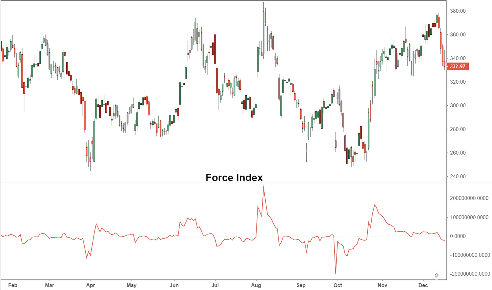

Technical analysis is fundamental to contemporary trading practices, serving as a crucial means for traders to glean insights into market trends and potential inflection points by examining historical price and volume data. Among the diverse array of technical indicators used in this analysis, the Force Index is particularly noteworthy due to its distinctive capability to quantify the strength behind price movements. This indicator was developed by Alexander Elder, a well-respected figure in the field of technical analysis, and it effectively integrates both price and volume data to deliver a comprehensive perspective on the buying and selling pressures present in the market.

The Force Index distinguishes itself by its unique methodology that merges the dynamics of price changes with volume, offering a nuanced understanding of market behavior beyond what price alone can reveal. This capacity makes it a favored tool among traders who seek to identify the underlying forces driving market movements. The widespread use of the Force Index is attributed to its ability to provide valuable confirmations of prevailing trends and to pinpoint potential reversals, thereby aiding traders in making informed decisions.



This article sets out to thoroughly examine the Force Index, providing a detailed explanation of its calculation, applications in trading strategies, and an assessment of its advantages and shortcomings. By offering such a comprehensive exploration, traders can better understand how to effectively incorporate the Force Index into their analytical toolkit, enhancing their ability to navigate the complexities of modern financial markets.

## Table of Contents

## What is the Force Index?

The Force Index is a technical indicator created to gauge the strength or pressure behind price movements in trading markets. It takes into account three critical elements: the direction of price change, the magnitude of this price change, and the volume of trades executed. This comprehensive approach allows traders to determine the power driving an asset's price movement, making it a valuable tool for understanding market trends.

Introduced by Alexander Elder in his seminal work "Trading for a Living," the Force Index has gained popularity among traders for its ability to confirm existing trends and identify potential market reversals. The strength of the Force Index lies in its dual focus—unlike purely price-based indicators, it incorporates trade volume, thus offering a more nuanced picture of market dynamics. 

This indicator is particularly useful for assessing whether buying or selling pressure is stronger in the market. A high Force Index, for instance, suggests that buyers have the upper hand, while a low index indicates seller dominance. By observing these pressure dynamics, traders can make informed decisions on potential entry and exit points within the market, thus optimizing their trading strategies. The Force Index facilitates this by translating the interplay of volume and price change into a numerical format that is easy to interpret and apply.

## Calculating the Force Index

The Force Index is calculated by combining price changes with trading volumes, offering a nuanced measure of market dynamics. Specifically, the Force Index (FI) is expressed through the formula:

$$
\text{FI} = (\text{Current Close} - \text{Previous Close}) \times \text{Volume}
$$

This calculation captures three critical components: the direction of price movement, the magnitude of this change, and the [volume](/wiki/volume-trading-strategy) accompanying the change. High values indicate strong market [momentum](/wiki/momentum), typically driven by substantial volume or significant price change, while low values suggest weaker momentum.

To enhance its practical application, the Force Index often undergoes a smoothing process using an exponential moving average (EMA). The EMA is applied over a specified period to reduce short-term fluctuations and noise, providing a clearer trend signal. A common smoothing period is 13 days, but this can be adjusted according to the trader's specific objectives:

- **Shorter Periods:** These may be employed for traders seeking to capture short-term market trends, wherein quicker responses to recent price movements are desired.

- **Longer Periods:** These periods cater to traders interested in understanding long-term trends, providing a more stable and less reactive indicator.

Incorporating the Force Index within a technical analysis framework requires thoughtful consideration of these smoothing periods to align with individual trading strategies and goals. By adjusting the EMA period, traders can fine-tune the sensitivity of the Force Index to market conditions, thus enhancing its utility as a tool for decision-making.

## Interpreting the Force Index

A positive Force Index indicates a scenario where buying pressure surpasses selling pressure. This occurs because the current closing price is higher than the previous closing price, leading to a positive figure when multiplied by the volume. Conversely, a negative Force Index arises when selling pressure dominates, as the current closing price falls below the previous closing price, resulting in a negative value.

Significant movements in the Force Index, particularly when associated with substantial trading volume, suggest robust market momentum. These large swings usually denote strong buy or sell actions and can indicate sustained trends or potential reversals.

Traders pay close attention to the moment when the Force Index crosses the zero line. This crossing is a crucial signal, as it can indicate potential entry or [exit](/wiki/exit-strategy) points. A movement from below zero to above zero may suggest a buying opportunity, reflecting a shift from selling dominance to buying pressure. In contrast, a transition from above zero to below may signal a selling opportunity, indicating a reversal from buying to selling pressure. 

For example, a Python script to simulate this might look like:

```python
def force_index(current_close, previous_close, volume):
    return (current_close - previous_close) * volume

# Sample data
previous_close = 100
current_close = 105
volume = 1000

fi_value = force_index(current_close, previous_close, volume)
print(f"The Force Index value is: {fi_value}")

# Check for crossing zero
if fi_value > 0:
    print("Buying pressure is dominant.")
elif fi_value < 0:
    print("Selling pressure is dominant.")
else:
    print("No net buying or selling pressure.")
```

In this example, a Force Index value greater than zero indicates predominant buying pressure, and a value less than zero signifies dominant selling pressure. Such evaluations aid traders in making informed decisions based on price and volume dynamics.

## Force Index Trading Strategies

Incorporating the Force Index into trading strategies, particularly for trend-following and divergence detection, can significantly enhance decision-making by providing a clearer insight into market movements. Traders who employ trend-following strategies focus on the Force Index to affirm the direction of a prevailing trend. A positive Force Index reinforces an upward trend as it reflects stronger buying pressure compared to selling pressure. Conversely, a negative Force Index suggests the continuation of a downward trend, indicating that selling forces dominate.

Furthermore, the Force Index is a valuable tool for identifying divergences, which are critical signals for potential market reversals. A divergence occurs when the Force Index moves contrary to the price direction. For instance, if prices are rising but the Force Index is decreasing, this divergence could suggest waning buying pressure and a potential reversal to a downtrend. Similarly, a divergence occurs when prices fall but the Force Index starts to rise, indicating a possible shift in momentum towards an upward trend.

The Force Index gains further analytical power when combined with other technical indicators such as moving averages. Moving averages help smooth out price action to identify the direction of the trend, and when used alongside the Force Index, they can bolster confidence in trading decisions. For instance, pairing a 13-day exponential moving average (EMA) with the Force Index can be instrumental in reducing noise and providing more reliable trend signals.

Consider a simple Python script to calculate and plot the Force Index with a moving average:

```python
import pandas as pd
import numpy as np
import matplotlib.pyplot as plt

# Example price and volume data
data = pd.DataFrame({
    'Close': [110, 112, 115, 113, 117],
    'Volume': [1000, 1100, 1050, 1150, 1200]
})

# Force Index Calculation
data['ForceIndex'] = (data['Close'] - data['Close'].shift(1)) * data['Volume']

# Applying a 13-day EMA on Force Index for smoothing 
data['ForceIndex_EMA'] = data['ForceIndex'].ewm(span=13, adjust=False).mean()

# Plotting the results
plt.figure(figsize=(10, 5))
plt.plot(data['ForceIndex'], label='Force Index', color='blue')
plt.plot(data['ForceIndex_EMA'], label='Force Index EMA', color='red', linestyle='--')
plt.title('Force Index and its EMA')
plt.legend()
plt.show()
```

In this example, traders can observe the smoothed Force Index alongside the unsmoothed values, providing a dual perspective on buying and selling pressures. By integrating these technical insights, traders can enhance their strategies, improving both entry and exit timing in volatile markets.

## Benefits and Limitations of the Force Index

The Force Index, a technical indicator developed by Alexander Elder, offers significant benefits by integrating price changes and trading volume to evaluate market strength. This dual consideration provides traders with more comprehensive insights compared to analyzing price movements alone. By multiplying the difference in closing prices ($\text{Current Close} - \text{Previous Close}$) with the volume, the Force Index quantitatively assesses trading dynamics, illustrating the relative force behind movements.

A notable advantage of using the Force Index lies in its ability to highlight the intensity of buying or selling pressure, enabling traders to gauge the vigor of market trends. This can be particularly beneficial in validating the strength of ongoing trends or signaling potential trend reversals when the force of price movements contradicts the prevailing market direction.

However, the Force Index is not without limitations. As a lagging indicator, it often reflects past price actions rather than anticipating future movements. This delay might result in trade signals being generated after a significant price change has already occurred, potentially diminishing the opportunity for maximizing profits. In fast-moving markets, traders might find that by the time the Force Index confirms a trend, much of the opportunity has already been realized.

Moreover, the Force Index can generate false signals, especially in market environments characterized by low volume or irregular price fluctuations. In such conditions, the noise in data can result in misleading interpretations, leading traders to potentially incorrect decisions. This highlights the importance of using the Force Index in conjunction with other technical indicators or tools. By cross-referencing signals with additional data, traders can improve the reliability of their trading strategies and minimize the impact of erroneous signals. This complementary approach helps in filtering out unreliable signals and provides a more robust foundation for decision-making in various market conditions.

## Force Index vs. Money Flow Index

Both the Force Index and the Money Flow Index (MFI) are effective tools for evaluating market momentum, yet they differ significantly in their calculation methodologies and practical applications. 

The Force Index, developed by Alexander Elder, is inherently straightforward, focusing on closing prices and volume to indicate buying and selling pressure. Its primary formula is given by:

$$
\text{FI} = (\text{Current Close} - \text{Previous Close}) \times \text{Volume}
$$

This formula emphasizes changes in closing prices and how much volume accompanies these changes, providing a direct measure of the force behind market moves.

In contrast, the Money Flow Index (MFI) adopts a more complex approach. The MFI incorporates the high, low, and closing prices along with the volume to assess money flow in and out of a security. It is a volume-weighted version of the Relative Strength Index (RSI) and is calculated as follows:

1. First, calculate the typical price for the period:

$$
\text{Typical Price} = \frac{\text{High} + \text{Low} + \text{Close}}{3}
$$

2. Determine the money flow by multiplying the typical price by the period volume.

3. Raw money flow is then calculated as positive or negative depending on whether the current typical price is higher or lower than the previous period's typical price.

4. The Money Flow Index is then calculated using a ratio of positive and negative money flows over a set period, typically 14 days, using the formula:

$$
\text{MFI} = 100 - \left( \frac{100}{1 + \frac{\text{Positive Money Flow}}{\text{Negative Money Flow}}} \right)
$$

The MFI is especially useful for identifying overbought or oversold conditions, as its readings range from 0 to 100, with typical thresholds often set at 20 and 80.

Given their differing emphases—Force Index on the immediacy of price movements and volume, and MFI on the broader price range and its relation to volume—the choice between these indicators should be guided by a trader's specific strategy and objectives. Testing both indicators may help traders determine which aligns more closely with their individual preferences and the type of insights they seek for making informed trading decisions.

## Conclusion

The Force Index stands as a valuable technical tool for traders seeking to comprehend the nuances of market dynamics beyond mere price changes. Its incorporation of both price and volume data offers a multi-dimensional view of buying and selling pressures, aiding traders in deciphering market momentum more effectively. This capacity to provide deeper insights makes it an essential component of diverse trading strategies, allowing participants to anticipate potential market movements with greater confidence.

When applied judiciously, the Force Index can significantly bolster trading approaches by revealing stronger or weaker trends. For instance, a consistently positive Force Index suggests sustained buying power, whereas a steady negative reading indicates persistent selling pressure. Understanding these dynamics empowers traders to align their positions with prevailing market forces, enhancing the likelihood of favorable outcomes.

Despite its usefulness, traders should be cognizant of the limitations intrinsic to the Force Index, such as its lagging nature and susceptibility to false signals, particularly in volatile or low-volume market conditions. Therefore, it is advisable to employ the Force Index in conjunction with other technical indicators to mitigate potential risks. By confirming signals with additional tools, traders can achieve a more comprehensive analysis, thus facilitating better decision-making and fostering more dependable trading results. Ultimately, the strategic use of the Force Index alongside complementary indicators can lead to more informed and successful trading practices.

## References & Further Reading

[1]: Elder, A. (1993). ["Trading for a Living: Psychology, Trading Tactics, Money Management."](https://www.amazon.com/Trading-Living-Psychology-Tactics-Management/dp/0471592242) John Wiley & Sons.

[2]: Schwager, J. D. (1993). ["The New Market Wizards: Conversations with America's Top Traders."](https://archive.org/details/newmarketwizards00jack) Harper Business.

[3]: Murphy, J. J. (1999). ["Technical Analysis of the Financial Markets: A Comprehensive Guide to Trading Methods and Applications."](https://archive.org/details/technicalanalysi0000murp) New York Institute of Finance.

[4]: Pring, M. J. (2002). ["Technical Analysis Explained: The Successful Investor's Guide to Spotting Investment Trends and Turning Points."](https://www.amazon.com/Technical-Analysis-Explained-Fifth-Successful/dp/0071825177) McGraw-Hill.

[5]: Nison, S. (1991). ["Japanese Candlestick Charting Techniques: A Contemporary Guide to the Ancient Investment Techniques of the Far East."](https://archive.org/details/japanesecandlest0000niso) Prentice Hall Press.