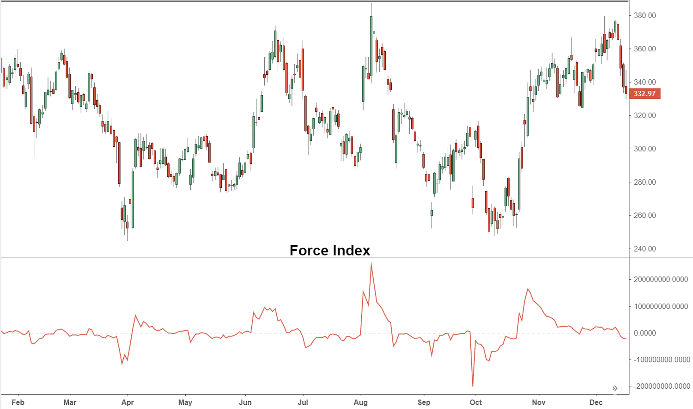

In today's fast-paced financial markets, leveraging technical indicators is crucial for making informed trading decisions. Among these indicators, the Force Index stands out as a significant tool that traders use to assess market momentum and anticipate price movements. Developed by Dr. Alexander Elder, the Force Index measures the power behind a price movement by calculating the strength of buying and selling pressure. This calculation is achieved by taking the difference between the current closing price and the previous closing price and multiplying it by the traded volume. Mathematically, the Force Index $FI$ can be expressed as:

$$

FI = (P_{\text{close\_current}} - P_{\text{close\_previous}}) \times V 
$$

where $P_{\text{close\_current}}$ is the current closing price, $P_{\text{close\_previous}}$ is the previous closing price, and $V$ is the volume.

In recent years, the rise of algorithmic trading has seen the Force Index gain prominence within various quantitative trading strategies. Algorithms incorporating the Force Index are designed to automatically execute trades based on strong signals of momentum shifts, thereby minimizing the potential for human error and allowing traders to capitalize on rapid market changes. 

This article explains the mechanics of the Force Index, discussing its advantages and limitations, and its integration into algorithmic trading systems. Whether you are a seasoned trader or a novice investor, understanding the Force Index can significantly enhance your trading toolkit. By incorporating this indicator with other technical analysis tools, traders can obtain a more comprehensive view of market dynamics, optimizing their strategies to better navigate the complexities of financial markets.

## Table of Contents

## Understanding the Force Index

The Force Index is a technical indicator developed by Dr. Alexander Elder to quantify the strength behind a price movement in the financial markets. It is distinguished by its integration of price changes, the direction of price movement, and trading [volume](/wiki/volume-trading-strategy), offering traders a unique perspective on market trends. The primary formula for calculating the Force Index is:

$$
\text{Force Index} = (\text{Current Closing Price} - \text{Previous Closing Price}) \times \text{Volume}
$$

This calculation allows traders to discern the [momentum](/wiki/momentum) of market participants. When the Force Index yields a positive value, it indicates buying pressure, suggesting that market participants are actively pushing the prices higher. Conversely, a negative value reflects selling pressure, signifying that sellers are dominating, which leads to declining prices.

The Force Index serves as an efficient tool for traders to spot potential buying or selling opportunities. By analyzing the magnitude of the Force Index, traders can assess whether a trend is likely to continue or if a reversal might occur. A substantial positive Force Index suggests that a strong upward trend could be underway, while a significant negative Force Index might herald a robust downward trend.

Furthermore, traders often complement the Force Index with other technical indicators to enhance their analysis. For instance, combining it with moving averages or oscillators can provide a more comprehensive understanding of market conditions. The simplicity of its calculation and the depth of insight it offers make the Force Index a favored choice among traders for identifying market momentum and potential price movements.

## Benefits of Using the Force Index

The Force Index is a critical tool among technical indicators for traders seeking to understand market momentum and predict future price movements. One of its primary benefits is its ability to identify trend continuations and reversals. By analyzing the relationship between price changes and volume, the Force Index can effectively pinpoint the ongoing trend's strength and potential shifts in market direction. This capability makes it particularly effective in volatile markets, where price movements are rapid and frequent, offering insights that might be overlooked by other indicators that do not consider volume.

Versatility is another hallmark of the Force Index, as it can be adapted to various trading time frames and strategies. Whether a trader is focusing on short-term trades or long-term investment strategies, the Force Index provides the flexibility needed to adjust the analysis to suit specific market conditions and trading styles. This adaptability is crucial for traders who operate in fast-moving markets or who tailor their approaches based on different asset classes or trading periods.

The simplicity of the Force Index is one of its most appreciated qualities among traders. With its straightforward calculation, which involves subtracting the previous closing price from the current closing price and multiplying by volume, the Force Index offers a deep level of market insight with just a few data points. Despite its simplicity, the Force Index's ability to combine price direction, magnitude, and volume provides traders with a powerful tool for market analysis, without the complexity or data overload that can accompany more intricate indicators.

In addition to its standalone advantages, the Force Index integrates seamlessly with other technical indicators to enhance market analysis. By combining the Force Index with indicators like moving averages or Relative Strength Index (RSI), traders can obtain a more comprehensive view of market dynamics and validate their trading signals. This integration allows for a robust analytical framework that can capture various market conditions, thus enabling traders to make more informed decisions.

In summary, the Force Index's ability to identify trends, its adaptability to different trading styles, and its straightforward nature make it an invaluable component of a trader's toolkit. Its effectiveness in volatile markets and its compatibility with other indicators further enhance its utility in comprehensive market analysis.

## Limitations of the Force Index

The Force Index, while a robust tool for analyzing market power and momentum, is not without its limitations. As with any technical indicator, it should be approached with caution and not used in isolation. Understanding its potential weaknesses can help traders better manage risks and improve decision-making.

One significant limitation of the Force Index is its tendency to produce false signals, particularly during periods of low trading volume or sideways market movements. In such conditions, the price changes and volume used to calculate the index may not accurately reflect market sentiment or potential future price trends. Consequently, relying too heavily on the Force Index during these times could lead traders to make erroneous trading decisions.

Moreover, traders utilizing the Force Index should be wary of placing excessive trust in short-term readings. The index is primarily designed to measure the power behind price movements over a specified period. Short-term fluctuations can often be misleading due to market noise or temporary price [volatility](/wiki/volatility-trading-strategies) unrelated to broader trends. Therefore, incorporating longer-term analyses or complementary indicators can help provide a clearer picture of market conditions.

To mitigate these drawbacks, it is advisable for traders to combine the Force Index with other technical analysis tools. For instance, integrating it with moving averages or trendlines can offer additional context and confirm signal validity. By cross-referencing signals from multiple indicators, traders can reduce the likelihood of acting on misleading information.

Ultimately, the key to effectively using the Force Index lies in understanding the broader market context and conditions. Acknowledging its limitations but leveraging it within a well-rounded analytical framework enhances its utility. Traders who adapt their strategies to account for market dynamics, keeping the Force Index as one of many tools in their arsenal, can harness its insights more effectively.

## Incorporating the Force Index into Algorithmic Trading

Algorithmic trading exploits the capabilities of the Force Index for automated and efficient decision-making processes. This utilization significantly diminishes the potential for human error, allowing for more consistent and timely trading actions. Here's a closer examination of how the Force Index is integrated into [algorithmic trading](/wiki/algorithmic-trading) systems.

**Programmable Trading Execution**

Algorithms are scripted to automatically initiate buy or sell orders when the Force Index indicates a robust shift in trend. The Force Index calculation, based on the formula:
$$
\text{Force Index} = (\text{Current Close} - \text{Previous Close}) \times \text{Volume}
$$
is used to assess the strength of market movements. By incorporating this calculation, algorithms can quickly respond to market dynamics, executing trades when certain thresholds are met, which are indicative of trend changes.

**Backtesting with Historical Data**

Traders employ historical market data to backtest algorithmic strategies that include the Force Index. This process involves running simulations to evaluate how well a strategy might have performed in the past, allowing traders to refine their approach before applying it to live markets. By understanding the effectiveness of the Force Index in different scenarios and time frames, traders can optimize strategy parameters to enhance future performance.

**Integration with Machine Learning Models**

When combined with [machine learning](/wiki/machine-learning) models, the Force Index can offer more precise predictions of market behavior. Machine learning involves training models to recognize patterns and predict outcomes based on input data. By incorporating the Force Index into these models, traders can improve the models' accuracy in identifying trading opportunities. Python libraries like scikit-learn or TensorFlow can be utilized to build and train predictive models that integrate the Force Index as a feature.

**Optimizing Algorithm Parameters**

Selecting the appropriate parameters and settings is crucial to maximizing the performance of trading algorithms that incorporate the Force Index. Parameter optimization includes determining the best threshold values for the Force Index and the specific market conditions under which the algorithm should operate. Adjustments in settings, such as the look-back period for calculations, can significantly impact the algorithm's effectiveness. Tools such as grid search or random search can be used to systematically identify the optimal parameter combinations.

In conclusion, incorporating the Force Index into algorithmic trading systems enhances their ability to make informed and swift trading decisions. By programming execution strategies, [backtesting](/wiki/backtesting) with historical data, integrating with machine learning, and optimizing parameters, traders can harness the full potential of the Force Index to improve trading outcomes.

## Practical Applications and Case Studies

Examining real-world scenarios highlights the practical value of the Force Index in trading strategies. Successful traders have integrated this technical indicator into their algorithmic trading systems, achieving notable results.

One case study involves a trader who implemented the Force Index in a high-frequency trading algorithm. By setting the algorithm to enter trades when the Force Index indicated strong buying or selling pressure, the trader was able to capture short-term price movements effectively. Through backtesting and analyzing historical data, the trader identified periods where the Force Index consistently predicted market reversals, leading to improved profitability.

Another case study focuses on a portfolio manager using the Force Index alongside moving averages to develop a trend-following strategy. By combining these indicators, the manager could filter out false signals inherent in the Force Index during sideways markets. This combination proved effective in volatile market conditions, allowing the manager to maintain a steady return on investment.

The integration of the Force Index with other indicators forms a robust basis for trading strategies. For example, pairing the Force Index with the Relative Strength Index (RSI) can enhance decision-making. When both indicators align, indicating overbought or oversold conditions, the confidence level in potential trade signals increases. This convergence helps traders reduce the risk of false signals and improves the accuracy of their market entries and exits.

However, there are common pitfalls in applying the Force Index that traders should be wary of. One major issue is over-reliance on the index in isolation, especially in low-volume or flat market scenarios where its accuracy diminishes. It's crucial to incorporate other analysis tools to confirm signals generated by the Force Index. Traders must also be cautious with short-term Force Index readings, as they can lead to reactionary trading based on noise rather than genuine market momentum.

In conclusion, the Force Index, when used judiciously and in conjunction with other indicators, can significantly enhance trading strategies. Learning from case studies and understanding its limitations can guide traders to utilize the Force Index more effectively, avoiding common pitfalls and capitalizing on its strengths.

## Conclusion

The Force Index serves as a pivotal tool for traders aiming to comprehend the dynamics of markets and the power driving price movements. It integrates price and volume data to provide a nuanced perspective on buying and selling pressures, making it a highly informative indicator for assessing market sentiments. However, on its own, the Force Index is not a comprehensive solution for predicting market behavior. It tends to be most effective when used in conjunction with other technical analysis tools, thereby enriching the depth of the analysis.

Algorithmic traders, in particular, can find the Force Index invaluable for refining trading decisions and adapting to different market environments. By integrating the Force Index within algorithmic systems, traders can automate responses to market shifts indicated by changes in this metric, thereby reducing the risk of human error and enhancing decision-making efficiency. For instance, algorithms might be programmed to initiate trades when the Force Index indicates a significant shift in market momentum.

Mastering the use of the Force Index in trading strategies necessitates continuous learning and adaptation. As markets evolve, traders need to be vigilant in updating their understanding and optimizing their trading models. The dynamic nature of financial markets requires that traders remain flexible and willing to adjust their strategies in response to new information and conditions.

With the right approach, including a comprehensive understanding of how the Force Index interacts with other indicators and market conditions, this tool can significantly enhance any trader's strategy. By appreciating its strengths and limitations, traders can effectively integrate the Force Index into their trading arsenal, improving their ability to anticipate and act on potential market moves.

## References & Further Reading

[1]: ["Trading for a Living: Psychology, Trading Tactics, Money Management"](https://www.amazon.com/Trading-Living-Psychology-Tactics-Management/dp/0471592242) by Dr. Alexander Elder

[2]: Bergstra, J., Bardenet, R., Bengio, Y., & Kégl, B. (2011). ["Algorithms for Hyper-Parameter Optimization."](https://dl.acm.org/doi/10.5555/2986459.2986743) Advances in Neural Information Processing Systems 24.

[3]: ["Advances in Financial Machine Learning"](https://www.amazon.com/Advances-Financial-Machine-Learning-Marcos/dp/1119482089) by Marcos Lopez de Prado

[4]: ["Evidence-Based Technical Analysis: Applying the Scientific Method and Statistical Inference to Trading Signals"](https://www.amazon.com/Evidence-Based-Technical-Analysis-Scientific-Statistical/dp/0470008741) by David Aronson

[5]: ["Machine Learning for Algorithmic Trading"](https://github.com/stefan-jansen/machine-learning-for-trading) by Stefan Jansen

[6]: ["Quantitative Trading: How to Build Your Own Algorithmic Trading Business"](https://github.com/LucindaYa/quant-resources/blob/master/Quantitative%20Trading%20How%20to%20Build%20Your%20Own%20Algorithmic%20Trading%20Business.pdf) by Ernest P. Chan