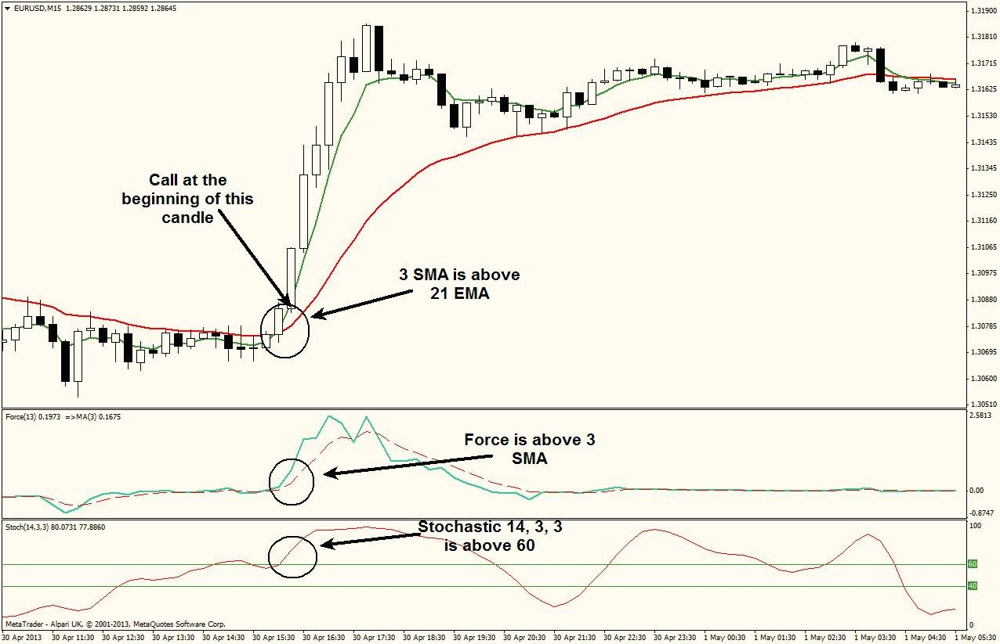

## Table of Contents

## What is the Force Index and what does it measure?

The Force Index is a technical indicator used in stock trading to measure the strength of price movements. It combines price changes and trading volume to give traders an idea of how strong the buying or selling pressure is in the market. The formula for the Force Index is simple: it's the difference between the current closing price and the previous closing price, multiplied by the current trading volume. If the result is positive, it means there's buying pressure, and if it's negative, it shows selling pressure.

This indicator helps traders understand whether a trend is likely to continue or reverse. For example, if the Force Index is high and positive during an uptrend, it suggests that the buying pressure is strong and the uptrend might keep going. On the other hand, if the Force Index starts to drop while prices are still rising, it could mean that the buying pressure is weakening, and the uptrend might be about to end. Traders often use the Force Index along with other indicators to make better decisions about when to buy or sell stocks.

## How is the Force Index calculated?

The Force Index is calculated by taking the difference between the current closing price of a stock and its previous closing price, and then multiplying that difference by the current trading volume. This gives you a single number that shows the strength of the price movement. If the number is positive, it means there was more buying pressure. If it's negative, it shows there was more selling pressure.

To make the Force Index easier to use, traders often smooth it out over several days. They do this by calculating the Force Index for each day and then taking a moving average of those daily values. This smoothed version helps traders see trends more clearly and make better decisions about when to buy or sell.

## What is the significance of the Force Index in technical analysis?

The Force Index is important in technical analysis because it helps traders understand how strong the buying or selling pressure is in the market. It does this by looking at both the price change and the trading volume. If the Force Index is high and positive, it means there's a lot of buying going on, which can make traders think the price will keep going up. On the other hand, if the Force Index is low or negative, it shows that selling is strong, and the price might go down.

Traders use the Force Index to make better decisions about when to buy or sell stocks. For example, if the price of a stock is going up but the Force Index starts to go down, it might mean that the buying pressure is getting weaker. This could be a sign that it's time to sell before the price starts to fall. By watching the Force Index along with other indicators, traders can get a better picture of what's happening in the market and make smarter trading choices.

## Can you explain the difference between the 1-day, 13-day, and 2-day Force Index?

The 1-day Force Index is the most basic version. It's calculated by taking the difference between the current day's closing price and the previous day's closing price, then multiplying that difference by the current day's trading volume. This gives you a quick snapshot of the buying or selling pressure for that one day. It's useful for seeing immediate changes in the market, but it can be a bit jumpy because it's only looking at one day at a time.

The 13-day Force Index smooths out the daily ups and downs by using a 13-day moving average of the 1-day Force Index values. This makes it easier to spot longer-term trends in buying and selling pressure. If the 13-day Force Index is going up, it means the buying pressure is getting stronger over time. If it's going down, the selling pressure is increasing. Traders often use the 13-day version to get a clearer picture of what's happening in the market over a couple of weeks.

The 2-day Force Index is a middle ground between the 1-day and 13-day versions. It's calculated by taking a 2-day moving average of the 1-day Force Index values. This helps smooth out the data a bit more than the 1-day version but still keeps it more responsive to short-term changes than the 13-day version. The 2-day Force Index can be helpful for traders who want to see trends over a few days without waiting for the longer-term 13-day average to catch up.

## How do traders interpret positive and negative Force Index values?

Traders look at the Force Index to see if there's more buying or selling going on in the market. If the Force Index is positive, it means the closing price today is higher than it was yesterday, and people are buying more. This tells traders that there's buying pressure, and the price might keep going up. A high positive Force Index can be a sign that the trend is strong and could continue.

On the other hand, if the Force Index is negative, it means the closing price today is lower than it was yesterday, and people are selling more. This shows there's selling pressure, and the price might go down. A low or very negative Force Index can be a warning that the trend might be getting weaker or could reverse soon. By watching these positive and negative values, traders can make better guesses about what the market will do next.

## What are the common trading signals generated by the Force Index?

Traders use the Force Index to spot when it might be a good time to buy or sell. One common signal is called a "divergence." This happens when the price of a stock is going up, but the Force Index is going down. It means the buying pressure is getting weaker, even though the price is still rising. Traders might see this as a sign to sell the stock before the price starts to fall. On the flip side, if the price is going down but the Force Index is going up, it could mean the selling pressure is getting weaker. This might be a good time to buy the stock because the price could start to go up soon.

Another signal traders look for is when the Force Index crosses above or below zero. When the Force Index goes from negative to positive, it can mean the buying pressure is starting to take over. This might be a good time to buy. When it goes from positive to negative, it can mean the selling pressure is getting stronger, and it might be a good time to sell. Traders also pay attention to big changes in the Force Index. If it suddenly jumps up or down a lot, it can show strong buying or selling pressure, and traders might decide to act quickly based on that.

## How can the Force Index be used in conjunction with other technical indicators?

Traders often use the Force Index along with other indicators to get a better idea of what's happening in the market. One common way to do this is by combining the Force Index with moving averages. For example, a trader might look at the 13-day Force Index and a 50-day moving average of the stock's price. If the Force Index is positive and the price is above the moving average, it could mean the stock is in a strong uptrend. But if the Force Index starts to drop while the price is still above the moving average, it might be a sign that the uptrend is losing steam and it's time to sell.

Another way to use the Force Index with other indicators is by looking at it with the Relative Strength Index (RSI). The RSI measures how fast a stock's price is changing and whether it's overbought or oversold. If the Force Index is high and positive but the RSI is over 70, it might mean the stock is overbought and could soon drop in price. On the other hand, if the Force Index is low and negative but the RSI is below 30, it could mean the stock is oversold and might be a good time to buy. By using the Force Index with other indicators like moving averages and the RSI, traders can make better decisions about when to buy or sell stocks.

## What are the limitations of using the Force Index in trading?

The Force Index is a helpful tool, but it has some limitations that traders need to know about. One big problem is that it can give false signals. Sometimes, the Force Index might show a strong buying or selling pressure, but the price doesn't move the way you expect. This can lead to bad trading decisions if you rely only on the Force Index. Also, the Force Index can be a bit jumpy, especially if you're looking at the 1-day version. This means it might change a lot from one day to the next, making it hard to see the bigger picture.

Another limitation is that the Force Index doesn't tell you everything about the market. It looks at price changes and volume, but it doesn't consider other important things like news events or big economic changes that can affect stock prices. So, if you only use the Force Index, you might miss out on important information. That's why it's a good idea to use the Force Index along with other indicators and to keep an eye on what's happening in the world. This way, you can make better trading decisions and avoid some of the limitations of using just one tool.

## How does the Force Index help in identifying trend strength and potential reversals?

The Force Index helps traders see how strong a trend is by looking at both the price change and the trading volume. If the Force Index is high and positive during an uptrend, it means the buying pressure is strong, and the price might keep going up. On the other hand, if the Force Index is low or negative during a downtrend, it shows that the selling pressure is strong, and the price might keep going down. By watching the Force Index, traders can tell if the trend is getting stronger or weaker. For example, if the price is going up but the Force Index starts to drop, it might mean the buying pressure is getting weaker, and the uptrend could be losing steam.

The Force Index also helps traders spot when a trend might reverse. One way to do this is by looking for divergences. A divergence happens when the price is moving one way, but the Force Index is moving the opposite way. If the price is going up but the Force Index is going down, it might mean the buying pressure is weakening, and the price could soon start to fall. This could be a good time to sell. On the other hand, if the price is going down but the Force Index is going up, it might mean the selling pressure is weakening, and the price could start to go up. This could be a good time to buy. By paying attention to these signals, traders can make better guesses about when a trend might change direction.

## What are some advanced strategies for using the Force Index in algorithmic trading?

In [algorithmic trading](/wiki/algorithmic-trading), the Force Index can be used to create more complex trading strategies by combining it with other indicators and setting up specific rules for buying and selling. One advanced strategy is to use the Force Index to spot divergences and then use other indicators like the Moving Average Convergence Divergence (MACD) to confirm these signals. For example, if the price is going up but the Force Index is going down, showing a bearish divergence, the algorithm can check if the MACD is also showing a bearish signal. If both indicators agree, the algorithm might decide to sell the stock. This helps reduce false signals and makes the trading strategy more reliable.

Another advanced strategy involves using the Force Index to measure trend strength and then setting up entry and [exit](/wiki/exit-strategy) points based on that strength. An algorithm can be programmed to buy a stock when the 13-day Force Index is above a certain level, showing strong buying pressure, and the price is above a key moving average like the 50-day moving average. To exit the trade, the algorithm might look for a drop in the Force Index below a certain level or a bearish divergence. By combining the Force Index with other indicators and setting up clear rules, algorithmic traders can create strategies that take advantage of market trends and reversals more effectively.

## How can historical Force Index data be used to backtest trading strategies?

Historical Force Index data can be used to backtest trading strategies by running the data through a set of rules to see how the strategy would have worked in the past. Traders can take old stock price and volume data, calculate the Force Index for each day, and then apply their trading rules to see if they would have made money. For example, if the strategy says to buy when the 13-day Force Index is positive and the price is above a 50-day moving average, the backtest will show how often this rule would have led to profits or losses in the past. This helps traders see if their strategy is good or if it needs to be changed.

By looking at the results of the backtest, traders can make their strategies better. They can see if the Force Index gave false signals and adjust their rules to avoid those mistakes. They can also try different settings for the Force Index, like using a 2-day or 13-day version, to see which one works best. Backtesting with historical data helps traders feel more confident that their strategy will work in the future, but they need to remember that past results don't always predict what will happen next.

## What are the current research developments and future directions for the Force Index?

Researchers are always looking for ways to make the Force Index better. One area they're exploring is how to combine the Force Index with other new indicators to make trading signals even more accurate. They're also working on using [machine learning](/wiki/machine-learning) to find patterns in the Force Index that humans might miss. This could help create trading strategies that work better in different market conditions. Another thing researchers are looking at is how to adjust the Force Index to work well with different types of financial markets, like cryptocurrencies or commodities, which can be more volatile than stocks.

In the future, we might see the Force Index being used in more automated trading systems. As more traders use algorithms to make decisions, the Force Index could become a key part of these systems. Researchers might also develop new ways to smooth out the Force Index to make it less jumpy and more reliable. They could look into how different time periods for the Force Index, like using a 7-day or 21-day version, might work better in certain situations. Overall, the goal is to keep improving the Force Index so it can help traders make smarter decisions in a fast-changing market.

## What is the Force Index and how can it be understood?

The Force Index is a technical indicator developed by Dr. Alexander Elder to quantify the strength behind a price movement in the financial markets. It is distinguished by its integration of price changes, the direction of price movement, and trading [volume](/wiki/volume-trading-strategy), offering traders a unique perspective on market trends. The primary formula for calculating the Force Index is:

$$
\text{Force Index} = (\text{Current Closing Price} - \text{Previous Closing Price}) \times \text{Volume}
$$

This calculation allows traders to discern the [momentum](/wiki/momentum) of market participants. When the Force Index yields a positive value, it indicates buying pressure, suggesting that market participants are actively pushing the prices higher. Conversely, a negative value reflects selling pressure, signifying that sellers are dominating, which leads to declining prices.

The Force Index serves as an efficient tool for traders to spot potential buying or selling opportunities. By analyzing the magnitude of the Force Index, traders can assess whether a trend is likely to continue or if a reversal might occur. A substantial positive Force Index suggests that a strong upward trend could be underway, while a significant negative Force Index might herald a robust downward trend.

Furthermore, traders often complement the Force Index with other technical indicators to enhance their analysis. For instance, combining it with moving averages or oscillators can provide a more comprehensive understanding of market conditions. The simplicity of its calculation and the depth of insight it offers make the Force Index a favored choice among traders for identifying market momentum and potential price movements.

## References & Further Reading

[1]: ["Trading for a Living: Psychology, Trading Tactics, Money Management"](https://www.amazon.com/Trading-Living-Psychology-Tactics-Management/dp/0471592242) by Dr. Alexander Elder

[2]: Bergstra, J., Bardenet, R., Bengio, Y., & Kégl, B. (2011). ["Algorithms for Hyper-Parameter Optimization."](https://dl.acm.org/doi/10.5555/2986459.2986743) Advances in Neural Information Processing Systems 24.

[3]: ["Advances in Financial Machine Learning"](https://www.amazon.com/Advances-Financial-Machine-Learning-Marcos/dp/1119482089) by Marcos Lopez de Prado

[4]: ["Evidence-Based Technical Analysis: Applying the Scientific Method and Statistical Inference to Trading Signals"](https://www.amazon.com/Evidence-Based-Technical-Analysis-Scientific-Statistical/dp/0470008741) by David Aronson

[5]: ["Machine Learning for Algorithmic Trading"](https://github.com/stefan-jansen/machine-learning-for-trading) by Stefan Jansen

[6]: ["Quantitative Trading: How to Build Your Own Algorithmic Trading Business"](https://github.com/LucindaYa/quant-resources/blob/master/Quantitative%20Trading%20How%20to%20Build%20Your%20Own%20Algorithmic%20Trading%20Business.pdf) by Ernest P. Chan