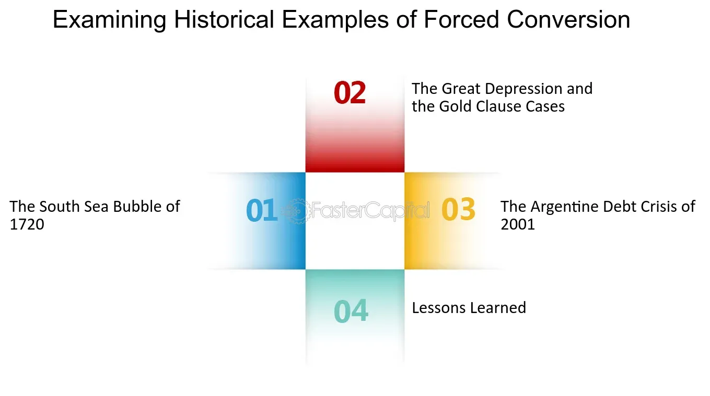

## Table of Contents

## What is forced conversion?

Forced conversion is when someone is made to change their religion against their will. This can happen through threats, violence, or other kinds of pressure. It is wrong because everyone should be free to choose their own beliefs.

Many times, forced conversion happens during conflicts or wars. People might be forced to convert to the religion of the group in power. This can cause a lot of pain and suffering for those who are forced to change their beliefs. It is important for people to respect others' freedom to believe what they want.

## What are the historical examples of forced conversion?

In history, one big example of forced conversion happened during the Spanish Inquisition. This started in the late 1400s. The Catholic Church and the Spanish rulers wanted everyone in Spain to be Catholic. They forced Jews and Muslims to convert to Christianity. If people didn't convert, they could be punished or even killed. This caused a lot of fear and suffering for many people.

Another example is from the 16th and 17th centuries when European countries colonized parts of the Americas. The Spanish and Portuguese forced many Native Americans to convert to Christianity. They often used violence and threats to make this happen. This was part of a bigger effort to control the land and the people who lived there. Many Native Americans suffered because of these forced conversions.

In the 20th century, during World War II, the Nazis in Germany forced many Jewish people to convert to Christianity. This was part of their plan to get rid of Jews. Even if Jews converted, they were still often sent to concentration camps. This shows how forced conversion can be used as a tool of power and control, causing a lot of harm.

## How does forced conversion impact individuals and communities?

Forced conversion can hurt individuals a lot. It makes them feel scared and unsafe. When someone is forced to change their religion, they lose the freedom to believe what they want. This can make them feel sad and confused. They might also feel like they've lost part of who they are because their beliefs are important to them. Some people might even be hurt or killed if they don't convert, which causes a lot of pain and suffering.

Communities also suffer from forced conversion. When many people in a community are forced to change their religion, it can break the community apart. People might not trust each other anymore. They might also lose their traditions and culture, which are important parts of their community life. This can lead to long-lasting problems, like people feeling angry or sad for a long time. It can also cause tension and conflict between different groups of people, making it hard for them to live together peacefully.

## What are the legal frameworks addressing forced conversion?

Many countries have laws that try to stop forced conversion. These laws say that it's wrong to force someone to change their religion. They are meant to protect people's right to believe what they want. For example, in the United States, the First Amendment to the Constitution says that everyone has the right to freedom of religion. This means that no one can be forced to change their religion against their will. Other countries have similar laws that protect this right.

International laws also help to stop forced conversion. The Universal Declaration of Human Rights, made by the United Nations, says that everyone has the right to freedom of thought, conscience, and religion. This means that people should be free to choose their own beliefs without being forced to change them. The International Covenant on Civil and Political Rights is another important document that many countries have agreed to follow. It also protects the right to freedom of religion and says that no one should be forced to change their beliefs.

## What is the difference between forced conversion and religious persecution?

Forced conversion happens when someone is made to change their religion against their will. This can be done through threats, violence, or other kinds of pressure. The main goal of forced conversion is to make someone change their beliefs, often to match the beliefs of the group in power. It takes away a person's freedom to choose their own religion and can cause a lot of suffering.

Religious persecution is when people are treated badly because of their religion. This can include being arrested, hurt, or even killed because of what they believe. Unlike forced conversion, the main goal of religious persecution is to punish or control people because of their beliefs, not necessarily to make them change their religion. Both forced conversion and religious persecution are wrong and can cause a lot of harm to individuals and communities.

## How do international human rights organizations view forced conversion?

International human rights organizations think that forced conversion is very wrong. They believe that everyone should be free to choose their own religion without being forced to change it. Groups like Amnesty International and Human Rights Watch say that forced conversion goes against important human rights. They work to stop it from happening by speaking out about it and helping people who have been forced to change their religion.

These organizations also help make sure that laws around the world protect people from forced conversion. They work with governments and other groups to make sure these laws are followed. They believe that stopping forced conversion is important for making sure everyone can live in peace and respect each other's beliefs.

## What are the psychological effects of forced conversion on victims?

Forced conversion can make people feel very scared and confused. When someone is forced to change their religion, they might feel like they've lost part of who they are. Their beliefs are important to them, and being forced to change can make them feel sad and lost. They might also feel angry because they had no choice in what happened to them. This can lead to a lot of stress and anxiety, and some people might even have trouble trusting others after going through something like this.

The effects can last a long time. People who have been forced to convert might struggle with their identity for years. They might feel like they don't belong anywhere, which can make them feel lonely and isolated. Some people might also have trouble sleeping or feel depressed because of what happened to them. It's important for them to get help from others who understand and support them, so they can start to feel better and heal from their experiences.

## What role do governments play in preventing or promoting forced conversion?

Governments can play a big role in stopping forced conversion. They can make laws that say it's wrong to force someone to change their religion. These laws help protect people's right to believe what they want. Governments can also work with groups like the United Nations to make sure these laws are followed everywhere. When governments do this, they help make sure people can live in peace and respect each other's beliefs.

Sometimes, governments might make forced conversion worse. If a government supports one religion over others, they might force people to change their beliefs to match the religion in power. This can happen during wars or conflicts when one group wants to control another. When governments do this, it causes a lot of pain and suffering for people who are forced to change their religion against their will. It's important for governments to treat all religions fairly and protect everyone's right to choose their own beliefs.

## How can forced conversion be distinguished from voluntary religious conversion?

Forced conversion happens when someone is made to change their religion against their will. This can be done through threats, violence, or other kinds of pressure. People might be scared or hurt if they don't convert. It takes away their freedom to choose what they believe. Forced conversion is wrong because everyone should be able to decide their own beliefs without being forced.

Voluntary religious conversion is different. It happens when someone chooses to change their religion because they want to. They might learn about a new religion and decide it's right for them. They are not forced or pressured by anyone. Voluntary conversion is okay because it respects a person's right to choose their own beliefs. The big difference is that one is forced and the other is a free choice.

## What are the socio-economic factors that contribute to forced conversion?

Forced conversion can happen because of socio-economic factors like poverty and lack of education. When people are poor, they might be more easily pressured into changing their religion. Someone might promise them money or a better life if they convert. This can make them feel like they have no choice, even if they don't really want to change their beliefs. Also, if people don't have much education, they might not know their rights or how to stand up against forced conversion. This makes them more vulnerable to being forced to change their religion.

Another factor is when a group in power wants to control a weaker group. This can happen during wars or conflicts. The group in power might use forced conversion as a way to take over and control the other group. They might think that if everyone has the same religion, it will be easier to control them. This can lead to forced conversion because people might be scared to say no. Socio-economic factors like these can make forced conversion more likely to happen, causing a lot of harm to individuals and communities.

## How have modern technologies and social media influenced forced conversion practices?

Modern technologies and social media have changed how forced conversion happens. Now, people can use the internet to spread messages that pressure others to change their religion. Sometimes, these messages can be very scary or make people feel like they have no choice. Groups might use social media to target people who are already feeling vulnerable because of things like poverty or lack of education. This can make it easier for them to force people to convert by promising help or threatening them online.

On the other hand, technology can also help stop forced conversion. People can use the internet to learn about their rights and find support from others who have been through the same thing. Social media can be a place where people share their stories and get help from organizations that work to stop forced conversion. By using technology in the right way, people can fight against forced conversion and protect their right to choose their own beliefs.

## What are the current global trends and statistics regarding forced conversion?

Forced conversion is still a problem in many parts of the world. It's hard to know the exact numbers because many cases are not reported. But, groups like the United States Commission on International Religious Freedom (USCIRF) and other human rights organizations keep track of where forced conversion happens the most. They say that it often happens in places where there are conflicts or where one group wants to control another. Countries like Nigeria, India, and parts of the Middle East have seen more cases of forced conversion in recent years.

The reasons for forced conversion can be different in different places. In some areas, it might be because of religious conflicts. In others, it might be because of political power or economic control. For example, in Nigeria, some groups have used forced conversion as a way to gain power during conflicts. In India, there have been reports of people being forced to convert because of their lower social status. These trends show that forced conversion is still a big issue that needs attention and action to protect people's right to choose their own beliefs.

## References & Further Reading

[1]: ["The Flash Crash of May 6, 2010," U.S. Securities and Exchange Commission (SEC)](https://www.sec.gov/news/studies/2010/marketevents-report.pdf).

[2]: Bergstra, J., Bardenet, R., Bengio, Y., & Kégl, B. (2011). ["Algorithms for Hyper-Parameter Optimization."](https://dl.acm.org/doi/10.5555/2986459.2986743) Advances in Neural Information Processing Systems 24.

[3]: ["Advances in Financial Machine Learning"](https://www.amazon.com/Advances-Financial-Machine-Learning-Marcos/dp/1119482089) by Marcos Lopez de Prado.

[4]: ["Evidence-Based Technical Analysis: Applying the Scientific Method and Statistical Inference to Trading Signals"](https://www.amazon.com/Evidence-Based-Technical-Analysis-Scientific-Statistical/dp/0470008741) by David Aronson.

[5]: ["Quantitative Trading: How to Build Your Own Algorithmic Trading Business"](https://www.amazon.com/Quantitative-Trading-Build-Algorithmic-Business/dp/1119800064) by Ernest P. Chan.