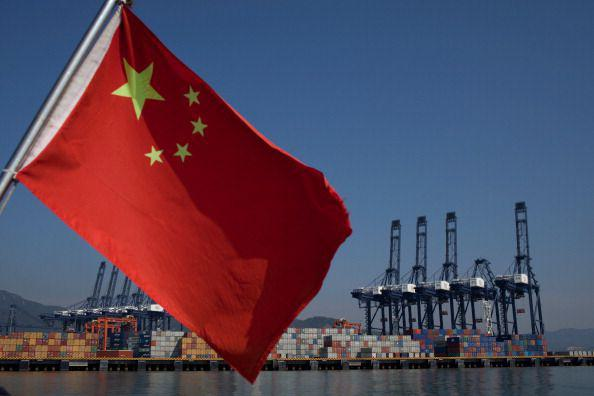

Forced Technology Transfer (FTT) is a practice wherein a country or company is compelled to share its technology with another entity, often as a precondition for market access or investment. This practice has become a significant issue in global trade and technology exchanges, as it directly impacts innovation, competition, and the balance of economic power. Historically, FTT has played a pivotal role in the industrialization strategies of several nations, particularly those with rapid economic growth aspirations. The relevance of FTT in today’s interconnected world is underscored by its potential to accelerate technological dissemination while simultaneously raising concerns about fairness and intellectual property rights.

Forced Technology Transfer is especially pertinent in discussions surrounding algorithmic trading or algo trading. Algorithmic trading refers to the use of computer algorithms to execute trades at speeds and frequencies beyond human capabilities. The connection between FTT and algo trading arises in scenarios where proprietary trading algorithms and technologies are transferred under duress, potentially skewing competitive advantages in global financial markets. This interaction highlights the complexities surrounding the protection of intellectual assets and the ethical implications of technology sharing in high-stakes industries such as finance.

Criticism of Forced Technology Transfer has grown substantially, driven by the perceived coercion and loss of competitive edge suffered by companies subject to such practices. Entities forced to share their technologies often view FTT as a barrier to fair trade, arguing that it jeopardizes their intellectual property and stymies innovation. Critics argue that FTT creates an uneven playing field where nations or companies that can extract or mimic advanced technologies gain a disproportionate advantage, undermining the principles of free market competition.

This article aims to explore the dimensions of Forced Technology Transfer, examining its history, the controversies it engenders, and its specific ramifications for algorithmic trading. By analyzing past practices, current criticisms, and future prospects, the article seeks to offer a comprehensive understanding of how FTT shapes global technological landscapes and influences trade dynamics. The goal is to foster informed discussions around the management and regulation of FTT practices, balancing the need to foster innovation with the imperative to protect intellectual property.

## Table of Contents

## Understanding Forced Technology Transfer (FTT)

Forced Technology Transfer (FTT) refers to the practice where a government compels foreign businesses to share their technological innovations, often as a prerequisite for market access. This sharing includes not only patented technologies but also proprietary methods, software, and designs. The concept of FTT is most often associated with concerns regarding intellectual property (IP) violations and can occur via formal requirements or through more subtle pressures exerted within business partnerships.

Common practices and mechanisms of FTT typically involve joint ventures and partnerships between foreign companies and local firms. Multinational corporations may be required to enter into such partnerships to access certain markets, leading to the mandatory transfer of technology to local entities. These arrangements benefit the local economy by providing access to advanced technology, skills, and know-how, but they may also erode the competitive advantage of foreign firms.

FTT predominantly affects sectors where technological innovations are crucial for maintaining market competitiveness. Key sectors include automotive, telecommunications, pharmaceuticals, and information technology. Each sector faces unique technological transfer demands shaped by the local political and economic landscape.

Government policies play a critical role in facilitating FTT by setting regulations that mandate technology sharing as a condition for business operation within their borders. Such policies aim to bolster domestic industries by acquiring advanced technologies, thereby reducing reliance on foreign technologies. This has generated significant controversy and is a focal point in international trade negotiations. 

Several instances from recent history illustrate how FTT has been enacted. China's economic strategy, for instance, has often been cited in discussions of FTT. The country has been known to require foreign companies to form joint ventures with local firms, which involves sharing valuable technological resources and sometimes oversight of corporate operations.

Thus, FTT, while potentially beneficial for developing local technological capacities, continues to be contentious due to its impact on global innovation dynamics and intellectual property rights. The pressure it places on multinational enterprises highlights significant challenges within the global trade environment.

## A Brief History of FTT

Forced Technology Transfer (FTT) has a complex history, evolving alongside global trade dynamics and technological advancements. Its origins can be traced back to the post-World War II period, when rebuilding efforts and the Cold War spurred countries to seek strategic advantages through technology acquisition. The early instances of FTT were characterized by pressures on companies to transfer technology as a prerequisite for market access, especially in rapidly industrializing countries.

During the 1980s and 1990s, the liberalization of global trade and the rise of emerging economies, particularly in Asia, brought FTT into sharper focus. These decades saw significant policy changes, with countries like China implementing stringent FTT policies to boost domestic innovation. The Chinese government's requirements for joint ventures and local partnerships often mandated the sharing of technological knowledge as a condition for foreign firms' operations in the country. This period highlighted FTT as a contentious issue in international trade, leading to debates on its impact on global innovation and competitiveness.

Several high-profile international trade disputes have placed FTT at the center of global economic discussions. For instance, the United States and European Union have repeatedly challenged China's FTT practices in the World Trade Organization (WTO), arguing that such requirements stifle fair competition and violate intellectual property rights. The ongoing scrutiny of these cases has made FTT a pivotal concern in trade negotiations and discussions, particularly as countries grapple with balancing national interests and global market participation.

Over the decades, global perspectives on FTT have shifted. Initially viewed as a strategy for rapid development and technology assimilation, FTT increasingly faces criticism for undermining innovation incentives and intellectual property protections. As intellectual property became a cornerstone of economic growth, countries started recognizing the need for more stringent protections, thus prompting international frameworks like the Agreement on Trade-Related Aspects of Intellectual Property Rights (TRIPS) to mediate the tensions between domestic development goals and international trade fairness.

Today's discourse on FTT reflects a nuanced understanding of its role in global trade. While some view it as a necessary strategy for technology diffusion in developing markets, others argue it unduly burdens innovative companies, making international cooperation and balanced policy approaches more critical than ever before.

## Criticism of Forced Technology Transfer

Forced Technology Transfer (FTT) is a controversial practice that has sparked significant debate in international trade circles. The primary criticisms of FTT center around its detrimental effects on innovation and intellectual property rights. Critics argue that FTT undermines the incentive structures necessary for innovation by compelling foreign companies to relinquish valuable technological knowledge and trade secrets as a condition for market access. This practice can lead to the erosion of competitive advantages that companies accrue through research and development.

1. **Impact on Innovation and Intellectual Property Rights:** FTT can stifle innovation by disincentivizing original research and development efforts. When firms are forced to share their technologies, the intellectual property (IP) is at risk of being disseminated beyond control, potentially fueling competitors without appropriate compensation. The existence of weak IP enforcement mechanisms in some jurisdictions exacerbates this issue, further deterring firms from investing in pioneering technologies.

2. **Stakeholder Arguments:**
   - **Businesses:** Many companies view FTT as a coercive practice that primarily benefits domestic firms in the host country. Corporations, predominantly from Western economies, have long argued that FTT equates to a non-tariff barrier that distorts the benefits of free trade. They assert that such transfers diminish returns on investments and compromise proprietary innovations.
   - **Policymakers:** On the other hand, policymakers in countries that implement FTT argue that it is a legitimate strategy to build local capabilities and speed up technological advancement. They claim that with strategic alliances and joint ventures, local firms can absorb critical technologies, contributing to national development goals. This perspective is often aligned with the strategic economic priorities of developing nations seeking rapid industrialization.

3. **International Responses and Regulations:** The international community has taken steps to address the frictions caused by FTT. The World Trade Organization (WTO) provides a platform for countries to resolve disputes related to technology transfer obligations. Moreover, recent trade agreements featuring the United States, such as the United States-Mexico-Canada Agreement (USMCA) and various bilateral deals with Asian and European nations, have included clauses explicitly prohibiting forced technology transfer practices. These regulatory measures aim to protect IP rights while ensuring that international trade remains fair and equitable.

In conclusion, the criticisms of FTT underscore the need for a nuanced approach that balances the interests of technology-creating and technology-receiving countries. Achieving such a balance requires international cooperation and well-defined policies that protect intellectual property while encouraging global technological advancement.

## The Intersection of FTT and Algorithmic Trading

Forced Technology Transfer (FTT) has notably influenced the development and widespread adoption of [algorithmic trading](/wiki/algorithmic-trading) within the financial sector. This influence primarily arises due to the transfer of technology and expertise that occurs when firms from technologically advanced nations enter markets with strong government-mediated FTT policies. 

Algorithmic trading, which involves the use of computer algorithms to execute trading orders based on pre-defined criteria, relies heavily on advanced technology and sophisticated software. FTT can expedite the spread of these critical technologies across borders, especially into markets with emerging financial sectors. Through FTT, domestic enterprises in these markets gain access not only to the algorithms and software but also to the underlying knowledge required to design and maintain these systems.

In terms of technology transfer dynamics, the financial and trading sectors are particularly susceptible because these areas rely on cutting-edge technologies that continuously evolve. When multinational companies establish joint ventures or operations in certain jurisdictions, they may be required, either explicitly by law or implicitly through business practices, to share their proprietary trading technologies. This can lead to accelerated local development of similar or derivative algorithmic systems, enhancing the domestic sector's competitiveness.

The implications of FTT for market transparency and fairness are complex. On one hand, the rapid dissemination of trading technologies can level the playing field by enabling more participants to engage in sophisticated trading practices, potentially increasing market [liquidity](/wiki/liquidity-risk-premium) and efficiency. On the other hand, it can lead to unfair advantages if the technology is not equally accessible or if some entities acquire superior technology through preferential FTT arrangements. This could exacerbate disparities in market power among participants and raise concerns over market manipulation or predatory trading practices.

Measurable impacts on global financial markets as a result of FTT in algorithmic trading include increased [volatility](/wiki/volatility-trading-strategies) and shifts in trading volumes. For instance, as more players adopt algorithmic trading, market behaviors can become increasingly synchronized, leading to rapid movements in asset prices. The amplification of trading volumes can be quantified using statistical measures such as trading [volume](/wiki/volume-trading-strategy) growth rates and volatility indices. However, it is crucial to note that these impacts may vary across different markets and are influenced by the specific regulatory and economic contexts of each region.

In summary, FTT's role in the proliferation of algorithmic trading highlights significant shifts in technology access and utilization within the global financial sector. It presents both opportunities for market development and challenges related to ensuring fair and transparent trade practices. Through thoughtful regulation and international cooperation, the adverse effects can be mitigated while harnessing the beneficial aspects of technology transfer for enhancing market dynamics.

## Future Prospects of FTT and Algorithmic Trading

Forced Technology Transfer (FTT) practices are likely to see significant developments as algorithmic trading continues to grow within global financial markets. The integration of emerging technologies such as [artificial intelligence](/wiki/ai-artificial-intelligence), blockchain, and [machine learning](/wiki/machine-learning) could reshape the FTT landscape. These technologies are integral to advancing algorithmic trading, potentially leading to an increase in cross-border technology exchange and the subsequent exploitation of FTT practices. As countries strive to maintain competitive advantages, entities may pressure firms to share cutting-edge technologies in return for market access.

Consequently, policy developments aimed at regulating FTT may gain [momentum](/wiki/momentum). Governments and international bodies could work towards creating frameworks that address technology transfer while safeguarding intellectual property. The potential for reform in FTT regulation could focus on promoting fair practices and ensuring that technology exchanges are mutually beneficial. This necessitates collaboration on global standards, cybersecurity measures, and transparent licensing agreements.

International cooperation will be crucial in managing FTT. Countries might recognize the benefits of establishing treaties or agreements to maintain global trade relations while addressing the challenges posed by FTT. Collaborative efforts could lead to the harmonization of intellectual property laws and the implementation of mechanisms to resolve disputes.

In terms of long-term implications, FTT practices concerning algorithmic trading might affect global innovation and trade dynamics. If managed effectively, FTT could foster a more innovative global environment by facilitating shared technological advancements and specialized knowledge in algorithmic trading. Conversely, unchecked FTT practices might lead to economic disparities, impacting smaller nations or companies unable to afford the costs of enforced technology sharing.

Ultimately, navigating the future of FTT and algorithmic trading requires balancing innovation and intellectual property protection. This balance is essential to ensuring fair and sustainable global trade and fostering technological advancements that benefit all participants in the international market.

## Conclusion

Forced Technology Transfer (FTT) has emerged as a crucial [factor](/wiki/factor-investing) influencing global trade and technology dynamics. It has been demonstrated that the mechanisms driving FTT can significantly impact technological innovation and economic growth. Understanding the deep-rooted and multifaceted nature of FTT is essential for policymakers and industry leaders as it highlights both challenges and opportunities within international trade. Through careful examination, it becomes clear that FTT not only affects technology sectors traditionally associated with manufacturing but also extends into modern domains like financial services and algorithmic trading.

The interconnection between FTT and global trade emphasizes the necessity for a balanced approach that protects intellectual property while fostering innovation and economic collaboration. Challenges such as unauthorized use and replication of technology underscore the importance of developing robust international regulations and cooperative frameworks. Encouraging ongoing discussion and research can lead to more effective management strategies that are sensitive to the diverse interests of all stakeholders involved.

Finally, balanced policies are needed to navigate the complexities of FTT, ensuring that technological advances contribute to economic progress without underscoring intellectual property risks. By fostering cooperative international environments and crafting nuanced policies, stakeholders can achieve a sustainable balance between open innovation and the protection of technological assets, thus promoting a more equitable and innovative global economy.

## References & Further Reading

[1]: Ruhaak, S. (2019). ["The Evolution of Industrial Policy in China"](https://www.harvard-yenching.org/wp-content/uploads/legacy_files/featurefiles/Sebastian%20Heilmann%20and%20Lea%20Shih_The%20Rise%20of%20Industrial%20Policy%20in%20China%201978-2012.pdf). Mercator Institute for China Studies.

[2]: Mulvenon, J. C., & Wang, L. (Eds.). (2015). ["The PLA's Influence on China's National Security Policymaking"](https://www.degruyter.com/document/doi/10.1515/9780804796286/html?lang=en). RAND Corporation.

[3]: Lozada, T., & Omelka, M. (2020). ["Algorithmic Trading and the Dynamic Market Environment"](https://www.researchgate.net/publication/383201516_Algorithmic_trading_and_machine_learning_Advanced_techniques_for_market_prediction_and_strategy_development). Social Science Research Network.

[4]: Lopez de Prado, M. (2018). ["Advances in Financial Machine Learning"](https://www.amazon.com/Advances-Financial-Machine-Learning-Marcos/dp/1119482089). Wiley.

[5]: Aronson, D. R. (2006). ["Evidence-Based Technical Analysis: Applying the Scientific Method and Statistical Inference to Trading Signals"](https://www.amazon.com/Evidence-Based-Technical-Analysis-Scientific-Statistical/dp/0470008741). Wiley.