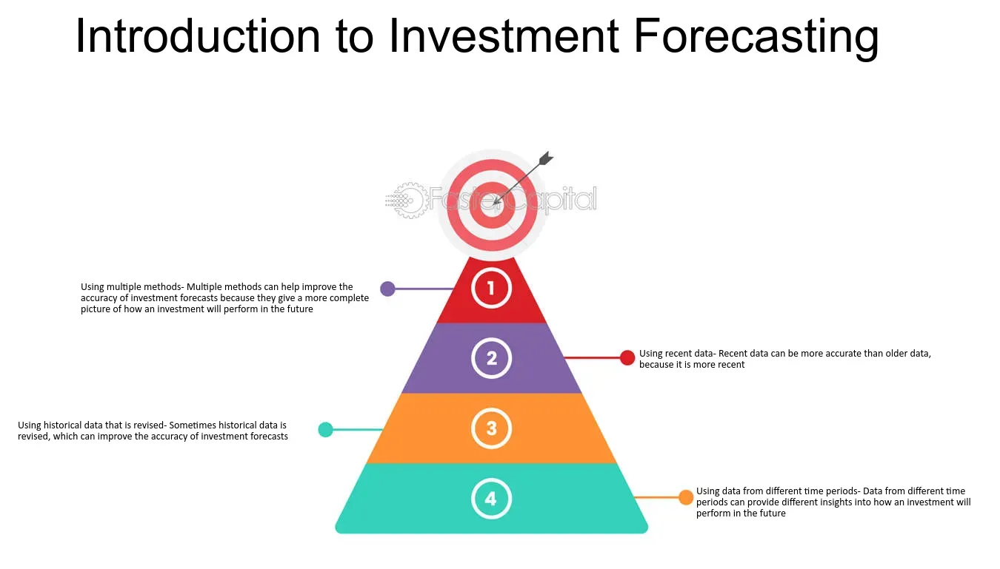

## Table of Contents

## What is forecasting and why is it important in business and investing?

Forecasting is like making a smart guess about what will happen in the future. In business and investing, it means trying to predict things like how many products people will buy, how much money a company will make, or how the stock market will do. People use past information, current trends, and sometimes even their gut feelings to make these guesses. It's not about knowing the future for sure, but about making the best possible prediction with the information you have.

Forecasting is really important in business and investing because it helps people make better decisions. If a business can predict that more people will want their product next year, they can make more of it now. This can help them make more money and grow. For investors, if they think a company's stock will go up, they might buy it now to sell it later for a profit. Without forecasting, businesses and investors would be making decisions in the dark, which could lead to big mistakes and lost money.

## What are the different types of forecasting methods used in business?

There are several types of forecasting methods that businesses use to predict future trends and outcomes. One common method is qualitative forecasting, which relies on people's opinions and judgments. This can include things like market research, where businesses ask customers what they think, or using expert opinions from people who know a lot about the industry. This method is useful when there isn't a lot of past data to look at, or when the business is trying to predict something new and different.

Another type is quantitative forecasting, which uses numbers and math to make predictions. This method looks at past data and uses it to find patterns and trends. There are two main types of quantitative forecasting: time series analysis, which looks at how things have changed over time, and causal models, which try to find out how different things affect each other. For example, a business might use time series analysis to predict how many products they will sell next month based on how many they sold in the past.

Some businesses also use a mix of both qualitative and quantitative methods, called combined forecasting. This can give them a more complete picture by using both numbers and people's opinions. For example, a company might use quantitative data to make a sales forecast and then adjust it based on what their sales team thinks will happen. This way, they can make the best possible prediction by considering both hard data and human insights.

## How does qualitative forecasting differ from quantitative forecasting?

Qualitative forecasting is all about using people's opinions and judgments to predict the future. It's like asking experts or customers what they think will happen. This method is really helpful when there's not a lot of past data to look at, or when a business is trying to predict something brand new. For example, if a company is launching a totally new product, they might not have any past sales data to use. So, they could ask people in focus groups or industry experts what they think about the product and how well it might sell.

On the other hand, quantitative forecasting uses numbers and math to make predictions. It looks at past data to find patterns and trends, and then uses those to guess what will happen next. There are two main ways to do this: time series analysis, which looks at how things have changed over time, and causal models, which try to see how different things affect each other. For instance, a business might use time series analysis to predict next month's sales based on how many products they sold in previous months. This method is great when there's a lot of historical data to work with, because it can make more accurate predictions based on hard numbers.

## What are some common tools and software used for forecasting in business?

Businesses often use different tools and software to help them with forecasting. One popular tool is Microsoft Excel, which many people already know how to use. Excel has built-in functions and formulas that can help businesses analyze past data and make predictions about the future. It's easy to use and can handle a lot of different kinds of data, making it a go-to choice for many companies. Another common software is IBM SPSS, which is more advanced and can do complex statistical analysis. This tool is great for businesses that need to dive deep into their data to find patterns and make accurate forecasts.

In addition to these, there are specialized forecasting software like SAP Integrated Business Planning and Oracle Demantra. These programs are designed specifically for forecasting and can handle large amounts of data from different parts of a business. They help companies make better predictions by combining data from sales, inventory, and other areas. For smaller businesses or startups, tools like Google Sheets can be a good option. Google Sheets is similar to Excel but is free and works well for teams that need to collaborate on forecasts. All these tools help businesses make smarter decisions by giving them a clearer picture of what might happen in the future.

## How can businesses use historical data to improve their forecasting accuracy?

Businesses can use historical data to make their forecasts more accurate by looking at past trends and patterns. When a business collects data over time, like how many products they sold each month or how much money they made, they can see what usually happens. For example, if a business sees that they sell more ice cream in the summer, they can use that information to predict they will sell more ice cream next summer too. By understanding these patterns, businesses can make better guesses about what will happen in the future.

Another way historical data helps is by showing businesses what didn't work in the past. If a company tried a new marketing strategy last year and it didn't increase sales, they can use that information to avoid making the same mistake again. This learning from past mistakes helps businesses make smarter decisions and improve their forecasting. By constantly updating their data and looking for new patterns, businesses can keep making their forecasts more and more accurate over time.

## What role does market analysis play in forecasting for investment decisions?

Market analysis is like looking at a big picture to understand what's going on in the world of business and money. When investors want to make good decisions, they use market analysis to see how different things might affect the future. This can include looking at how the economy is doing, what other people are buying and selling, and even what's happening in the news. By understanding these things, investors can make better guesses about which investments will do well and which ones might not.

For example, if market analysis shows that more people are buying electric cars, an investor might think that companies making electric cars or their parts will do well in the future. This kind of information helps investors decide where to put their money. By using market analysis, investors can feel more confident that their guesses about the future are based on real information, not just a lucky guess. This can help them make smarter choices and hopefully make more money.

## How do economic indicators influence business and investment forecasting?

Economic indicators are like signs that tell us how the economy is doing. They can show things like how many people have jobs, how much stuff people are buying, and how fast prices are going up. When businesses and investors look at these signs, they can guess what might happen next. For example, if more people are getting jobs, businesses might think they will sell more products because people have more money to spend. This can help them plan how much to make and where to spend their money.

Investors also use these signs to decide where to put their money. If the signs show that the economy is growing, investors might think that buying stocks in companies that make things people need every day, like food or clothes, could be a good idea. On the other hand, if the signs show that the economy might slow down, investors might be more careful and look for safer places to put their money, like bonds. By paying attention to these economic indicators, both businesses and investors can make smarter choices about the future.

## What are the challenges and limitations of forecasting in volatile markets?

Forecasting in volatile markets is really hard because things can change quickly and unexpectedly. In a volatile market, prices and trends can go up and down a lot, making it tough to predict what will happen next. For example, if there's a big news event like a political change or a natural disaster, it can shake up the market and make all the guesses about the future wrong. Because of this, businesses and investors have to be ready to change their plans fast and not rely too much on their forecasts.

Another challenge is that the data in volatile markets can be all over the place. It's hard to find clear patterns when everything is moving so fast. This means that even the best forecasting tools and methods might not work well. Businesses and investors need to understand that their forecasts might not be very accurate and should always have a backup plan. It's like trying to guess the weather during a storm - you can make a guess, but it might not be right, so you need to be ready for anything.

## How can scenario analysis enhance forecasting in strategic business planning?

Scenario analysis is a way to make better guesses about the future by thinking about different things that could happen. Instead of just making one prediction, businesses use scenario analysis to come up with several different stories about what might happen. Each story, or scenario, looks at different ways the future could go. For example, a business might think about what would happen if the economy grows a lot, stays the same, or gets worse. By looking at these different stories, businesses can see how their plans might work out in different situations. This helps them be ready for whatever the future brings.

Using scenario analysis can make strategic business planning a lot better. When businesses know how their plans might work out in different situations, they can make smarter choices. They can see which plans are strong no matter what happens and which ones might only work if everything goes perfectly. This helps businesses be more flexible and ready to change if things don't go as planned. By thinking about different scenarios, businesses can feel more confident in their plans and be better prepared for the future.

## What advanced statistical models are used for forecasting in financial markets?

In financial markets, people use some fancy math models to try and predict what will happen with prices and trends. One popular model is called the Autoregressive Integrated Moving Average (ARIMA). It's like a smart way to look at how prices have moved in the past to guess where they might go next. ARIMA looks at the patterns in the data over time and tries to find out if there's a rhythm or a cycle. This can help traders and investors make better guesses about stock prices, interest rates, or even how much a currency might be worth in the future.

Another model that's often used is the Vector Autoregression (VAR) model. This one is a bit more complicated because it looks at how different things in the market affect each other. For example, it can show how changes in one stock might affect another stock or how economic news can change the whole market. By understanding these connections, investors can make more accurate predictions about what might happen next. Both ARIMA and VAR models help people in the financial world make smarter choices by giving them a clearer picture of what the future might hold.

## How does machine learning and AI impact the future of forecasting in business?

Machine learning and AI are changing the way businesses make guesses about the future. These smart technologies can look at huge amounts of data really fast and find patterns that people might miss. For example, a [machine learning](/wiki/machine-learning) model can look at past sales data, customer behavior, and even things like the weather to predict how many products a business might sell next month. This makes the guesses more accurate because the computer can see things that are too complicated for people to notice. As these technologies get better, businesses will be able to make even better predictions, helping them plan and make decisions more confidently.

AI also helps businesses by learning from new information all the time. Unlike old ways of forecasting that just use past data, AI can change its predictions as new data comes in. This means that if something unexpected happens, like a new trend or a big news event, the AI can quickly update its guesses. This makes businesses more flexible and ready for whatever might happen. In the future, as AI keeps getting smarter, it will become a big part of how businesses plan and make decisions, making their guesses about the future more accurate and useful.

## What case studies demonstrate successful forecasting strategies in business and investing?

One good example of successful forecasting is how Amazon uses it to manage its inventory. Amazon looks at past data to guess how many products people will want to buy. They use fancy computer programs to see patterns in what people buy, like more [books](/wiki/algo-trading-books) in the winter or more swimsuits in the summer. By guessing right, Amazon can make sure they have enough stuff in their warehouses without having too much that they can't sell. This helps them save money and make their customers happy because they can get what they want fast.

Another example is how Warren Buffett uses forecasting in his investing. Buffett is famous for [picking](/wiki/asset-class-picking) stocks that do well over time. He looks at a company's past earnings, how the economy is doing, and even what people think about the company. By putting all this information together, he can make a smart guess about which companies will do well in the future. His successful guesses have helped him make a lot of money and show how important good forecasting can be in investing.

A third case is how Netflix uses forecasting to make shows and movies. Netflix looks at what people watch and uses that information to guess what they might want to see next. They use computers to find patterns in what people like, such as certain types of shows or movies with specific actors. By making good guesses, Netflix can create content that people will enjoy, which helps them keep and attract more viewers. This shows how forecasting can help a business grow by understanding what customers want.

## What are Forecasting Techniques and Tools?

Forecasting techniques are fundamental tools in finance and business, allowing analysts to predict future trends based on historical data and informed judgment. These techniques are generally classified into quantitative and qualitative methods, each offering distinct advantages and applications.

Quantitative forecasting relies on numerical data and statistical methods to produce forecasts. Statistical analysis is a central component of quantitative forecasting, using data sets to identify patterns and trends. Time series analysis is a common approach, employing methods such as moving averages and exponential smoothing to forecast future values. Econometric models expand on these ideas by introducing economic theories into the analysis, using regression techniques to explore relationships between different variables. An example of an econometric model is the Autoregressive Integrated Moving Average (ARIMA), which blends autoregressive and moving average components to create comprehensive forecasts:

$$
ARIMA(p, d, q)
$$
where $p$ denotes the number of lag observations, $d$ the degree of differencing, and $q$ the size of the moving average window.

Qualitative forecasting, on the other hand, is based on expert opinion and judgment, often used when precise data is lacking. Techniques like the Delphi method gather insights from multiple experts to converge on a consensus forecast. This technique is valuable in industries subject to rapid change or where historical data is sparse or unreliable.

To enhance accuracy, hybrid approaches combine quantitative and qualitative methods, leveraging the strengths of each. For example, a business might use statistical forecasts as a base, refining them with insights from industry experts. Machine learning models, such as ensemble methods, are also used to integrate diverse data sources and methodologies. Python's Scikit-learn library provides tools for developing such ensemble models, like Random Forests or Gradient Boosting, facilitating the combination of varied forecasting techniques for superior performance. 

In Python, a Random Forest can be implemented as follows:

```python
from sklearn.ensemble import RandomForestRegressor
from sklearn.model_selection import train_test_split

# Assuming 'data' is a pandas DataFrame with features and 'target' as the column to predict
X_train, X_test, y_train, y_test = train_test_split(data.drop('target', axis=1), data['target'], test_size=0.2)

model = RandomForestRegressor(n_estimators=100)
model.fit(X_train, y_train)

predictions = model.predict(X_test)
```

These hybrid approaches, by integrating multiple data sources and methodologies, provide more accurate and robust forecasts, essential for navigating the complexities of financial and business environments.

## References & Further Reading

[1]: Bergstra, J., Bardenet, R., Bengio, Y., & Kégl, B. (2011). ["Algorithms for Hyper-Parameter Optimization."](https://proceedings.neurips.cc/paper/2011/file/86e8f7ab32cfd12577bc2619bc635690-Paper.pdf) Advances in Neural Information Processing Systems 24.

[2]: ["Advances in Financial Machine Learning"](https://www.amazon.com/Advances-Financial-Machine-Learning-Marcos/dp/1119482089) by Marcos Lopez de Prado

[3]: ["Evidence-Based Technical Analysis: Applying the Scientific Method and Statistical Inference to Trading Signals"](https://www.amazon.com/Evidence-Based-Technical-Analysis-Scientific-Statistical/dp/0470008741) by David Aronson

[4]: ["Machine Learning for Algorithmic Trading"](https://github.com/stefan-jansen/machine-learning-for-trading) by Stefan Jansen

[5]: ["Quantitative Trading: How to Build Your Own Algorithmic Trading Business"](https://books.google.com/books/about/Quantitative_Trading.html?id=j70yEAAAQBAJ) by Ernest P. Chan