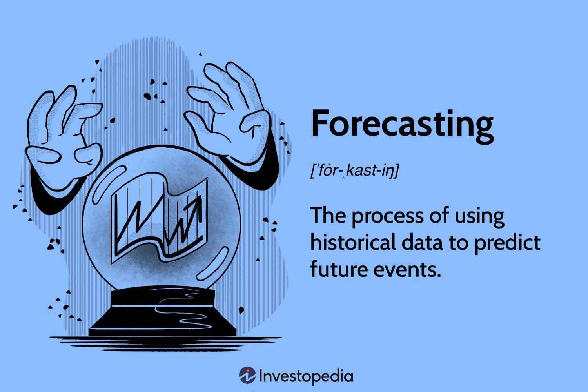

In the rapidly evolving world of finance, forecasting has emerged as a cornerstone for informed decision-making and strategic planning. This discipline harnesses the power of data-driven predictions to anticipate market trends and economic shifts, which are crucial for stakeholders ranging from individual investors to large financial institutions. Investment forecasting, business forecasting, and algorithmic trading are interconnected areas that strategically employ these predictions to optimize outcomes and mitigate risks.

Investment forecasting is a process that involves predicting potential movements and trends in financial markets. It relies heavily on advanced quantitative models, such as time series analysis, as well as qualitative assessments. Such forecasts enable investors to make more informed decisions about asset allocation and portfolio management, ultimately aiming to maximize returns and minimize risks.



In parallel, business forecasting focuses on predicting future trends in business operations. This involves estimating variables like sales, revenues, and expenses to inform decisions regarding resource allocation and strategic planning. Business forecasting aids organizations in managing risks and preparing for market fluctuations, thereby maintaining competitiveness and efficiency.

Algorithmic trading represents a significant leap in the application of forecasting in finance. It automates trading processes by using sophisticated algorithms that analyze market data and execute trades at high speeds. These systems leverage forecasting techniques, often integrating machine learning and artificial intelligence to identify patterns and predict price movements with precision, thereby enhancing trading strategies.

This article explores the methodologies, applications, and synergies across these three domains within financial forecasting. It examines the various tools and techniques employed, emphasizing the evolving role of algorithmic trading in shaping modern finance. In doing so, the discussion offers insights into how these forecasting methods collectively contribute to a more dynamic and responsive financial landscape.

## Table of Contents

## Understanding Investment Forecasting

Investment forecasting is a critical process in the financial industry, aiming to predict market trends and asset prices to guide strategic decision-making. The ability to forecast with accuracy depends heavily on both quantitative and qualitative methodologies. This section explores the techniques and data requirements essential for effective investment forecasting.

One of the primary quantitative techniques used in investment forecasting is time series analysis. Time series analysis involves examining historical data points to discern patterns or trends that may inform future behaviors. A widely used model in this category is the Autoregressive Integrated Moving Average (ARIMA), which combines autoregressive (AR) processes with moving averages (MA). ARIMA models work on the principle that past values and errors can jointly influence present values, allowing predictions about future data points.

To implement an ARIMA model in Python, the `statsmodels` library provides a robust framework. Here is a simplified example of applying ARIMA to a financial times series dataset:

```python
import pandas as pd
from statsmodels.tsa.arima.model import ARIMA

# Load the dataset
data = pd.read_csv('financial_data.csv')  # Example dataset
time_series = data['closing_price']

# Fit the ARIMA model
model = ARIMA(time_series, order=(1, 1, 1))  # ARIMA(p, d, q) parameters
model_fit = model.fit()

# Forecast the future values
forecast = model_fit.forecast(steps=5)
print(forecast)
```

Time series models, however, require stationary data, meaning the statistical properties such as mean and variance are constant over time. Data transformation methods like differencing or logarithmic scaling are often used to achieve stationarity.

In addition to ARIMA, other quantitative techniques include regression analysis and econometric models which [factor](/wiki/factor-investing) in economic indicators and variables beyond historical prices alone. These models often integrate complex mathematical constructs to account for factors such as [volatility](/wiki/volatility-trading-strategies) clustering, especially prevalent in financial datasets.

On the qualitative side, investment forecasting leverages market sentiment analysis through expert judgment and behavioral finance principles. Understanding how economic events, geopolitical developments, and even investor psychology impact markets provides a complementary perspective to the quantitative approach. Expertise and insights from seasoned analysts often add a layer of depth that purely data-driven methods might overlook.

The accuracy of investment forecasts heavily relies on the quality and granularity of data. Reliable data sources ensure that historical trends are reflected accurately, allowing models to produce viable predictions. Inconsistent or outdated information can skew the results, jeopardizing investment strategies.

In summary, investment forecasting synthesizes mathematical modeling and qualitative insights to predict financial markets. While quantitative tools like ARIMA provide data-driven forecasts, qualitative methods offer context, allowing for comprehensive decision-making. The synergy of reliable data and robust methodologies is fundamental to forecasting accuracy, forming the backbone of informed investment strategies.

## The Role of Business Forecasting

Business forecasting serves as a crucial mechanism for anticipating future trends and developments in business operations. By projecting future business performance based on historical data, patterns, and economic indicators, it allows organizations to allocate resources more efficiently, plan strategically, and manage potential risks effectively.

One of the primary objectives of business forecasting is resource allocation. Businesses can use forecasts to predict demand for products or services, thereby optimizing inventory levels, minimizing waste, and ensuring that production capabilities align with market needs. This proactive approach can improve financial performance and operational efficiency by ensuring that resources—such as capital, workforce, and raw materials—are deployed where they are needed most.

Strategic planning is another significant application of business forecasting. Companies can set long-term goals, formulate strategies to achieve them, and anticipate potential challenges that may arise. For instance, accurate sales forecasts enable a company to plan for future growth by investing in new markets, launching new products, or expanding production capacities. Strategic planning informed by solid forecasts helps organizations stay competitive and responsive to market changes.

Risk management is also a key aspect of business forecasting. By predicting fluctuations in market conditions, consumer behavior, or economic trends, businesses can identify potential risks and develop contingency plans. For example, economic downturns or shifts in consumer preferences can be anticipated, allowing businesses to mitigate potential negative impacts through alternative strategies or diversification efforts.

It is essential to differentiate between business forecasting and business planning, although they are interrelated. Business forecasting focuses on predicting future conditions based on current data, emerging trends, and statistical methods. It involves analyzing historical data and applying models to estimate future outcomes. On the other hand, business planning is the process of developing strategies and solutions based on these forecasts. It is more action-oriented and involves setting objectives, determining the necessary steps to achieve these objectives, and allocating resources accordingly.

In summary, business forecasting equips organizations with the insights needed to make informed decisions about resource allocation, strategic planning, and risk management. By effectively distinguishing between forecasting and planning, businesses can better prepare for future uncertainties and capitalize on upcoming opportunities.

## Algorithmic Trading and Forecasting

Algorithmic trading applies forecasting to streamline and enhance investment decisions. This approach employs advanced [artificial intelligence](/wiki/ai-artificial-intelligence) (AI) and [machine learning](/wiki/machine-learning) techniques that analyze vast amounts of market data to generate predictive models. These models help traders pinpoint market opportunities with heightened accuracy and speed. 

The core of [algorithmic trading](/wiki/algorithmic-trading) lies in its ability to automate and optimize trade executions using pre-defined rules and algorithms. This automation is particularly significant in high-frequency trading ([HFT](/wiki/high-frequency-trading-strategies)), where algorithms execute numerous trades in fractions of a second. Forecasting in this context involves predicting short-term market movements, often using historical price patterns and [volume](/wiki/volume-trading-strategy) data.

Machine learning is instrumental in refining forecasting models, as it enables the detection of intricate patterns and anomalies in the market data that traditional statistical techniques might overlook. Techniques like neural networks, [reinforcement learning](/wiki/reinforcement-learning), and support vector machines are commonly used. For example, neural networks can be trained on historical trading data to predict future asset price movements, thereby informing trading strategies.

Algorithmic trading systems also incorporate real-time data feeds and adjust their forecasts dynamically. This capability is essential in the fluid financial markets, where conditions can shift abruptly. By continuously ingesting and analyzing fresh data, these systems can recalibrate their models to maintain accuracy.

Python is one of the primary languages used for developing algorithmic trading strategies due to its robust libraries and frameworks, such as NumPy for numerical computations, pandas for data manipulation, and scikit-learn for machine learning applications. Here is an example of a simple moving average crossover strategy using Python:

```python
import pandas as pd
import numpy as np

# Load your historical market data
data = pd.DataFrame({'Price': [100, 101, 102, 103, 104, 105, 106, 107, 108, 109]})

# Calculate moving averages
short_window = 3
long_window = 5
data['Short_MA'] = data['Price'].rolling(window=short_window, min_periods=1).mean()
data['Long_MA'] = data['Price'].rolling(window=long_window, min_periods=1).mean()

# Generate signals
data['Signal'] = 0.0
data['Signal'][short_window:] = np.where(data['Short_MA'][short_window:] > data['Long_MA'][short_window:], 1.0, 0.0)

# Calculate position
data['Position'] = data['Signal'].diff()

print(data)
```

In this example, the strategy generates a buy signal when the short-term moving average crosses above the long-term moving average and a sell signal when the opposite occurs. This simple strategy may serve as the foundation for more complex models incorporating other predictive indicators.

The adaptability of algorithmic trading systems is pivotal to their effectiveness, as they must cope with market changes and uncertainties. Despite their capabilities, these systems are not infallible; unforeseen events and data quality issues can impact their performance. However, continuous improvements in AI technologies and data analytics promise greater precision and reliability in forecasting for algorithmic trading.

## Forecasting Techniques and Tools

Forecasting techniques are fundamental tools in finance and business, allowing analysts to predict future trends based on historical data and informed judgment. These techniques are generally classified into quantitative and qualitative methods, each offering distinct advantages and applications.

Quantitative forecasting relies on numerical data and statistical methods to produce forecasts. Statistical analysis is a central component of quantitative forecasting, using data sets to identify patterns and trends. Time series analysis is a common approach, employing methods such as moving averages and exponential smoothing to forecast future values. Econometric models expand on these ideas by introducing economic theories into the analysis, using regression techniques to explore relationships between different variables. An example of an econometric model is the Autoregressive Integrated Moving Average (ARIMA), which blends autoregressive and moving average components to create comprehensive forecasts:

$$
ARIMA(p, d, q)
$$
where $p$ denotes the number of lag observations, $d$ the degree of differencing, and $q$ the size of the moving average window.

Qualitative forecasting, on the other hand, is based on expert opinion and judgment, often used when precise data is lacking. Techniques like the Delphi method gather insights from multiple experts to converge on a consensus forecast. This technique is valuable in industries subject to rapid change or where historical data is sparse or unreliable.

To enhance accuracy, hybrid approaches combine quantitative and qualitative methods, leveraging the strengths of each. For example, a business might use statistical forecasts as a base, refining them with insights from industry experts. Machine learning models, such as ensemble methods, are also used to integrate diverse data sources and methodologies. Python's Scikit-learn library provides tools for developing such ensemble models, like Random Forests or Gradient Boosting, facilitating the combination of varied forecasting techniques for superior performance. 

In Python, a Random Forest can be implemented as follows:

```python
from sklearn.ensemble import RandomForestRegressor
from sklearn.model_selection import train_test_split

# Assuming 'data' is a pandas DataFrame with features and 'target' as the column to predict
X_train, X_test, y_train, y_test = train_test_split(data.drop('target', axis=1), data['target'], test_size=0.2)

model = RandomForestRegressor(n_estimators=100)
model.fit(X_train, y_train)

predictions = model.predict(X_test)
```

These hybrid approaches, by integrating multiple data sources and methodologies, provide more accurate and robust forecasts, essential for navigating the complexities of financial and business environments.

## Challenges and Limitations

Forecasting, despite its crucial role in decision-making, is inherently fraught with challenges and limitations. One of the most significant challenges is data quality. Reliable forecasts depend on high-quality data, and any inaccuracies or inconsistencies in data can lead to erroneous predictions. The presence of outliers, missing values, and improper data handling can further exacerbate these issues. Robust data preprocessing and validation methods are essential to mitigate these problems. Data cleaning and normalization processes are often employed to enhance the integrity of input data, ensuring that forecasts are based on accurate and reliable information.

Changing market conditions present another hurdle in forecasting. Financial markets are dynamic, influenced by numerous factors such as political events, economic indicators, and technological advancements. These changes can disrupt prevailing trends and render existing models less effective. One way to address this is through adaptive models that can adjust to new information. Models equipped with machine learning algorithms are particularly adept at self-adjusting to market changes, as they continuously learn from new data.

Unforeseeable events pose an additional layer of complexity. Events such as natural disasters, geopolitical conflicts, or unforeseen regulatory changes can have sudden and profound impacts on markets. These events are difficult to predict and incorporate into models, often leading to significant forecasting errors in such cases. Employing stress testing and scenario analysis can help prepare for these unexpected events by simulating various potential outcomes and assessing the robustness of forecasting models under different conditions.

Uncertainty is an inherent aspect of all forecasting endeavors. While models can provide probabilistic forecasts, they cannot eliminate uncertainty. It is crucial for forecasters to communicate the levels of uncertainty associated with their predictions, allowing decision-makers to understand and consider the potential risks. Techniques such as confidence intervals and prediction bands are used to quantify and convey this uncertainty.

Continuous model improvement is vital in overcoming these challenges. Models must be regularly updated and re-evaluated to maintain their relevance and accuracy. This involves the integration of new data, refinement of model parameters, and, occasionally, the adoption of more advanced methodologies. Backtesting is commonly used to assess the predictive accuracy of models by testing them against historical data, allowing for iterative refinements.

In conclusion, while forecasting is indispensable in financial decision-making, it is imperative to recognize its limitations. High-quality data, adaptive modeling approaches, acknowledgment of uncertainties, and ongoing model refinement are essential to enhance the reliability and usefulness of forecasts.

## The Future of Forecasting and Trading

The landscape of forecasting and trading is undergoing substantial transformation driven by advancements in artificial intelligence (AI), big data, and real-time analytics. These technologies are enhancing the precision and efficiency of financial predictions, offering new opportunities and challenges for investors and forecasters alike.

AI plays a pivotal role in modern forecasting by enabling the analysis of vast datasets with higher speed and accuracy than traditional methods. Machine learning algorithms, such as neural networks and decision trees, are particularly valuable in detecting patterns and making predictions based on complex market data. These algorithms can adapt to changing conditions, improving forecast accuracy over time. For instance, reinforcement learning algorithms can optimize strategies dynamically by interacting with market environments to maximize rewards.

Big data, characterized by high volume, velocity, and variety, provides a comprehensive view of market trends and consumer behaviors. By leveraging big data, forecasters can integrate numerous data sources, leading to more holistic models. Predictive analytics, powered by big data, facilitate the identification of correlations and causations that were previously unattainable due to data limitations. For example, sentiment analysis of social media feeds can uncover investor sentiment shifts, while transaction data can reveal emerging market trends.

Real-time analytics allow for immediate processing and interpretation of data as it is generated, which is particularly advantageous for high-frequency trading (HFT). HFT strategies require rapid decision-making based on the latest market information, which can be achieved through real-time analytics. This immediacy reduces latency, enabling traders to capitalize on short-lived market opportunities.

The shift towards integrated and responsive forecasting systems involves the convergence of AI, big data, and real-time analytics. These systems are designed to be adaptive, continuously updating predictions as new information becomes available. This integration helps mitigate risks associated with volatility and unforeseen global events by providing timely insights and enhancing decision-making agility.

The collaboration between traditional forecasting methods and algorithmic trading systems is set to increase as these technologies evolve. Traditional forecasting techniques, such as econometric models, benefit from computational advancements and can be augmented with machine learning algorithms to improve model robustness. Meanwhile, algorithmic trading systems can be fine-tuned to incorporate nuanced insights from qualitative forecasts and expert judgment, bridging the gap between quantitative data and qualitative analysis.

As these technologies continue to advance, the potential for innovation in forecasting and trading is vast. Analysts and traders are encouraged to continually learn and adapt to these changes, ensuring they remain at the forefront of this dynamic financial landscape. By embracing these technological enhancements, the financial industry is poised to navigate the complexities of global markets with increased precision and foresight.

## Conclusion

Investment forecasting, business forecasting, and algorithmic trading are integral components of modern financial strategies, each offering distinct yet interconnected insights crucial for decision-making processes. Investment forecasting involves the analysis of financial market trends to guide decisions in asset allocation and risk management. Techniques such as time series analysis, which models historical data to predict future values, are fundamental in this context. Accurate forecasts rely heavily on reliable data and historical trends, emphasizing the need for meticulously curated datasets.

Business forecasting, on the other hand, extends beyond financial markets to predict future business operations and trends. It plays a vital role in resource allocation, strategic planning, and risk management, providing a roadmap for businesses to navigate uncertain futures. Unlike investment forecasting which often focuses on financial metrics, business forecasting considers a wider array of variables, including market conditions and consumer behavior, offering a comprehensive view that aids businesses in crafting resilient strategies.

Algorithmic trading exemplifies the fusion of forecasting and automation, utilizing AI and machine learning for rapid, data-driven trading decisions. By analyzing vast datasets in real-time, these algorithms enable high-frequency trading, where trades are executed at exceptionally high speeds. The synergies between algorithmic trading and forecasting illustrate the potential of technology to enhance traditional methods, leading to more efficient and effective trading strategies.

The interconnectedness of these fields lies in their shared reliance on accurate forecasts to inform strategic decisions. The integration of investment and business forecasting with algorithmic trading systems underscores the transformative impact of advanced analytics on finance, driving efficiencies and creating new opportunities for innovation.

As forecasting technologies continue to evolve, embracing advancements such as AI, big data, and real-time analytics becomes crucial. The continuous learning and adaptation to emerging techniques and tools represent not only a pathway to enhanced predictive capabilities but also a necessity in maintaining competitive advantage in a rapidly changing financial landscape. Encouraging ongoing education and skill development in these areas will be essential for practitioners aiming to harness the full potential of forecasting methodologies in the future.

## References & Further Reading

[1]: Bergstra, J., Bardenet, R., Bengio, Y., & Kégl, B. (2011). ["Algorithms for Hyper-Parameter Optimization."](https://proceedings.neurips.cc/paper/2011/file/86e8f7ab32cfd12577bc2619bc635690-Paper.pdf) Advances in Neural Information Processing Systems 24.

[2]: ["Advances in Financial Machine Learning"](https://www.amazon.com/Advances-Financial-Machine-Learning-Marcos/dp/1119482089) by Marcos Lopez de Prado

[3]: ["Evidence-Based Technical Analysis: Applying the Scientific Method and Statistical Inference to Trading Signals"](https://www.amazon.com/Evidence-Based-Technical-Analysis-Scientific-Statistical/dp/0470008741) by David Aronson

[4]: ["Machine Learning for Algorithmic Trading"](https://github.com/stefan-jansen/machine-learning-for-trading) by Stefan Jansen

[5]: ["Quantitative Trading: How to Build Your Own Algorithmic Trading Business"](https://books.google.com/books/about/Quantitative_Trading.html?id=j70yEAAAQBAJ) by Ernest P. Chan