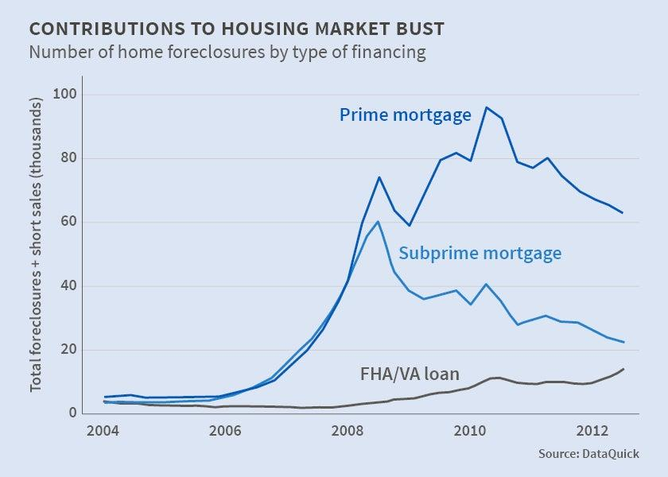

## Table of Contents

## What is a foreclosure?

A foreclosure happens when someone who borrowed money to buy a house can't pay it back. The bank or lender that gave the money can take the house away because the borrower didn't keep up with the payments. This is a legal process where the bank sells the house to try to get back the money they lent.

When a house goes into foreclosure, it can be a tough time for the person who was living there. They might have to move out and find a new place to live. The house is usually sold at an auction, where people can bid on it. If the house sells for less than what the borrower owed, the borrower might still owe the bank the difference. Foreclosures can happen if someone loses their job or has other money problems and can't pay their mortgage anymore.

## What causes a foreclosure crisis?

A foreclosure crisis happens when a lot of people can't pay their home loans at the same time. This can start because of big problems in the economy, like when lots of people lose their jobs or when house prices drop a lot. Banks might have given out loans too easily, thinking that house prices would always go up. But when prices go down, people owe more on their loans than their homes are worth, and they can't sell their homes to pay off the loans.

When many people can't pay their loans, it makes the problem even bigger. Banks start to have a lot of houses they need to sell, but there are too many houses and not enough buyers. This makes house prices drop even more, and more people find themselves underwater on their loans. The cycle keeps going, causing more foreclosures and making the crisis worse. Governments and banks might try to help by changing loan rules or offering help to people who are struggling, but fixing a foreclosure crisis can take a long time.

## How does a foreclosure affect homeowners?

When a house goes into foreclosure, it can be really hard on the people who own it. They might have to leave their home and find somewhere new to live, which can be stressful and upsetting. It's not just about moving; it can also hurt their credit score, making it harder to borrow money or get a new home in the future. This can affect their life for a long time, making it tough to get back on their feet.

On top of moving and credit problems, homeowners might still owe money to the bank even after their house is sold. If the house doesn't sell for enough to cover the loan, the leftover debt, called a deficiency, can still be the homeowner's responsibility. This can add more financial stress and make it even harder to start over. Foreclosure is a big deal that can change a lot of things in someone's life.

## What was the timeline of the 2007-2009 foreclosure crisis in the United States?

The 2007-2009 foreclosure crisis in the United States started to get bad in 2006 when house prices started to drop. Banks had given out a lot of loans that people couldn't really afford, thinking that house prices would keep going up. But when prices went down, a lot of people owed more on their loans than their houses were worth. This made it hard for them to sell their homes or keep up with their payments. By late 2007, the number of foreclosures started to go up a lot, and it was clear that there was a big problem.

In 2008, things got even worse. The financial markets crashed in September 2008, and big banks like Lehman Brothers went bankrupt. This made it even harder for people to get loans, and more people lost their jobs. As a result, more and more people couldn't pay their mortgages, and the number of foreclosures kept going up. The crisis hit its peak in 2009, with millions of homes in foreclosure. The government tried to help by starting programs like the Home Affordable Modification Program (HAMP) to help people keep their homes, but it took a long time for things to start getting better.

By 2010, the number of foreclosures started to go down a bit, but the effects of the crisis were felt for years. Many people lost their homes, and it took a long time for the housing market to recover. The crisis showed how important it is for banks to be careful about who they give loans to and for people to understand what they're getting into when they borrow money to buy a house.

## What were the main factors contributing to the 2007-2009 foreclosure crisis?

The 2007-2009 foreclosure crisis was caused by a few big problems. One big problem was that banks gave out a lot of loans to people who couldn't really afford them. These were called subprime loans. Banks thought that house prices would keep going up, so they didn't worry too much about whether people could pay back the loans. But when house prices started to drop in 2006, a lot of people found themselves owing more on their loans than their houses were worth. This made it hard for them to sell their homes or keep up with their payments.

Another big problem was that a lot of these loans were bundled together and sold as investments. When people started to default on their loans, these investments lost a lot of value. This caused a big problem in the financial markets, and in September 2008, big banks like Lehman Brothers went bankrupt. This made it even harder for people to get loans, and more people lost their jobs. As a result, more and more people couldn't pay their mortgages, and the number of foreclosures kept going up. The crisis showed how important it is for banks to be careful about who they give loans to and for people to understand what they're getting into when they borrow money to buy a house.

## How did government policies contribute to the foreclosure crisis?

Government policies played a part in the foreclosure crisis. One big way was through the Community Reinvestment Act and other policies that pushed banks to lend more to people who couldn't afford it. The government wanted to help more people own homes, so they encouraged banks to give loans to people with lower incomes. This was a good idea, but it went too far. Banks started giving out risky loans called subprime loans to people who couldn't really pay them back. The government didn't do enough to make sure these loans were safe, which helped cause the crisis.

Another way government policies contributed was by keeping interest rates low for a long time. The Federal Reserve, which is in charge of interest rates, kept them low to help the economy grow. Low interest rates made borrowing money cheaper, so more people took out loans to buy houses. This pushed house prices up a lot. But when the Federal Reserve started to raise interest rates in 2004, it made monthly payments go up for people with adjustable-rate mortgages. A lot of people couldn't afford the higher payments, and this led to more foreclosures. The government's actions with interest rates and encouraging risky loans helped make the foreclosure crisis worse.

## What were the economic impacts of the foreclosure crisis on the broader economy?

The foreclosure crisis had a big impact on the whole economy. When a lot of people couldn't pay their home loans, it caused a lot of houses to go into foreclosure. This made house prices drop a lot because there were too many houses for sale and not enough people buying them. When house prices went down, people felt less rich because their homes were worth less. This made them spend less money on other things, which hurt businesses. Banks also lost a lot of money because they couldn't get back what they lent out on the houses. This made them stop lending money to other people and businesses, which slowed down the economy even more.

The crisis also led to a lot of job losses. When banks and businesses lost money, they had to cut costs, and one way to do that was by laying off workers. Unemployment went up a lot, and people who lost their jobs had an even harder time paying their bills, including their mortgages. This made the foreclosure problem even worse. The government had to step in with big programs to help the economy, like bailing out banks and giving money to people who were out of work. It took a long time for the economy to start getting better, and the effects of the crisis were felt for years.

## How did the foreclosure crisis affect different demographic groups?

The foreclosure crisis hit different groups of people in different ways. People with lower incomes and minorities were hit the hardest. A lot of these people got subprime loans, which are riskier and have higher interest rates. When house prices dropped and they couldn't pay their loans, they lost their homes more often than others. This made it even harder for them to get back on their feet because they had less money to start over and their credit scores were hurt.

Older people also felt the crisis a lot. Many of them were living on fixed incomes, like pensions or social security, and when their house payments went up, they couldn't afford them. Losing their home was really hard because they might have lived there for a long time and didn't have the energy or money to move somewhere new. The crisis made life a lot harder for these groups and showed how important it is to have safe and fair loans for everyone.

## What measures were taken by the government to mitigate the effects of the foreclosure crisis?

The government took several steps to help with the foreclosure crisis. One big thing they did was start the Home Affordable Modification Program (HAMP). This program helped people change their loan terms so they could keep their homes. It lowered their monthly payments and made it easier for them to pay back their loans. The government also started the Home Affordable Refinance Program (HARP) to help people get new loans with better terms, even if they owed more on their house than it was worth.

Another thing the government did was pass the American Recovery and Reinvestment Act in 2009. This was a big plan to help the economy by giving money to people and businesses. It included help for people who were out of work and money for states to keep services running. The government also set up the Troubled Asset Relief Program (TARP) to help banks that were in trouble. By helping the banks, the government hoped to keep them lending money so the economy could start to get better. These steps took time to work, but they helped a lot of people keep their homes and helped the economy start to recover.

## How have lending practices changed since the foreclosure crisis?

Since the foreclosure crisis, banks have changed how they give out loans. They are more careful now about who they lend money to. They check people's credit scores and how much money they make more closely to make sure they can afford the loans. Banks also don't give out as many subprime loans, which are risky loans with high interest rates. They want to make sure that people can really pay back what they borrow, so they don't end up in foreclosure again.

The government also made new rules to make lending safer. One big rule is the Dodd-Frank Act, which was passed in 2010. This law makes banks keep more money in reserve and be more open about the loans they give out. It also set up a new group called the Consumer Financial Protection Bureau (CFPB) to watch over banks and make sure they are treating people fairly. These changes help make sure that the kind of problems that led to the foreclosure crisis don't happen again.

## What are the long-term effects of the foreclosure crisis on the housing market?

The foreclosure crisis changed the housing market a lot in the long run. After so many houses went into foreclosure, house prices dropped a lot. It took a long time for the prices to start going back up. Even now, some places still have lower house prices than before the crisis. Because so many people lost their homes, a lot of them are more careful about buying houses now. They want to make sure they can afford the payments and that the loan is safe. This has made the market more stable, but it also means fewer people are buying houses.

Another long-term effect is that banks are more careful about giving out loans. They check people's money and credit more closely to make sure they can pay back the loans. This has made it harder for some people to get loans, especially if they don't have a lot of money or good credit. But it's also made the housing market safer because fewer people are getting loans they can't afford. The government also made new rules to keep the market safe, like the Dodd-Frank Act. These rules help make sure that the big problems from the foreclosure crisis don't happen again.

## What lessons can be learned from the foreclosure crisis to prevent future occurrences?

The foreclosure crisis taught us a lot about how to keep the housing market safe. One big lesson is that banks need to be careful about who they give loans to. They should check people's money and credit to make sure they can pay back the loans. Banks shouldn't give out risky loans, like subprime loans, that people can't afford. The government also needs to watch over the banks to make sure they are doing things the right way. Rules like the Dodd-Frank Act help keep the market safe by making banks be more open about their loans and keep more money in reserve.

Another lesson is that people need to be careful when they borrow money to buy a house. They should understand what they're getting into and make sure they can afford the payments, even if interest rates go up. It's important for people to ask questions and not take out loans they can't pay back. The government can help by making sure people have good information about loans and by offering help if they start to have trouble paying. By learning from the foreclosure crisis, we can work together to keep the housing market strong and help people stay in their homes.

## References & Further Reading

[1]: Reinhart, C. M., & Rogoff, K. S. (2009). ["This Time is Different: Eight Centuries of Financial Folly."](https://www.nber.org/system/files/working_papers/w13882/w13882.pdf) Princeton University Press.

[2]: Gorton, G. B. (2012). ["Misunderstanding Financial Crises: Why We Don't See Them Coming."](https://archive.org/details/misunderstanding0000gort) Oxford University Press.

[3]: Financial Crisis Inquiry Commission. (2011). ["The Financial Crisis Inquiry Report."](https://www.govinfo.gov/app/details/GPO-FCIC/) U.S. Government Printing Office.

[4]: Fabozzi, F. J., & Kothari, V. (Eds.). (2008). ["The Subprime Credit Crisis of 2007."](https://onlinelibrary.wiley.com/doi/book/10.1002/9781118266892) Yale SOM Working Paper.

[5]: Lo, A. W. (2012). ["Reading About the Financial Crisis: A Twenty-One-Book Review."](https://dspace.mit.edu/bitstream/handle/1721.1/75360/Lo_Reading%20about.pdf) Journal of Economic Literature, 50(1), 151-178.

[6]: Philippon, T., & Reshef, A. (2012). ["Wages and Human Capital in the U.S. Finance Industry: 1909-2006."](https://www.jstor.org/stable/41812144) The Quarterly Journal of Economics, 127(4), 1551-1609.