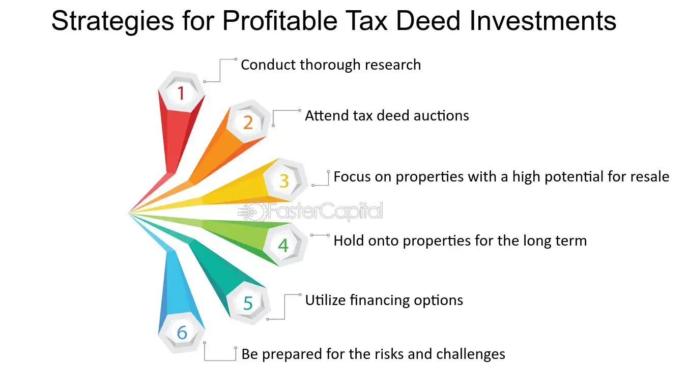

## Table of Contents

## What is foreclosure and how does it work?

Foreclosure is when a bank or lender takes back a house because the owner can't pay the mortgage. A mortgage is a big loan people get to buy a house. When someone can't make their monthly payments, the bank might start the foreclosure process. This means the bank wants to sell the house to get back the money they loaned.

The foreclosure process can be long and complicated. It usually starts with the bank sending the homeowner a notice that they are behind on payments. If the homeowner still can't pay, the bank might take the house to an auction where people can bid on it. If no one buys the house at the auction, the bank keeps it and tries to sell it later. During this time, the homeowner might have to move out of the house.

Sometimes, homeowners can stop foreclosure by paying what they owe or by working out a new payment plan with the bank. But if they can't do this, they will lose their home. Foreclosure can be very stressful and sad for homeowners, so it's important to talk to the bank as soon as possible if you're having trouble making payments.

## What are the different types of foreclosure properties?

There are mainly three types of foreclosure properties: pre-foreclosure, foreclosure auction, and bank-owned (REO) properties. Pre-foreclosure happens when the homeowner is behind on payments but before the bank takes the house. During this time, the homeowner might try to sell the house to avoid losing it. Foreclosure auction is when the bank puts the house up for sale at a public auction. Anyone can bid on the house, and the highest bidder wins. If no one buys the house at the auction, it becomes a bank-owned or REO (Real Estate Owned) property. The bank then tries to sell the house on their own.

Each type of foreclosure property has different risks and benefits. Pre-foreclosures can sometimes be bought at a lower price, but there's a risk that the homeowner might not want to sell or can't sell the house fast enough. Foreclosure auctions can offer good deals, but buyers need to pay in cash right away and might not get to inspect the house first. Bank-owned properties are usually the safest option because the bank has taken care of any legal issues, but they might be more expensive than pre-foreclosures or auction properties.

## What are the basic steps to start investing in foreclosures?

To start investing in foreclosures, first, you need to learn about the different types of foreclosure properties, like pre-foreclosures, foreclosure auctions, and bank-owned properties. Each type has its own rules and risks. You can find information about these properties by checking public records, visiting bank websites, or using real estate websites that list foreclosures. It's a good idea to attend some foreclosure auctions to see how they work, even if you're not ready to buy yet.

Next, you should set a budget and decide how much you can afford to spend. Remember, you might need cash for foreclosure auctions, so make sure you have enough money saved up. It's also important to get pre-approved for a loan if you plan to finance your investment. Once you have your budget and financing figured out, start looking for properties that fit your criteria. When you find a property you like, do a thorough inspection to check for any problems that might cost you money later. Finally, be ready to act fast because foreclosure properties can sell quickly.

Investing in foreclosures can be a good way to make money, but it can also be risky. Make sure you understand the local laws and regulations about foreclosures in the area where you want to invest. It might be helpful to talk to a real estate agent or lawyer who knows about foreclosures. They can give you advice and help you avoid common mistakes. Remember, the more you know and prepare, the better your chances of making a smart investment.

## How can I find foreclosure properties in my area?

To find foreclosure properties in your area, start by checking public records at your local county recorder's office or online. These records will show properties that are in pre-foreclosure or have been scheduled for a foreclosure auction. You can also visit bank websites, as many banks list their foreclosure properties for sale. Another helpful tool is real estate websites like Zillow, RealtyTrac, or Foreclosure.com, which have listings of foreclosure properties across the country. You can search these sites by entering your city or zip code to find properties near you.

Once you have a list of potential foreclosure properties, it's a good idea to drive by the properties to get a better look at them. This can help you decide if a property is worth pursuing further. If you're interested in attending foreclosure auctions, check local newspapers or the county's website for auction schedules and locations. Remember, foreclosure auctions often require you to pay in cash, so make sure you have enough money ready if you plan to bid. By using these methods, you can find foreclosure properties in your area and start the process of investing in them.

## What are the risks associated with investing in foreclosures?

Investing in foreclosures can be risky. One big risk is that you might not know the true condition of the property. Foreclosure homes can be in bad shape because the owners couldn't afford to keep them up. This means you might have to spend a lot of money on repairs, which can eat into your profits. Another risk is that you might not be able to sell the property quickly. If the market is slow or if the neighborhood isn't popular, you could be stuck with the house for a long time, costing you more money in taxes and maintenance.

Another risk is legal problems. Sometimes, there can be issues with the title of the property, like liens or back taxes that you have to pay. This can make buying a foreclosure more complicated and expensive. Also, if you're buying at an auction, you usually have to pay in cash and can't back out if you find problems later. This means you need to be very sure about what you're buying. Foreclosure investing can be a good way to make money, but you need to understand these risks and be ready to deal with them.

## How can I finance a foreclosure purchase?

Financing a foreclosure purchase can be a bit tricky, but there are several ways to do it. One common way is to use a traditional mortgage. You can get pre-approved for a mortgage from a bank or a mortgage lender before you start looking at foreclosure properties. This way, you know how much you can afford to spend. Another option is to use a hard money loan. Hard money loans are short-term loans from private investors or companies, and they often have higher interest rates but can be easier to get than a traditional mortgage. They are good for buying properties that need a lot of work because you can fix them up and sell them quickly.

Another way to finance a foreclosure is to use cash. If you have enough money saved up, paying cash can be the simplest and fastest way to buy a foreclosure, especially if you're buying at an auction where cash is usually required. You might also consider partnering with other investors to pool your money together. This can help you buy more expensive properties or spread out the risk. No matter which financing method you choose, it's important to do your homework and make sure you understand the terms and costs involved.

## What should I look for during a foreclosure property inspection?

When inspecting a foreclosure property, start by checking the outside of the house. Look at the roof for any missing or damaged shingles, as a bad roof can be expensive to fix. Check the gutters and downspouts to make sure they're not clogged or falling off. Walk around the house to see if there are any cracks in the foundation or walls, which could mean big problems. Also, look at the yard and any outbuildings to see if they need work. 

Next, go inside the house and check every room carefully. Look for signs of water damage, like stains on the ceilings or walls, which could mean a leaky roof or pipes. Check the floors for any soft spots or uneven areas that might need repairs. Turn on all the lights and faucets to make sure they work, and flush the toilets to see if they're in good shape. Open and close all the windows and doors to make sure they're not broken or stuck. It's also a good idea to check the electrical system and the heating and cooling systems to make sure they're working properly. By doing a thorough inspection, you can get a good idea of what repairs the property might need and how much they might cost.

## How do I determine the value of a foreclosure property?

To determine the value of a foreclosure property, start by looking at what similar homes in the same area have sold for recently. These are called "comps" or comparables. You can find this information on real estate websites or by talking to a local real estate agent. Look for homes that are similar in size, age, and condition to the foreclosure property you're interested in. This will give you a good idea of what the market value of the property might be.

Next, consider the condition of the foreclosure property itself. Foreclosures can sometimes be in bad shape because the owners couldn't afford to keep them up. You might need to spend money on repairs, so it's important to get a professional inspection to find out what needs to be fixed and how much it might cost. Subtract the cost of these repairs from the market value you found using the comps, and that will give you a better idea of what the property is really worth to you. Keep in mind that the final value will also depend on how much work you're willing to put into fixing up the property and how quickly you think you can sell it.

## What are some advanced strategies for flipping foreclosed properties?

One advanced strategy for flipping foreclosed properties is to focus on buying properties in up-and-coming neighborhoods. These areas might not be popular yet, but they're starting to grow and attract new businesses and residents. By buying a foreclosure in an up-and-coming area, you can fix it up and sell it for a higher price once the neighborhood becomes more popular. This strategy takes a good understanding of local real estate trends and a willingness to hold onto the property for a bit longer, but it can lead to bigger profits.

Another strategy is to use a technique called wholesaling. This means finding a foreclosure property at a low price, then quickly finding another investor who wants to buy it from you for a higher price. You make money on the difference between what you paid and what you sell it for. Wholesaling requires good networking skills and the ability to move fast, but it can be a way to make money without having to fix up the property yourself. It's important to do your research and understand the local market well to make this strategy work.

## How can I use foreclosure auctions to my advantage?

Foreclosure auctions can be a good way to buy properties at a lower price. At these auctions, banks sell houses that people couldn't pay for. The prices can be lower because the bank just wants to get back some of the money they loaned. To use auctions to your advantage, you need to do a lot of research first. Find out when and where the auctions happen in your area. Look at the properties that will be auctioned and try to learn about their condition and value. This way, you can decide how much you're willing to pay.

Another way to use foreclosure auctions to your advantage is to be ready to act fast. You need to have enough cash because most auctions require you to pay right away. If you win a bid, you might not have time to inspect the house closely, so it's risky. But if you've done your homework and know the market well, you can find good deals. Remember, the goal is to buy low and then fix up the house or sell it quickly to make a profit.

## What are the tax implications of investing in foreclosures?

When you invest in foreclosures, you need to think about taxes. If you buy a foreclosure and fix it up to sell it for a profit, that profit is called a capital gain. You have to pay taxes on capital gains. The tax rate depends on how long you owned the property before selling it. If you owned it for less than a year, it's a short-term capital gain and you pay your regular income tax rate. If you owned it for more than a year, it's a long-term capital gain and the tax rate is usually lower.

Another tax thing to think about is if you rent out the foreclosure property instead of selling it right away. The money you get from rent is called rental income, and you have to pay taxes on that too. But you can also take deductions for things like mortgage interest, property taxes, and repairs. These deductions can lower the amount of tax you have to pay. It's a good idea to talk to a tax professional to understand all the tax rules and make sure you're doing everything right.

## How can I build a portfolio of foreclosure investments for long-term wealth?

To build a portfolio of foreclosure investments for long-term wealth, start by learning about the foreclosure market in your area. Look for properties that are in pre-foreclosure, at auction, or bank-owned. Each type has its own risks and benefits, so understand them well. Once you know the market, set a budget and decide how much you can afford to invest. It's important to have enough cash on hand, especially for auctions where you need to pay right away. As you buy properties, focus on those in up-and-coming neighborhoods where values might go up over time. This way, you can fix up the houses and either sell them for a profit or rent them out for steady income.

After you start buying foreclosures, think about how to manage your portfolio for long-term wealth. You might want to keep some properties to rent out, which can give you regular income and help cover your costs. Other properties you might fix up and sell for a quick profit. It's a good idea to diversify your portfolio by having a mix of properties in different neighborhoods or types of properties. This can help spread out your risk. Also, keep an eye on the real estate market and be ready to buy more properties when good deals come up. By managing your portfolio carefully and staying informed, you can build wealth over time through foreclosure investments.

## What are effective strategies for acquisition and owning?

Successful acquisition strategies in foreclosure investing require navigating pre-auction scenarios and purchasing distressed loans. Acquiring properties before they reach auction can often be achieved through direct negotiations with owners in default. This approach demands an understanding of the homeowner’s situation and finding mutually beneficial solutions. Key tactics include offering to pay outstanding debts or negotiating short sales with lenders, whereby the sale is agreed upon for less than the owed mortgage amount, contingent on the lender's approval. 

Alternatively, investors may opt to purchase distressed loans directly from lenders. In such cases, the investor essentially steps into the lender's shoes and, if necessary, can initiate foreclosure proceedings themselves. This approach requires a thorough risk assessment and due diligence to ensure that the cost of acquiring the loan, along with any subsequent foreclosure costs, remains below the property's market value to guarantee profitability.

Owning strategies are contingent upon prevailing market conditions. In booming markets, investors often employ property flipping, buying distressed properties, rehabilitating them, and reselling at a profit. This strategy bases its success on the property's appreciation potential and the investor's ability to efficiently manage renovation costs and timelines. On the other hand, in stable or declining markets, holding the property as a rental can provide steady income and benefit from long-term appreciation. Investors should conduct rental yield analyses to project potential returns, using formulas such as:

$$
\text{Gross Rental Yield} = \left( \frac{\text{Annual Rental Income}}{\text{Purchase Price}} \right) \times 100
$$

Improvements play a significant role in enhancing property value and optimizing returns. Investors should focus on renovations that provide high return on investment (ROI), such as kitchen and bathroom remodels, upgrades in energy efficiency, and enhancing curb appeal. These improvements not only increase the sale or rental value but also attract higher-quality tenants if the rental strategy is chosen.

To maximize profitability, it is crucial for investors to maintain a balance between investment in improvements and the expected increase in property value. Over-improving for the area can lead to diminished returns; therefore, savvy investors conduct a comparative market analysis to ensure planned improvements align with neighborhood standards and buyer expectations. Thus, strategic planning and market analysis underpin effective acquisition and owning strategies in foreclosure investing.

## References & Further Reading

[1]: ["Real Estate Investing: Market Analysis, Valuation Techniques, and Risk Management"](https://link.springer.com/book/10.1007/978-3-319-06397-3) by David M. Geltner

[2]: "Foreclosure Investing for Dummies" by Ralph R. Roberts

[3]: ["Algorithmic Trading: Winning Strategies and Their Rationale"](https://books.google.com/books/about/Algorithmic_Trading.html?id=WAlFDwAAQBAJ) by Ernie Chan

[4]: ["Foreclosure Investing: A Guide to Making Huge Profits Investing in Foreclosures"](https://www.propertyradar.com/blog/the-complete-guide-to-foreclosure-investing) by Bob Zachmeier

[5]: ["Investing in Foreclosures: A Real Estate Investor's Guide"](https://www.propertyradar.com/blog/the-complete-guide-to-foreclosure-investing) by Steve Berges

[6]: ["Machine Learning and Data Sciences for Financial Markets: Strategies, Tools, and Case Studies"](https://www.cambridge.org/core/books/machine-learning-and-data-sciences-for-financial-markets/8BB31611662A96D0AB93A8A26E2D0D0A) by Alan K. Suret