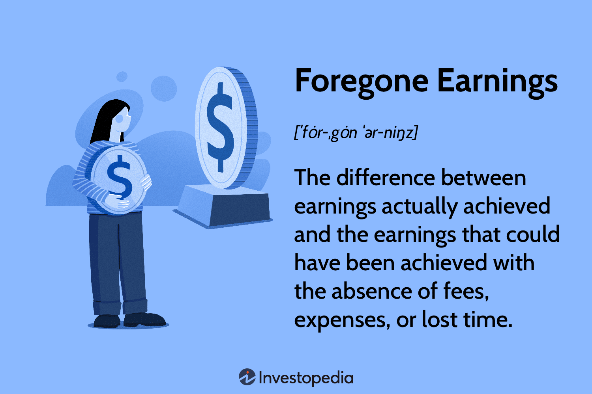

In the rapidly evolving world of financial markets, comprehending economic concepts such as foregone earnings, economic loss, and opportunity cost is paramount, particularly for individuals engaged in algorithmic trading. Algorithmic trading, commonly referred to as algo trading, utilizes algorithms and automated systems to execute trades at speeds and frequencies surpassing human capability. This trading approach, widely adopted across financial markets, involves unique economic considerations that traders must navigate. The automated nature of algorithmic trading not only accelerates trade execution but also introduces specific economic dynamics that influence trading outcomes.

This article aims to dissect these critical financial concepts and explore their role and implications within the context of algorithmic trading. Foregone earnings, for instance, refer to the potential income an investor misses by choosing one investment path over another. This concept necessitates a thorough understanding of how different trading strategies and associated costs, like commission fees and operational expenses, affect potential returns. Evaluating potential versus realized gains is essential for assessing the effectiveness of any trading strategy employed.



Opportunity cost, another essential economic consideration, refers to the benefits an investor could receive by taking an alternative action. In algorithmic trading, this often manifests in the decision-making process when choosing between various algorithms or trading strategies. Each decision carries inherent trade-offs, and understanding opportunity costs can significantly impact how traders allocate their resources to meet investment goals effectively.

Economic loss encompasses any decline or limitation in asset value resulting from trading decisions. In algorithmic trading, economic loss can be exacerbated or mitigated depending on how technology is utilized. Factors like transaction costs and market volatility contribute to potential economic losses, and an understanding of these dynamics is crucial for anticipating and managing risks associated with trading activities.

Ultimately, these economic concepts are integral to informing trading decisions, capital allocation, and overall financial performance in algorithmic trading. By understanding and applying these principles, traders and investors can gain a crucial edge, enabling them to make more informed and financially sound decisions. This knowledge is invaluable in optimizing trade strategies for enhanced performance and increased potential returns in the competitive landscape of automated trading.

## Table of Contents

## Understanding Foregone Earnings in Algorithmic Trading

Foregone earnings represent the potential income that an investor forgoes by selecting one investment option over another. Within the framework of algorithmic trading, which utilizes algorithms and automated systems for executing trades, foregone earnings could manifest when a chosen trading strategy or algorithm underperforms relative to other available options. This underperformance can stem from various factors, including commission fees, operational costs, or suboptimal algorithm efficiency.

To effectively evaluate foregone earnings, traders should undertake a comparative analysis between potential earnings—those that could have been achieved using alternative strategies—and the actual realized gains from the chosen algorithm. This evaluation process involves a few key steps:

1. **Benchmarking Against Potential Returns**: Traders can compare their strategy's performance against a benchmark, which represents a standard or ideal level of performance. This benchmark may involve market indices or a hierarchy of alternative algorithmic strategies that have been tested for similar market conditions.

2. **Cost Analysis**: Understanding total operational costs is crucial. These include direct expenses such as transaction and commission fees, as well as indirect costs like computational resources and data acquisition needed for algorithmic operations. An effective cost analysis enables traders to approximate net returns accurately.

3. **Execution Efficiency**: Optimizing trade execution is critical in minimizing foregone earnings. This involves ensuring that algorithms are optimized for speed and accuracy to capture favorable market conditions. Techniques like slippage analysis can help in understanding the price differences between the expected and executed asset prices, thereby identifying areas for improvement.

For a practical illustration, consider a Python simulation where two algorithms, `algo_A` and `algo_B`, are compared over a period using a hypothetical market model. The code snippet below evaluates their performance based on simulated returns and costs:

```python
import numpy as np

# Simulated returns and costs for demonstration purposes
returns_algo_A = np.random.normal(0.02, 0.05, 100)
returns_algo_B = np.random.normal(0.03, 0.05, 100)
costs_algo_A = 0.01
costs_algo_B = 0.015

# Net returns
net_returns_A = returns_algo_A - costs_algo_A
net_returns_B = returns_algo_B - costs_algo_B

# Potential earnings difference
foregone_earnings = np.mean(net_returns_B) - np.mean(net_returns_A)
print("Foregone Earnings: {:.2f}%".format(foregone_earnings * 100))
```
This snippet demonstrates a basic approach to quantifying foregone earnings by comparing the net returns of two algorithms after accounting for associated costs. Here, selecting the better-performing `algo_B` over `algo_A` would minimize foregone earnings.

Therefore, by comprehensively evaluating these aspects, traders can enhance the effectiveness of their trading strategies. They are better positioned to adjust their strategies in real-time, optimizing execution to reduce unnecessary foregone earnings, and ultimately improving their net returns.

## The Role of Opportunity Cost in Trading Strategies

Opportunity cost is a crucial element in trading strategies, representing the potential benefits an investor forfeits when choosing one option over another. In [algorithmic trading](/wiki/algorithmic-trading), opportunity cost frequently arises when selecting between different algorithms or strategies. This involves weighing the expected returns of each option against the potential income that could be realized by choosing another path.

### Scenario Analysis in Algorithmic Trading

Consider a scenario where a trader must decide between two algorithmic strategies. Strategy A has a higher projected return but also higher [volatility](/wiki/volatility-trading-strategies), while Strategy B offers more consistent returns with lower volatility. The opportunity cost, in this case, is determined by comparing the potential outcomes of both strategies. If Strategy B is chosen, the opportunity cost is the foregone potential high returns of Strategy A.

Alternatively, suppose a trader has the option of investing in a recently updated algorithm that utilizes advanced market data analysis. Opting for this updated algorithm may offer the benefit of improved accuracy in predicting market movements, but it could also entail higher costs for data procurement or additional processing power. Thus, the opportunity cost includes the tangible benefits of improved decision-making weighed against the additional operational costs.

### Quantifying Opportunity Costs

Opportunity costs can be quantified by evaluating the net present value (NPV) of different trading strategies. The NPV calculates the expected profitability by discounting future cash flows of various strategies. A trader might use the formula:

$$

\text{NPV} = \sum_{t=1}^{T} \frac{CF_t}{(1 + r)^t} 
$$

where $CF_t$ represents the cash flow at time $t$, $r$ is the discount rate, and $T$ is the total number of periods.

In algorithmic trading, utilizing simulations or [backtesting](/wiki/backtesting) historical data helps to estimate these cash flows, enabling traders to make informed decisions aligning with their risk tolerance and investment goals.

### Strategic Allocation of Resources

Opportunity cost awareness assists traders in effectively allocating resources, ensuring they are not only taking potential profits into account but also minimizing missed opportunities. Resources such as computational power, market data subscriptions, and capital are finite and should be directed towards strategies that maximally align with the investor's goals and risk preference.

For instance, an algorithm that requires significant processing resources might hinder other potential investment opportunities. Thus, traders must assess whether the potential gains justify the expense of these resources or if they are better allocated elsewhere.

### Conclusion on Opportunity Costs in Trading

Opportunity cost serves as a fundamental consideration in developing robust trading strategies. By recognizing and quantifying these costs, traders can enhance strategy selection and resource allocation, facilitating better trading outcomes and increased financial performance. As algorithmic trading evolves with technological advances, continuously evaluating opportunity costs becomes vital for maintaining competitive advantage in the dynamic financial markets.

## Economic Loss and Algorithmic Trading

Economic loss in algorithmic trading arises from decisions that affect the value of a trader’s assets. This loss can manifest due to the limitations or misapplication of trading technologies. The use of algorithms can both alleviate and exacerbate economic losses, depending on the deployment and execution strategy utilized by the trader. 

Algorithmic trading systems, when well-designed, can efficiently process large volumes of data and execute trades at speeds faster than human capability, potentially reducing economic losses that stem from the lag in decision-making. For example, algorithms can react to market changes almost instantaneously, which is particularly beneficial in volatile markets where rapid shifts in asset prices are common.

However, the reliance on these systems also introduces new avenues for potential losses. Transaction costs, which include broker fees and slippage, are critical considerations. Slippage occurs when there is a difference between the expected price of a trade and the actual price at which the trade is executed. High-frequency trading algorithms, in particular, incur substantial transaction costs due to the large number of trades executed. This can lead to significant accumulated costs over time, creating an economic loss if not managed effectively.

Market volatility is another [factor](/wiki/factor-investing) contributing to economic loss. Algorithms must be robust enough to handle sudden price swings without executing trades that result in unfavorable positions. A poorly calibrated algorithm might react negatively to market noise, making purchases or sales that diminish the asset’s value.

Moreover, the technology behind algorithmic trading systems can either mitigate losses through efficiency or exacerbate them due to technical failures. For example, system outages or bugs in the code can lead to missing trading opportunities or executing trades at incorrect prices, thus increasing economic loss. 

Traders can anticipate and manage these risks by incorporating risk management measures into their algorithms. For example, parameters can be set within the Python code of a trading algorithm to trigger stop-loss orders, which automatically sell an asset when its price falls to a certain level. Below is an example of how one might implement such a feature in Python:

```python
def stop_loss(price, limit):
    if price <= limit:
        execute_sell_order()

def execute_sell_order():
    print("Sell order executed")

# Example usage
current_price = 98
limit_price = 100
stop_loss(current_price, limit_price)
```

Another approach to manage economic loss is the continuous monitoring and adjustment of algorithmic strategies to align with current market conditions, ensuring the algorithms remain relevant and effective. This includes backtesting strategies against historical data to assess their performance under various market scenarios.

In summary, economic loss in algorithmic trading is influenced by transaction costs, market volatility, and the technical efficacy of the trading systems used. By understanding these dynamics and incorporating effective risk management strategies, traders can better position themselves to minimize potential losses and protect their asset value.

## Strategies to Mitigate Financial Setbacks in Algo Trading

Successful algorithmic trading involves deploying strategies that effectively minimize financial setbacks such as foregone earnings and economic losses. Risk management, algorithm optimization, and adaptive trading strategies play critical roles in achieving this.

Risk management strategies are essential for controlling potential losses in algorithmic trading. These strategies include position sizing, diversification, stop-loss orders, and volatility analysis. Position sizing determines the amount of capital allocated to each trade relative to total capital. By diversifying across multiple assets or strategies, traders can reduce the impact of any single adverse market event. Stop-loss orders automatically close a position at a predetermined loss threshold, thus limiting exposure. Moreover, analyzing market volatility helps in adjusting the level of risk exposure according to current market conditions.

Optimizing algorithm efficiency is another key tactic to minimize financial setbacks. Efficient algorithms execute trades rapidly, reducing the risk of adverse price movements between the decision-making and execution phases. Algorithms can be fine-tuned by reducing latency, ensuring accurate data feeds, and minimizing transaction costs. Reducing transaction costs involves choosing the right brokers, opting for the best order types, and executing trades at optimal times. Algorithmic traders may utilize cost-reducing strategies such as batch processing of orders or exploiting favorable market conditions like higher [liquidity](/wiki/liquidity-risk-premium) periods.

Reducing opportunity costs involves continuously assessing and choosing the best trading strategies. This requires comprehensive backtesting and forward testing of algorithms with historical and live market data to evaluate their performance under various scenarios. A robust backtesting framework helps identify the most profitable strategies while minimizing the risk of overfitting. Traders should consider the Sharpe ratio, which measures risk-adjusted return, to compare different strategies and choose the one that offers the best risk-return balance.

Finally, continuous assessment and adaptation are crucial in responding to evolving market conditions. Markets are dynamic, influenced by macroeconomic factors, geopolitical events, and technological advancements. Algorithmic traders must continually monitor their strategies' performance and adjust parameters to maintain competitiveness. Implementing a feedback loop where trading outcomes are analyzed to inform future decisions ensures resilience in strategy effectiveness. Techniques such as [machine learning](/wiki/machine-learning) can be employed to refine algorithms based on patterns identified in market data.

In summary, reducing financial setbacks in algorithmic trading involves a multifaceted approach encompassing risk management, algorithm optimization, and adaptive strategies. These elements are critical in maintaining competitive trading performance and achieving long-term financial success.

## Conclusion

Algorithmic trading stands as a formidable force within financial markets, offering both vast potential and inherent challenges. Mastering concepts such as foregone earnings, economic loss, and opportunity cost is critical for enhancing trading performance and achieving financial success.

Foregone earnings represent the unrealized gains from alternative investments that were not pursued, emphasizing the importance of selecting the right trading strategies to.optimize returns. Economic loss, on the other hand, involves understanding the depreciation in asset value from trading decisions, necessitating a close examination of transaction costs and market conditions to minimize negative impacts.

Opportunity cost focuses on the benefits missed by choosing one trading avenue over another. In algorithmic trading, where multiple strategies and algorithms compete for execution, recognizing these costs ensures resources are allocated effectively to maximize returns. The integration of these economic principles guides traders and investors in making informed, strategic decisions.

In this dynamic intersection of technology and finance, continuous learning and adaptation is vital. The rapidly changing nature of markets and technological advancements demands an ever-evolving approach to maintain a competitive edge. By staying informed and agile, traders can harness the full potential of algorithmic trading, positioning themselves for success in an increasingly complex financial landscape.

## References & Further Reading

[1]: Bergstra, J., Bardenet, R., Bengio, Y., & Kégl, B. (2011). ["Algorithms for Hyper-Parameter Optimization."](https://papers.nips.cc/paper/4443-algorithms-for-hyper-parameter-optimization) Advances in Neural Information Processing Systems 24.

[2]: ["Advances in Financial Machine Learning"](https://www.amazon.com/Advances-Financial-Machine-Learning-Marcos/dp/1119482089) by Marcos Lopez de Prado

[3]: ["Evidence-Based Technical Analysis: Applying the Scientific Method and Statistical Inference to Trading Signals"](https://www.amazon.com/Evidence-Based-Technical-Analysis-Scientific-Statistical/dp/0470008741) by David Aronson

[4]: ["Machine Learning for Algorithmic Trading"](https://github.com/stefan-jansen/machine-learning-for-trading) by Stefan Jansen

[5]: ["Quantitative Trading: How to Build Your Own Algorithmic Trading Business"](https://www.amazon.com/Quantitative-Trading-Build-Algorithmic-Business/dp/1119800064) by Ernest P. Chan