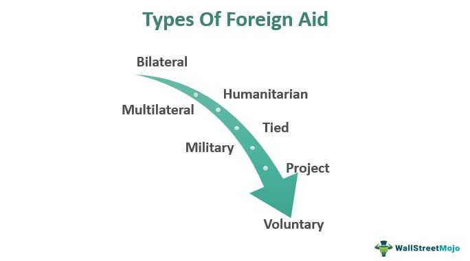

In a globalized world, foreign aid plays a pivotal role in fostering international relations and economic development. This intricate system of financial assistance often involves transferring resources from wealthier nations to those less developed, with aims ranging from alleviating poverty to fostering long-term economic stability. The dynamics between donor and recipient countries shape international politics and influence economic policies, highlighting the interconnectedness of global economies.

Foreign aid comes in various forms—monetary support, goods, services, and technical assistance—and serves multiple purposes such as humanitarian relief, economic growth, and security enhancement. As different countries navigate the complexities of providing or receiving aid, these actions carry significant political and economic implications. The analysis of foreign aid statistics, alongside its ethical considerations, provides insight into the motivations behind aid distribution and its impact on global relations.



Beyond foreign aid, advancements in technology have introduced new paradigms in financial markets, one of the most significant being algorithmic trading. This automated trading method utilizes pre-programmed instructions and complex algorithms to execute trades at high speeds, revolutionizing financial markets. It demonstrates how technological innovation not only influences economic activities but also the decision-making processes within these systems.

Data analytics further enhances both international aid distribution and algorithmic trading by enabling more informed and strategic decisions. By leveraging large datasets, stakeholders can assess the effectiveness of aid programs and optimize resource allocation, while traders can identify market trends and improve trading strategies.

This article will explore the multifaceted nature of foreign aid, discuss the influence of algorithmic trading on financial markets, and examine the transformative role of data analytics across these sectors.

## Table of Contents

## Understanding Foreign Aid

Foreign aid is a vital instrument in international relations, enabling the transfer of resources from one nation to another, typically from developed to developing countries. This form of assistance aims to enhance economic growth, support humanitarian efforts, and bolster security efforts. 

Foreign aid manifests in various forms, including financial assistance, goods, services, and technical expertise. Financial aid often involves grants or loans, providing the recipient country with capital that can be used to fund development projects or stabilize economies. Goods and services typically include the supply of food, medical supplies, educational materials, or infrastructure support, essential during emergencies like natural disasters or conflicts. Technical assistance refers to the transfer of expertise and knowledge, often through training programs or the dispatch of experts to support areas such as governance, healthcare, or education.

The objectives of foreign aid are diverse but fundamentally revolve around three key areas: humanitarian assistance, economic development, and security support. Humanitarian assistance addresses immediate needs during crises, such as famine, earthquakes, or pandemics, providing essential relief to affected populations. Economic development aid aims to build and enhance the infrastructure and institutions necessary for sustainable growth, fostering economic stability and improving living standards. Security support focuses on strengthening the recipient country's ability to maintain peace and security, often through military training or aid intended to stabilize regions plagued by conflict or terrorism.

Foreign aid can be implemented bilaterally or multilaterally. Bilateral aid involves direct assistance from one country to another, often reflecting strategic interests or historical ties between the donor and recipient nations. Multilateral aid, in contrast, involves contributions from multiple countries channeled through international organizations such as the United Nations, the World Bank, or regional bodies like the European Union. This form of aid is generally regarded as more impartial and is often utilized for large-scale initiatives aimed at addressing global challenges.

Understanding the different dimensions of foreign aid is crucial for comprehending how international relationships are forged and maintained. The strategic distribution and management of these resources are essential in ensuring that foreign aid effectively meets its goals and contributes positively to global stability and development.

## Forms and Statistics of Foreign Aid

Foreign aid involves several forms of assistance aimed at facilitating the development and stability of recipient countries. These forms include economic, military, humanitarian, and educational support. Economic aid typically consists of financial contributions, grants, and loans that enable countries to invest in infrastructure, healthcare, and technology. Military aid involves training, equipment, and funding provided to enhance the security capabilities of a recipient nation. Humanitarian aid addresses immediate needs during emergencies, such as natural disasters or conflicts, providing essential resources like food, water, and shelter. Educational support involves scholarships, educational materials, and the establishment of institutions to foster long-term development through education.

In 2023, the Organisation for Economic Co-operation and Development (OECD) reported a total of $223.7 billion in international aid contributions, emphasizing the growing commitment of developed nations to support global development goals. The United States emerged as the largest donor, reflecting its extensive international engagement in aid and development. Financial assistance remains the most common form of aid provided; however, there is a notable shift towards allocating resources for healthcare, education, and infrastructure development. These areas are seen as critical for sustainable development and for addressing the root causes of poverty and instability.

Statistical analyses of aid distributions in 2023 highlight significant financial commitments to countries such as Ukraine, Ethiopia, and Egypt. These nations have been focal points for aid due to a combination of geopolitical interests, humanitarian needs, and development potential. Ukraine, for example, has received substantial aid in response to the ongoing conflict in the region. In contrast, aid to countries like Ethiopia and Egypt often targets development projects and poverty alleviation, addressing healthcare, education, and infrastructural challenges.

The continuous monitoring and evaluation of aid effectiveness are essential for optimizing the use of resources. This involves employing data analytics and other technological tools to ensure that aid reaches those most in need and achieves the intended development outcomes. Increasing transparency and efficiency in aid distribution remain priorities for donor and recipient countries alike, aligning with global development frameworks such as the United Nations Sustainable Development Goals (SDGs).

## The Role of Technology in Foreign Aid

Technological advancements have fundamentally reshaped the landscape of foreign aid, impacting distribution, monitoring, and evaluation processes. Through data analytics, stakeholders can assess aid programs' effectiveness, ensuring better outcomes for recipient countries. These analytics facilitate the collection, processing, and interpretation of vast datasets that provide insights into the best practices for aid allocation. For instance, analyzing patterns in aid distribution and outcomes can pinpoint what works and what doesn't, optimizing strategic planning.

Algorithmic models further enhance efficiency by predicting needs and optimizing resource allocation. These models can process extensive historical data to forecast future assistance requirements, ensuring resources reach those who need them most. By leveraging [machine learning](/wiki/machine-learning) algorithms, practitioners can identify trends and insights that might not be immediately obvious, thus fine-tuning the allocation process. For instance, using regression models and decision trees, one can effectively predict areas of most significant need and tailor resource distribution accordingly.

Emerging technologies, such as satellite imagery and blockchain, play a crucial role in disaster response and mitigation strategies. Satellite imagery, integrated with Geographic Information Systems (GIS), allows for real-time monitoring of affected areas, aiding in rapid response and resource deployment. Blockchain technology, with its secure and transparent nature, provides a reliable framework for tracking aid from donors to recipients, reducing opportunities for corruption and ensuring that aid reaches the intended beneficiaries.

Overall, the integration of advanced technologies in foreign aid creates opportunities for more targeted and effective assistance, enhances accountability, and provides new mechanisms for rapid and efficient response to global challenges. As these technologies continue to evolve, they hold the potential to revolutionize how international aid is conceptualized and implemented.

## Algorithmic Trading: An Overview

Algorithmic trading is the use of automated, pre-programmed trading instructions to execute orders in financial markets. These algorithms are designed to analyze and interpret large volumes of data at speeds and accuracies that are beyond the reach of human traders. Institutional investors such as hedge funds, investment banks, and pension funds predominantly utilize [algorithmic trading](/wiki/algorithmic-trading) to achieve a competitive edge in the financial markets.

The strength of algorithmic trading lies in several key benefits. Firstly, it significantly enhances the speed of trading executions. By leveraging complex and sophisticated algorithms, orders can be executed in milliseconds, minimizing the likelihood of price changes during the execution process. This capability is crucial in markets where prices can fluctuate rapidly.

Secondly, algorithmic trading improves the accuracy of order execution. Algorithms are designed to make decisions based on a set of predefined rules and conditions, reducing the potential for human error. They can process vast amounts of financial data, including historical prices, trading volumes, and patterns, which helps in making informed and precise trading decisions.

Another advantage is the reduction in transaction costs. Algorithmic trading optimizes the timing of trades and minimizes market impact, cutting down the cost of trading on markets. By efficiently splitting large orders into smaller parts and timing their release, algorithms help mitigate the risk of moving the market, thereby reducing the overall cost of the transaction.

A subset of algorithmic trading is high-frequency trading ([HFT](/wiki/high-frequency-trading-strategies)), which involves the execution of millions of small orders in fractions of a second. HFT is characterized by high turnover rates and the use of sophisticated algorithms to analyze multiple markets and execute orders based on market conditions. The primary aim is to capture small price discrepancies that exist for short periods, often mere seconds.

Here's a simple Python script that illustrates how an algorithm might decide when to buy a stock based on historical moving averages:

```python
import pandas as pd

# Assume df is a pandas dataframe with a datetime index and a 'Close' column for the stock's closing prices

def moving_average_strategy(df, short_window=40, long_window=100):
    signals = pd.DataFrame(index=df.index)
    signals['signal'] = 0.0

    # Create short simple moving average
    signals['short_mavg'] = df['Close'].rolling(window=short_window, min_periods=1, center=False).mean()

    # Create long simple moving average
    signals['long_mavg'] = df['Close'].rolling(window=long_window, min_periods=1, center=False).mean()

    # Create signals
    signals['signal'][short_window:] = \
        np.where(signals['short_mavg'][short_window:] > signals['long_mavg'][short_window:], 1.0, 0.0)

    # Generate trading orders
    signals['positions'] = signals['signal'].diff()

    return signals

# Example usage with a given stock price dataframe
signals = moving_average_strategy(stock_price_df)
print(signals)
```

In this script, a simple moving average strategy is implemented where a buy signal is generated when the short-term moving average surpasses the long-term moving average, indicating a potential upward trend. This is a basic example of how algorithmic trading strategies can be programmed to automate trading decisions. 

Algorithmic trading represents a significant evolution in financial markets, providing increased efficiency and precision in executing trades, and continues to grow with advancements in technology and data analytics.

## Impact of Algorithmic Trading on Markets

Algorithmic trading plays a crucial role in enhancing market [liquidity](/wiki/liquidity-risk-premium) and efficiency, contributing to more streamlined financial operations. It facilitates faster execution of trades, often resulting in tighter bid-ask spreads, which enhances liquidity by making it easier for buyers and sellers to connect. The automation brought by algorithmic trading reduces transaction costs and minimizes manual errors, thereby improving overall market efficiency.

However, this technological advancement is not without its challenges. Market [volatility](/wiki/volatility-trading-strategies) and systemic risks have been significant concerns, particularly highlighted by events like the Flash Crash of 2010. During this event, the U.S. stock market experienced a rapid and severe decline in prices, only to recover within minutes. Investigations revealed that algorithmic trading and high-frequency trading (HFT) were major contributors to this volatility, as they rapidly magnified the impact of sell orders, leading to a cascading effect.

In response to these risks, regulatory bodies around the world have been proactive in implementing measures to monitor and mitigate potential threats posed by algorithmic trading. Regulatory frameworks, such as the European Union's Markets in Financial Instruments Directive II (MiFID II), aim to increase transparency and orderliness in financial markets. These regulations require trading firms to implement robust risk management systems and provide detailed reporting on trading activities.

Despite the regulatory challenges, algorithmic trading continues to evolve, propelled by advancements in [artificial intelligence](/wiki/ai-artificial-intelligence) (AI) and machine learning. These technologies enable traders to develop more sophisticated algorithms that can analyze large volumes of data and make instantaneous decisions based on market conditions. Machine learning models, in particular, can identify and adapt to emerging trading patterns, thereby optimizing trading strategies.

The continuous development in AI and machine learning promises to further enhance the capabilities of algorithmic trading, potentially reducing some of the risks associated with earlier models. As the technology becomes more advanced, it is crucial for both market participants and regulators to engage in ongoing dialogue to ensure that algorithmic trading contributes positively to the stability and efficiency of financial markets.

## The Intersection of Foreign Aid and Financial Technology

Financial technologies (fintech) are revolutionizing the field of foreign aid by enhancing transparency and monitoring capabilities. These advancements facilitate secure, efficient, and equitable distribution of aid resources.

Blockchain technology is a principal innovation driving this transformation. Its decentralized ledger system ensures a secure and immutable record of transactions, which significantly minimizes the risk of corruption and fraud. By providing an accessible and verifiable audit trail, blockchain enhances the trustworthiness of aid distributions. For instance, blockchain can be used to track the disbursement of funds from donors to beneficiaries, ensuring that the resources reach the intended recipients without diversion. Additionally, smart contracts on blockchain can automate the release of funds based on predefined conditions, further increasing efficiency and reducing administrative overhead.

Predictive analytics plays a crucial role in optimizing the allocation of resources in foreign aid. By analyzing historical data and current trends, these advanced analytics forecast future needs and potential challenges in aid distribution. This predictive capability allows organizations to anticipate and prepare for emergencies, ensuring a more timely and effective response. For example, machine learning models can predict areas of potential crisis due to environmental changes or economic instability, enabling preemptive action.

The collaboration between fintech firms and humanitarian organizations is increasingly vital in addressing complex global challenges. Such partnerships combine technological expertise with humanitarian insights to develop innovative solutions tailored to specific needs. For example, mobile payment platforms have been leveraged to facilitate direct financial assistance to individuals in remote or underserved areas, bypassing traditional banking systems that may be inaccessible.

These technological advancements in foreign aid not only improve operational efficiency but also promote greater accountability and effectiveness in the global effort to support developing countries. As these tools continue to evolve, they hold the potential to further enhance the impact of foreign aid initiatives across the world.

## Ethical Considerations and Challenges

Foreign aid and algorithmic trading present distinct ethical challenges that have significant implications for both global economic development and financial markets.

In the domain of foreign aid, the risk of dependency and a resulting loss of agency for aid-receiving countries are critical ethical concerns. Studies suggest that prolonged aid can create reliance, inhibiting the local economy's ability to develop independently and sustainably. This dependency can also skew power dynamics, potentially allowing donor countries to wield excessive influence over recipient nations’ policies and governance. The solution lies in structuring aid programs that promote capacity building and self-sufficiency, ensuring that support is a catalyst for independent, long-term growth rather than a perpetual crutch.

Algorithmic trading, on the other hand, raises issues related to fairness and accountability due to algorithmic biases and a lack of transparency. Algorithms, if not correctly designed, can reinforce existing biases or introduce new ones into trading practices, leading to unfair advantages or even manipulation of market conditions. The complexity of algorithmic systems often means that traders and regulatory bodies alike may find it challenging to understand and monitor their decision-making processes. Ensuring transparency requires robust testing and validation protocols, along with stringent regulation to prevent potential malpractices. 

To maintain a balance between innovation and ethics, responsible practices must be at the forefront of both foreign aid initiatives and algorithmic trading strategies. In foreign aid, this involves integrating ethical considerations into program design, implementing strict monitoring and evaluation frameworks, and encouraging genuine partnerships between donors and recipients. For algorithmic trading, it means developing transparent models, implementing effective oversight mechanisms, and fostering accountability across all market participants.

Both sectors are integral to the modern economic ecosystem; however, their ethical complexities demand thoughtful, ongoing scrutiny to foster sustainable and equitable growth. Responsible practices and proactive regulation are vital to harness their full potential while mitigating any adverse effects.

## Conclusion

Foreign aid and algorithmic trading are integral to shaping the modern economic landscape, influencing international relations, development, and market dynamics. Each, while distinct in function and scope, holds significant potential for fostering positive global change.

Foreign aid, with its capacity to provide humanitarian assistance, facilitate economic development, and enhance security, continues to be pivotal in alleviating poverty and promoting sustainable growth in recipient nations. While there are ethical challenges and risks associated with aid dependency and misallocation, technological innovations, such as blockchain and data analytics, promise to improve transparency and efficiency. By embracing these advancements, donor countries and international organizations can optimize aid distribution and impact, ensuring aid reaches those who need it most.

Similarly, algorithmic trading has transformed global financial markets, enabling increased speed, accuracy, and efficiency in executing trades. Despite concerns about market volatility and systemic risk, algorithmic trading enhances market liquidity and accessibility for investors. The ongoing evolution of trading strategies, powered by advancements in artificial intelligence and machine learning, offers the promise of more robust and resilient financial systems.

Both foreign aid and algorithmic trading benefit significantly from continuous innovation and technology integration. Collaborative policy measures between governments, international organizations, financial institutions, and technology firms are crucial to leverage these benefits effectively. By fostering an environment that promotes ethical considerations and transparency, stakeholders can mitigate potential risks while maximizing positive outcomes.

Furthermore, continuous dialogue and analysis remain essential to understanding and navigating the complexities inherent in these fields. As global challenges become more interconnected, a nuanced approach that considers the multifaceted implications of foreign aid and algorithmic trading will be vital. This commitment to ongoing evaluation and adaptability ensures these mechanisms can fulfill their potential as engines of global progress and stability.

## References & Further Reading

[1]: Radelet, S. (2006). ["A Primer on Foreign Aid."](https://www.cgdev.org/publication/primer-foreign-aid-working-paper-92) Center for Global Development.

[2]: Easterly, W. (2002). ["The Elusive Quest for Growth: Economists’ Adventures and Misadventures in the Tropics."](https://www.jstor.org/stable/1061505) MIT Press.

[3]: Sachs, J. D. (2005). ["The End of Poverty: Economic Possibilities for Our Time."](https://globaljournals.org/GJMBR_Volume14/8-Jeffrey-Sachs.pdf) Penguin Books.

[4]: Willmott, P., Howison, S., & Dewynne, J. (1995). ["The Mathematics of Financial Derivatives: A Student Introduction."](https://www.cambridge.org/core/books/mathematics-of-financial-derivatives/7121345D07C5BCE4FBEC91A8A7E6F267) Cambridge University Press.

[5]: [Organisation for Economic Co-operation and Development (OECD).](https://www.oecd.org/) - For statistics and reports on international aid contributions and trends.