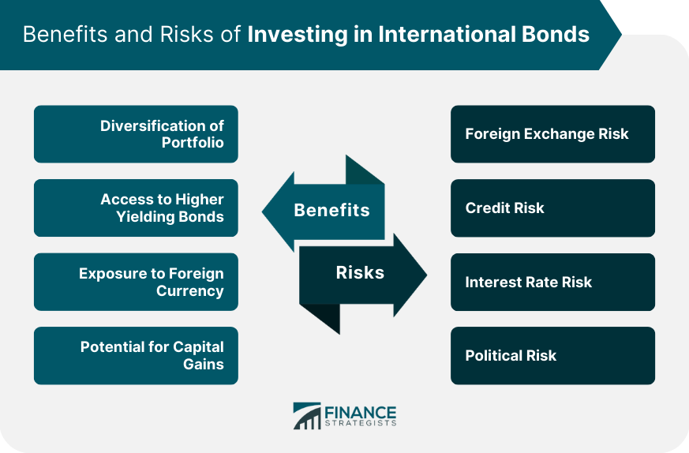

## Table of Contents

## What are foreign bonds?

Foreign bonds are bonds that are issued in a country by a foreign entity, like a company or government from another country. They are denominated in the currency of the country where they are issued. For example, if a Japanese company issues bonds in the United States, those bonds would be denominated in US dollars. Foreign bonds help companies and governments raise money from investors in different countries.

These bonds are often called by specific names based on where they are issued. For example, bonds issued in the US by a foreign entity are called Yankee bonds, while those issued in Japan by a foreign entity are called Samurai bonds. Investors might buy foreign bonds to diversify their investments or to take advantage of different interest rates in other countries. However, investing in foreign bonds can also come with risks, like changes in currency values or political instability in the issuing country.

## How do foreign bonds differ from domestic bonds?

Foreign bonds and domestic bonds are different in a few ways. A foreign bond is a bond that a company or government from one country sells in another country. It uses the money of the country where it is sold. For example, if a German company sells bonds in the United States, those bonds will be in US dollars. On the other hand, a domestic bond is a bond that is sold in the same country where the company or government that is selling it is from. So, if a US company sells bonds in the US, those are domestic bonds and they are in US dollars.

The main difference is where the bond is sold and what currency it uses. Foreign bonds help companies and governments get money from people in other countries. This can be good because it lets them reach more investors. But it can also be risky because the value of the money can change, and there might be problems in the country where the bond is sold. Domestic bonds are usually seen as less risky because they are sold in the same country and use the same money. But they might not reach as many investors as foreign bonds.

## What are the potential benefits of investing in foreign bonds?

Investing in foreign bonds can help you spread out your investments. When you put money into bonds from different countries, you are not relying on just one country's economy. If something goes bad in one place, your investments in other countries might still do well. This can make your overall investment safer. Also, sometimes foreign bonds offer higher interest rates than what you can find at home. If you find a bond that pays more, you could earn more money over time.

Another benefit is that you can take advantage of different economic cycles around the world. Sometimes one country's economy is doing better than another's. By investing in foreign bonds, you can put your money where the economy is growing faster. This way, you might see better returns on your investment. Plus, investing in foreign bonds can help you learn more about how the global economy works, which can be useful if you want to make smarter investment choices in the future.

## What are the main types of risks associated with foreign bonds?

One big risk with foreign bonds is currency risk. This means the value of the money you get back from the bond can change because of changes in exchange rates. If the currency of the country where you bought the bond goes down compared to your home currency, you might get less money when you convert it back. Another risk is political risk. This happens when the country where the bond is from has political problems or changes in government that can affect the bond's value or the ability of the issuer to pay back the bond.

There's also [interest rate](/wiki/interest-rate-trading-strategies) risk. If interest rates go up in the country where you bought the bond, the value of your bond might go down. This is because new bonds will be issued with higher interest rates, making your bond less attractive to other investors. Lastly, there's credit risk. This is the chance that the company or government that issued the bond might not be able to pay you back. This risk can be higher with foreign bonds because you might not know as much about the financial health of foreign issuers as you do about those in your own country.

## Can you explain currency risk in the context of foreign bonds?

Currency risk is a big thing to think about when you invest in foreign bonds. It happens because the money you get back from the bond is in a different currency than your own. If the value of that foreign currency goes down compared to your home currency, you'll get less money when you change it back. For example, if you buy a bond in euros and the euro loses value against the dollar, you'll end up with fewer dollars when you convert your earnings.

This risk can make your investment go up and down a lot. It's not just about how well the bond does, but also about what's happening with currencies around the world. Things like a country's economy, what the government is doing, and even global events can change currency values. So, even if the bond itself is doing well, you might still lose money if the currency doesn't do well. That's why it's important to think about currency risk when you're looking at foreign bonds.

## How does political risk affect foreign bond investments?

Political risk can really change how safe your foreign bond investment is. It's about what's happening in the country where the bond comes from. If there's a lot of political trouble, like a change in government or new laws, it can make it harder for the company or government that issued the bond to pay you back. For example, if a new government decides to not pay back old debts, your bond could lose a lot of value.

This kind of risk can also make the value of the bond go up and down a lot. If people think a country is becoming unstable, they might want to sell their bonds from that country. This can make the price of the bond drop. So, even if the bond was doing well before, political problems can make it less valuable and riskier to hold onto.

## What is interest rate risk and how does it impact foreign bonds?

Interest rate risk is about what happens to your bond when interest rates change in the country where the bond is from. If interest rates go up, new bonds will be issued with higher interest rates. This makes your old bond less attractive because it pays less interest than the new ones. So, the value of your bond can go down because people would rather buy the new bonds that pay more.

This risk is important for foreign bonds because you're dealing with interest rates from another country. If the country where your bond is from raises interest rates a lot, the value of your bond can drop a lot too. It's something to keep in mind because it can affect how much money you might make or lose from your investment in foreign bonds.

## How can inflation rates in different countries affect foreign bond returns?

Inflation rates in different countries can change how much money you make from foreign bonds. If the country where you bought the bond has high inflation, the money you get back might not be worth as much as when you invested it. This is because inflation makes the value of money go down over time. So, even if you get the same amount of money back, it won't buy as much as it used to. This can make your investment less valuable.

On the other hand, if the country has low inflation, your bond's returns might be worth more. Low inflation means the money you get back keeps its value better. This can help your investment grow because the money you earn will still be worth a lot. But you also have to think about inflation in your own country. If inflation is high at home, the money you bring back might not be worth as much, even if the foreign country has low inflation.

## What are some strategies to mitigate the risks of investing in foreign bonds?

One way to lower the risks of investing in foreign bonds is by spreading out your investments. This means you don't put all your money into bonds from just one country. Instead, you buy bonds from different countries. This way, if something bad happens in one place, like high inflation or political trouble, it won't hurt all your money. Another good idea is to use something called currency hedging. This is when you do something to protect against changes in money values. For example, you might use special financial tools that help keep your money safe if the currency of the country where you bought the bond goes down.

It's also smart to keep an eye on what's happening in the world. By staying informed about news and events in the countries where you have bonds, you can make better choices about when to buy or sell. Sometimes, you might want to work with a financial advisor who knows a lot about foreign bonds. They can help you understand the risks better and pick the right bonds for you. Remember, no investment is completely safe, but by being careful and using these strategies, you can make your foreign bond investments less risky.

## Can you provide examples of well-known foreign bonds?

One famous type of foreign bond is called a Yankee bond. This is when a company or government from another country sells bonds in the United States. For example, if a big company from Japan wants to borrow money, they might sell Yankee bonds to American investors. These bonds are in US dollars, so American investors can buy them easily. A real example of a Yankee bond was issued by Toyota in 2010. They sold bonds in the US to raise money for their business.

Another well-known type of foreign bond is the Samurai bond. This is when a company or government from outside Japan sells bonds in Japan. These bonds are in Japanese yen, so Japanese investors can buy them. An example of a Samurai bond was issued by the World Bank in 2019. They sold bonds in Japan to raise money for their projects around the world. These bonds help the World Bank get money from Japanese investors who want to help with global development.

## How do tax implications vary for foreign bonds compared to domestic bonds?

When you invest in foreign bonds, you need to think about taxes in a different way than with domestic bonds. With domestic bonds, you usually just pay taxes in your own country on the interest you earn. But with foreign bonds, you might have to pay taxes in the country where the bond is from, too. This is called withholding tax. It means the country where the bond is issued takes some of your interest earnings before you get them. You might be able to get some of this money back by claiming a tax credit in your home country, but it can be a bit complicated.

Also, the rules about how much tax you pay can be different for foreign bonds. Some countries have special tax treaties with each other that can change how much tax you owe. For example, if your country has a treaty with the country where you bought the bond, you might pay less tax. It's important to look into these rules because they can affect how much money you keep from your investment. Talking to a tax advisor can help you understand all this better and make sure you're not paying more tax than you need to.

## What advanced analytical tools can investors use to assess the risk of foreign bonds?

Investors can use a tool called a credit rating to help understand the risk of foreign bonds. Credit ratings are given by special companies that look at how likely a bond issuer is to pay back the money they borrowed. If a bond has a high credit rating, it means the issuer is seen as reliable and the bond is less risky. If the rating is low, the bond is riskier because there's a bigger chance the issuer won't pay back. These ratings can help investors decide if a foreign bond is worth the risk.

Another useful tool is something called a yield curve. This shows how the interest rates on bonds change over different lengths of time. By looking at the yield curve for a country's bonds, investors can see if the market thinks the country's economy will grow or shrink. A normal yield curve goes up, which means longer-term bonds pay more interest than short-term ones. If the curve is flat or goes down, it might mean people are worried about the economy. This can help investors understand the bigger picture and make better choices about which foreign bonds to buy.

## What are the investment risks in foreign bonds?

Foreign bonds, much like their domestic counterparts, are subject to various investment risks that investors need to understand thoroughly to manage their portfolios effectively. Among these are interest rate risk, currency risk, inflation risk, and political risk.

Interest rate risk is one of the most fundamental risks associated with bond investing. When interest rates rise, the value of existing bonds tends to decrease because newer bonds are likely to be issued at higher yields, making the older issues less attractive. This risk affects foreign bonds similarly to domestic bonds. For instance, if an investor holds a foreign bond and interest rates in the bond's currency region increase, the market value of that bond may decline. This is due to the inverse relationship between bond prices and interest rates, which can be mathematically represented as:

$$
\Delta P \approx -D \times \Delta y
$$

where $\Delta P$ is the change in the bond's price, $D$ is the bond's duration, and $\Delta y$ is the change in yield.

Currency risk is another crucial consideration for investors in foreign bonds. It arises from fluctuations in the exchange rate between the foreign currency in which the bond is denominated and the investor’s domestic currency. When the foreign currency weakens against the investor’s home currency, the returns on the foreign bond, once converted, will diminish. For example, if an American investor holds a bond denominated in euros and the euro depreciates against the dollar, the value of coupon payments and the principal repayment, when exchanged into dollars, will decrease, potentially eroding the investment's return.

Inflation risk can erode the purchasing power of future cash flows from bonds. In the context of foreign bonds, this risk can be more complex, as it involves predicting inflation in the foreign country and its potential impact on both interest rates and currency value.

Political risk refers to the potential for a foreign government to change regulations, impose capital controls, or even default on debt. These geopolitical factors can significantly impact the reliability and returns of foreign bonds. Changes in a country's political landscape can lead these bonds to suddenly become riskier, and in extreme cases, impossible to trade or repatriate funds from.

Investors venturing into foreign bonds must consider these risks carefully, adopting both quantitative models and qualitative assessments to guide their investment decisions. While these risks present significant challenges, they also provide opportunities for diversification, which can enhance portfolio resilience in volatile markets. Understanding the nature of these risks enables investors to implement strategies such as currency hedging or diversifying across different countries and bond types to mitigate potential losses.

## What are Frequently Asked Questions?

What are the main risks associated with foreign bonds?

Foreign bonds are subject to multiple risk factors that can impact their overall return and stability within an investment portfolio. The primary risks include:

1. **Interest Rate Risk**: Like domestic bonds, foreign bonds are sensitive to changes in interest rates. An increase in interest rates tends to decrease the value of existing bonds, as newer issues may offer higher returns.

2. **Currency Risk**: This arises from fluctuations in exchange rates. When a bond is issued in a foreign currency, it introduces the risk of currency depreciation against the investor's home currency, potentially diminishing returns.

3. **Inflation Risk**: Inflation affects the real return of bonds, eroding purchasing power. While this is a common risk for all fixed-income securities, it is particularly relevant in foreign investments where inflation rates may vary significantly across countries.

4. **Political Risk**: This risk pertains to changes in political environments that could affect the repayment of the bond or its value. Factors like instability, policy changes, or geopolitical tensions can influence bond performance and investor confidence.

How do currency fluctuations affect foreign bond investments?

Currency fluctuations can significantly impact the returns on foreign bond investments through the mechanism of exchange rate changes. Consider an investor who holds a foreign bond denominated in a currency that depreciates against their home currency. Upon converting the bond's interest payments or principal back into the home currency, the investor may receive less than expected, resulting in reduced overall returns. Mathematically, if $C$ represents the cash flow in foreign currency and $E$ is the exchange rate (foreign to domestic), the domestic currency cash flow is given by:

$$
\text{Domestic Cash Flow} = C \times E
$$

A decline in $E$ leads to lower domestic cash flow, demonstrating the adverse effect of currency depreciation. Conversely, if the foreign currency appreciates, the investor might benefit from enhanced returns.

What role does [algorithmic trading](/wiki/algorithmic-trading) play in managing bond investments?

Algorithmic trading plays a crucial role in optimizing bond investment management by automating trade execution based on pre-defined criteria. This approach enhances the speed and precision of transactions, helping investors respond rapidly to market conditions. In the context of foreign bonds, algorithmic trading aids in managing currency fluctuations, timing trades strategically, and deploying complex statistical models for risk analysis. Algorithms can dynamically adjust investment positions in response to real-time data, minimizing potential losses from adverse market movements. Python, a popular programming language, is often used to develop these algorithms due to its extensive libraries and ease of handling large datasets.

Can algorithmic trading completely eliminate the risks in foreign bonds?

While algorithmic trading offers sophisticated methods to manage some risks associated with foreign bonds, it cannot entirely eliminate them. Algorithms can mitigate risks by providing timely execution, reducing human error, and hedging against market [volatility](/wiki/volatility-trading-strategies). However, they remain vulnerable to unforeseen market conditions, technological failures, and inaccuracies in the underlying assumptions. Furthermore, intrinsic risks such as political or inflation risk often depend on factors beyond market data, making them difficult to account for fully through algorithmic procedures alone. Thus, while algorithmic trading can enhance risk management, investors must employ comprehensive strategies considering the broader market context.

## References & Further Reading

[1]: Curry, T., & Shibata, M. (2000). ["Japan's Corporate Bond Market: Issues in Market Development."](https://www.jstage.jst.go.jp/article/jnsv1973/51/5/51_5_355/_pdf/-char/en) IMF Working Paper.

[2]: Khanna, J. (2001). ["The Operational and Currency Risks of International Bond Portfolios."](https://www.researchgate.net/publication/4726682_Exchange-Rate_Hedging_Financial_versus_Operational_Strategies) Financial Analysts Journal, 57(3), 80-90.

[3]: Ujihara, S. (1998). ["The Impact of Algorithmic Trading on Foreign Exchange Markets."](https://www.jstor.org/stable/43612951) International Review of Economics & Finance, 7(2), 171-182.

[4]: Lopez de Prado, M. M. (2018). ["Advances in Financial Machine Learning"](https://www.amazon.com/Advances-Financial-Machine-Learning-Marcos/dp/1119482089) Wiley.

[5]: Jorion, P. (2003). ["Financial Risk Manager Handbook"](https://books.google.com/books/about/Financial_Risk_Manager_Handbook.html?id=gi9jujL8UW4C) Wiley.

[6]: Bodnar, G. M., Dumas, B., & Marston, R. C. (2002). ["Pass-through and Exposure"](https://onlinelibrary.wiley.com/doi/10.1111/1540-6261.00420) Journal of Finance, 57(1), 199-231.