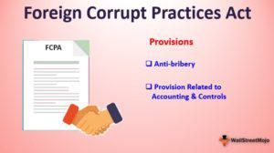

The intricate universe of finance and international business is governed by a myriad of legal frameworks designed to maintain order and fairness across borders. A significant piece of legislation in this context is the Foreign Corrupt Practices Act (FCPA), a law of the United States enacted in 1977 to curtail bribery and corruption in international business dealings. Its key objective is to ensure that U.S.-based organizations and individuals engage in ethical practices globally, thereby promoting fair competition.

The FCPA specifically targets corrupt practices by prohibiting the payment of bribes to foreign officials to secure or maintain business advantages. Its enactment marked a significant step in global business ethics, enabling American enterprises to compete on an equal footing internationally. The legislation comprises two main components: the anti-bribery provisions and requirements related to accounting transparency, both of which are crucial for regulatory compliance.



Simultaneously, the evolution of algorithmic trading, commonly known as algo trading, introduces both challenges and opportunities within the securities markets. This advanced form of trading utilizes sophisticated algorithms to execute trades at high speed and with greater precision than traditional methods. While algo trading improves efficiency and reduces transaction costs, it also ushers in concerns regarding ethical trading practices and potential market manipulation.

This article examines the implications of the FCPA and the rise of algorithmic trading for companies engaging in global markets. Understanding how these elements intersect is vital for businesses striving to maintain ethical standards and handle the complexities of international finance. The discussion underscores the importance of adhering to anti-bribery statutes and navigating the ethical considerations of advanced trading technologies, ultimately advocating for a balanced approach that supports sustainable business operations worldwide.

## Table of Contents

## Understanding the Foreign Corrupt Practices Act (FCPA)

The Foreign Corrupt Practices Act (FCPA), enacted by the U.S. Congress in 1977, is a significant piece of legislation aimed at curbing corruption and promoting ethical business conduct on a global scale. This law prohibits U.S. individuals, businesses, and certain foreign issuers of securities from offering bribes to foreign officials to gain or retain business. The FCPA's introduction represented a pioneering effort to thwart corrupt practices and uphold fair competition internationally.

The FCPA is fundamentally divided into two key components: the anti-bribery provisions and the provisions related to accounting transparency. The anti-bribery provisions expressly forbid U.S. entities and individuals from directly or indirectly offering anything of value to foreign government officials to influence their decision-making for business advantages. These provisions are globally enforceable and apply not only to American firms but also to foreign companies that trade securities in the United States.

Beyond merely targeting bribery, the FCPA places equal emphasis on the accuracy of financial records and internal controls. The [books](/wiki/algo-trading-books), records, and internal control provisions require publicly traded companies to maintain precise accounting records. The law mandates that these records fairly and accurately reflect all transactions and dispositions of the company’s assets. This aspect of the FCPA is designed to prevent the concealment of unethical practices within financial reporting and ensure transparency in business operations.

For businesses operating internationally, comprehension and adherence to these FCPA statutes are critical. Operating within the confines of U.S. regulations demands a clear understanding of these provisions, as failure to comply can result in significant penalties. Companies are encouraged to develop comprehensive compliance programs that incorporate regular training, risk assessment, and internal audits. Such programs can assist in mitigating the risk of encountering legal issues related to FCPA violations.

In summary, the FCPA serves as a cornerstone of international anti-corruption efforts, laying out stringent requirements for both ethical business conduct and financial transparency. By understanding its provisions, companies can navigate the complexities of global markets while maintaining compliance with U.S. laws.

## Anti-Bribery Provisions: Building a Framework for Compliance

The anti-bribery provisions of the Foreign Corrupt Practices Act (FCPA) form a cornerstone of the United States' legislative efforts to combat bribery and corruption in international business. These provisions explicitly prohibit U.S. individuals and businesses, including their [agents](/wiki/agents), subsidiaries, and intermediaries, from offering, promising, or giving anything of value to foreign officials with the intent to influence official actions or secure any improper advantage aimed at obtaining or retaining business.

To understand the impact of these regulations, multinational corporations must consider how the anti-bribery provisions inherently influence the structuring of their international operations. This involves ensuring that all involved parties, whether agents, consultants, or subsidiaries, are calibrated to comply with FCPA standards. The prohibition remains strict regardless of whether the act occurs directly or indirectly through an intermediary.

By mandating compliance, the FCPA addresses significant aspects of global business operations, prompting corporations to adopt rigorous anti-bribery policies and practices. Multinational corporations are thus encouraged to develop comprehensive compliance programs. These typically include clear guidelines for interactions with foreign officials, examining permissible versus prohibited transactions, and implementing extensive due diligence processes before hiring foreign representatives or entering into partnerships abroad.

Additionally, the anti-bribery provisions foster ethical business practices through their deterrent effect on global corruption. Businesses operating internationally must establish training programs emphasizing legal compliance and the ethical dimensions of global commerce. Further, regular audits and monitoring can help in identifying potential breaches and ensuring adherence to anti-bribery standards.

A crucial aspect of these provisions is their extraterritorial reach, meaning they can apply to non-U.S. companies and individuals who engage in activities that have a substantial connection to the United States or its financial systems. This broad applicability reinforces the importance of compliance among global corporations and promotes a level playing field in international markets by reducing the incidence of corrupt practices.

The persistent enforcement of the FCPA's anti-bribery provisions by the Securities and Exchange Commission (SEC) and the Department of Justice (DOJ) underscores the serious consequences of non-compliance. Firms found guilty of violations often face hefty fines, legal penalties, and reputational damage, which can have long-term implications for business operations and financial performance.

By actively integrating these provisions into their business models, organizations effectively contribute to the global fight against corruption, laying down the groundwork for ethical, fair practices in international commerce.

## The Role of Internal Controls and Accounting Transparency

The Foreign Corrupt Practices Act (FCPA) extends beyond prohibiting bribery, emphasizing the significance of internal controls and accounting transparency for U.S.-based companies operating internationally. These measures are crucial in ensuring that business transactions are documented accurately, providing a true representation of a company's financial activities.

The FCPA's accounting provisions consist primarily of two key components: internal controls and accurate books and records. Internal controls are systems and processes designed to provide reasonable assurance regarding the reliability of financial reporting, the effectiveness and efficiency of operations, and compliance with applicable laws and regulations. This ensures that business transactions are recorded in a manner that prevents the misrepresentation of financial health.

Accurate books and records are vital for transparency and accountability. The FCPA mandates that publicly traded companies maintain records that "in reasonable detail, accurately and fairly reflect the transactions and dispositions of the assets of the issuer." This requirement aims to deter the falsification of financial documents that could potentially mask bribery or corrupt practices under ordinary business transactions.

To comply with these provisions, companies must implement comprehensive compliance programs. These programs often include regular internal audits, risk assessments, and the establishment of ethical guidelines and procedures to identify and mitigate potential violations. Regular training for employees, management, and partners is essential to create awareness and understanding of FCPA requirements, ensuring that all parties involved understand the implications of non-compliance.

Advanced technologies and tools can aid in maintaining adequate internal controls. For example, automation and data analytics can improve the accuracy and efficiency of financial recordkeeping and auditing processes. Python libraries such as pandas and NumPy can be utilized to streamline data management tasks:

```python
import pandas as pd

# Create a sample dataframe with financial transactions
data = {
    'TransactionID': [1, 2, 3],
    'Amount': [1000, 500, 1200],
    'Description': ['Office Supplies', 'Consulting Fee', 'Travel Expense']
}

df = pd.DataFrame(data)

# Generate a report by summarizing transactions
report = df.groupby('Description')['Amount'].sum()
print(report)
```

This example illustrates how companies can leverage Python to manage financial data effectively, ensuring transparency and accountability in financial reporting.

In conclusion, the FCPA's requirement for robust internal controls and transparent accounting practices underscores the broader goal of preventing financial misconduct and promoting ethical business conduct globally. By adhering to these guidelines, companies can not only avoid substantial fines and legal sanctions but also enhance their reputation and operational efficiency in the international marketplace.

## Algo Trading: Opportunities and Ethical Considerations

Algorithmic trading, often referred to as algo trading, utilizes complex algorithms to automate trading decisions, significantly transforming the landscape of financial markets. This method enables traders to execute orders at speeds and frequencies far beyond human capability, resulting in increased efficiency and substantial cost reductions. The core of algo trading is the implementation of algorithms—sets of rules for execution, including timing, price, quantity, and so forth—that can predict market trends and make trading decisions accordingly. For instance, a simplified form of an algorithm might involve buying stocks when their moving average of a short time frame exceeds that of a long time frame.

Despite its benefits, [algorithmic trading](/wiki/algorithmic-trading) surfaces substantial concerns regarding ethical trading practices and potential market manipulation. High-frequency trading ([HFT](/wiki/high-frequency-trading-strategies)), a subset of algo trading, is often scrutinized for creating market [volatility](/wiki/volatility-trading-strategies). HFT strategies can lead to situations where the trading machinery exploits minor price discrepancies, which, although legal, might raise ethical questions about fairness in trading. Furthermore, intense reliance on algorithms might result in systemic risks, where errors within the algorithm could inadvertently disrupt markets. An infamous example is the Flash Crash of May 6, 2010, where the Dow Jones Industrial Average plunged about 1,000 points within minutes, partly due to algorithmic trading.

The relationship between algorithmic trading and FCPA regulations is another crucial consideration for businesses engaging in international markets. While the Foreign Corrupt Practices Act primarily addresses corruption and bribery, its compliance framework reaches into broader corporate governance and operational strategies. An example of intersection is through the adherence to transparent and accurate bookkeeping. Algo trading requires robust internal controls to ensure that transactions are recorded properly, deterring any financial malpractices or manipulations that could potentially trace back to corrupt practices.

From a compliance standpoint, businesses must integrate their algorithmic trading operations within a framework that aligns with FCPA requirements. This involves not only safeguarding against illicit financial activities but also fostering ethical standards that prevent manipulation and ensure market integrity. Companies can employ compliance technologies that integrate real-time monitoring systems with their trading algorithms, which can alert compliance officers of discrepancies or activities that might breach legal or ethical guidelines. In doing so, they realize the dual benefits of leveraging algorithmic trading for competitive advantage while upholding stringent standards of corporate ethics.

## FCPA Enforcement: Case Studies and Implications

The enforcement of the Foreign Corrupt Practices Act (FCPA) is the responsibility of both the Securities and Exchange Commission (SEC) and the Department of Justice (DOJ). These two bodies collaborate to rigorously enforce FCPA provisions, resulting in significant consequences for non-compliant companies, including substantial fines and legal sanctions. There are numerous cases that highlight these enforcement actions, such as those involving Ericsson and Microsoft.

Ericsson's case serves as a prominent example. In 2019, Ericsson agreed to pay over $1 billion to settle charges related to FCPA violations. The charges were defined by systematic and wide-ranging corruption involving bribery in multiple countries over several years. The SEC's and DOJ's actions against Ericsson underscored the comprehensive and costly nature of non-compliance with the FCPA, as well as the risks associated with using intermediaries for corrupt purposes. The company's failure to implement a robust compliance program and maintain accurate records played a significant role in its legal troubles, leading to one of the largest settlements in FCPA history. [DOJ Press Release, 2019](https://www.justice.gov/opa/pr/ericsson-pay-over-1-billion-resolve-foreign-corrupt-practices-act-case).

Microsoft's FCPA case provides another illustration of enforcement actions. In 2019, Microsoft paid approximately $25 million to resolve charges of violating the FCPA. The charges included the failure of Microsoft's subsidiaries in Hungary, Saudi Arabia, Thailand, and Turkey to ensure compliance, with employees using false justifications and self-enrichment practices. This case highlighted the importance of financial controls and adherence to compliance standards within diverse corporate structures to prevent and detect potential FCPA infractions. The enforcement actions against Microsoft emphasize the necessity for constant vigilance and proactive compliance measures to mitigate the risk of financial and reputational damage. [SEC Press Release, 2019](https://www.sec.gov/news/press-release/2019-129).

These cases collectively point to the critical importance of adhering to anti-bribery laws. They illustrate the substantial legal and financial liabilities companies can face if found in violation of the FCPA's provisions. As such, they highlight the essential nature of maintaining strong corporate integrity, implementing effective compliance programs, and avoiding severe penalties through strict adherence to the FCPA's regulations. This vigilance not only safeguards companies from legal repercussions but also promotes sustainable and ethical business operations on a global scale.

## Conclusion

Navigating the complexities of the Foreign Corrupt Practices Act (FCPA) alongside the burgeoning realm of algorithmic trading presents both challenges and opportunities for businesses on a global scale. The FCPA, with its stringent anti-bribery and accounting provisions, serves as a critical framework for maintaining transparency and integrity in international business transactions. Understanding these intricacies is crucial for companies aiming to thrive in the global marketplace. By ensuring robust compliance strategies, businesses can mitigate the risks associated with legal infractions, thus protecting their reputations and financial standing.

Algorithmic trading, when integrated with a solid compliance structure, can enhance operational efficiencies and provide a competitive edge. However, it is imperative that businesses remain vigilant about ethical considerations, ensuring that their algorithms do not facilitate illicit activities or market manipulation. By fostering a culture of compliance and ethical behavior, organizations can not only avoid the dire consequences associated with FCPA violations but also promote long-term sustainable business practices.

Success in the international arena demands a balanced approach, where strategic use of technology aligns with the principles of ethical conduct and legal compliance. In doing so, businesses not only adhere to their legal responsibilities but also position themselves as leaders in fostering a transparent and equitable global business environment.

## References & Further Reading

[1]: Tarun, K., & Sandeep, B. (2020). ["The Foreign Corrupt Practices Act: A Critical Evaluation of Its Impact on International Business Ethics."](https://en.wikipedia.org/wiki/List_of_Telugu_films_of_2019) Journal of Business Ethics, Springer.

[2]: Fisch, J. E., & Davidoff Solomon, S. (2014). ["The Influence of FCPA Enforcement on Corporate Governance."](https://papers.ssrn.com/sol3/papers.cfm?abstract_id=3305319) University of Pennsylvania Law School.

[3]: Loftus, M. (2013). ["Compliance Programs and the Foreign Corrupt Practices Act: Drafting Effective Programs to Protect Against FCPA Violations."](https://www.linkedin.com/in/joe-loftus-640b183) American Criminal Law Review.

[4]: Johnson, B. R., & Kwak, J. (2011). ["Algorithmic Trading and Price Dynamics."](https://books.google.com/books/about/Educational_Research.html?id=6gFHDQAAQBAJ) University of Chicago Press.

[5]: Aldridge, I. (2013). ["High-Frequency Trading: A Practical Guide to Algorithmic Strategies and Trading Systems"](https://www.amazon.com/High-Frequency-Trading-Practical-Algorithmic-Strategies/dp/1118343506) Wiley Finance.