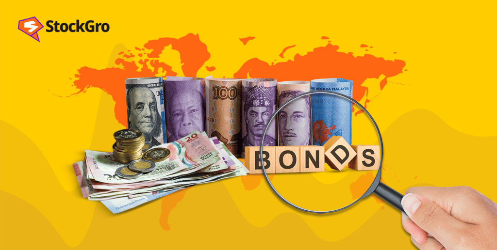

## Table of Contents

## What are Foreign Currency Convertible Bonds (FCCBs)?

Foreign Currency Convertible Bonds (FCCBs) are a type of bond that companies issue to raise money from investors. These bonds are special because they are issued in a currency different from the company's home country, like US dollars or euros. Investors buy these bonds, and in return, they get regular interest payments. The unique thing about FCCBs is that they can be converted into shares of the company instead of being repaid in cash when they mature.

When investors decide to convert their FCCBs into shares, they do so at a pre-determined price. This can be a good deal for investors if the company's stock price goes up a lot. For the company, issuing FCCBs can be a way to get money without immediately increasing its debt, since the bonds might turn into equity. However, if the stock price doesn't go up enough, the company might have to pay back the bonds in cash, which can be a risk.

## How do FCCBs differ from traditional bonds?

FCCBs and traditional bonds are both ways for companies to borrow money, but they have some key differences. Traditional bonds are usually paid back in the same currency they were issued in, and at the end of the bond term, the company pays back the money it borrowed plus interest. These bonds don't change into anything else; they stay as debt until they're paid off.

On the other hand, FCCBs are issued in a foreign currency and give investors the option to convert their bonds into the company's stock instead of getting their money back with interest. This means that if the company's stock price goes up a lot, investors might choose to convert their bonds into shares and possibly make more money than if they had just received the bond's interest and principal. For the company, FCCBs can be a way to raise money without adding to its debt if the bonds are converted into equity, but it's also a risk if the stock price doesn't go up enough and they have to pay back the bonds in cash.

## What are the benefits of issuing FCCBs for a company?

Issuing FCCBs can help a company raise money from investors in different countries. Since FCCBs are issued in a foreign currency, like US dollars or euros, a company can reach investors who might not be interested in buying bonds in the company's home currency. This can be especially helpful for companies in countries with less stable currencies, as it lets them borrow money in a more stable currency.

Another benefit is that FCCBs can be converted into the company's stock. If the stock price goes up a lot, investors might choose to convert their bonds into shares instead of getting their money back with interest. This means the company doesn't have to pay back the money it borrowed, which can help keep its debt low. However, if the stock price doesn't go up enough, the company might still have to pay back the bonds in cash, which is a risk they have to consider.

## What are the risks associated with FCCBs for investors?

When investors buy FCCBs, they face some risks. One big risk is that the company's stock price might not go up as much as they hope. If the stock price stays low, investors might not want to convert their bonds into shares. Instead, they'll get their money back with interest, but they might have missed out on a chance to make more money if they had invested in something else.

Another risk is that the company might not be able to pay back the money it borrowed if the stock price doesn't go up enough and the bonds aren't converted into shares. If the company runs into financial trouble, investors could lose some or all of their money. Also, since FCCBs are issued in a foreign currency, changes in exchange rates can affect how much money investors get back. If the currency the bonds are issued in loses value compared to the investor's home currency, they might get less money than they expected.

## How does the conversion of FCCBs into equity work?

When someone buys FCCBs, they have the option to convert those bonds into shares of the company later on. This happens at a price that's set when the bonds are first issued. If the company's stock price goes up a lot, it might be a good deal for the investor to convert their bonds into shares. They can do this by giving back the bonds and getting the shares instead.

If the stock price doesn't go up enough, the investor might decide not to convert the bonds. In that case, they'll get their money back with interest when the bonds mature. The company hopes that the stock price will go up so that investors will convert their bonds into shares, which means the company doesn't have to pay back the money it borrowed. But if the stock price stays low, the company might have to pay back the bonds in cash, which can be a risk for them.

## What are the typical terms and conditions of FCCBs?

When a company issues FCCBs, they set some rules about how the bonds work. One important rule is the conversion price, which is the price at which investors can turn their bonds into shares. This price is set when the bonds are issued and it's usually a bit higher than the current stock price. Another rule is the conversion period, which is the time when investors can choose to convert their bonds into shares. This period can last for several years, giving investors time to see if the stock price goes up enough to make conversion a good idea.

There are also rules about the [interest rate](/wiki/interest-rate-trading-strategies), which is how much money the company pays investors each year for borrowing their money. This rate is usually lower than what you'd get with regular bonds because investors have the chance to make more money if they convert their bonds into shares. The maturity date is another important rule, which is when the bonds have to be paid back if they haven't been converted into shares. If the stock price doesn't go up enough by this date, the company has to pay back the money it borrowed plus interest.

## Can you explain the pricing mechanism of FCCBs?

The pricing of FCCBs involves setting a conversion price, which is the price at which the bonds can be turned into shares of the company. This conversion price is usually set higher than the current stock price when the bonds are issued. The idea is to give investors a chance to make more money if the stock price goes up a lot. If it does, they can convert their bonds into shares at the lower conversion price and then sell those shares at the higher market price.

The interest rate on FCCBs is another part of the pricing mechanism. This rate is typically lower than what you'd get with regular bonds. That's because investors have the chance to make more money if they convert their bonds into shares. The company sets this rate to make the bonds attractive to investors while keeping their borrowing costs down. If the stock price doesn't go up enough by the time the bonds mature, the company has to pay back the money it borrowed plus the interest, which is based on this rate.

## How do FCCBs impact a company's balance sheet and financial ratios?

When a company issues FCCBs, it affects its balance sheet right away. The money the company gets from selling the bonds is shown as cash, which makes the company's assets go up. On the other side, the bonds are shown as a liability because the company has to pay back the money it borrowed, either in cash or by giving investors shares. If investors choose to convert their bonds into shares, the liability goes away, and the company's equity goes up instead. This can help the company keep its debt low, but it also means more shares are out there, which can change how much each share is worth.

FCCBs also affect the company's financial ratios. At first, the company's debt-to-equity ratio goes up because the bonds are counted as debt. But if the bonds are converted into shares, this ratio can go down because the debt turns into equity. The company's earnings per share can also change. If more shares are created because of the conversion, the earnings per share might go down unless the company's profits go up a lot. So, FCCBs can help a company manage its debt, but they also come with risks that can affect how the company looks financially.

## What are some real-world examples of companies issuing FCCBs?

A famous example of a company using FCCBs is Tata Steel, an Indian company. In 2007, they issued FCCBs worth $875 million to help pay for buying a company in Europe called Corus. This helped them raise money in US dollars, which was good because the Indian rupee was not as stable. But when the global financial crisis hit in 2008, Tata Steel's stock price dropped a lot. This made it hard for them to pay back the bonds, and they had to ask investors to wait longer before getting their money back.

Another example is Reliance Industries, also from India. In 2009, they issued FCCBs worth $1.5 billion. They did this to raise money for their business without adding too much debt. If the stock price went up, investors could turn their bonds into shares, which would help Reliance keep their debt low. But if the stock price didn't go up enough, they would have to pay back the money in cash. This shows how FCCBs can be a good way to raise money, but it also comes with risks.

## How do regulatory environments affect the issuance of FCCBs?

The rules and laws in different countries can really change how companies use FCCBs. Some countries have strict rules about how much money a company can borrow from outside the country. They might also have rules about how the bonds can be converted into shares. These rules can make it harder or easier for a company to issue FCCBs. For example, if a country's rules are very strict, a company might have to spend a lot of time and money to follow them, which could make them decide not to issue FCCBs at all.

On the other hand, some countries have rules that make it easier for companies to issue FCCBs. They might let companies borrow more money from foreign investors or have simpler rules about converting bonds into shares. This can help companies raise money more easily and attract more investors. But no matter where a company is, they always have to follow the rules of the country where they're issuing the bonds, as well as the rules of their own country. This can be tricky, but it's important for making sure everything is done the right way.

## What are the tax implications of investing in FCCBs?

When you invest in FCCBs, you need to think about taxes. The interest you get from the bonds is usually taxed as regular income. This means you have to pay taxes on it every year, just like you would on money you earn from a job. If you convert your FCCBs into shares, you might have to pay taxes on any profit you make from selling those shares later. This is called capital gains tax, and how much you pay can depend on how long you held the shares before selling them.

Different countries have different rules about taxing FCCBs. If you're investing in FCCBs from a company in another country, you might have to pay taxes in that country too. This can make things more complicated because you might have to follow the tax laws of two countries. It's a good idea to talk to a tax expert to make sure you understand all the taxes you might have to pay and how to report your income correctly.

## How can investors hedge against the risks of FCCBs?

Investors can use different ways to protect themselves from the risks of FCCBs. One way is to use currency hedging. Since FCCBs are in a foreign currency, changes in exchange rates can affect how much money investors get back. By using currency hedging, investors can protect themselves from these changes. They can do this by using financial tools like forward contracts or currency options, which help lock in a certain exchange rate for the future.

Another way to hedge is by using stock options. If investors think the company's stock price might not go up enough to make converting the bonds into shares a good idea, they can buy put options. These options give them the right to sell the company's stock at a certain price, even if the stock price goes down. This can help them limit their losses if the stock price doesn't go up as expected. By using these hedging strategies, investors can feel more secure about investing in FCCBs.

## What are the benefits and risks of FCCBs?

Foreign Currency Convertible Bonds (FCCBs) are a popular instrument for companies seeking to raise capital, particularly in international markets. Issuing FCCBs comes with a range of benefits and risks that impact both the issuing company and investors.

### Benefits for Companies Issuing FCCBs

1. **Lower Interest Rates**: Companies often opt to issue FCCBs because they can secure capital at lower interest rates compared to standard loans. This is partly due to the conversion feature, which provides investors with potential equity upside, thus allowing issuers to offer a lower coupon rate. The equation for calculating the effective interest rate on FCCBs can be less complex than other debt instruments:
$$
   \text{Effective Interest Rate} = \frac{\text{Interest Payment}}{\text{Bond Principal}}

$$

2. **Access to Foreign Capital**: By denominating the bond in a foreign currency, companies can tap into overseas investor pools, expanding their access to capital beyond domestic markets. This can be particularly advantageous for entities looking to diversify their investor base.

3. **Deferred Dilution**: The conversion feature allows companies to defer dilution of equity. Unlike outright equity issues, FCCBs do not impact the company’s share structure unless converted, allowing companies to manage shareholder value more strategically.

### Benefits for Investors

1. **Guaranteed Returns**: FCCBs typically offer fixed interest payments until conversion, providing investors with a guaranteed return. This is attractive in volatile market conditions where equity investments are riskier.

2. **Conversion Potential**: The option to convert bonds into equity allows investors to benefit from potential stock price appreciation. This optionality adds to the bond's intrinsic value, balancing the conservative nature of bonds with the growth opportunities typical of equities.

3. **Diversification and Currency Benefits**: Investing in FCCBs denominated in a foreign currency provides investors with diversification benefits. Moreover, if the foreign currency appreciates relative to the investor's domestic currency, additional returns can be realized, although this also introduces additional currency risk.

### Risks for Issuers

1. **Exchange Rate Fluctuations**: Issuing bonds in a foreign currency exposes companies to exchange rate risk. Depreciation of the issuer’s local currency against the bond’s currency can increase the effective debt burden. To mitigate this risk, issuers might employ hedging strategies using financial derivatives like currency swaps or options.

2. **Conversion Challenges**: If a company's share price does not perform as expected, there may be minimal interest in conversion. This scenario results in the maturity of a significant portion of debt, which companies must be prepared to repay, posing potential liquidity challenges.

### Risks for Investors

1. **Exchange Rate Risk**: While currency fluctuations can be beneficial, they also pose a significant risk. A depreciating foreign currency can erode the returns when converted back to the investor's home currency, adversely affecting the investment’s overall yield.

2. **Issuer Credit Risk**: As with any fixed-income securities, the risk of default is present. The creditworthiness of the issuing company is crucial. If the issuer faces financial difficulties, it may lead to default, reducing or eliminating returns.

In summary, while FCCBs offer strategic advantages to both issuers and investors by bridging debt and equity, they are not without their inherent risks. Both parties must carefully analyze market conditions, currency fluctuations, and the financial health of the issuing company before proceeding with such financial instruments.

## References & Further Reading

[1]: Menachem Brenner and Yehuda Izhakian. (2018). ["An Overview of Convertible Bonds."](https://papers.ssrn.com/sol3/papers.cfm?abstract_id=1996802) Asia-Pacific Journal of Management Research and Innovation.

[2]: Thomas S. Y. Ho and Sang-Bin Lee. (2004). ["The Oxford Guide to Financial Modeling: Applications for Capital Markets, Corporate Finance, Risk Management, and Financial Institutions."](https://archive.org/details/oxfordguidetofin0000hoth) Oxford University Press.

[3]: ["Algorithmic Trading: Winning Strategies and Their Rationale"](https://www.amazon.com/Algorithmic-Trading-Winning-Strategies-Rationale-ebook/dp/B00CY5HC0U) by Ernie Chan.

[4]: ["Convertible Securities: A Complete Guide to Investment and Corporate Financing Strategies"](https://www.amazon.com/Convertible-Securities-Investment-Corporate-Strategies/dp/1260462900) by Tracy V. Maitland and William Cavanagh.

[5]: Avinash Persaud. (2011). ["The Incentive Structure of the ‘Plumber’ of Global Finance: The Role of the Currency Trader in the Financial Universe."](https://en.wikipedia.org/wiki/Leonard_Seabrooke) Springer, Global Financial Markets.