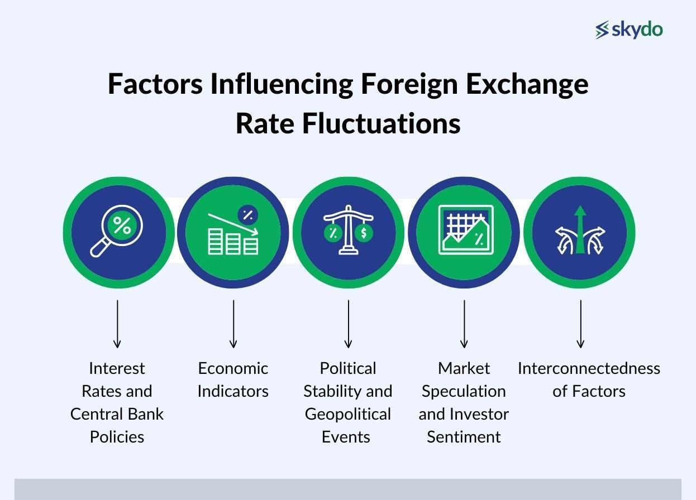

## Table of Contents

## What is foreign currency and how does it affect investments?

Foreign currency is money used in other countries. For example, if you live in the United States, the U.S. dollar is your currency. But if you travel to Japan, you would use the Japanese yen. When you invest in another country, you need to use their currency. This can affect your investments because the value of different currencies can change over time.

When you invest in a foreign country, the value of your investment can go up or down based on changes in the foreign currency's value compared to your home currency. For example, if the U.S. dollar gets weaker compared to the Japanese yen, your investments in Japan might be worth more when you convert them back to dollars. But if the U.S. dollar gets stronger, your investments might be worth less. This is why changes in currency values are important for people who invest in other countries.

## How can fluctuations in foreign currency impact the returns on international investments?

When you invest in another country, the money you use is in that country's currency. If the value of that currency goes up compared to your home currency, your investment can become more valuable when you change it back to your home currency. For example, if you invest in Europe using euros and the euro gets stronger against the U.S. dollar, you'll get more dollars back when you convert your euros. This can make your investment returns higher than if the currency values stayed the same.

On the other hand, if the foreign currency gets weaker compared to your home currency, your investment might be worth less when you convert it back. For instance, if you invest in Japan and the yen weakens against the U.S. dollar, you'll get fewer dollars when you convert your yen back. This can lower your investment returns. So, changes in currency values can make your international investments go up or down, even if the investment itself doesn't change in value in its own currency.

## What are exchange rates and how do they relate to investment performance?

Exchange rates are the values at which one country's currency can be exchanged for another country's currency. For example, if the exchange rate between the U.S. dollar and the euro is 1 to 0.85, it means you can get 0.85 euros for every U.S. dollar you exchange. These rates are always changing based on things like how much people want to buy or sell each currency, how well a country's economy is doing, and what interest rates are in different countries.

When you invest in another country, the exchange rate between your home currency and the foreign currency can affect how much money you make or lose. If the foreign currency gets stronger compared to your home currency, the value of your investment in your home currency will go up, even if the investment itself hasn't changed in value in the foreign currency. But if the foreign currency gets weaker, your investment will be worth less when you convert it back to your home currency. So, keeping an eye on exchange rates is important because they can make a big difference in how well your international investments perform.

## Can you explain the concept of currency risk in the context of investing?

Currency risk is the chance that changes in exchange rates will make your investments worth more or less when you change them back to your home currency. When you invest in another country, you're using their money. If that country's money gets stronger compared to your home currency, your investment could be worth more when you convert it back. But if it gets weaker, you'll get less of your home currency when you convert it, which means your investment could lose value.

For example, imagine you invest in a company in Europe using euros. If the euro gets stronger against the U.S. dollar, you'll get more dollars back when you convert your euros. This can make your investment seem better than it would if the exchange rate hadn't changed. But if the euro gets weaker, you'll get fewer dollars, and your investment could lose value even if the company you invested in is doing well. So, currency risk is something investors need to think about when they put money into other countries, because it can affect how much they earn or lose.

## What strategies can investors use to hedge against foreign currency risk?

One way investors can protect themselves from currency risk is by using something called currency hedging. This means they use financial tools to help keep their money safe from big changes in exchange rates. For example, they might use something called a forward contract, which lets them agree on an exchange rate now for a trade they'll make in the future. This way, even if the currency's value goes up or down, they know exactly how much they'll get when they convert their money back.

Another strategy is to invest in funds that are already hedged against currency risk. These funds use special techniques to reduce the impact of changes in exchange rates. This can be a good choice for investors who don't want to deal with the details of hedging themselves. By choosing these funds, they can focus more on the performance of their investments without worrying as much about what's happening with currency values.

Lastly, some investors choose to diversify their investments across many different countries. By spreading their money around, they can lower the risk that big changes in one currency will hurt their overall investment returns. If one currency goes down, another might go up, balancing things out. This doesn't eliminate currency risk completely, but it can make it less of a worry.

## How does currency conversion affect the cost and returns of foreign investments?

When you invest in another country, you need to use that country's money. This means you have to change your money into their money, which is called currency conversion. The cost of changing money can affect how much you have to invest. For example, if you are from the U.S. and want to invest in Europe, you'll need to change your dollars into euros. Banks and other places that change money often charge a fee for this, which means you might get fewer euros than you expected. This fee can make your investment cost more from the start.

Once your investment grows or shrinks, you'll want to change the money back to your home currency. The exchange rate at that time will affect how much money you get back. If the euro gets stronger compared to the dollar while you're invested, you'll get more dollars when you convert your euros back. This can make your returns look better. But if the euro gets weaker, you'll get fewer dollars, which can make your returns look worse. So, the cost of changing money and the changes in exchange rates can both affect how much money you make or lose from your foreign investments.

## What are the long-term effects of currency depreciation or appreciation on investment portfolios?

When a country's currency gets weaker over a long time, it's called currency depreciation. This can make your foreign investments worth more when you change them back to your home currency. For example, if you invest in a country where the currency is getting weaker, like the euro getting weaker against the U.S. dollar, your investment in euros will be worth more dollars when you convert it back. This can boost the returns on your investment portfolio. But, if your home currency is the one getting weaker, it might make your foreign investments worth less in your home currency, even if they're doing well in the foreign country.

On the other hand, when a country's currency gets stronger over time, it's called currency appreciation. This can make your foreign investments worth less when you convert them back to your home currency. If you invest in a country where the currency is getting stronger, like the yen getting stronger against the U.S. dollar, your investment in yen will be worth fewer dollars when you convert it back. This can lower the returns on your investment portfolio. But, if your home currency is the one getting stronger, it might make your foreign investments worth more in your home currency, even if they're not doing as well in the foreign country.

Over the long term, these changes in currency values can have a big impact on how well your investment portfolio does. If you're investing in many different countries, the ups and downs of different currencies can balance each other out. But if most of your investments are in one country, big changes in that country's currency can really affect your overall returns. So, it's important to think about currency changes when you're planning your investments for the long run.

## How do economic policies influence foreign currency values and investment outcomes?

Economic policies can change how much a country's money is worth and affect how well your investments do. For example, if a country's government raises interest rates, it might make their money more valuable because people want to invest there to get higher returns. This can make the currency stronger compared to other countries' money. But if the government lowers interest rates, their money might become less valuable because people might not want to invest there as much. This can make the currency weaker. These changes can affect how much money you make or lose from your foreign investments.

Also, if a government spends a lot of money or changes taxes, it can make their economy grow faster or slower. If the economy grows fast, it might make their money stronger because more people want to buy things from that country. But if the economy slows down, their money might get weaker because fewer people want to buy things there. These changes in the economy can make your investments go up or down in value, especially if you're investing in different countries. So, it's important to keep an eye on what governments are doing because it can really affect your money.

## What role do central banks play in managing currency values and their impact on investments?

Central banks are like the bosses of a country's money. They can change how much a country's money is worth by deciding things like interest rates. If a central bank raises interest rates, it can make their money more valuable because people want to invest there to get higher returns. This can make the currency stronger compared to other countries' money. But if the central bank lowers interest rates, their money might become less valuable because people might not want to invest there as much. This can make the currency weaker. These changes can affect how much money you make or lose from your foreign investments.

Central banks also try to keep their country's money stable. They might buy or sell their own money to make sure it doesn't go up or down too fast. If their money is getting too weak, they might buy it to make it stronger. If it's getting too strong, they might sell it to make it weaker. This can help keep things steady for people who are investing in that country. But sometimes, even with the central bank's help, big changes in the economy or what's happening around the world can still make a country's money go up or down a lot. This can make your investments go up or down in value, so it's good to know what the central bank is doing.

## How can investors analyze the potential currency effects on their investment decisions?

Investors can look at a few things to understand how changes in money values might affect their investments. One thing to watch is the exchange rate, which is how much one country's money is worth compared to another's. If the money of the country you're investing in gets stronger compared to your home money, your investment might be worth more when you change it back. But if it gets weaker, you might get less money when you convert it. You can also keep an eye on what the central bank of that country is doing. If they raise interest rates, their money might get stronger, which can be good for your investment. But if they lower rates, their money might get weaker, which can be bad.

Another way to analyze currency effects is to think about the overall health of the country's economy. If the economy is doing well, the money might get stronger because more people want to buy things from that country. But if the economy is struggling, the money might get weaker because fewer people want to buy things there. You can also look at what's happening around the world. Big events like wars or big changes in other countries can make money values go up or down a lot. By paying attention to these things, you can get a better idea of how changes in money values might affect your investments and make smarter choices about where to put your money.

## What are some advanced tools or models used to predict currency movements and their investment implications?

To predict how a country's money value might change, experts use advanced tools and models. One common tool is called a "forecasting model." These models look at things like past money values, how the economy is doing, and what the government is doing with interest rates. They use this information to guess what might happen next. Another tool is called "technical analysis," which looks at charts and patterns in money values to predict future changes. These tools help investors understand if a country's money might get stronger or weaker, which can affect their investment decisions.

Another model used is the "purchasing power parity" (PPP) model. This model compares how much things cost in different countries to see if one country's money is overvalued or undervalued. If things are cheaper in one country, their money might be undervalued and could get stronger in the future. On the other hand, if things are more expensive, their money might be overvalued and could get weaker. By using these models, investors can make better guesses about how money values might change and plan their investments accordingly. This can help them decide if it's a good time to invest in a certain country or if they should wait.

## How do multinational corporations manage foreign currency exposure and what lessons can individual investors learn from their strategies?

Multinational corporations often deal with money from many different countries. They use special ways to manage the risk that comes with changing money values. One way they do this is by using "currency hedging." This means they make deals to exchange money at a certain rate in the future, so they know exactly how much they'll get. They might also use "natural hedging," which means they try to match their money coming in with their money going out in the same currency. This can help balance things out if one currency gets weaker or stronger. Another thing they do is spread their business across many countries, so if one country's money goes down, they might still do well in other places.

Individual investors can learn a lot from how big companies handle money from different countries. One lesson is to use currency hedging if you can. This can help protect your money from big changes in exchange rates. Another lesson is to spread your investments across many countries, just like big companies spread their business. This can help balance out the risk if one country's money goes down. Finally, paying attention to what's happening in the economy and what central banks are doing can give you clues about where money values might be headed. By using these strategies, you can make smarter choices about where to put your money and how to protect it from changes in money values.

## How do currency effects influence investment impact?

Currencies are in a constant state of flux due to various economic factors, including interest rates, inflation rates, and geopolitical developments. This continuous change in currency values significantly impacts the value of foreign investments. When a domestic currency appreciates, the value of returns on foreign investments can diminish. Conversely, if a local currency depreciates, the returns on international investments can be enhanced.

The relationship between currency fluctuations and investment returns can be expressed through the formula for the return on foreign investment in local currency terms:

$$

R_{\text{local}} = (1 + R_{\text{foreign}}) \times \left(\frac{E_{\text{end}}}{E_{\text{start}}}\right) - 1
\] 

where $R_{\text{local}}$ is the return in the investor's domestic currency, $R_{\text{foreign}}$ is the return in the foreign currency, and $E_{\text{start}}$ and $E_{\text{end}}$ represent the exchange rates at the start and end of the investment period, respectively.

Investors use various strategies to manage currency risk. One popular approach is currency-hedged exchange-traded funds (ETFs). These financial instruments are designed to mitigate the impact of currency fluctuations on investment returns. By using derivatives and other financial products to offset currency exposure, currency-hedged ETFs provide investors with a means to achieve more stable returns, independent of exchange rate [volatility](/wiki/volatility-trading-strategies).

For example, a U.S. investor investing in European stocks might use a currency-hedged [ETF](/wiki/etf-trading-strategies) to protect against potential depreciation of the Euro relative to the U.S. Dollar. This strategy helps in preserving the investment's value by neutralizing the currency risk, thereby focusing solely on the underlying asset's performance.

Managing currency risks through such strategies is essential for investors seeking to optimize returns and maintain portfolio stability amidst the inherent uncertainties of the [forex](/wiki/forex-system) market.

## References & Further Reading

[1]: ["Exchange Rates and International Finance"](https://www.amazon.com/Exchange-Rates-International-Finance-6th/dp/0273786040) by Laurence S. Copeland

[2]: Chordia, T., Roll, R., & Subrahmanyam, A. (2005). ["Evidence on the speed of convergence to market efficiency."](https://www.cfainstitute.org/-/media/documents/article/cfa-digest/2005/dig-v35-n4-1778-pdf.ashx) Journal of Financial Economics, 76(2), 271-292.

[3]: ["Algorithmic Trading: Winning Strategies and Their Rationale"](https://books.google.com/books/about/Algorithmic_Trading.html?id=WAlFDwAAQBAJ) by Ernie Chan

[4]: James, G., Witten, D., Hastie, T., & Tibshirani, R. (2013). ["An Introduction to Statistical Learning: with Applications in R."](https://link.springer.com/book/10.1007/978-1-0716-1418-1) Springer.

[5]: ["Foreign Exchange: Practical Asset Pricing and Macroeconomic Theory"](https://www.amazon.com/Foreign-Exchange-Practical-Pricing-Macroeconomic/dp/303093554X) by Kallianiotis, J. N.

[6]: Dacorogna, M. M., Gencay, R., Müller, U. A., Pictet, O. V., & Olsen, R. B. (2001). ["An Introduction to High-Frequency Finance."](https://archive.org/details/an-introduction-to-high-frequency-finance) Academic Press.

[7]: Till, H. (2016). ["A Technical Primer for Machine Learning in the Finance Industry"](https://www.researchgate.net/publication/321419754_Machine_learning_A_primer). SSRN Electronic Journal.