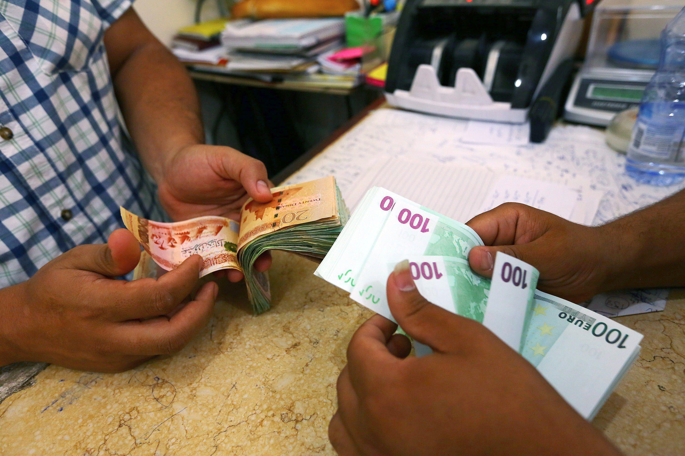

The foreign exchange market, commonly known as the forex market, is the largest and most liquid financial market in the world. It facilitates the exchange of currencies and determines the relative value of different currencies. Daily trading volumes exceed $6 trillion, highlighting its critical role in global finance. Understanding the intricacies of the forex market, particularly elements like exchange spreads, is essential for participants ranging from individual traders to multinational corporations.

Exchange spreads, or the bid-ask spread, represent the difference between the highest price a buyer is willing to pay for a currency (the bid) and the lowest price a seller is willing to accept (the ask). This spread is a key factor in determining the cost-effectiveness of currency transactions. Narrow spreads usually indicate a liquid market with high trading volume and low volatility, leading to reduced transaction costs for traders. Conversely, wider spreads typically signify less liquidity, higher volatility, and increased transaction costs.



Currency exchange refers to the process of converting one currency into another. This process is influenced by various factors, including exchange rates that represent the value of one currency in terms of another. Traders engage with the direct and indirect currency quotes that define these rates, while cross-currency rates further impact international transactions by connecting currencies that are not directly quoted against each other.

Algorithmic trading, or algo trading, has become a vital component of the modern forex market. It involves the use of pre-programmed instructions and computer algorithms to execute trades at speeds and efficiencies unattainable by human traders. This method of trading mitigates human emotional biases—such as fear and greed—allowing for more consistent trading outcomes.

The interconnectedness of exchange spreads, currency exchange mechanisms, and algorithmic trading is evident in today’s global financial landscape. Understanding these components and their interrelations enables market participants to navigate the forex market more effectively. This foundational knowledge supports strategic decision-making and paves the way for innovations in trading methodologies and technologies.

As forex trading continues to evolve, the integration of these elements will remain central to achieving successful outcomes in this dynamic market. Further exploration and research into these areas will continue to drive the development of sophisticated trading strategies and tools, enhancing the overall efficiency of currency exchanges.

## Table of Contents

## Understanding Exchange Spreads

Exchange spreads, commonly referred to as bid-ask spreads, are a fundamental concept in the foreign exchange ([forex](/wiki/forex-system)) market. The bid-ask spread is the difference between the highest price that a buyer is willing to pay for a currency (the bid) and the lowest price that a seller is willing to accept (the ask). This spread is a crucial element in currency exchange as it represents the transaction cost that traders incur in buying and selling currencies.

The bid-ask spread serves as a metric for the cost-effectiveness of currency transactions. Narrower spreads usually indicate a more cost-effective transaction environment, benefiting traders by allowing them to execute trades at prices closer to market equilibrium. On the other hand, wider spreads can increase transaction costs, potentially affecting profitability. Therefore, understanding and monitoring exchange spreads are vital for traders seeking to optimize their trading strategies and minimize expenses.

Several factors can influence exchange spreads. Market [volatility](/wiki/volatility-trading-strategies) is a significant determinant; during periods of high volatility, spreads may widen due to increased uncertainty and risk. Conversely, in more stable market conditions, spreads tend to narrow, reflecting reduced risk and heightened competition among market participants. Liquidity is another critical [factor](/wiki/factor-investing) affecting spreads. Highly liquid currency pairs, such as EUR/USD or USD/JPY, typically exhibit narrower spreads owing to the larger number of buyers and sellers in the market, facilitating quicker and more efficient transactions. In contrast, less liquid pairs often experience wider spreads due to the reduced availability of counterparties and increased risk for market makers.

Understanding these dynamics is essential for forex traders as they navigate the complexities of international currency markets, allowing them to make informed decisions and optimize their trading outcomes.

## Currency Exchange Mechanics

The mechanics of currency exchange are fundamental to understanding how the foreign exchange market operates. At its core, currency exchange involves the conversion of one currency into another at an agreed-upon rate, known as the exchange rate. Exchange rates are crucial as they determine the value of one currency relative to another and play a significant role in international trade and investments.

Exchange rates can be classified into two main types: direct and indirect quotes. A direct quote, also referred to as the price quotation, is the domestic currency stated as a constant, while the foreign currency is variable. For example, in the United States, a direct quote for the euro might be 1.15 USD/EUR, meaning it costs 1.15 US dollars to purchase one euro. Conversely, an indirect quote is when the foreign currency is expressed as a constant, and the domestic currency becomes variable. Using the same example, the indirect quote for the euro in the United States would be 0.87 EUR/USD, indicating that one US dollar buys 0.87 euros.

The foreign exchange market also involves cross-currency rates, which are particularly significant when a currency pair does not involve the US dollar. A cross-currency rate is derived from the relative exchange rates between two currencies against a third, commonly the US dollar. For instance, to determine the exchange rate between the euro (EUR) and the Japanese yen (JPY), one might reference the respective EUR/USD and USD/JPY rates:

$$
\text{EUR/JPY} = \frac{\text{EUR/USD}}{\text{USD/JPY}}
$$

If the EUR/USD rate is 1.15 and the USD/JPY rate is 110, then the cross rate EUR/JPY would be:

$$
\text{EUR/JPY} = \frac{1.15}{110} \approx 0.01045 
$$

Thus, one euro would approximately equal 110 yen in this scenario. Cross-currency calculations are vital in global finance for establishing rates where direct currency pairs are not extensively traded.

Currency exchange processes rely heavily on these mechanics and the understanding of exchange rates. They allow for efficient trading and facilitate a global economy where currencies from different nations can be exchanged seamlessly. Understanding these dynamics is essential for traders, investors, and businesses dealing with international transactions, as exchange rates can impact the cost and profitability of foreign exchanges and operations.

 to Forex Algorithmic Trading

Algorithmic trading in the forex market refers to the use of computer programs and algorithms to execute trades automatically. This method involves the utilization of complex mathematical models and formulas to make high-speed and precise trading decisions. The main principle behind [algorithmic trading](/wiki/algorithmic-trading) is to leverage pre-programmed instructions concerning various parameters such as timing, price, or [volume](/wiki/volume-trading-strategy) to execute currency trades far swifter than any human trader could achieve.

The scope of algorithmic trading in the forex market is wide and continuously expanding due to advancements in technology. Algorithms are designed to parse through vast amounts of data, identify trading opportunities, and execute trades based on pre-defined criteria. This automated process eliminates the need for manual intervention, thereby increasing the speed and efficiency of trades. It also allows for the execution of multiple trades simultaneously.

Automation in currency trading is achieved through the use of pre-programmed trading instructions. These instructions are composed of complex algorithms that analyze data and execute trades when market conditions meet specific criteria. For instance, an algorithm might trigger a buy order for a particular currency pair if certain technical indicators align to suggest a favorable market movement. In Python, a simple illustrative strategy using a moving average crossover might look like this:

```python
# Assuming data is a DataFrame with a 'Close' column for the currency pair prices
data['Short_MA'] = data['Close'].rolling(window=40).mean()
data['Long_MA'] = data['Close'].rolling(window=100).mean()

def generate_signals(data):
    buy_signals = []
    sell_signals = []
    position = None  # No position at start

    for i in range(len(data)):
        if data['Short_MA'][i] > data['Long_MA'][i]:
            if position != 'Long':
                buy_signals.append(data['Close'][i])
                sell_signals.append(float('nan'))
                position = 'Long'
            else:
                buy_signals.append(float('nan'))
                sell_signals.append(float('nan'))
        elif data['Short_MA'][i] < data['Long_MA'][i]:
            if position != 'Short':
                buy_signals.append(float('nan'))
                sell_signals.append(data['Close'][i])
                position = 'Short'
            else:
                buy_signals.append(float('nan'))
                sell_signals.append(float('nan'))
        else:
            buy_signals.append(float('nan'))
            sell_signals.append(float('nan'))

    data['Buy'] = buy_signals
    data['Sell'] = sell_signals
    return data
```

The rise of algorithmic trading in the forex market can be attributed to its efficiency and precision, allowing traders to capitalize on market opportunities within fractions of a second. With the ability to process and analyze large datasets faster than a human trader, algorithmic trading minimizes the risk of human error and emotional decision-making, providing an edge in volatile and fast-moving market conditions. 

In summary, the advent of algorithmic trading has introduced a paradigm shift in how currency trading is conducted, reflecting a broader trend across financial markets towards automation and data-driven decision-making.

## Benefits of Forex Algorithmic Trading

Forex algorithmic trading offers numerous advantages that enhance the effectiveness and efficiency of currency trading practices. One of the primary benefits is the significant increase in speed and efficiency. Algorithmic trading enables traders to execute high-frequency transactions almost instantaneously, allowing them to take advantage of fleeting market opportunities that human traders might miss. This rapid execution is particularly advantageous in the highly volatile foreign exchange ([FX](/wiki/fx-anomaly)) markets, where exchange rates can fluctuate rapidly within short timeframes.

Another crucial advantage of algorithmic trading is the elimination of human emotional biases. Emotions such as fear and greed can cloud judgment and lead to suboptimal trading decisions. By automating trading strategies through algorithms, forex traders can remove these emotional influences, ensuring that trades are executed based on predefined criteria and logic. This objectivity is critical in maintaining a consistent trading approach, which can be pivotal in achieving long-term financial success.

Furthermore, algorithmic trading platforms offer sophisticated capabilities for [backtesting](/wiki/backtesting) and optimization of trading strategies. Backtesting allows traders to apply their trading algorithms to historical market data to evaluate their potential performance without financial risk. It involves simulating trades using past data, enabling traders to assess the effectiveness of their algorithms accurately. Here is a simple Python example of backtesting a moving average crossover strategy using historical data:

```python
import pandas as pd

# Load historical price data
data = pd.read_csv('forex_data.csv')

# Calculate moving averages
data['SMA_50'] = data['Close'].rolling(window=50).mean()
data['SMA_200'] = data['Close'].rolling(window=200).mean()

# Generate trading signals
data['Signal'] = 0
data['Signal'][50:] = np.where(data['SMA_50'][50:] > data['SMA_200'][50:], 1, -1)

# Calculate returns
data['Returns'] = data['Close'].pct_change()
data['Strategy_Returns'] = data['Signal'].shift(1) * data['Returns']

# Backtest performance
cumulative_strategy_returns = (data['Strategy_Returns'] + 1).cumprod()
print("Cumulative Returns: ", cumulative_strategy_returns.iloc[-1])
```

In this example, the algorithm automatically generates buy or sell signals based on the crossover of two simple moving averages. This systematic approach can be further fine-tuned through optimization techniques, where parameters such as the length of moving averages or risk constraints are adjusted to maximize performance metrics.

Overall, forex algorithmic trading provides traders with the tools to enhance their trading efficiency, maintain objectivity, and rigorously analyze and improve their strategies. These benefits make algorithmic trading an increasingly popular choice among both institutional and retail forex traders, driving advancements and innovation in the FX markets.

## Developing Profitable Forex Trading Algorithms

Developing profitable forex trading algorithms is a multi-faceted task that requires a blend of strategic foresight, technical expertise, and disciplined risk management. The foundational component of a successful algorithm is a well-defined strategy. This begins by identifying a clear trading objective, which could range from capital appreciation to hedging against currency risk. Strategy development entails setting specific rules for entering and exiting trades, which must be grounded in technical and data analysis.

Technical analysis involves examining past market data, primarily price and volume, to anticipate future price movements. Successful algorithm design often incorporates technical indicators such as moving averages, MACD (Moving Average Convergence Divergence), and RSI (Relative Strength Index). For example, an algorithm might be programmed to enter a trade when a short-term moving average crosses above a long-term moving average, indicating a potential uptrend.

Data analysis in algorithmic trading leverages vast datasets, including historical price data, economic indicators, and even news headlines. Machine learning techniques can enhance this process by identifying patterns not immediately apparent to human traders. Python, with its extensive libraries such as pandas for data manipulation, scikit-learn for [machine learning](/wiki/machine-learning), and TA-Lib for technical analysis, is a popular choice for developing such trading algorithms. Here's a basic example of using Python for a simple moving average crossover strategy:

```python
import pandas as pd

def moving_average_crossover(data, short_window=40, long_window=100):
    data['Short_MA'] = data['Close'].rolling(window=short_window, min_periods=1).mean()
    data['Long_MA'] = data['Close'].rolling(window=long_window, min_periods=1).mean()

    data['Signal'] = 0
    data['Signal'][short_window:] = np.where(data['Short_MA'][short_window:] > data['Long_MA'][short_window:], 1, 0)
    data['Position'] = data['Signal'].diff()

    return data
```

Incorporating risk management is crucial for the longevity of forex trading algorithms. Effective risk management includes position sizing, setting stop-loss orders, and managing leverage. Algorithms are designed to take calculated risks, not arbitrary ones. For instance, stop-loss orders can be programmed to automatically close a position if the market moves against it by a certain percentage, thus capping potential losses.

Moreover, the Sharpe Ratio, a measure of risk-adjusted return, can be used to evaluate the performance of a trading algorithm. It's calculated as:

$$
\text{Sharpe Ratio} = \frac{E[R_a - R_f]}{\sigma_a}
$$

Where $E[R_a - R_f]$ is the expected return of the portfolio above the risk-free rate, and $\sigma_a$ is the standard deviation of the excess return.

Risk management also extends to ensuring the algorithm is robust enough to handle varying market conditions. This involves backtesting strategies on historical data to evaluate potential performance and stress testing under extreme conditions. By continuously monitoring and adjusting these algorithms, traders can better navigate the inherent uncertainties of the forex market and improve their potential for profitability.

## Mitigating Risks in Forex Algorithmic Trading

Algorithmic trading in the forex market, while offering significant opportunities for efficiency and precision, also presents inherent risks that require careful management. Notably, two common pitfalls in this domain are over-optimization and data snooping. Over-optimization, often referred to as "curve fitting," occurs when a trading algorithm is excessively fine-tuned to perform well on historical data. This can result in strategies that appear highly successful in backtesting but fail when applied to live markets, where conditions may vary. Data snooping bias is another peril, arising when multiple tests on the same set of data influence model selection, leading to strategies that capitalize on random market noise rather than genuine predictive power.

To mitigate these risks, several strategies can be employed. A cornerstone approach is proper risk diversification, which distributes potential losses across various currency pairs and time frames, thereby reducing exposure to unfavorable market conditions in any single scenario. Additionally, robust strategy design involves developing algorithms that withstand different market regimes and volatility levels. Incorporating parameters such as stop-loss orders and position sizing can help safeguard against unforeseen market movements.

Continuous monitoring and adaptation are also critical components of risk management in forex algorithmic trading. Given the dynamic nature of financial markets, an algorithmic trading strategy that performs well in one market environment may underperform in another. Therefore, implementing systems that regularly review real-time performance metrics and adjust algorithms in response to market changes is essential. Techniques like machine learning and statistical analysis can aid in identifying when a strategy needs modification or replacement.

In summary, addressing the risks inherent in forex algorithmic trading necessitates a comprehensive approach that prioritizes robust strategy design, diversification, and ongoing strategy evaluation and adaptation. Such measures help ensure that trading algorithms maintain their effectiveness and resilience in constantly evolving market landscapes.

## Conclusion

Understanding the complexities of exchange spreads, currency exchange, and algorithmic trading is pivotal for any serious participant in the foreign exchange (forex) market. Exchange spreads, defined as the difference between the bid and ask prices, play a crucial role in determining transaction costs. Their dynamics are influenced by factors like market volatility and [liquidity](/wiki/liquidity-risk-premium), and thus, grasping their implications can lead to more cost-effective trading decisions. The mechanics of currency exchange, involving exchange rates and the navigation of direct and indirect currency quotes, demand careful consideration, especially in relation to cross-currency rates that can affect transaction value.

Integrating algorithmic trading into the forex market offers substantial benefits. Automated trading systems mitigate human emotional biases such as fear and greed, allowing for faster market responses and enhanced decision-making precision. This is achieved through pre-programmed algorithms capable of executing trades based on specific criteria. Furthermore, the ability to backtest and optimize strategies prior to live deployment not only refines performance but also underpins risk management practices. A well-developed algorithmic trading system harnesses comprehensive technical and data analysis, forming the backbone of effective forex strategies.

The confluence of these elements—understanding exchange spreads, mastering currency exchange mechanics, and deploying sophisticated algorithmic trading systems—can significantly enhance trading efficacy. Traders who combine these aspects effectively are likely to achieve strategic advantages in the forex market. There is a clear impetus for continued research and strategic development in forex algorithmic trading. Advancements in technology and trading methodologies present ongoing opportunities for innovation and improvement in trading strategies. Emphasizing this integrated approach promises to yield compelling insights and potential for enhanced profitability in the dynamic forex landscape.

## References & Further Reading

[1]: Bergstra, J., Bardenet, R., Bengio, Y., & Kégl, B. (2011). ["Algorithms for Hyper-Parameter Optimization."](https://dl.acm.org/doi/10.5555/2986459.2986743) Advances in Neural Information Processing Systems 24.

[2]: ["Advances in Financial Machine Learning"](https://www.amazon.com/Advances-Financial-Machine-Learning-Marcos/dp/1119482089) by Marcos Lopez de Prado

[3]: ["Evidence-Based Technical Analysis: Applying the Scientific Method and Statistical Inference to Trading Signals"](https://www.amazon.com/Evidence-Based-Technical-Analysis-Scientific-Statistical/dp/0470008741) by David Aronson

[4]: ["Machine Learning for Algorithmic Trading"](https://github.com/PacktPublishing/Machine-Learning-for-Algorithmic-Trading-Second-Edition) by Stefan Jansen

[5]: ["Quantitative Trading: How to Build Your Own Algorithmic Trading Business"](https://books.google.com/books/about/Quantitative_Trading.html?id=j70yEAAAQBAJ) by Ernest P. Chan