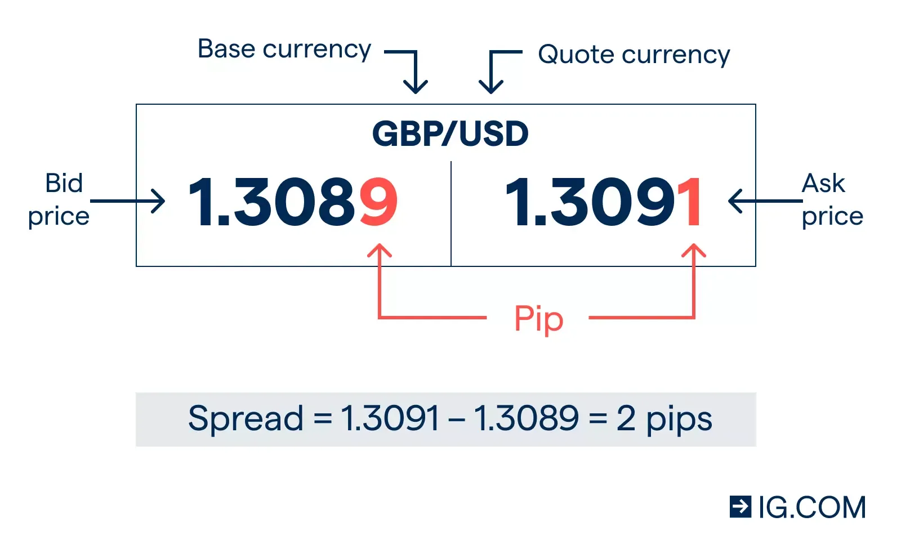

## Table of Contents

## What is a foreign currency exchange spread?

A foreign currency exchange spread is the difference between the buying rate and the selling rate of a currency. When you want to exchange one currency for another, banks or currency exchange services will offer you two rates: one rate to buy the currency from you and another rate to sell the currency to you. The spread is how these services make money, as they buy low and sell high.

Think of it like this: if you are exchanging dollars for euros, the bank might buy your dollars at a rate of 1 euro per 1.10 dollars, but sell euros to you at a rate of 1 euro per 1.15 dollars. The difference between these two rates, in this case 0.05 dollars per euro, is the spread. This spread can vary depending on the currency pair, the amount of money being exchanged, and the service provider.

## How is the spread calculated in foreign currency exchange?

The spread in foreign currency exchange is calculated by finding the difference between the buying rate and the selling rate of a currency. When you go to exchange money, you'll see two prices: one price for when the bank or exchange service buys your currency, and another price for when they sell you a different currency. The spread is simply the gap between these two prices. For example, if a bank buys your dollars at 1 euro per 1.10 dollars and sells you euros at 1 euro per 1.15 dollars, the spread is 0.05 dollars per euro.

This spread is important because it's how banks and exchange services make money. They buy currencies at a lower rate and sell them at a higher rate, pocketing the difference. The size of the spread can vary depending on several factors, like which currencies you're exchanging, how much money you're exchanging, and which service you're using. Generally, the spread is larger for less commonly traded currencies and smaller for major currencies like the US dollar or the euro.

## Why do banks and currency exchange services charge a spread?

Banks and currency exchange services charge a spread to make money. When you exchange one currency for another, they buy your currency at a lower rate and sell you the new currency at a higher rate. The difference between these two rates is the spread, and this is how they earn their profit. It's a bit like buying something at a low price and then selling it at a higher price to make a profit.

The size of the spread can change depending on a few things. For example, if you're exchanging a currency that isn't traded very often, the spread might be bigger. Also, if you're using a smaller bank or exchange service, they might charge a bigger spread to cover their costs. But if you're exchanging a common currency like the US dollar or the euro, the spread is usually smaller because these currencies are traded a lot.

## How does the spread affect the cost of currency exchange for individuals?

The spread is the difference between the buying rate and the selling rate of a currency. When you want to change your money from one currency to another, the bank or exchange service will buy your money at a lower rate and sell you the new money at a higher rate. This difference, or spread, is what they charge you. The bigger the spread, the more it costs you to exchange your money.

The spread can vary depending on the type of currency you are exchanging and where you are doing the exchange. If you are changing money into a currency that is not used very often, the spread might be bigger. Also, if you use a smaller bank or exchange service, they might charge a bigger spread to cover their costs. But if you are exchanging a common currency like the US dollar or the euro, the spread is usually smaller because these currencies are traded a lot. So, the spread can make a big difference in how much it costs you to exchange your money.

## What factors influence the size of the spread in foreign currency exchange?

The size of the spread in foreign currency exchange can be influenced by several factors. One big factor is how often the currency is traded. If you're exchanging a currency that a lot of people use, like the US dollar or the euro, the spread is usually smaller. This is because there are many buyers and sellers, so the difference between the buying and selling price is smaller. But if you're exchanging a currency that isn't traded as much, the spread can be bigger because there are fewer people buying and selling it.

Another factor that affects the spread is the type of service you use. Big banks and well-known exchange services often have smaller spreads because they do a lot of business and can afford to charge less. Smaller banks or less-known services might charge a bigger spread to cover their costs. Also, the amount of money you're exchanging can make a difference. If you're exchanging a large amount, the spread might be smaller because the service makes more money overall, even with a smaller spread.

## How can travelers minimize the impact of spreads when exchanging money?

Travelers can minimize the impact of spreads when exchanging money by choosing to use big banks or well-known exchange services. These places often have smaller spreads because they do a lot of business and can afford to charge less. It's a good idea to compare the rates at different places before you exchange your money. You might find that one place offers a better deal than another.

Another way to save money is to exchange larger amounts at once. When you exchange more money, the spread might be smaller because the service makes more money overall, even with a smaller spread. Also, try to avoid exchanging money at airports or hotels, as they often have bigger spreads. If you can, use ATMs to withdraw local currency, but be aware of any fees your bank might charge for using an ATM abroad.

## What is the difference between the bid and ask price in the context of currency spreads?

The bid and ask prices are important when you want to exchange one currency for another. The bid price is the rate at which a bank or exchange service will buy your currency from you. For example, if you have US dollars and want to exchange them for euros, the bid price might be 1 euro for every 1.10 dollars. On the other hand, the ask price is the rate at which the bank or exchange service will sell you the new currency. Using the same example, the ask price might be 1 euro for every 1.15 dollars.

The difference between the bid and ask price is called the spread. In our example, the spread is 0.05 dollars per euro. This spread is how banks and exchange services make money because they buy your currency at a lower rate and sell you the new currency at a higher rate. The size of the spread can vary depending on how often the currency is traded and the type of service you use. If you're exchanging a common currency like the US dollar or the euro, the spread is usually smaller. But if you're exchanging a less common currency, the spread might be bigger.

## How do online currency exchange platforms typically compare in terms of spreads to traditional banks?

Online currency exchange platforms often have smaller spreads than traditional banks. This is because they have lower overhead costs and can offer better rates to attract more customers. When you use an online platform, you might find that the difference between the buying and selling rate of a currency is smaller than what you would get at a bank. This means you can exchange your money for less cost.

However, it's important to check the fees that online platforms might charge. Some platforms might have low spreads but make up for it with other fees, like a transaction fee or a service fee. So, it's a good idea to look at the total cost of exchanging your money, not just the spread. By comparing the total costs at different places, you can find the best deal for your currency exchange.

## Can the spread vary depending on the currency pair being exchanged?

Yes, the spread can vary depending on the currency pair being exchanged. If you are exchanging a currency that a lot of people use, like the US dollar or the euro, the spread is usually smaller. This is because there are many buyers and sellers, so the difference between the buying and selling price is smaller. But if you are exchanging a currency that isn't traded as much, like the currency of a smaller country, the spread can be bigger because there are fewer people buying and selling it.

The size of the spread can also depend on how often the currency pair is traded. For example, if you are exchanging US dollars for euros, which is a very common trade, the spread will be smaller. But if you are exchanging US dollars for the currency of a country that doesn't trade much with the US, the spread might be bigger. So, the more common the currency pair, the smaller the spread is likely to be.

## How do market conditions affect foreign currency exchange spreads?

Market conditions can make the spread in foreign currency exchange go up or down. When the market is calm and there's a lot of trading happening, the spread usually gets smaller. This is because there are more people buying and selling, so the difference between the price to buy a currency and the price to sell it is smaller. But if the market is not calm, like during a big event or a crisis, the spread can get bigger. This is because fewer people might want to trade, so the difference between the buying and selling price gets bigger.

Also, the time of day can affect the spread. When the markets in big financial centers like London or New York are open, more trading happens, which can make the spread smaller. But when these markets are closed, like at night or on weekends, fewer people are trading, so the spread might get bigger. So, market conditions and the time of day can both change how much it costs to exchange your money.

## What strategies can businesses use to manage the risks associated with currency exchange spreads?

Businesses can manage the risks associated with currency exchange spreads by using forward contracts. A forward contract is an agreement to exchange currency at a set rate on a future date. This helps businesses know exactly how much they will pay or receive, even if the market changes. By locking in a rate, businesses can avoid the risk of the spread getting bigger and costing them more money.

Another strategy is to use currency hedging. Hedging means taking steps to protect against changes in currency values. Businesses can use financial tools like options or futures to do this. These tools let businesses buy or sell currency at a set price in the future, which can help them manage the risk of the spread changing. By using hedging, businesses can make sure they don't lose too much money if the exchange rate moves against them.

## How do regulatory environments impact the spreads offered by financial institutions?

Regulatory environments can have a big impact on the spreads offered by financial institutions. Governments and financial authorities set rules that banks and exchange services have to follow. These rules can affect how much it costs to exchange money. For example, if there are strict rules about how much money banks can keep in reserve, they might charge a bigger spread to cover their costs. Also, if there are a lot of rules about reporting and transparency, banks might pass these costs on to customers through wider spreads.

On the other hand, regulations can sometimes help keep spreads smaller. If the government makes rules to protect consumers, like setting limits on how much banks can charge for currency exchange, the spreads might be smaller. Also, if there are rules that encourage competition among banks and exchange services, this can lead to smaller spreads as companies try to offer better rates to attract more customers. So, the regulatory environment can affect spreads in different ways, depending on the specific rules and how they are enforced.

## What are the mechanics of currency exchange?

The mechanics of currency exchange are fundamental to understanding how the foreign exchange market operates. At its core, currency exchange involves the conversion of one currency into another at an agreed-upon rate, known as the exchange rate. Exchange rates are crucial as they determine the value of one currency relative to another and play a significant role in international trade and investments.

Exchange rates can be classified into two main types: direct and indirect quotes. A direct quote, also referred to as the price quotation, is the domestic currency stated as a constant, while the foreign currency is variable. For example, in the United States, a direct quote for the euro might be 1.15 USD/EUR, meaning it costs 1.15 US dollars to purchase one euro. Conversely, an indirect quote is when the foreign currency is expressed as a constant, and the domestic currency becomes variable. Using the same example, the indirect quote for the euro in the United States would be 0.87 EUR/USD, indicating that one US dollar buys 0.87 euros.

The foreign exchange market also involves cross-currency rates, which are particularly significant when a currency pair does not involve the US dollar. A cross-currency rate is derived from the relative exchange rates between two currencies against a third, commonly the US dollar. For instance, to determine the exchange rate between the euro (EUR) and the Japanese yen (JPY), one might reference the respective EUR/USD and USD/JPY rates:

$$
\text{EUR/JPY} = \frac{\text{EUR/USD}}{\text{USD/JPY}}
$$

If the EUR/USD rate is 1.15 and the USD/JPY rate is 110, then the cross rate EUR/JPY would be:

$$
\text{EUR/JPY} = \frac{1.15}{110} \approx 0.01045 
$$

Thus, one euro would approximately equal 110 yen in this scenario. Cross-currency calculations are vital in global finance for establishing rates where direct currency pairs are not extensively traded.

Currency exchange processes rely heavily on these mechanics and the understanding of exchange rates. They allow for efficient trading and facilitate a global economy where currencies from different nations can be exchanged seamlessly. Understanding these dynamics is essential for traders, investors, and businesses dealing with international transactions, as exchange rates can impact the cost and profitability of foreign exchanges and operations.

 to Forex Algorithmic Trading

Algorithmic trading in the forex market refers to the use of computer programs and algorithms to execute trades automatically. This method involves the utilization of complex mathematical models and formulas to make high-speed and precise trading decisions. The main principle behind [algorithmic trading](/wiki/algorithmic-trading) is to leverage pre-programmed instructions concerning various parameters such as timing, price, or [volume](/wiki/volume-trading-strategy) to execute currency trades far swifter than any human trader could achieve.

The scope of algorithmic trading in the forex market is wide and continuously expanding due to advancements in technology. Algorithms are designed to parse through vast amounts of data, identify trading opportunities, and execute trades based on pre-defined criteria. This automated process eliminates the need for manual intervention, thereby increasing the speed and efficiency of trades. It also allows for the execution of multiple trades simultaneously.

Automation in currency trading is achieved through the use of pre-programmed trading instructions. These instructions are composed of complex algorithms that analyze data and execute trades when market conditions meet specific criteria. For instance, an algorithm might trigger a buy order for a particular currency pair if certain technical indicators align to suggest a favorable market movement. In Python, a simple illustrative strategy using a moving average crossover might look like this:

```python
# Assuming data is a DataFrame with a 'Close' column for the currency pair prices
data['Short_MA'] = data['Close'].rolling(window=40).mean()
data['Long_MA'] = data['Close'].rolling(window=100).mean()

def generate_signals(data):
    buy_signals = []
    sell_signals = []
    position = None  # No position at start

    for i in range(len(data)):
        if data['Short_MA'][i] > data['Long_MA'][i]:
            if position != 'Long':
                buy_signals.append(data['Close'][i])
                sell_signals.append(float('nan'))
                position = 'Long'
            else:
                buy_signals.append(float('nan'))
                sell_signals.append(float('nan'))
        elif data['Short_MA'][i] < data['Long_MA'][i]:
            if position != 'Short':
                buy_signals.append(float('nan'))
                sell_signals.append(data['Close'][i])
                position = 'Short'
            else:
                buy_signals.append(float('nan'))
                sell_signals.append(float('nan'))
        else:
            buy_signals.append(float('nan'))
            sell_signals.append(float('nan'))

    data['Buy'] = buy_signals
    data['Sell'] = sell_signals
    return data
```

The rise of algorithmic trading in the forex market can be attributed to its efficiency and precision, allowing traders to capitalize on market opportunities within fractions of a second. With the ability to process and analyze large datasets faster than a human trader, algorithmic trading minimizes the risk of human error and emotional decision-making, providing an edge in volatile and fast-moving market conditions. 

In summary, the advent of algorithmic trading has introduced a paradigm shift in how currency trading is conducted, reflecting a broader trend across financial markets towards automation and data-driven decision-making.

## How can one develop profitable forex trading algorithms?

Developing profitable forex trading algorithms is a multi-faceted task that requires a blend of strategic foresight, technical expertise, and disciplined risk management. The foundational component of a successful algorithm is a well-defined strategy. This begins by identifying a clear trading objective, which could range from capital appreciation to hedging against currency risk. Strategy development entails setting specific rules for entering and exiting trades, which must be grounded in technical and data analysis.

Technical analysis involves examining past market data, primarily price and volume, to anticipate future price movements. Successful algorithm design often incorporates technical indicators such as moving averages, MACD (Moving Average Convergence Divergence), and RSI (Relative Strength Index). For example, an algorithm might be programmed to enter a trade when a short-term moving average crosses above a long-term moving average, indicating a potential uptrend.

Data analysis in algorithmic trading leverages vast datasets, including historical price data, economic indicators, and even news headlines. Machine learning techniques can enhance this process by identifying patterns not immediately apparent to human traders. Python, with its extensive libraries such as pandas for data manipulation, scikit-learn for [machine learning](/wiki/machine-learning), and TA-Lib for technical analysis, is a popular choice for developing such trading algorithms. Here's a basic example of using Python for a simple moving average crossover strategy:

```python
import pandas as pd

def moving_average_crossover(data, short_window=40, long_window=100):
    data['Short_MA'] = data['Close'].rolling(window=short_window, min_periods=1).mean()
    data['Long_MA'] = data['Close'].rolling(window=long_window, min_periods=1).mean()

    data['Signal'] = 0
    data['Signal'][short_window:] = np.where(data['Short_MA'][short_window:] > data['Long_MA'][short_window:], 1, 0)
    data['Position'] = data['Signal'].diff()

    return data
```

Incorporating risk management is crucial for the longevity of forex trading algorithms. Effective risk management includes position sizing, setting stop-loss orders, and managing leverage. Algorithms are designed to take calculated risks, not arbitrary ones. For instance, stop-loss orders can be programmed to automatically close a position if the market moves against it by a certain percentage, thus capping potential losses.

Moreover, the Sharpe Ratio, a measure of risk-adjusted return, can be used to evaluate the performance of a trading algorithm. It's calculated as:

$$
\text{Sharpe Ratio} = \frac{E[R_a - R_f]}{\sigma_a}
$$

Where $E[R_a - R_f]$ is the expected return of the portfolio above the risk-free rate, and $\sigma_a$ is the standard deviation of the excess return.

Risk management also extends to ensuring the algorithm is robust enough to handle varying market conditions. This involves backtesting strategies on historical data to evaluate potential performance and stress testing under extreme conditions. By continuously monitoring and adjusting these algorithms, traders can better navigate the inherent uncertainties of the forex market and improve their potential for profitability.

## References & Further Reading

[1]: Bergstra, J., Bardenet, R., Bengio, Y., & Kégl, B. (2011). ["Algorithms for Hyper-Parameter Optimization."](https://dl.acm.org/doi/10.5555/2986459.2986743) Advances in Neural Information Processing Systems 24.

[2]: ["Advances in Financial Machine Learning"](https://www.amazon.com/Advances-Financial-Machine-Learning-Marcos/dp/1119482089) by Marcos Lopez de Prado

[3]: ["Evidence-Based Technical Analysis: Applying the Scientific Method and Statistical Inference to Trading Signals"](https://www.amazon.com/Evidence-Based-Technical-Analysis-Scientific-Statistical/dp/0470008741) by David Aronson

[4]: ["Machine Learning for Algorithmic Trading"](https://github.com/PacktPublishing/Machine-Learning-for-Algorithmic-Trading-Second-Edition) by Stefan Jansen

[5]: ["Quantitative Trading: How to Build Your Own Algorithmic Trading Business"](https://books.google.com/books/about/Quantitative_Trading.html?id=j70yEAAAQBAJ) by Ernest P. Chan