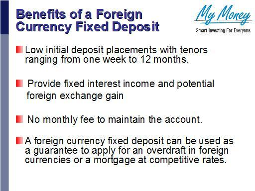

## Table of Contents

## What is a Foreign Currency Fixed Deposit?

A Foreign Currency Fixed Deposit (FCFD) is a type of savings account where you keep money in a foreign currency for a fixed period of time. You can't take the money out until the time is up, which can be anywhere from a few months to a few years. Banks offer FCFDs in currencies like US dollars, Euros, or British pounds. People often use FCFDs if they want to save money in a different currency or if they are planning to travel or move to another country.

When you put money into an FCFD, the bank will pay you interest on your deposit. The interest rate can be different depending on the currency and the length of time you choose. FCFDs can be a good way to protect your money from changes in currency values. If the currency you choose gets stronger compared to your home currency, you might get more money when you convert it back. However, there is also a risk that the currency could get weaker, which means you might get less money when you convert it back.

## How does a Foreign Currency Fixed Deposit work?

A Foreign Currency Fixed Deposit (FCFD) is a type of savings account where you put your money in a currency that's not from your own country. You choose how long you want to keep your money in the account, which can be from a few months up to several years. During this time, you can't take your money out. Banks offer FCFDs in many different currencies like US dollars, Euros, or British pounds. People use FCFDs if they want to save in a different currency or if they plan to travel or move to another country.

When you put money into an FCFD, the bank will give you interest on your deposit. The amount of interest you get depends on the currency you choose and how long you keep your money in the account. FCFDs can help protect your money if the currency you choose becomes stronger compared to your home currency. This means you might get more money when you change it back to your home currency. But there's also a risk that the currency could become weaker, which means you might get less money when you convert it back.

## What are the common currencies used in Foreign Currency Fixed Deposits?

Foreign Currency Fixed Deposits (FCFDs) are often made in popular global currencies. Some of the most common currencies used for FCFDs are the US dollar, the Euro, and the British pound. These currencies are widely used in international trade and are considered stable, which makes them popular choices for people who want to save in a different currency.

Other currencies that are sometimes used for FCFDs include the Australian dollar, the Canadian dollar, the Singapore dollar, and the Swiss franc. These currencies are also seen as stable and can be a good choice depending on where you plan to travel or move. The choice of currency can depend on your personal needs and the economic conditions at the time you open the deposit.

## What are the advantages of investing in a Foreign Currency Fixed Deposit?

Investing in a Foreign Currency Fixed Deposit can offer some benefits. One big advantage is that it can help you protect your money from changes in currency values. If the foreign currency you choose gets stronger compared to your home currency, you might get more money when you convert it back. This can be useful if you plan to travel or move to a country that uses that currency. Also, if your home currency is going through a tough time, keeping your money in a different currency might be safer.

Another advantage is that FCFDs can offer good interest rates. Sometimes, the interest rates for foreign currencies are higher than what you can get with your home currency. This means you could earn more money on your savings. Plus, because you can't take the money out until the fixed period is over, it helps you save without the temptation to spend. This can be a good way to build up savings over time.

## How do interest rates for Foreign Currency Fixed Deposits compare to local currency fixed deposits?

Interest rates for Foreign Currency Fixed Deposits can be different from the rates you get with local currency fixed deposits. Sometimes, the interest rates for foreign currencies can be higher than what you can get with your home currency. This happens because banks want to attract money in foreign currencies, so they offer better rates. But it's not always the case. The rates can change depending on the economic conditions of the country whose currency you are using and the global financial market.

On the other hand, local currency fixed deposits might offer lower interest rates but come with less risk. When you save in your own currency, you don't have to worry about changes in exchange rates. This means you know exactly how much money you will get back at the end of the term. With foreign currency fixed deposits, there's a chance that the currency could get weaker, and you might get less money when you convert it back to your home currency. So, you need to think about both the potential for higher interest and the risk of currency changes when deciding which type of deposit is best for you.

## What are the risks associated with Foreign Currency Fixed Deposits?

One risk of Foreign Currency Fixed Deposits is that the currency you choose might get weaker compared to your home currency. If this happens, you could get less money when you convert it back. This is called exchange rate risk. For example, if you save in US dollars and the dollar becomes weaker compared to your home currency, you might lose money when you change it back. This risk can be hard to predict because it depends on many things like the economy of the country whose currency you are using and global financial markets.

Another risk is that the interest rates for Foreign Currency Fixed Deposits can change. Sometimes, the rates might not be as good as you expected. If the rates go down, you might not earn as much money as you hoped. Also, if the country whose currency you are using has economic problems, it could affect the safety of your deposit. Even though banks are usually safe, there is always a small chance that something could go wrong. So, it's important to think about these risks before you decide to invest in a Foreign Currency Fixed Deposit.

## How can one mitigate the risks of Foreign Currency Fixed Deposits?

To lower the risks of Foreign Currency Fixed Deposits, you can do a few things. First, it's a good idea to keep an eye on the exchange rates of the currency you want to save in. If you see that the currency is getting weaker, you might want to wait before putting your money in. Also, try to spread your money around by saving in more than one currency. This way, if one currency loses value, you might still be okay with the others.

Another way to reduce risk is to choose currencies from countries with strong and stable economies. Countries like the United States, the European Union, and Switzerland usually have more stable currencies. You can also look at the interest rates offered by different banks and pick the ones that seem the safest and give you the best return. Remember, no investment is completely safe, but by being careful and doing your research, you can make smarter choices with your money.

## What are the eligibility criteria for opening a Foreign Currency Fixed Deposit account?

To open a Foreign Currency Fixed Deposit account, you usually need to be at least 18 years old. Some banks might also let you open an account if you're younger, but you'll need a parent or guardian to help. You'll also need to show some documents like your ID, proof of address, and sometimes proof of income. Banks want to make sure you're who you say you are and that you can handle the account.

Another thing to think about is the minimum amount of money you need to start the account. This can be different depending on the bank and the currency you choose. Some banks might ask for a bigger amount for certain currencies. It's a good idea to check with the bank to see what they need before you start.

## How do tax implications affect Foreign Currency Fixed Deposit earnings?

When you earn money from a Foreign Currency Fixed Deposit, you might have to pay taxes on the interest you get. The tax rules can be different depending on where you live and where the bank is located. In many places, the interest you earn from a Foreign Currency Fixed Deposit is seen as income, and you'll need to report it on your tax return. This means you might have to pay income tax on that money. Sometimes, the bank will take out some tax before they give you the interest, but other times you'll need to figure out how much tax you owe yourself.

Another thing to think about is if you make money or lose money because of changes in the exchange rate. If the currency you saved in gets stronger and you get more money when you change it back to your home currency, that extra money might be taxed as well. On the other hand, if you lose money because the currency gets weaker, you might be able to use that loss to lower your taxes. It's a good idea to talk to a tax advisor to understand how these rules apply to you and make sure you're following the law.

## What are the typical terms and conditions of Foreign Currency Fixed Deposits?

When you open a Foreign Currency Fixed Deposit, you agree to keep your money in the account for a certain time, like a few months or a few years. During this time, you can't take your money out. If you do need to take it out early, you might have to pay a fee or lose some of the interest you've earned. The bank will tell you the interest rate you'll get, and it usually stays the same for the whole time your money is in the account. You also need to put in a minimum amount of money to start the account, and this can be different depending on the bank and the currency you choose.

The terms and conditions also include rules about what happens if you want to renew the deposit or if you want to change the currency. Some banks might let you renew the deposit automatically when it ends, but you need to check the rules. If you want to change the currency, you might have to close the old account and open a new one, which could mean paying fees or losing some money because of exchange rates. It's important to read all the terms and conditions carefully so you know what you're agreeing to and can make the best choice for your savings.

## How do Foreign Currency Fixed Deposits fit into a diversified investment portfolio?

Foreign Currency Fixed Deposits can be a good part of a diversified investment portfolio because they offer a way to save money in different currencies. When you spread your money across different types of investments, like stocks, bonds, and savings accounts, you can lower your risk. If one type of investment goes down in value, the others might still do well. By putting some of your money into a Foreign Currency Fixed Deposit, you can protect yourself from changes in your home currency's value. If your home currency gets weaker, having money in a stronger foreign currency might help you keep more of your savings.

Another way Foreign Currency Fixed Deposits can help is by offering different interest rates. Sometimes, the interest rates for foreign currencies are higher than what you can get with your home currency. This means you could earn more money on your savings. Adding Foreign Currency Fixed Deposits to your portfolio can also give you more options for when you need to use the money. If you plan to travel or move to another country, having savings in that country's currency can be really helpful. Overall, Foreign Currency Fixed Deposits can make your investment portfolio stronger and more flexible.

## What advanced strategies can be used to maximize returns from Foreign Currency Fixed Deposits?

One advanced strategy to maximize returns from Foreign Currency Fixed Deposits is to use a laddering approach. This means you split your money into several smaller deposits, each with a different end date. For example, you might put some money into a deposit that lasts for 3 months, some for 6 months, and some for a year. When each deposit ends, you can decide whether to take the money out or put it into a new deposit. This way, you can take advantage of changing interest rates and exchange rates. If rates go up, you can put your money into a new deposit with a higher rate. If rates go down, you still have some money earning the higher rate from before.

Another strategy is to keep an eye on the economic conditions of the countries whose currencies you are using. If you think a currency is going to get stronger, you might want to put more money into a deposit in that currency. You can use news and financial reports to help you make these decisions. Also, some people use a technique called currency hedging to protect their money from big changes in exchange rates. This can be a bit complicated and might cost some money, but it can help you keep more of your savings safe. By combining these strategies, you can try to get the most out of your Foreign Currency Fixed Deposits.

## What is a Foreign Currency Fixed Deposit (FCFD) and how does it work?

Foreign Currency Fixed Deposits (FCFDs) represent a specialized banking instrument that combines the principles of traditional fixed deposits with the complexities of foreign currency markets. Unlike traditional fixed deposits that are held in the local currency, FCFDs are denominated in foreign currencies, which introduces a dimension of exchange rate variability alongside the usual interest income.

### What Constitutes an FCFD in Banking?

An FCFD involves depositing a fixed sum of money in a foreign currency with a financial institution for a specified period, at an agreed-upon [interest rate](/wiki/interest-rate-trading-strategies). This rate is often competitive relative to domestic fixed deposits due to additional risks and market dynamics associated with foreign currencies. At the end of the tenure, the initial deposit along with the accrued interest is returned in the same foreign currency.

### The Mechanics of FCFDs: How They Operate and Their Risk Profiles

FCFDs operate on simple banking principles where investors select a currency in which to deposit their funds. The bank then offers a fixed interest rate depending on the currency and the duration of the deposit, usually ranging from a few months to several years. The interest is calculated based on the principal amount and the agreed rate over the deposit period. 

An example of interest calculation for an FCFD can be represented by the formula:

$$
\text{Interest} = P \times r \times t
$$

where $P$ is the principal amount, $r$ is the annual interest rate, and $t$ is the time in years.

Risks associated with FCFDs are primarily centered around currency fluctuations. Since these deposits are in foreign currency, they are subject to exchange rate [volatility](/wiki/volatility-trading-strategies). A depreciating domestic currency relative to the deposit currency can enhance returns, while an appreciating domestic currency could diminish them.

### Exchange Rate Risks Associated with FCFDs

Exchange rate risk is a significant [factor](/wiki/factor-investing) in FCFDs. This risk arises from potential fluctuations in the exchange rate between the domestic currency and the foreign currency of the deposit. Investors face the risk that at maturity, currency conversion might lead to lesser gains or even losses when translated back into the domestic currency. For example, if an investor holds a deposit in USD and the exchange rate moves unfavorably against their domestic currency, the final converted amount could be less than expected.

### Comparing FCFDs with Traditional Fixed Deposits

FCFDs differ from traditional fixed deposits mainly due to their exposure to exchange rate risk. While both types of deposits offer fixed interest rates, the return in FCFDs is impacted by currency movements, making them more volatile in terms of returns. Conversely, traditional fixed deposits are insulated from such risks, providing a more stable, albeit lower, interest income.

Moreover, FCFDs can offer higher interest rates compared to domestic fixed deposits, compensating for the additional currency risk. This makes them an attractive option for investors looking to diversify their portfolio and potentially benefit from favorable currency movements.

In conclusion, FCFDs offer a distinctive combination of interest income and currency exposure, appealing to risk-tolerant investors seeking diversification and potential currency appreciation gains. However, they require careful consideration of exchange rate trends and potential impacts on overall return.

## What are the risks and management strategies?

Foreign Currency Fixed Deposits (FCFDs) and algorithmic trading in the forex market present several risks that investors must manage effectively. Understanding these risks and implementing effective management strategies is key to stabilizing returns and ensuring the success of investment portfolios.

### Exploring the Risks Inherent in FCFD and Algo Trading

FCFDs are susceptible to exchange rate risks as they involve deposits in foreign currencies whose value relative to the investor’s domestic currency can fluctuate. This volatility may lead to potential losses if the foreign currency depreciates against the investor's home currency upon maturity of the deposit.

Algorithmic trading, while offering precision and speed, carries its own set of risks. These include the possibility of technical errors or unforeseen market events that can result in significant financial losses. Moreover, algorithmic models rely heavily on historical data, which may not always accurately predict future market conditions.

### Risk Management Techniques for Minimizing Exchange Rate Losses

To manage exchange rate risks effectively, investors can employ several strategies. Hedging is one of the primary techniques, which involves taking offsetting positions in derivatives such as futures or options to protect against adverse currency movements. This strategy helps lock in exchange rates and minimizes potential losses.

Another management technique is to choose currencies with a historical stability track record. Conducting thorough research and analysis of geopolitical and economic factors can provide insight into potential currency behavior, helping in making informed decisions.

### Using Diversified Currency Portfolios to Stabilize Returns

Diversification is a well-recognized strategy in risk management. By investing in a diversified FCFD portfolio composed of multiple foreign currencies, investors can spread risk across different currency exposures. This approach reduces the impact of a single currency's adverse movement on the overall portfolio return.

Creating a diversified currency portfolio might involve selecting a mix of emerging and developed market currencies, balancing high-risk, high-reward options with more stable choices. To mathematically demonstrate the benefits of diversification, one might consider the variance of returns ($\sigma^2$) of a portfolio with multiple currencies. The formula can be given by:

$$
\sigma^2_p = \sum_{i=1}^{n} w_i^2 \sigma_i^2 + 2 \sum_{i=1}^{n} \sum_{j=i+1}^{n} w_i w_j \text{Cov}(R_i, R_j)
$$

where $w_i$ and $w_j$ are the weights of currencies $i$ and $j$ in the portfolio, $\sigma_i^2$ is the variance of currency $i$, and $\text{Cov}(R_i, R_j)$ is the covariance between returns of currencies $i$ and $j$.

### The Importance of Continuous Monitoring and Strategy Adjustments

Continuous monitoring of both FCFD investments and algorithmic trading strategies is crucial. Markets are dynamic, and strategies that perform well under certain conditions might become obsolete as market dynamics shift. Regularly recalibrating algorithmic models and re-assessing the external economic environment ensures that strategies remain relevant.

Adjustments may involve modifying algorithm parameters to better align with prevailing market conditions or reallocating funds to different currencies in an FCFD portfolio based on updated analyses. Modern technology provides tools and platforms for real-time monitoring, allowing investors and traders to react promptly to changes.

In summary, managing risks in FCFD and algo trading involves a combination of hedging to limit potential losses, diversification to balance risks, and continuous monitoring to adapt strategies to evolving market conditions. Adaptive management enables investors to navigate the complexities of the forex market effectively, thereby stabilizing returns and maximizing the benefits from their investments.

## References & Further Reading

[1]: Bhatti, S. I. (2014). ["Risk Management Strategies for Foreign Exchange Markets"](https://www.semanticscholar.org/paper/FINANCIAL-MARKET-VOLATILITY-AND-RISK-MANAGEMENT-Bhatti/3df1668639f98c6f16239e845727948dd294d453). Palgrave Macmillan.

[2]: Hull, J. C. (2018). ["Options, Futures, and Other Derivatives"](https://www.semanticscholar.org/paper/Options%2C-Futures%2C-and-Other-Derivatives-Hull/89bdee500c8623864fc9eb7a471546aa713acc44) (10th Edition). Pearson.

[3]: ["Algorithmic Trading and DMA: An Introduction to Direct Access Trading Strategies"](https://www.amazon.com/Algorithmic-Trading-DMA-introduction-strategies/dp/0956399207) by Barry Johnson

[4]: Ramazon, E., & Ali, S. (2018). ["Portfolio Diversification Benefits from Foreign Currency Fixed Deposits"](https://www.researchgate.net/publication/350073576_Portfolio_diversification_benefits_of_alternative_currency_investment_in_Bitcoin_and_foreign_exchange_markets). Journal of International Financial Markets, Institutions, and Money.

[5]: Engel, C. (2016). ["Exchange Rates and Interest Parity"](https://www.ssc.wisc.edu/~cengel/PublishedPapers/AERExchangeRates.pdf). National Bureau of Economic Research.

[6]: Bridges, S. (2019). ["Foreign Exchange Volatility and Algorithmic Trading"](https://www.sciencedirect.com/science/article/pii/S0148296323005155). The European Journal of Finance.