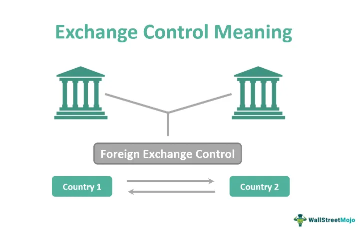

A Fixed Deposit (FD) is a financial instrument provided by banks or non-banking financial institutions, offering investors a higher interest rate than a regular savings account until the given maturity date. The investor deposits a sum of money for a fixed tenure, receiving interest typically compounded annually. Upon maturity, the principal amount along with interest is returned to the investor.

A Foreign Currency Fixed Deposit (FCFD) operates similarly to a domestic fixed deposit but is denominated in a foreign currency. Investors deposit a specific currency at a fixed interest rate, and the principal and interest are repaid in the same currency at maturity. FCFDs provide an opportunity to diversify currency exposure and potentially benefit from currency appreciation. However, they also introduce exchange rate risks, as changes in currency value can impact returns when converting back to the investor's home currency.



The unique elements of FCFDs include exchange rate fluctuations and interest rate differentials between currencies. For instance, an appreciation of the foreign currency relative to the investor's domestic currency enhances returns, while depreciation can erode gains. The potential for higher interest rates in certain currencies offers attractive opportunities but also emphasizes the importance of evaluating economic indicators and geopolitical stability.

Diversification in investment portfolios is crucial for risk management and optimizing returns. By allocating investments across various asset classes and currencies, investors can mitigate risks associated with market volatility or economic downturns. FCFDs serve as a valuable diversification tool by adding currency variation to portfolios, thus providing a hedge against domestic inflation and currency depreciation.

Integrating FCFD investments with foreign currency algorithmic trading offers several advantages. Algorithmic trading utilizes computer algorithms to execute trades based on predefined criteria, allowing for precise and swift transactions in the forex market. By leveraging FCFDs alongside algorithmic trading, investors can potentially enhance returns while minimizing risks. Algorithmic strategies can capitalize on currency volatility for profit, while FCFDs provide stability and predictable returns. This synergy enables investors to optimize their forex market exposure, balancing risks and rewards effectively.

In summary, Fixed Deposits and Foreign Currency Fixed Deposits are pivotal components of investment portfolios, offering a blend of stability and potential currency-based gains. Understanding their mechanics, risks, and role in diversification can empower investors to make informed decisions. Combining FCFDs with cutting-edge algorithmic trading techniques further enhances the capability to navigate the dynamic landscape of global currencies.

## Table of Contents

## Understanding Foreign Currency Fixed Deposit (FCFD)

Foreign Currency Fixed Deposits (FCFDs) represent a specialized banking instrument that combines the principles of traditional fixed deposits with the complexities of foreign currency markets. Unlike traditional fixed deposits that are held in the local currency, FCFDs are denominated in foreign currencies, which introduces a dimension of exchange rate variability alongside the usual interest income.

### What Constitutes an FCFD in Banking?

An FCFD involves depositing a fixed sum of money in a foreign currency with a financial institution for a specified period, at an agreed-upon [interest rate](/wiki/interest-rate-trading-strategies). This rate is often competitive relative to domestic fixed deposits due to additional risks and market dynamics associated with foreign currencies. At the end of the tenure, the initial deposit along with the accrued interest is returned in the same foreign currency.

### The Mechanics of FCFDs: How They Operate and Their Risk Profiles

FCFDs operate on simple banking principles where investors select a currency in which to deposit their funds. The bank then offers a fixed interest rate depending on the currency and the duration of the deposit, usually ranging from a few months to several years. The interest is calculated based on the principal amount and the agreed rate over the deposit period. 

An example of interest calculation for an FCFD can be represented by the formula:

$$
\text{Interest} = P \times r \times t
$$

where $P$ is the principal amount, $r$ is the annual interest rate, and $t$ is the time in years.

Risks associated with FCFDs are primarily centered around currency fluctuations. Since these deposits are in foreign currency, they are subject to exchange rate [volatility](/wiki/volatility-trading-strategies). A depreciating domestic currency relative to the deposit currency can enhance returns, while an appreciating domestic currency could diminish them.

### Exchange Rate Risks Associated with FCFDs

Exchange rate risk is a significant [factor](/wiki/factor-investing) in FCFDs. This risk arises from potential fluctuations in the exchange rate between the domestic currency and the foreign currency of the deposit. Investors face the risk that at maturity, currency conversion might lead to lesser gains or even losses when translated back into the domestic currency. For example, if an investor holds a deposit in USD and the exchange rate moves unfavorably against their domestic currency, the final converted amount could be less than expected.

### Comparing FCFDs with Traditional Fixed Deposits

FCFDs differ from traditional fixed deposits mainly due to their exposure to exchange rate risk. While both types of deposits offer fixed interest rates, the return in FCFDs is impacted by currency movements, making them more volatile in terms of returns. Conversely, traditional fixed deposits are insulated from such risks, providing a more stable, albeit lower, interest income.

Moreover, FCFDs can offer higher interest rates compared to domestic fixed deposits, compensating for the additional currency risk. This makes them an attractive option for investors looking to diversify their portfolio and potentially benefit from favorable currency movements.

In conclusion, FCFDs offer a distinctive combination of interest income and currency exposure, appealing to risk-tolerant investors seeking diversification and potential currency appreciation gains. However, they require careful consideration of exchange rate trends and potential impacts on overall return.

## Benefits of Foreign Currency Fixed Deposit

Foreign Currency Fixed Deposits (FCFDs) offer distinct advantages that can enhance investment portfolios in various ways. These deposits allow investors to hold funds in currencies different from their domestic currency, leading to several beneficial outcomes. 

**Portfolio Diversification through FCFD Investments**

Investing in FCFDs provides an effective means of diversifying portfolios. By holding assets in multiple currencies, investors reduce their reliance on any single economic region, thereby spreading the risk. Diversification helps in mitigating country-specific risks such as political instability, inflation, and economic downturns. As different currencies may have varying correlations with global economic cycles, FCFDs can cushion against localized economic shocks and enhance overall portfolio stability.

**Hedging Against Currency Fluctuations Using FCFDs**

Currency markets can be volatile, and exchange rates fluctuate due to numerous factors including changes in interest rates, economic indicators, and geopolitical events. FCFDs can serve as a hedge against such fluctuations. By strategically selecting currencies that are expected to appreciate or remain stable, investors can protect their investments from adverse currency movements. For instance, if an investor expects their domestic currency to weaken, holding FCFDs in a stronger foreign currency can offset potential losses in purchasing power.

**Access to Higher Interest Rates from Larger and Longer FCFDs**

FCFDs may offer higher interest rates compared to domestic fixed deposits, especially when invested in countries with higher prevailing interest rates. This is particularly true for larger deposits and longer-term commitments. Investing in economies with robust growth prospects and higher interest rates not only yields higher returns but also takes advantage of favorable interest differentials. For example, if a country has a 5% interest rate while another offers 7%, holding an FCFD in the latter can yield superior returns.

**The Role of FCFDs in Cross-Currency Business Transactions**

For businesses engaged in international trade, FCFDs can play a pivotal role in managing foreign exchange exposures and optimizing cash flows. By holding deposits in the currency of their trading partner, businesses can reduce exchange rate conversion costs and mitigate the risks associated with currency price volatility. Additionally, businesses can leverage FCFDs to secure better terms in future cross-border transactions by demonstrating financial stability backed by diversified currency holdings.

In essence, the strategic use of Foreign Currency Fixed Deposits not only enhances portfolio resilience through diversification but also offers a safeguard against currency risks and an opportunity to earn higher returns. These attributes make FCFDs a valuable component in both personal and corporate financial strategies.

## Foreign Currency Algo Trading: An Overview

Algorithmic trading, commonly referred to as algo trading, is an innovative practice in the [forex](/wiki/forex-system) market that uses computer algorithms to execute trades based on predetermined criteria. These algorithms analyze vast volumes of market data to identify trading opportunities, allowing for rapid execution of trades, often without human intervention. The growing complexity and speed of the forex market have made algo trading not only advantageous but essential for many traders.

One of the primary ways algo trading enhances the forex trading process is through its technological leverage. By employing sophisticated algorithms, traders can manage and process extensive data sets to predict market trends and execute trades with precision. Algorithms can factor in variables such as price, timing, and [volume](/wiki/volume-trading-strategy), offering a distinct edge over traditional trading methods. Furthermore, technology enables [backtesting](/wiki/backtesting) strategies against historical data, allowing traders to refine their approaches and optimize performance before deploying real capital.

The synergy between algo trading and Foreign Currency Fixed Deposits (FCFDs) is an emerging area of interest. Both mechanisms aim to optimize returns while mitigating risks, albeit through different methodologies. While FCFDs provide investors with a fixed interest income in foreign currencies, algo trading offers dynamic market engagement and the potential for capital appreciation. By integrating [algorithmic trading](/wiki/algorithmic-trading) with FCFDs, investors can enhance currency diversification and manage exchange rate risks more effectively. This integration allows for a balanced approach, combining the stability of fixed returns with the growth prospects of currency trading.

Several key strategies are prominent in foreign currency algo trading. Trend-following strategies, for instance, capitalize on the inherent [momentum](/wiki/momentum) in forex markets by trading in the direction of prevailing trends. Mean reversion strategies, conversely, are based on the premise that asset prices will revert to their historical averages. These strategies involve buying currencies that are undervalued and selling those that are overvalued, anticipating a return to the mean.

Moreover, [arbitrage](/wiki/arbitrage) strategies explore price discrepancies in different markets or timeframes, executing trades to profit from these inefficiencies. High-frequency trading ([HFT](/wiki/high-frequency-trading-strategies)), a subset of algo trading, executes a large number of orders at extremely fast speeds to benefit from small price movements.

The mathematical and computational prowess required for algo trading can be exemplified through the use of [machine learning](/wiki/machine-learning) models. For instance, algorithms can be trained to predict currency movements by analyzing historical data patterns, leveraging Python for machine learning libraries such as Scikit-learn or TensorFlow.

```python
from sklearn.model_selection import train_test_split
from sklearn.linear_model import LinearRegression
import numpy as np

# Example currency data
X = np.array([[1, 2, 3], [4, 5, 6], [7, 8, 9]])  # Feature set
y = np.array([3, 6, 9])  # Target values

# Splitting the data
X_train, X_test, y_train, y_test = train_test_split(X, y, test_size=0.2, random_state=42)

# Linear regression model
model = LinearRegression()
model.fit(X_train, y_train)

# Predicting future movements
predictions = model.predict(X_test)
```

Overall, the integration of advanced algorithmic strategies in forex trading not only enhances the efficiency and effectiveness of trades but also provides a robust framework for managing the inherent risks of currency exchange markets.

## Integrating FCFD Benefits with Algo Trading

Foreign Currency Fixed Deposits (FCFDs) offer unique benefits that can be effectively integrated with algorithmic trading strategies to optimize trading outcomes in the volatile forex markets. This integration can significantly enhance portfolio returns while managing associated risks.

Leveraging FCFDs within algorithmic trading strategies involves using these deposits as a stable financial base. The fixed interest rates provided by FCFDs can mitigate some of the unpredictability inherent in currency trading. By securing a portion of assets in a stable currency through FCFDs, traders can allocate resources more confidently to high-frequency trading strategies, knowing there is a cushion in place.

Mitigating risks from currency fluctuations is a significant advantage of combining FCFDs with algorithmic trading. FCFDs, denominated in multiple currencies, allow investors to diversify their holdings, thus providing a hedge against adverse currency movements. Furthermore, algorithmic trading systems can be programmed to account for and exploit currency inefficiencies by signaling trades when systematic opportunities arise, maintaining balance through the stability provided by FCFDs.

There are notable examples of successful integration of these financial tools. For instance, an investment firm using FCFDs as part of their base capital has developed an algorithm that dynamically adjusts currency holdings, switching between currencies based on predictive market models. This integration has resulted in improved yield performance, even when forex markets experienced significant volatility.

For investors aiming to combine FCFD benefits with algorithmic trading, several best practices should be observed:

1. **Risk Assessment**: Investors should conduct thorough risk assessments to understand the risk-return profile of each currency involved in their FCFD strategy. This understanding can inform the algorithmic models used in trading.

2. **Diversification**: Maintaining a diversified currency portfolio within FCFDs can help stabilize returns and offset losses from adverse movements in any single currency.

3. **Algorithmic Efficiency**: Algorithms should be designed to scan for broader market indicators, such as geopolitical developments or macroeconomic shifts, that could affect currency values, allowing for dynamic reallocation of funds when necessary.

4. **Regular Monitoring**: Continuous monitoring and revision of both FCFD allocations and trading algorithms ensure they remain responsive to current market conditions. This adaptability is key to successful integration.

5. **Data Utilization**: Successful strategies often involve leveraging vast amounts of historical and real-time data to refine predictive models, thus enhancing decision-making processes.

In summary, the confluence of the fixed and secure structure of FCFDs with the technological precision of algorithmic trading can open pathways for optimized investment outcomes. This strategic combination offers investors avenues to maximize returns while adeptly managing the associated risks of currency market participation.

## Risks and Management Strategies

Foreign Currency Fixed Deposits (FCFDs) and algorithmic trading in the forex market present several risks that investors must manage effectively. Understanding these risks and implementing effective management strategies is key to stabilizing returns and ensuring the success of investment portfolios.

### Exploring the Risks Inherent in FCFD and Algo Trading

FCFDs are susceptible to exchange rate risks as they involve deposits in foreign currencies whose value relative to the investor’s domestic currency can fluctuate. This volatility may lead to potential losses if the foreign currency depreciates against the investor's home currency upon maturity of the deposit.

Algorithmic trading, while offering precision and speed, carries its own set of risks. These include the possibility of technical errors or unforeseen market events that can result in significant financial losses. Moreover, algorithmic models rely heavily on historical data, which may not always accurately predict future market conditions.

### Risk Management Techniques for Minimizing Exchange Rate Losses

To manage exchange rate risks effectively, investors can employ several strategies. Hedging is one of the primary techniques, which involves taking offsetting positions in derivatives such as futures or options to protect against adverse currency movements. This strategy helps lock in exchange rates and minimizes potential losses.

Another management technique is to choose currencies with a historical stability track record. Conducting thorough research and analysis of geopolitical and economic factors can provide insight into potential currency behavior, helping in making informed decisions.

### Using Diversified Currency Portfolios to Stabilize Returns

Diversification is a well-recognized strategy in risk management. By investing in a diversified FCFD portfolio composed of multiple foreign currencies, investors can spread risk across different currency exposures. This approach reduces the impact of a single currency's adverse movement on the overall portfolio return.

Creating a diversified currency portfolio might involve selecting a mix of emerging and developed market currencies, balancing high-risk, high-reward options with more stable choices. To mathematically demonstrate the benefits of diversification, one might consider the variance of returns ($\sigma^2$) of a portfolio with multiple currencies. The formula can be given by:

$$
\sigma^2_p = \sum_{i=1}^{n} w_i^2 \sigma_i^2 + 2 \sum_{i=1}^{n} \sum_{j=i+1}^{n} w_i w_j \text{Cov}(R_i, R_j)
$$

where $w_i$ and $w_j$ are the weights of currencies $i$ and $j$ in the portfolio, $\sigma_i^2$ is the variance of currency $i$, and $\text{Cov}(R_i, R_j)$ is the covariance between returns of currencies $i$ and $j$.

### The Importance of Continuous Monitoring and Strategy Adjustments

Continuous monitoring of both FCFD investments and algorithmic trading strategies is crucial. Markets are dynamic, and strategies that perform well under certain conditions might become obsolete as market dynamics shift. Regularly recalibrating algorithmic models and re-assessing the external economic environment ensures that strategies remain relevant.

Adjustments may involve modifying algorithm parameters to better align with prevailing market conditions or reallocating funds to different currencies in an FCFD portfolio based on updated analyses. Modern technology provides tools and platforms for real-time monitoring, allowing investors and traders to react promptly to changes.

In summary, managing risks in FCFD and algo trading involves a combination of hedging to limit potential losses, diversification to balance risks, and continuous monitoring to adapt strategies to evolving market conditions. Adaptive management enables investors to navigate the complexities of the forex market effectively, thereby stabilizing returns and maximizing the benefits from their investments.

## Conclusion

The integration of Foreign Currency Fixed Deposits (FCFDs) with foreign currency algorithmic trading presents a multifaceted approach to investment that capitalizes on the respective strengths of each component. By combining FCFD's ability to offer hedging against currency fluctuations and access to potentially higher interest rates with the precision and speed of algo trading, investors can enhance their portfolio's resilience and performance. This strategic alliance allows for a diversified currency portfolio that is better equipped to manage risks and leverage opportunities in the fast-paced forex market.

Looking forward, several trends are poised to influence the FCFD and forex markets. The increased digitalization of banking and trading services is expected to reduce barriers to entry for retail investors, enabling more widespread participation in these sophisticated investment strategies. Additionally, advancements in [artificial intelligence](/wiki/ai-artificial-intelligence) and machine learning could further refine algorithmic trading strategies, offering new avenues for achieving optimal currency trade executions. The global economic landscape, with its inherent uncertainties, may also drive more investors towards these integrated strategies as a method of risk management and capital growth.

For investors seeking to effectively begin integrating FCFDs with algorithmic trading, a few key considerations are paramount. First, gaining a thorough understanding of both markets, their respective instruments, and associated risks is essential. Investors should prioritize selecting reliable financial institutions and trading platforms that offer robust services tailored to these needs. They might also consider collaborating with financial advisors or leveraging educational resources to build a comprehensive strategy.

Ultimately, the synergy between FCFDs and algo trading offers promising potential for investors looking to enhance their portfolio's performance while mitigating risks. As the financial landscape continues to evolve, the merging of these strategies offers a compelling avenue for achieving greater financial resilience and opportunity.

## References & Further Reading

[1]: Bhatti, S. I. (2014). ["Risk Management Strategies for Foreign Exchange Markets"](https://www.semanticscholar.org/paper/FINANCIAL-MARKET-VOLATILITY-AND-RISK-MANAGEMENT-Bhatti/3df1668639f98c6f16239e845727948dd294d453). Palgrave Macmillan.

[2]: Hull, J. C. (2018). ["Options, Futures, and Other Derivatives"](https://www.semanticscholar.org/paper/Options%2C-Futures%2C-and-Other-Derivatives-Hull/89bdee500c8623864fc9eb7a471546aa713acc44) (10th Edition). Pearson.

[3]: ["Algorithmic Trading and DMA: An Introduction to Direct Access Trading Strategies"](https://www.amazon.com/Algorithmic-Trading-DMA-introduction-strategies/dp/0956399207) by Barry Johnson

[4]: Ramazon, E., & Ali, S. (2018). ["Portfolio Diversification Benefits from Foreign Currency Fixed Deposits"](https://www.researchgate.net/publication/350073576_Portfolio_diversification_benefits_of_alternative_currency_investment_in_Bitcoin_and_foreign_exchange_markets). Journal of International Financial Markets, Institutions, and Money.

[5]: Engel, C. (2016). ["Exchange Rates and Interest Parity"](https://www.ssc.wisc.edu/~cengel/PublishedPapers/AERExchangeRates.pdf). National Bureau of Economic Research.

[6]: Bridges, S. (2019). ["Foreign Exchange Volatility and Algorithmic Trading"](https://www.sciencedirect.com/science/article/pii/S0148296323005155). The European Journal of Finance.