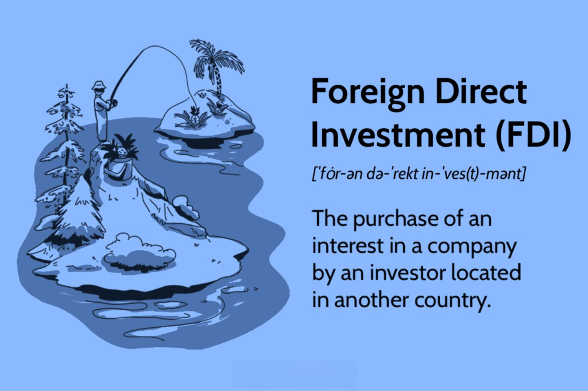

## Table of Contents

## What is Foreign Direct Investment (FDI)?

Foreign Direct Investment (FDI) is when a company or individual from one country invests in a business or starts a new business in another country. It's like when someone decides to put their money into a project or company that is located in a different country than their own. This can happen by buying shares in a foreign company, building a new factory, or even starting a new business from scratch in another country.

FDI is important because it can help countries grow their economies. When a foreign company invests in a country, it often brings new jobs, technology, and skills to that country. This can help the local people and businesses to develop and improve. For the company investing, it can be a way to reach new customers, use cheaper resources, or take advantage of special skills or knowledge in the other country.

## Why is FDI important for countries?

FDI is important for countries because it helps their economies grow. When a foreign company invests in a country, it often creates new jobs for the local people. This means more people can work and earn money, which helps them and their families live better lives. Also, the company might bring in new technology and skills that the local people can learn. This can make the businesses in the country better and more competitive.

Another reason FDI is important is that it can bring in money from other countries. This extra money can be used to build things like roads, schools, and hospitals, which make life better for everyone in the country. It also means the country doesn't have to borrow as much money from other places, which can be expensive. So, FDI can help a country become stronger and more independent.

Overall, FDI is like a boost for a country's economy. It helps create jobs, brings in new technology and skills, and provides money for important projects. This can make a big difference in helping a country grow and develop.

## What are the different types of FDI?

There are two main types of FDI: horizontal and vertical. Horizontal FDI happens when a company starts the same type of business in a different country as it has at home. For example, if a car company from one country builds a factory to make cars in another country, that's horizontal FDI. The company is doing the same thing in both places, just in different countries.

Vertical FDI is different. It happens when a company invests in a different part of its business in another country. There are two kinds of vertical FDI: backward and forward. Backward vertical FDI is when a company buys or starts a business that supplies it with what it needs to make its products. For example, if a car company buys a steel factory in another country to get the steel it needs, that's backward vertical FDI. Forward vertical FDI is when a company invests in a business that helps it sell its products. For example, if the car company buys a dealership in another country to sell its cars, that's forward vertical FDI.

Both types of FDI can help companies grow and reach new markets. They also help the countries where the investments are made by creating jobs and bringing in new technology and skills. Understanding these types of FDI can help people see how businesses work across different countries and how they can benefit both the companies and the countries involved.

## Can you explain horizontal FDI?

Horizontal FDI is when a company starts the same type of business in a different country as it has at home. Imagine a company that makes shoes in one country. If that company decides to build a new factory to make shoes in another country, that's horizontal FDI. The company is doing the same thing in both places, just in different countries. This can help the company reach new customers and sell more shoes.

Horizontal FDI can be good for the country where the new factory is built. It creates new jobs for people in that country, which means more people can work and earn money. The company might also bring in new technology and ways of doing things that can help local businesses improve. This can make the country's economy stronger and help it grow.

## What is vertical FDI?

Vertical FDI is when a company invests in a different part of its business in another country. There are two types of vertical FDI: backward and forward. Backward vertical FDI happens when a company buys or starts a business that supplies it with what it needs to make its products. For example, if a car company from one country buys a steel factory in another country to get the steel it needs, that's backward vertical FDI. This helps the car company control the quality and cost of the materials it uses.

Forward vertical FDI is when a company invests in a business that helps it sell its products. For example, if the same car company buys a dealership in another country to sell its cars, that's forward vertical FDI. This helps the company reach new customers and make sure its cars are sold well. Both types of vertical FDI can help the company grow and can bring new jobs and technology to the countries where the investments are made.

## What is conglomerate FDI?

Conglomerate FDI is when a company invests in a business in another country that is different from its main business. Imagine a company that makes toys decides to invest in a food company in another country. That's conglomerate FDI. It's like the company is spreading its wings into a totally new area.

This type of FDI can be good for the company because it helps them grow in new ways. They can use what they learn from their main business to help the new business succeed. For the country where the investment happens, it can mean new jobs and new ideas coming in. Even though the businesses are different, conglomerate FDI can still help both the company and the country grow.

## How does platform FDI work?

Platform FDI is when a company sets up a business in one country to make things and then sells those things to other countries. Imagine a company from one country builds a factory in another country to make toys. Instead of just selling those toys in the country where the factory is, the company also sends the toys to other countries to sell. This helps the company reach more customers in different places.

Platform FDI can be good for the company because it lets them use the factory to sell to a bigger market. It can also save them money because making things in one place and then sending them to other places can be cheaper than making them in lots of different places. For the country where the factory is, it can mean new jobs and more money coming into the economy. This can help the country grow and develop.

## What are some examples of FDI in developing countries?

One example of FDI in a developing country is when a big car company from Japan decided to build a factory in Thailand. The company chose Thailand because it has good workers and is in a good spot for selling cars to other countries in Asia. By building the factory, the car company created lots of jobs for people in Thailand. It also brought new technology and ways of making cars that helped the local businesses learn and grow. This helped Thailand's economy get stronger.

Another example is when a big phone company from South Korea started making phones in Vietnam. The company saw that Vietnam had a lot of young people who could work in factories and that it was cheaper to make phones there than in South Korea. By setting up factories in Vietnam, the phone company not only made more phones to sell around the world but also helped Vietnam's economy. The factories created jobs and brought in new technology, which helped Vietnam grow and develop.

## Can you provide examples of FDI in developed countries?

One example of FDI in a developed country is when a big car company from Germany decided to build a factory in the United States. The company chose the U.S. because it has a big market for cars and good workers. By building the factory, the German company created jobs for people in the U.S. and brought new technology and ways of making cars. This helped the U.S. economy grow and also helped the German company sell more cars in America.

Another example is when a big tech company from the United States decided to set up a research center in Ireland. The company chose Ireland because it has good schools and a lot of smart people who can work in tech. By setting up the research center, the U.S. company created jobs for people in Ireland and brought new technology and ideas. This helped Ireland's economy and also helped the U.S. company learn new things and make better products.

## What are the risks associated with FDI?

When a company decides to invest in another country, there are some risks they need to think about. One big risk is that the rules and laws in the other country might change. For example, the government might decide to raise taxes or make new rules that make it harder for the company to do business. This can make it more expensive or even impossible for the company to keep going. Another risk is that the money in the other country might change in value. If the money gets weaker, the company might lose money when it tries to bring its profits back home.

There are also risks that come from the people and the economy in the other country. For example, if the people in the country start to not like the company, they might protest or even damage the company's property. This can be bad for the company and make it hard to keep working. Also, if the economy in the other country gets worse, people might not buy as much of what the company is selling. This can hurt the company's profits and make it hard to keep the business going.

## How do governments regulate and encourage FDI?

Governments have different ways to regulate and encourage foreign direct investment (FDI). They can make rules and laws that control how foreign companies can invest in their country. For example, they might say that a foreign company has to work with a local company or that they can only invest in certain parts of the economy. Governments also check the investments to make sure they are good for the country and don't harm important things like security or the environment. This helps them keep a balance between welcoming new investments and protecting their country.

To encourage FDI, governments often give special benefits to foreign companies. They might offer tax breaks, which means the company doesn't have to pay as much in taxes. They can also give subsidies, which are like gifts of money to help the company start up or grow. Governments might also build special areas called economic zones where it's easier for foreign companies to set up and do business. By doing these things, governments hope to attract more foreign companies, which can bring in new jobs, technology, and money to help their country grow.

## What advanced strategies can companies use to maximize the benefits of FDI?

Companies can use several advanced strategies to get the most out of their foreign direct investments. One key strategy is to really understand the local market where they are investing. This means learning about the culture, what people like and need, and how the economy works. By doing this, companies can make sure their products or services fit well in the new country. They can also build good relationships with local businesses and the government, which can help them grow faster and face fewer problems.

Another important strategy is to use technology and innovation to their advantage. Companies can bring in new technology or ways of doing things that are better than what's already there. This can help them stand out from other businesses and attract more customers. Also, by investing in research and development in the new country, companies can create new products or improve old ones, which can help them make more money and grow their business even more. By using these strategies, companies can make their foreign direct investments work better and bring more benefits to both themselves and the countries they invest in.

## References & Further Reading

[1]: Bergstra, J., Bardenet, R., Bengio, Y., & Kégl, B. (2011). ["Algorithms for Hyper-Parameter Optimization."](https://papers.nips.cc/paper/4443-algorithms-for-hyper-parameter-optimization) Advances in Neural Information Processing Systems 24.

[2]: ["Advances in Financial Machine Learning"](https://www.amazon.com/Advances-Financial-Machine-Learning-Marcos/dp/1119482089) by Marcos Lopez de Prado

[3]: ["Evidence-Based Technical Analysis: Applying the Scientific Method and Statistical Inference to Trading Signals"](https://www.amazon.com/Evidence-Based-Technical-Analysis-Scientific-Statistical/dp/0470008741) by David Aronson

[4]: ["Machine Learning for Algorithmic Trading"](https://github.com/stefan-jansen/machine-learning-for-trading) by Stefan Jansen

[5]: ["Quantitative Trading: How to Build Your Own Algorithmic Trading Business"](https://www.amazon.com/Quantitative-Trading-Build-Algorithmic-Business/dp/1119800064) by Ernest P. Chan