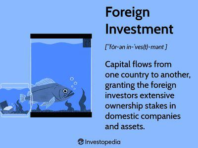

Foreign exchange, commonly known as forex, is a vital component of the global financial markets, facilitating international trade and investment by enabling currency conversion. In India, the Foreign Exchange Dealers Association of India (FEDAI) plays a crucial role in regulating and guiding the forex market. Established in 1958, FEDAI is instrumental in setting standards and protocols for interbank forex dealings, working alongside the Reserve Bank of India (RBI) to ensure a stable and efficient market environment.

This article explores the intricacies of forex trading in India, with a particular focus on FEDAI's influence and the rise of algorithmic trading. Algorithmic trading, or algo trading, has transformed financial markets worldwide by using technology to execute trades at unprecedented speeds and efficiencies. It involves deploying complex mathematical models and high-performance computing to automate trading decisions, maximizing speed, and reducing human error.



Understanding FEDAI's functions and their impact on the rapidly evolving landscape of forex algo trading in India is crucial. As the market landscape shifts towards automation and innovation, FEDAI's guidance and regulatory oversight become even more significant in maintaining market integrity and stability. Algorithmic trading represents a paradigm shift in trading practices, making it imperative to examine how FEDAI's policies influence this new dynamic.

## Table of Contents

## What is FEDAI?

The Foreign Exchange Dealers Association of India (FEDAI) was established in 1958 as an association composed of banks proficient in the forex markets. As a self-regulatory organization (SRO), FEDAI is essential in drafting and enforcing rules that govern Indian interbank forex transactions. The primary objective of FEDAI is to foster stability and integrity within the forex market by ensuring adherence to standardized procedures among its member banks.

One of FEDAI's core functions is to provide guidance and advice to its member banks. This includes representing them during discussions with critical regulatory bodies like the Reserve Bank of India (RBI). By serving as an intermediary, FEDAI helps to ensure that the perspectives and interests of its members are adequately communicated and considered, which is instrumental in promoting harmonious policy formulation and market operations.

FEDAI is also responsible for setting benchmarks related to exchange rates and interest rates. These benchmarks are vital for sustaining the stability of the forex markets. By establishing these standard rates, FEDAI contributes to a transparent and consistent trading environment, which aids in minimizing fluctuations and uncertainties that could adversely impact the financial system.

In addition to its regulatory functions, FEDAI emphasizes enhancing the proficiency and capability of banking personnel engaged in [forex](/wiki/forex-system) trading. To achieve this, the association organizes training programs and workshops aimed at improving the knowledge and skills of those involved in forex operations. This initiative not only boosts the efficiency of forex trading activities but also promotes transparency within the sector.

Overall, FEDAI plays a pivotal role in shaping the operational landscape of India's forex markets by ensuring regulatory compliance, stability, and continued professional development within the industry.

## The Role of FEDAI in Forex Regulations

The Foreign Exchange Dealers Association of India (FEDAI) plays a vital role in shaping the regulatory framework governing forex transactions within India. By setting guidelines and rules, FEDAI ensures that daily foreign exchange activities adhere to predetermined standards, maintaining market consistency and protection for all stakeholders involved.

A primary function of FEDAI is working in close collaboration with banks to guarantee compliance with international accounting and risk management standards. This collaboration is essential to fostering a sound financial environment where practices and operations meet global benchmarks. Such adherence not only promotes transparency but also mitigates potential financial mismanagement and risk exposure within the Indian forex market.

Furthermore, FEDAI's influence extends to stabilizing market dynamics. By partnering with institutions such as the Reserve Bank of India (RBI) and the Fixed Income Money Market and Derivatives Association of India (FIMMDA), FEDAI contributes to safeguarding the market against [volatility](/wiki/volatility-trading-strategies). These collaborations become particularly vital during periods of economic uncertainty, where swift and decisive intervention is required to preserve market equilibrium and investor confidence.

A core responsibility of FEDAI involves the announcement of daily and periodic forex rates to its member banks. These rates are critical in guiding the operational aspects of the forex market. By providing benchmark rates, FEDAI ensures uniformity and fairness in the pricing of forex transactions, which is crucial for maintaining a level playing field among market participants. These benchmarks serve as a reference point and facilitate smoother and more predictable market operations, thus enhancing the overall efficiency and resilience of India’s forex market.

In summary, FEDAI's regulatory role is multifaceted, encompassing guidelines formulation, collaboration with financial institutions, and rate setting. Its efforts in these areas help sustain a stable, transparent, and reliable forex trading environment in India.

 to Algorithmic Trading

Algorithmic trading is a method that uses complex pre-determined algorithms to make trading decisions, commonly conducted at a velocity and frequency beyond human capability. These algorithms are often grounded in advanced mathematical models capable of analyzing market data and executing trades at optimal prices. The automation of trade processes not only reduces manual intervention but also minimizes errors and enhances the speed and accuracy of transactions.

These trading strategies typically include statistical [arbitrage](/wiki/arbitrage), [market making](/wiki/market-making), and [trend following](/wiki/trend-following). For example, [statistical arbitrage](/wiki/statistical-arbitrage) involves exploiting short-term price differences between different markets or securities. Extensive models and historical data analysis are used to develop strategies that can predict potential market movements.

In Python, a simple [algorithmic trading](/wiki/algorithmic-trading) strategy might look like this:

```python
import pandas as pd

def moving_average_strategy(prices, short_window, long_window):
    signals = pd.DataFrame(index=prices.index)
    signals['signal'] = 0.0

    signals['short_mavg'] = prices.rolling(window=short_window, min_periods=1).mean()
    signals['long_mavg'] = prices.rolling(window=long_window, min_periods=1).mean()

    signals['signal'][short_window:] = np.where(signals['short_mavg'][short_window:] > signals['long_mavg'][short_window:], 1.0, 0.0)

    signals['positions'] = signals['signal'].diff()

    return signals
```

Algorithmic trading has become increasingly prevalent in India’s forex markets, reflecting global trends towards greater speed, precision, and efficiency in trading operations. This technological maturation is reshaping the traditional landscape, providing traders with tools to react instantly to market shifts. The reduction in transaction costs and improved market [liquidity](/wiki/liquidity-risk-premium) further underscore its growing significance.

As technology continues to advance, algorithmic trading signifies a major evolution in forex operations, offering opportunities for enhanced performance while adjusting to new regulatory and trading environments. This evolution represents not just improvements in processes, but a fundamental transformation of how trading is perceived and executed, paving the way for future financial innovations.

## FEDAI's Influence on Algo Trading in India

FEDAI's regulatory frameworks and benchmarks play a pivotal role in shaping the landscape of algorithmic trading in India's foreign exchange market. As an authoritative self-regulatory organization, FEDAI ensures that algorithmic trading practices adhere to standards that uphold fairness and market integrity. By aligning algo trading activities with prevailing market regulations, FEDAI mitigates potential risks associated with high-frequency trading strategies.

To sustain a balanced trading environment, FEDAI's guidelines promote equitable access to forex markets, ensuring that no undue advantage is obtained through technological exploits. This includes setting clear ethical boundaries and operational protocols that algo traders must follow. In doing so, FEDAI minimizes the risk of market manipulation or systemic instability that could arise from algorithmic malpractices or over-reliance on automated trading systems.

FEDAI's emphasis on transparency and accountability fortifies trust in the algorithmic trading ecosystem. For instance, by mandating rigorous reporting and surveillance mechanisms, FEDAI enables efficient monitoring of trading activities. This oversight is vital for detecting irregular patterns or anomalies promptly, thereby facilitating timely interventions to preserve market order.

Through these measures, FEDAI cultivates a stable and reliable forex market, appealing to both institutional and retail participants. Its regulatory influence is instrumental in fostering an environment where innovation and technological advancements in algo trading can flourish without compromising the security and functionality of the financial systems. As ongoing developments in technology continue to drive the evolution of trading methodologies, FEDAI's role in regulating and guiding these changes remains indispensable.

## Challenges and Opportunities

The rapid integration of algorithmic trading into the forex market brings several challenges and opportunities that are pivotal to the sector's progression. 

A primary challenge is the need for an advanced technological infrastructure capable of supporting the high-speed and high-frequency operations typical of algorithmic trading. As algorithms rely on massive computational power to analyze and execute trades almost instantaneously, any latency or inefficiency in the technological framework can lead to significant disadvantages. Updating legacy systems, improving data bandwidth, and ensuring robust cybersecurity measures are essential to keep pace with these evolving demands.

Despite these challenges, algorithmic trading also offers numerous opportunities that enhance the forex market's functioning. One significant advantage is the increase in market efficiency. Algorithms can process vast amounts of data and identify trading opportunities much faster than human traders, thereby reducing the time lag between market updates and trading decisions. This increased efficiency is accompanied by reduced transaction costs since automated processes minimize the need for manual intervention, which can be costly and time-consuming.

Additionally, algo trading contributes to enhanced liquidity in the forex markets. The continuous and automated execution of trades ensures that there are more participants in the market at any given time, facilitating smoother transactions and reducing bid-ask spreads. This heightened liquidity attracts more investors, creating a virtuous cycle that strengthens the overall market infrastructure.

The Foreign Exchange Dealers Association of India (FEDAI) plays a critical role in navigating these challenges and optimizing the resultant opportunities. By setting standards and benchmarks that guide the ethical and fair implementation of algorithmic trading, FEDAI maintains a stable and transparent market environment. Its regulatory oversight is essential for preventing systemic risks while fostering trust among market participants. As algorithmic trading continues to evolve, FEDAI’s leadership and proactive regulation are indispensable for driving sustainable growth and innovation in India’s forex markets.

## Conclusion

As the Indian forex market progresses, the Foreign Exchange Dealers Association of India (FEDAI) remains essential in creating an environment favorable to innovation and growth. Algorithmic trading, which leverages advanced computational techniques to execute trades at remarkable speeds, is significantly altering the forex landscape. Its integration underscores the necessity for robust regulatory frameworks to ensure market integrity and fairness. FEDAI's oversight becomes increasingly important as it sets standards that guide the ethical and transparent functioning of forex markets.

One of FEDAI's primary responsibilities is to balance regulation with the evolving demands of innovation in financial markets. This balance helps to maintain the stability and competitive edge of India's forex markets. By implementing regulations that both encourage innovation and prevent systemic risks, FEDAI contributes to a secure marketplace. These regulations facilitate the adoption of new technologies, increasing market efficiency and liquidity while keeping potential pitfalls in check.

Future sustainable development in the Indian forex sector will require ongoing collaboration between FEDAI, financial institutions, and technological firms. Such partnerships will be pivotal in ensuring that infrastructure keeps pace with the rapid advancements in algorithmic trading technologies. Moreover, active cooperation will promote the exchange of knowledge, leading to better strategies and improved risk management practices. This synergy will support the sustained growth and competitiveness of India’s forex markets by fostering a dynamic, adaptive, and resilient trading environment.

## References & Further Reading

[1]: Benninga, S. (2014). ["Financial Modeling."](https://www.amazon.com/Financial-Modeling-Press-Simon-Benninga/dp/0262027283) The MIT Press.

[2]: The Reserve Bank of India. ["Frequently Asked Questions on Foreign Exchange (Forex) and Money Market Operations."](https://www.rbi.org.in/Scripts/FAQDisplay.aspx)

[3]: ["Algorithmic Trading and DMA: An introduction to direct access trading strategies"](https://www.amazon.com/Algorithmic-Trading-DMA-introduction-strategies/dp/0956399207) by Barry Johnson

[4]: Hasbrouck, J. (2007). ["Empirical Market Microstructure: The Institutions, Economics, and Econometrics of Securities Trading."](https://academic.oup.com/book/52241) Oxford University Press.

[5]: ["MiFID II and Algorithmic Trading: A New Regime"](https://www.esma.europa.eu/document/mifid-ii-final-report-algorithmic-trading) by Niamh Moloney