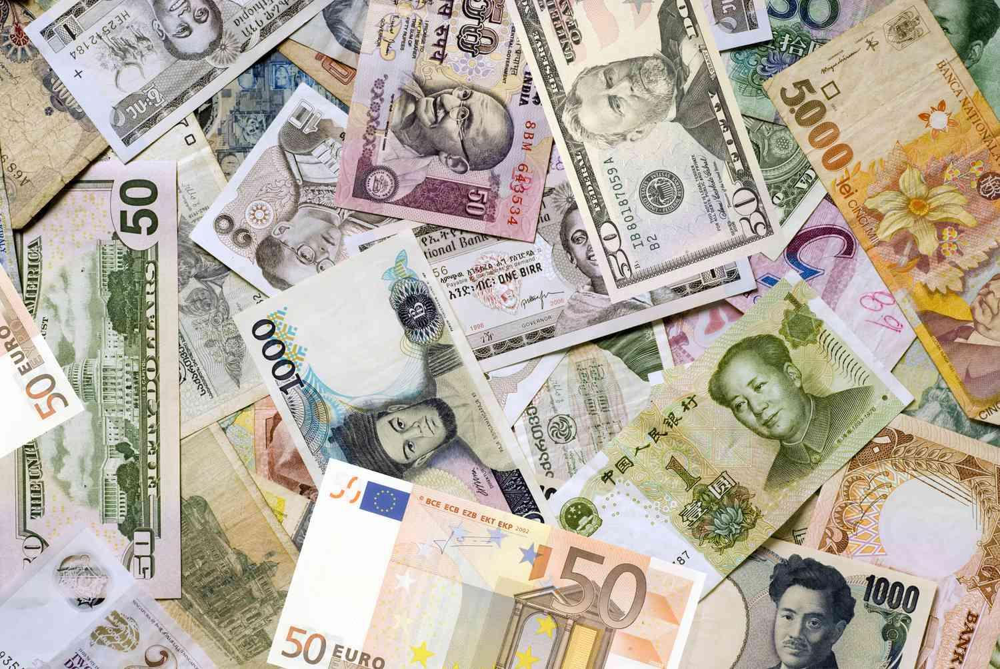

## Table of Contents

## What is the Foreign Exchange Dealers Coalition (FXDC)?

The Foreign Exchange Dealers Coalition (FXDC) is a group made up of banks and financial companies that deal with foreign exchange, or forex. They work together to make sure that trading in foreign currencies is fair and efficient. The FXDC helps to set rules and standards for how forex trading should be done, and they also talk to governments and regulators about these rules.

The main goal of the FXDC is to make the forex market work better for everyone. They do this by sharing information and ideas among their members, and by working to improve the systems and technology used in forex trading. By doing these things, the FXDC helps to make sure that the forex market is a safe and reliable place for people and businesses to trade currencies.

## When was the Foreign Exchange Dealers Coalition founded?

The Foreign Exchange Dealers Coalition, or FXDC, was started in 2007. This was a time when more and more people were trading currencies, and the group was formed to help make sure that this trading was done fairly and efficiently.

The FXDC brings together banks and financial companies that deal with foreign exchange. Their main job is to set rules and standards for [forex](/wiki/forex-system) trading, and to talk to governments about these rules. By working together, the members of the FXDC help to make the forex market a safe and reliable place for everyone.

## What are the main objectives of the FXDC?

The main goal of the Foreign Exchange Dealers Coalition, or FXDC, is to make sure that trading in foreign currencies is fair and works well. They do this by setting rules and standards that everyone in the forex market should follow. The FXDC also talks to governments and regulators to help make these rules better. By doing this, they help make sure that the forex market is a safe place for people and businesses to trade currencies.

Another important objective of the FXDC is to share information and ideas among its members. This helps everyone in the group to learn from each other and improve how they do their work. The FXDC also works to improve the systems and technology used in forex trading. By making these systems better, they help to make the forex market more efficient and reliable for everyone who uses it.

## Who are the members of the Foreign Exchange Dealers Coalition?

The Foreign Exchange Dealers Coalition, or FXDC, is made up of banks and financial companies that deal with foreign exchange. Some of the big banks that are part of the FXDC are JPMorgan Chase, Citigroup, and Bank of America. These banks are important because they handle a lot of the trading in foreign currencies.

Other members of the FXDC include companies like State Street and Goldman Sachs. These companies also play a big role in the forex market. By working together, all these members help to make sure that trading in foreign currencies is fair and efficient for everyone.

## How does the FXDC influence foreign exchange markets?

The Foreign Exchange Dealers Coalition, or FXDC, helps to make the foreign exchange market fair and efficient. They do this by setting rules and standards that everyone in the market should follow. These rules help to make sure that trading in different currencies is done in a way that is honest and clear. The FXDC also talks to governments and regulators about these rules. By working with these groups, the FXDC can help to make the rules better and make sure they are followed.

The members of the FXDC, like big banks and financial companies, share information and ideas with each other. This helps them to learn from each other and improve how they do their work. The FXDC also works to make the systems and technology used in forex trading better. By doing this, they help to make trading easier and more reliable for everyone. This makes the foreign exchange market a safer and better place for people and businesses to trade currencies.

## What regulatory challenges does the FXDC face?

The Foreign Exchange Dealers Coalition, or FXDC, faces some big challenges when it comes to rules and regulations. One of the main problems is that different countries have different rules about trading foreign currencies. This can make it hard for the FXDC to set rules that everyone can follow. They have to work with many different governments and regulators to try to make the rules fair and clear for everyone.

Another challenge is keeping up with new technology. The forex market uses a lot of new systems and tools, and these can change quickly. The FXDC has to make sure that their rules work well with these new technologies. They also have to make sure that these new systems are safe and fair for everyone who uses them. This can be a lot of work, but it's important for making the forex market a good place to trade.

## How does the FXDC contribute to the stability of foreign exchange markets?

The Foreign Exchange Dealers Coalition, or FXDC, helps keep the foreign exchange market stable by setting rules and standards that everyone should follow. These rules make sure that trading in different currencies is done fairly and clearly. When everyone follows the same rules, it helps to prevent big problems and surprises in the market. The FXDC also works with governments and regulators to make these rules better and to make sure they are followed. This helps to keep the market calm and predictable, which is good for everyone who trades currencies.

Another way the FXDC helps with stability is by sharing information and ideas among its members. When big banks and financial companies work together and learn from each other, they can make better decisions and avoid big mistakes. The FXDC also works to improve the systems and technology used in forex trading. By making these systems better and more reliable, the FXDC helps to make sure that trading goes smoothly and without big disruptions. This all adds up to a more stable and trustworthy foreign exchange market.

## What are the key initiatives undertaken by the FXDC to improve market transparency?

The Foreign Exchange Dealers Coalition, or FXDC, works hard to make the foreign exchange market more transparent. One of the main things they do is set rules and standards that everyone in the market should follow. These rules help make sure that trading in different currencies is done in a clear and open way. When everyone knows the rules and follows them, it's easier to see what's happening in the market. This helps to stop secret deals and makes trading fairer for everyone.

Another important thing the FXDC does is share information among its members. When big banks and financial companies talk to each other and share what they know, it helps everyone understand the market better. The FXDC also works to make the systems and technology used in forex trading better. By improving these systems, they help to make sure that trading information is easy to see and understand. All of these efforts help to make the foreign exchange market more transparent and trustworthy.

## How does the FXDC collaborate with other financial institutions and regulatory bodies?

The Foreign Exchange Dealers Coalition, or FXDC, works closely with other financial institutions and regulatory bodies to make the foreign exchange market better. They talk to banks, financial companies, and government groups to set rules that everyone in the market should follow. By working together, they can make sure these rules are fair and clear for everyone. The FXDC also shares information with these groups, which helps everyone understand the market better and make better decisions.

The FXDC also helps to make the rules better by talking to regulators. They explain how the forex market works and what rules would help to make it safer and more fair. This helps the regulators to make good rules that everyone can follow. By working with these different groups, the FXDC helps to make the foreign exchange market a place where people and businesses can trade currencies without big problems.

## What role does the FXDC play in advocating for its members' interests?

The Foreign Exchange Dealers Coalition, or FXDC, works to help its members, which are big banks and financial companies, by speaking up for them. They talk to governments and regulators to make sure the rules for trading foreign currencies are fair and good for their members. The FXDC shares what their members need and want, so the rules can be made better. This helps the members to do their work without big problems.

The FXDC also helps its members by sharing information and ideas among them. When members know more about the market, they can make better choices and avoid big mistakes. The FXDC makes sure that their members have a strong voice when talking to people who make the rules. This way, the members' needs are heard, and the foreign exchange market can work well for everyone.

## How has the FXDC adapted to technological advancements in the forex market?

The Foreign Exchange Dealers Coalition, or FXDC, has worked hard to keep up with new technology in the forex market. They know that new systems and tools can change quickly, so they make sure their rules work well with these changes. The FXDC helps to make sure that new technology is safe and fair for everyone who uses it. They talk to their members and share ideas about how to use new technology in a good way.

By working together, the FXDC and its members learn how to use new systems to make trading easier and more reliable. They also work to improve the technology used in forex trading, which helps to make the market better for everyone. The FXDC makes sure that as technology changes, the rules stay clear and fair, so the forex market can keep working well.

## What future trends or developments might impact the operations of the FXDC?

In the future, the Foreign Exchange Dealers Coalition, or FXDC, might see big changes because of new technology. Things like blockchain and [artificial intelligence](/wiki/ai-artificial-intelligence) could change how people trade currencies. The FXDC will need to make sure their rules work well with these new tools. They will also need to keep talking to their members to learn how to use new technology in a good way. This will help them make the forex market safer and better for everyone.

Another thing that could impact the FXDC is new rules from governments. As more people trade currencies, governments might make new laws to keep the market fair. The FXDC will need to work with these governments to help make these new rules. They will also need to make sure their members know about these rules and follow them. By doing this, the FXDC can help keep the forex market a good place for everyone to trade.

## References & Further Reading

[1]: Oberlechner, T. (2004). ["The Psychology of the Foreign Exchange Market"](https://www.amazon.com/Psychology-Foreign-Exchange-Market/dp/047084406X). Wiley.

[2]: Dominguez, K. M., & Panthaki, F. (2006). ["What Defines ‘News’ in Foreign Exchange Markets?"](https://papers.ssrn.com/sol3/papers.cfm?abstract_id=847041) Review of Economic Studies, 74(3), 678-708.

[3]: King, M. R., Osler, C. L., & Rime, D. (2012). ["The Market Microstructure Approach to Foreign Exchange: Looking Back and Looking Forward"](https://onlinelibrary.wiley.com/doi/10.1002/9781118445785.ch1). In The Handbook of Exchange Rates (pp. 285-308). Wiley.

[4]: Gehrig, T., & Menkhoff, L. (2006). ["Extended Evidence on the Use of Technical Analysis in Foreign Exchange"](https://onlinelibrary.wiley.com/doi/10.1002/ijfe.301) International Journal of Finance & Economics, 11(4), 327-338.

[5]: Harris, L. (2003). ["Trading and Exchanges: Market Microstructure for Practitioners"](https://www.amazon.com/Trading-Exchanges-Market-Microstructure-Practitioners/dp/0195144708). Oxford University Press.