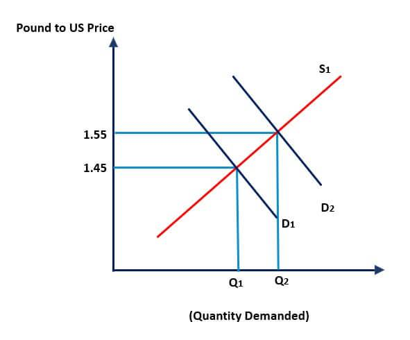

## Table of Contents

## What is foreign exchange and why is it important?

Foreign exchange, often called forex or FX, is the process of changing one country's money into another country's money. This happens when people or businesses need to buy things from other countries, travel abroad, or invest in foreign markets. The place where these exchanges happen is called the foreign exchange market, which is the largest and most liquid financial market in the world.

Foreign exchange is important because it allows global trade and investment to happen smoothly. Without it, buying goods from another country would be much harder because you would need to use the money of that country directly. It also helps countries manage their economies by controlling the value of their money compared to other countries. This can affect how much their exports cost and how attractive their country is for foreign investment.

## How do currency values and exchange rates work?

Currency values and exchange rates are like the prices of different countries' money. When you go to a store, you see how much things cost in your country's money. Exchange rates are similar, but they show how much one country's money is worth compared to another country's money. For example, if 1 US dollar can buy 0.85 Euros, that's the exchange rate between the US dollar and the Euro. These rates change all the time because many things affect them, like how strong a country's economy is, what people think will happen in the future, and even big news events.

Exchange rates are important because they affect how much things cost when you buy from other countries. If the US dollar gets stronger and the exchange rate changes to 1 US dollar buying 0.90 Euros, then things that cost Euros become cheaper for people with US dollars. But if the US dollar gets weaker and the exchange rate changes to 1 US dollar buying only 0.80 Euros, then things that cost Euros become more expensive for people with US dollars. This can make a big difference for businesses that buy and sell things all over the world, and it can also affect how much tourists spend when they travel to different countries.

## What are the most commonly traded currencies in the forex market?

The most commonly traded currencies in the forex market are the US dollar, the Euro, the Japanese yen, the British pound, and the Australian dollar. These currencies are often called the "major currencies" because they are used a lot in trading. The US dollar is the most traded currency because it is used in many international transactions and is considered a safe and stable currency.

People trade these currencies because they are from countries with big and strong economies. The Euro comes from the European Union, which has many countries working together. The Japanese yen is important because Japan has a big economy and lots of trade. The British pound is from the United Kingdom, which also has a strong economy. The Australian dollar is traded a lot because Australia has a lot of natural resources that other countries want to buy.

## What is the role of central banks in influencing exchange rates?

Central banks play a big role in affecting exchange rates. They do this by controlling the money supply and interest rates in their country. When a central bank raises interest rates, it can make the country's currency more attractive to investors because they can earn more from saving or investing in that country. This can make the currency stronger compared to other currencies. On the other hand, if a central bank lowers interest rates, it can make the currency less attractive and cause it to weaken.

Central banks can also directly buy or sell their own currency in the forex market to influence its value. If a central bank wants to make its currency stronger, it might sell foreign currencies and buy its own currency, which increases demand for it. If it wants to weaken its currency, it might sell its own currency and buy foreign currencies. These actions can help stabilize the economy or make exports cheaper for other countries to buy. By doing these things, central banks try to keep the value of their currency at a level that helps their country's economy grow and stay stable.

## How do interest rates affect currency values?

Interest rates can have a big effect on how much a country's money is worth. When a country's central bank raises interest rates, it makes that country's money more attractive to people who want to save or invest. This is because they can earn more money by keeping their savings in that country. As more people want to buy that country's money, its value goes up compared to other countries' money. So, raising interest rates can make a country's money stronger.

On the other hand, if a central bank lowers interest rates, it can make the country's money less attractive. People might not want to save or invest there as much because they won't earn as much money. This can cause the value of the country's money to go down compared to other countries' money. So, lowering interest rates can make a country's money weaker. This is why central banks carefully decide when to change interest rates, as it can affect their country's economy and how much their money is worth in the world.

## What impact does inflation have on foreign exchange rates?

Inflation is when prices in a country go up over time. When a country has high inflation, it means that the money in that country is worth less because you need more of it to buy the same things. This can make the country's money weaker compared to other countries' money. If people think a country's money will be worth less in the future because of high inflation, they might not want to keep their savings in that country's money. This can cause the exchange rate to go down, making the country's money less valuable on the foreign exchange market.

On the other hand, if a country has low inflation, it means that the money in that country keeps its value better. People might want to keep their savings in that country's money because it will buy about the same amount of things in the future. This can make the country's money stronger compared to other countries' money. So, countries with lower inflation often have stronger currencies, and countries with higher inflation often have weaker currencies. This is why central banks try to keep inflation under control, as it affects how much their money is worth in the world.

## How does political stability influence a country's currency value?

Political stability is important for a country's money value. When a country is politically stable, it means the government is strong and things are calm. People trust that the country's leaders will make good decisions and keep the economy running well. Because of this trust, people from other countries might want to invest their money there. This demand for the country's money can make it stronger compared to other countries' money.

On the other hand, if a country is politically unstable, it can scare people away. Political instability can mean things like protests, changes in government, or even wars. When people see this, they might worry that their money won't be safe in that country. They might take their money out and invest it somewhere else. This can make the country's money weaker because fewer people want to buy it. So, political stability can really affect how much a country's money is worth on the world stage.

## What are the effects of trade balances on exchange rates?

A trade balance is when a country looks at how much it sells to other countries compared to how much it buys from them. If a country sells more things to other countries than it buys, it has a trade surplus. This can make its money stronger. When a country has a trade surplus, it means other countries need to buy its money to pay for the things they are buying. This demand for the country's money can make its value go up compared to other countries' money.

On the other hand, if a country buys more things from other countries than it sells, it has a trade deficit. This can make its money weaker. When a country has a trade deficit, it needs to use its own money to buy things from other countries. This can make the value of its money go down because there is less demand for it and more of it is being used to buy foreign goods. So, the balance of trade can really affect how much a country's money is worth in the world.

## How do speculators and market sentiment impact forex rates?

Speculators are people who try to guess what will happen to currency values and make money from those guesses. They buy and sell currencies based on what they think will happen in the future. If a lot of speculators think a country's money will get stronger, they will buy it, which can make the currency's value go up right away. On the other hand, if they think a country's money will get weaker, they will sell it, which can make the currency's value go down. Because there is so much money involved in forex trading, what speculators do can have a big impact on exchange rates.

Market sentiment is about how people feel about a country's economy and its money. If people feel good about a country's economy, they might want to buy its money, which can make it stronger. If people feel bad about a country's economy, they might want to sell its money, which can make it weaker. Things like news, economic reports, and even rumors can change how people feel. When a lot of people feel the same way, it can cause big changes in exchange rates. So, both speculators and market sentiment play important roles in deciding how much a country's money is worth.

## What technical analysis tools are used to predict exchange rate movements?

Technical analysis is a way to guess what will happen to exchange rates by looking at past price movements and patterns. Traders use different tools to help them with this. One common tool is the moving average, which smooths out price data to show trends over time. Traders might look at short-term and long-term moving averages to see if they cross each other, which can signal a good time to buy or sell a currency. Another tool is the Relative Strength Index (RSI), which measures how fast and how much a currency's price has changed. If the RSI is high, it might mean the currency is overbought and could soon go down. If it's low, it might mean the currency is oversold and could soon go up.

Another important tool is the Fibonacci retracement, which helps traders find levels where a currency's price might stop falling and start going up again, or vice versa. Traders draw lines on a chart to show these levels based on the Fibonacci sequence. They use these lines to decide where to buy or sell. Chart patterns like head and shoulders, triangles, and double tops or bottoms are also used. These patterns can show when a trend might change direction. By looking at these patterns, traders try to predict future movements in exchange rates. All these tools together help traders make better guesses about what will happen to currency values.

## How do global economic indicators like GDP growth affect currency values?

Global economic indicators like GDP growth can have a big impact on how much a country's money is worth. GDP, or Gross Domestic Product, is a way to measure how well a country's economy is doing. When a country's GDP is growing a lot, it usually means the economy is strong and doing well. This can make people from other countries want to invest their money there. When more people want to buy a country's money, its value can go up compared to other countries' money. So, a high GDP growth can make a country's money stronger.

On the other hand, if a country's GDP is not growing much or even shrinking, it can make people worry about the economy. They might think the country's money will be worth less in the future, so they might not want to keep their savings there. This can make the country's money weaker compared to other countries' money. So, GDP growth is an important thing to watch because it can tell us a lot about how much a country's money might be worth in the future.

## What advanced strategies do professional forex traders use to manage exchange rate risks?

Professional forex traders use different strategies to manage exchange rate risks. One common strategy is hedging, where traders try to protect themselves from losing money if exchange rates move against them. They might do this by using financial tools like forward contracts, which let them buy or sell a currency at a set price in the future. Another way is to use options, which give them the right but not the obligation to buy or sell a currency at a certain price. By using these tools, traders can limit their losses if the market moves in a way they didn't expect.

Another strategy is diversification, where traders spread their money across different currencies and investments. This way, if one currency loses value, they might still make money from other currencies or investments. Professional traders also use stop-loss orders, which automatically sell a currency if its value drops to a certain level. This helps them limit how much they can lose on a trade. By using these advanced strategies, professional forex traders can better manage the risks that come with trading in the forex market.

## References & Further Reading

Bank for International Settlements (BIS) reports provide valuable insights into the global foreign exchange market, with data on trading volumes and market share [statistics](/wiki/bayesian-statistics). Their "Triennial Central Bank Survey" is considered the most comprehensive source for forex market activity, reflecting the varied trading patterns and shifts in the financial landscape. These reports help in understanding the global distribution of forex trading and the dominant currency pairs that drive market activity.

Books on algorithmic trading strategies and financial market dynamics offer foundational knowledge and advanced techniques for those interested in the intersection of finance and technology. Titles such as "Algorithmic Trading: Winning Strategies and Their Rationale" by Ernest P. Chan and "High-Frequency Trading: A Practical Guide to Algorithmic Strategies and Trading Systems" by Irene Aldridge provide readers with insights into the strategies used in forex markets and the technological tools available for optimizing trading decisions. These [books](/wiki/algo-trading-books) shed light on the development and execution of algorithmic strategies that exploit inefficiencies in the market.

Research papers on machine learning and its applications in forex trading present the latest academic and practical advancements in the use of algorithms and AI tools to improve trading outcomes. Notable works include papers published in journals like the "Journal of Financial Markets" and "Quantitative Finance," which discuss the incorporation of neural networks, [reinforcement learning](/wiki/reinforcement-learning), and predictive modeling into trading systems. These studies illustrate the potential of machine learning to forecast currency movements and make informed trading decisions based on vast amounts of real-time data.

For further exploration, consider these resources:

- Bank for International Settlements. (2022). "Triennial Central Bank Survey of Foreign Exchange and Over-the-counter (OTC) Derivatives Markets."
- Chan, E. P. (2009). "Algorithmic Trading: Winning Strategies and Their Rationale." Wiley.
- Aldridge, I. (2013). "High-Frequency Trading: A Practical Guide to Algorithmic Strategies and Trading Systems." Wiley.
- Fukuda, K., & Shinohara, K. (2021). "Machine Learning in Foreign Exchange Markets: A Survey." Journal of Financial Markets.
- Zhang, Y., & Ling, C. X. (2018). "Reinforcement Learning Strategies for Forex Trading." Quantitative Finance.

These resources provide a comprehensive foundation for understanding the complexity and technological innovations within the forex market.

