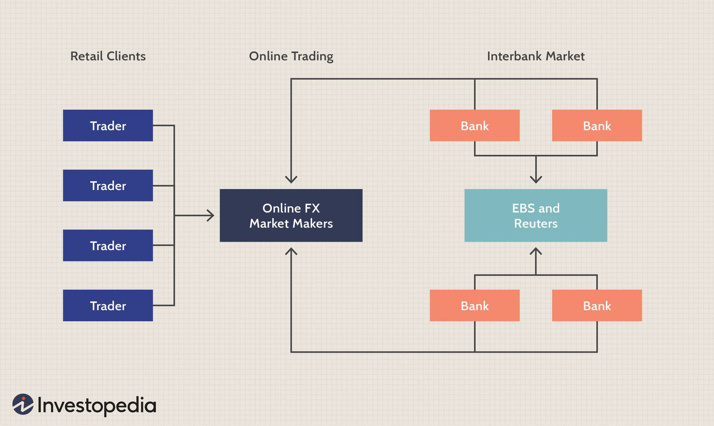

## Table of Contents

## What is the Foreign Exchange Interbank Market?

The Foreign Exchange Interbank Market is a global network where banks trade currencies with each other. It's like a big marketplace where banks buy and sell different types of money to help their customers and manage their own money needs. This market works all the time, even when you're sleeping, because somewhere in the world, it's always daytime.

In this market, banks use special systems and phones to make deals quickly. They agree on the price of one currency in terms of another, like how many US dollars you can get for one Euro. These prices can change a lot, depending on what's happening around the world, like big news or events. The interbank market is very important because it helps set the prices that you see when you want to exchange money at a bank or a money changer.

## Who are the main participants in the Foreign Exchange Interbank Market?

The main participants in the Foreign Exchange Interbank Market are big banks from all around the world. These banks trade currencies with each other to meet their own needs and the needs of their customers. For example, if a customer wants to buy Euros with US dollars, the bank might need to get Euros from another bank in the interbank market.

Besides banks, there are also other big players like financial institutions, such as investment banks and hedge funds, that participate in this market. These institutions might trade currencies to make profits from changes in currency prices. Central banks also play a role by sometimes buying or selling currencies to control their own country's money value.

All these participants help make the interbank market very active and liquid, meaning there's always someone ready to buy or sell currencies. This helps keep the market running smoothly and makes it easier for everyone to exchange money when they need to.

## How does the Foreign Exchange Interbank Market function?

The Foreign Exchange Interbank Market works like a big trading place where banks from all over the world swap different kinds of money with each other. It's open all the time, so banks can trade whenever they need to, even in the middle of the night. Banks use special computer systems and phones to talk to each other and make deals quickly. They agree on how much one type of money is worth compared to another, like how many US dollars you can get for one Euro. These prices can change a lot because of news or big events happening around the world.

Besides banks, other big money groups like investment banks and hedge funds also join in this market. They might trade money to make a profit if they think the price of one currency will go up or down. Sometimes, a country's central bank will also trade in this market to help keep their own money's value steady. All these different groups help make the market busy and full of action, so there's always someone ready to buy or sell money. This keeps the market running smoothly and makes it easier for everyone to exchange money when they need to.

## What is the role of banks in the Foreign Exchange Interbank Market?

Banks play a very important role in the Foreign Exchange Interbank Market. They are the main players who trade different kinds of money with each other. When a customer wants to change their money from one type to another, like from US dollars to Euros, the bank might need to get Euros from another bank in the interbank market. This helps the bank meet its customers' needs and also manage its own money.

Besides helping their customers, banks also trade in the interbank market to make profits. They might buy a currency if they think its value will go up, and sell it later for more money. Banks use special computer systems and phones to talk to each other and make these deals quickly. They agree on how much one type of money is worth compared to another, and these prices can change a lot because of news or big events happening around the world.

## How are exchange rates determined in the Interbank Market?

Exchange rates in the Interbank Market are determined by the forces of supply and demand. When banks and other big players trade currencies with each other, they agree on a price for how much one currency is worth in terms of another. If more people want to buy a certain currency, like the US dollar, its value goes up because there's more demand for it. On the other hand, if more people want to sell a currency, its value goes down because there's more supply of it.

Many things can affect supply and demand in the Interbank Market. Big news or events, like changes in a country's economy or political situations, can make people want to buy or sell more of a certain currency. For example, if a country's economy is doing well, more people might want to buy its currency, making its value go up. Banks use special computer systems and phones to quickly agree on these prices, and because the market is open all the time, prices can change a lot and very quickly.

## What are the common types of transactions in the Foreign Exchange Interbank Market?

In the Foreign Exchange Interbank Market, banks do two main types of transactions: spot transactions and forward transactions. A spot transaction is when banks agree to exchange currencies right away, usually within two business days. This is the most common type of deal because it's quick and helps banks meet their immediate needs, like when a customer wants to change money right away.

The other type of transaction is called a forward transaction. This is when banks agree to exchange currencies at a future date, at a price they agree on today. Banks use forward transactions to protect themselves from big changes in currency prices. For example, if a bank thinks the value of a currency might go down, it can use a forward transaction to lock in today's price and avoid losing money later. Both spot and forward transactions help banks manage their money and serve their customers better.

## How does liquidity affect the Foreign Exchange Interbank Market?

Liquidity is very important in the Foreign Exchange Interbank Market. It means there are always lots of people ready to buy or sell currencies. When the market is liquid, it's easier for banks to trade quickly and at good prices. This helps keep the market running smoothly. If the market is not very liquid, it can be harder for banks to find someone to trade with, and the prices might change a lot more. This can make it riskier for banks and might make them less willing to trade.

The level of [liquidity](/wiki/liquidity-risk-premium) in the market can change because of different things. For example, if big news or events happen, like a country's election or a change in interest rates, more people might want to trade, making the market more liquid. But if it's a quiet time with not much news, the market might be less liquid. Banks and other big players pay close attention to liquidity because it affects how easily they can do their trades and how much they might have to pay or get for the currencies they are trading.

## What is the significance of the bid-ask spread in the Interbank Market?

The bid-ask spread is really important in the Interbank Market. It's the difference between the price a bank is willing to pay to buy a currency (the bid) and the price it's willing to sell it for (the ask). This spread is like a small fee that banks charge for trading currencies. When the spread is small, it means the market is doing well, and it's easier and cheaper for banks to trade. But if the spread gets bigger, it can mean the market is less stable or there's less trading happening, which can make it harder and more expensive for banks to do their trades.

The size of the bid-ask spread can change because of many things. If lots of people want to trade a currency, the spread usually gets smaller because there's more competition among banks to make deals. But if there's big news or uncertainty, like a country's election or economic problems, the spread can get bigger. Banks watch the bid-ask spread closely because it helps them understand how easy or hard it will be to trade and how much it might cost them. A smaller spread means more money in their pockets, while a bigger spread can eat into their profits.

## How do regulatory frameworks impact the Foreign Exchange Interbank Market?

Regulatory frameworks are like rules that governments and special groups make to keep the Foreign Exchange Interbank Market fair and safe. These rules help make sure that banks and other big players follow the same guidelines when they trade currencies. For example, rules might say how much money banks need to keep on hand, or how they should report their trades. This helps stop banks from taking too many risks and keeps the market stable. If banks know they have to follow these rules, they are more likely to trade in a way that is good for everyone.

Sometimes, these rules can also make it harder for banks to trade. For example, if the rules are very strict, banks might have to spend more time and money to make sure they are following them. This can slow down trading and make it more expensive. But, even though rules can make things a bit harder, they are important because they help keep the market honest and protect everyone who uses it. So, while regulatory frameworks can change how the market works, they are there to make sure it stays a safe place for trading currencies.

## What are the technological advancements influencing the Interbank Market?

Technology has changed the way the Interbank Market works a lot. Now, banks use special computer systems to trade currencies quickly and easily. These systems help banks see the prices of different currencies in real-time and make deals with just a few clicks. This makes trading faster and more efficient. Also, technology has made it easier for banks to keep track of their trades and follow the rules set by governments. This helps keep the market safe and fair for everyone.

Another big change is the use of algorithms and automated trading. Banks use these smart computer programs to buy and sell currencies without people having to do it all the time. These programs can look at lots of information and make trades based on what they see, which can help banks make more money. Plus, technology has made it possible for banks to connect with each other all over the world, no matter what time it is. This keeps the market open all the time and helps banks trade whenever they need to.

## How does the Foreign Exchange Interbank Market influence global trade and finance?

The Foreign Exchange Interbank Market is really important for global trade and finance. It helps businesses and countries buy and sell things from each other by making it easy to change one type of money into another. For example, if a company in the US wants to buy something from a company in Europe, they need Euros. The Interbank Market helps the US company get Euros quickly and at a fair price. This makes it easier for companies to do business all over the world and helps the global economy grow.

The market also affects how much money countries have and how strong their economies are. When banks trade currencies, they help set the value of each country's money. If a country's currency is strong, it can buy more things from other countries. But if it's weak, it might be harder for them to buy things. Central banks sometimes trade in the Interbank Market to keep their country's money at a good value. This helps keep their economy stable and makes it easier for people and businesses to plan for the future.

## What are the risks and challenges faced by participants in the Foreign Exchange Interbank Market?

Participants in the Foreign Exchange Interbank Market face several risks and challenges. One big risk is that currency prices can change a lot and very quickly. This means banks can lose money if they buy a currency and its value goes down before they can sell it. Another risk is called "counterparty risk." This happens when the other bank they are trading with might not be able to pay them back. Banks have to be careful about who they trade with and make sure they can trust them.

There are also challenges related to following rules and regulations. Governments and special groups set rules to keep the market fair and safe, but these rules can be hard to follow. Banks have to spend time and money to make sure they are doing everything right. This can slow down their trading and make it more expensive. Plus, with technology changing all the time, banks need to keep up with new systems and ways of trading. If they don't, they might fall behind other banks and lose out on making money.

## References & Further Reading

[1]: Lyons, Richard K. ["The Microstructure Approach to Exchange Rates."](https://direct.mit.edu/books/monograph/2004/The-Microstructure-Approach-to-Exchange-Rates) MIT Press, 2001.

[2]: DeLong, J. Bradford, Shleifer, Andrei, Summers, Lawrence H., & Waldmann, Robert J. (1990). ["Noise Trader Risk in Financial Markets."](https://ms.mcmaster.ca/~grasselli/DeLongShleiferSummersWaldmann90.pdf) Journal of Political Economy, 98(4), 703-738.

[3]: Narang, Rishi K. ["Inside the Black Box: A Simple Guide to Quantitative and High Frequency Trading."](https://onlinelibrary.wiley.com/doi/book/10.1002/9781118662717) Wiley, 2013.

[4]: Hautsch, Nikolaus. ["Econometrics of Financial High-Frequency Data."](https://link.springer.com/book/10.1007/978-3-642-21925-2) Springer, 2012.

[5]: Frey, Stefan & Gabauer, David. (2017). ["Algorithmic Trading in Foreign Exchange Markets: A Panel Regression Approach."](https://onlinelibrary.wiley.com/doi/10.1002/for.2648) Journal of Empirical Finance, 39, 394-416.