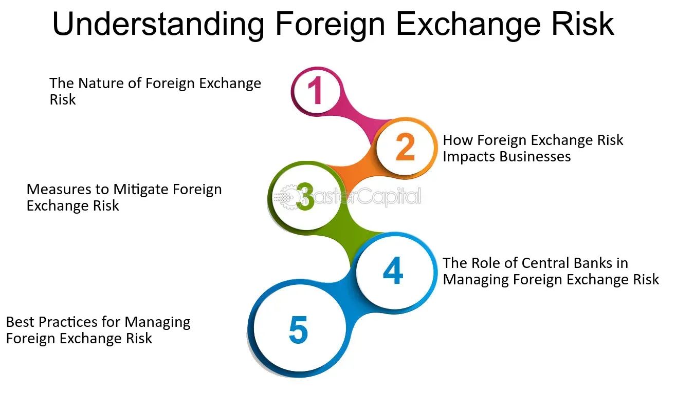

## Table of Contents

## What is foreign exchange intervention?

Foreign exchange intervention is when a country's central bank steps in to buy or sell its own currency in the foreign exchange market. This is done to influence the value of the currency. For example, if a country's currency is getting too strong and hurting its exports, the central bank might sell some of its currency to make it weaker. On the other hand, if the currency is getting too weak and causing inflation, the central bank might buy its own currency to make it stronger.

These actions can have big effects on the economy. By changing the value of the currency, the central bank can help control inflation, boost exports, or stabilize the economy during tough times. However, foreign exchange intervention is not always successful and can be very costly. It also depends a lot on how other countries and markets react to these moves.

## Why do central banks engage in foreign exchange interventions?

Central banks engage in foreign exchange interventions mainly to control the value of their country's currency. If a currency becomes too strong, it can hurt the country's exports because foreign buyers will find the goods more expensive. To fix this, the central bank might sell its own currency in the foreign exchange market to make it weaker. On the other hand, if the currency is too weak, it can lead to higher prices for imports, causing inflation. In this case, the central bank might buy its own currency to make it stronger and help keep prices stable.

These interventions are also used to stabilize the economy during times of uncertainty. For example, if there's a sudden drop in the value of the currency due to a crisis, the central bank might step in to calm the markets and prevent panic. By doing so, they aim to maintain confidence in the economy and avoid bigger problems. However, these actions can be expensive and may not always work as planned, depending on how other countries and markets respond.

## What are the primary goals of foreign exchange intervention?

The main goal of foreign exchange intervention is to control the value of a country's currency. If the currency gets too strong, it can make the country's exports more expensive, which is bad for businesses that sell goods abroad. To fix this, the central bank might sell its own currency to make it weaker. On the other hand, if the currency is too weak, it can make imports more expensive, which can lead to higher prices for things people need to buy. In this case, the central bank might buy its own currency to make it stronger and keep prices stable.

Another important goal is to help stabilize the economy during tough times. If there's a sudden drop in the value of the currency because of a crisis, the central bank might step in to calm things down and stop people from panicking. By doing this, they want to keep people's trust in the economy and avoid bigger problems. However, these actions can be expensive and might not always work, because they depend on how other countries and markets react.

## How do foreign exchange interventions influence currency values?

Foreign exchange interventions influence currency values by changing how much of a country's currency is available in the market. When a central bank wants to make its currency weaker, it sells that currency in the foreign exchange market. This increases the supply of the currency, which usually makes its value go down. For example, if the U.S. dollar is too strong and hurting American exports, the Federal Reserve might sell dollars to make them less valuable. This can help make American goods cheaper for foreign buyers, boosting exports.

On the other hand, if a central bank wants to make its currency stronger, it buys that currency in the market. This reduces the supply of the currency, which usually makes its value go up. For instance, if the Japanese yen is too weak and causing high prices for imports, the Bank of Japan might buy yen to make them more valuable. This can help keep the cost of imports down and control inflation. However, the success of these interventions depends a lot on how other countries and markets react to these moves.

## What are the different types of foreign exchange intervention strategies?

There are two main types of foreign exchange intervention strategies: direct intervention and indirect intervention. Direct intervention happens when a central bank buys or sells its own currency in the foreign exchange market. For example, if a country's currency is too strong, the central bank might sell some of it to make it weaker. If the currency is too weak, the central bank might buy it to make it stronger. This direct action changes how much of the currency is available, which can affect its value.

Indirect intervention is when a central bank uses other methods to influence the currency's value without directly buying or selling it. One common way is through [interest rate](/wiki/interest-rate-trading-strategies) changes. If a central bank raises interest rates, it can make the country's currency more attractive to investors, which can make it stronger. Lowering interest rates can have the opposite effect, making the currency weaker. Another indirect method is through verbal intervention, where central bank officials make public statements to influence market expectations about the currency's future value. Both direct and indirect interventions aim to control the currency's value, but they work in different ways and can have different impacts on the economy.

## Can you explain the difference between sterilized and non-sterilized interventions?

Sterilized intervention happens when a central bank buys or sells its currency in the foreign exchange market but then does something else to keep the overall amount of money in the economy the same. For example, if the central bank sells its currency to make it weaker, it might also buy government bonds to take money out of the economy. This way, the total amount of money people can spend doesn't change much. The goal of sterilized intervention is to affect the currency's value without messing up the economy's overall money supply.

Non-sterilized intervention is simpler. When a central bank does this, it just buys or sells its currency without doing anything else to balance it out. So, if the central bank sells its currency, more money stays in the economy, which can lead to more spending and maybe even higher prices. If it buys its currency, it takes money out of the economy, which can slow things down. Non-sterilized interventions can have a bigger impact on the economy because they change the total amount of money people have to spend.

## What are the potential risks and limitations of foreign exchange interventions?

Foreign exchange interventions can be risky and have limits. One big risk is that they can be very expensive. When a central bank buys or sells its currency, it uses up its reserves. If the intervention doesn't work, the central bank might lose a lot of money. Another risk is that these actions might not work as planned. Markets can be unpredictable, and other countries might do things that cancel out the intervention. For example, if one country tries to make its currency weaker, another country might do the same, which can start a currency war.

There are also limits to what foreign exchange interventions can do. They might only have a short-term effect on the currency's value. If the reasons for the currency's strength or weakness are still there, like a strong economy or high inflation, the intervention might not last long. Also, these actions can affect other parts of the economy. For example, making a currency weaker can lead to higher prices for imports, which can cause inflation. On the other hand, making a currency stronger can hurt exports, which can slow down the economy. So, central banks need to be careful and think about all the possible effects before they act.

## How do central banks decide when to intervene in the foreign exchange market?

Central banks decide to intervene in the foreign exchange market when they see that their country's currency is moving in a way that could hurt the economy. For example, if the currency is getting too strong and making it hard for businesses to sell things to other countries, the central bank might step in. They look at things like how much the currency has changed recently, what's happening in the economy, and what other countries are doing. If they think the currency's value is causing big problems, they might decide it's time to act.

Another reason central banks might intervene is to calm down the markets during a crisis. If the currency suddenly drops a lot because of something like a financial panic, the central bank might buy its currency to stop the fall and keep people from getting too worried. They want to make sure the economy stays stable and that people keep trusting in the country's money. But they also have to think about the risks, like how much it might cost and whether it will really work, before they make their move.

## What role does communication play in the effectiveness of foreign exchange interventions?

Communication is very important for making foreign exchange interventions work well. When central banks talk about what they are doing and why, it helps people understand their goals. This can make the market react in the way the central bank wants. For example, if a central bank says it will do whatever it takes to stop the currency from getting too weak, people might believe it and start buying the currency themselves. This can help the intervention work better without the central bank having to spend as much money.

But, if the central bank doesn't talk clearly or if people don't believe what they say, the intervention might not work as well. If people think the central bank is not serious or won't keep doing what it says, they might not change their actions. This can make the intervention less effective. So, clear and believable communication is key to making sure foreign exchange interventions achieve what the central bank wants.

## How do foreign exchange interventions impact inflation and economic growth?

Foreign exchange interventions can affect inflation by changing the value of a country's currency. If a central bank makes its currency weaker by selling it, imports become more expensive. This can lead to higher prices for things people buy every day, which means more inflation. On the other hand, if the central bank makes its currency stronger by buying it, imports become cheaper. This can help keep prices down and control inflation. So, the central bank has to be careful because making the currency weaker might help exports but can also make inflation worse.

These interventions can also impact economic growth. When a currency is made weaker, it can help the country's businesses sell more things to other countries because their goods become cheaper for foreigners to buy. This can boost the economy because more people are working and making money. But if the currency gets too weak, it can cause inflation, which can slow down growth if people start spending less because prices are too high. If the currency is made stronger, it might make imports cheaper and help control inflation, but it can also make exports more expensive and hurt businesses that sell abroad. So, central banks need to balance these effects to help the economy grow without causing too much inflation.

## What are some historical examples of successful foreign exchange interventions?

One famous example of a successful foreign exchange intervention happened in Japan in the 1980s. The Japanese yen was getting very strong, which was hurting their businesses that sold things to other countries. In 1985, Japan and other big countries, like the U.S., agreed to work together to make the yen weaker. They did this by selling yen in the market. This helped the yen's value go down and made it easier for Japanese businesses to sell their stuff abroad. This plan, called the Plaza Accord, is seen as a big success because it helped Japan's economy keep growing.

Another example is from Switzerland in 2011. The Swiss franc was getting too strong because people were worried about the economy in Europe and wanted to keep their money safe. This was bad for Switzerland because it made their exports more expensive. The Swiss National Bank decided to step in and buy a lot of foreign currencies, like euros, to make the franc weaker. They said they would do whatever it took to keep the franc from getting too strong. This worked well for a while, helping Swiss businesses sell more things to other countries. Even though they stopped this intervention later, it shows how a central bank can help its economy by changing its currency's value.

## How can advanced econometric models be used to predict the outcomes of foreign exchange interventions?

Advanced econometric models help predict how foreign exchange interventions might affect a country's currency by looking at a lot of past data. These models use math and [statistics](/wiki/bayesian-statistics) to see how things like interest rates, inflation, and other countries' actions have changed the currency's value before. By studying this data, the models can guess what might happen if the central bank buys or sells its currency now. For example, if the model sees that selling the currency has usually made it weaker in the past, it might predict the same thing will happen again. This helps central banks plan their moves better and understand the possible results.

However, these models are not perfect. They depend a lot on the data they use, and if the future is different from the past, their predictions might be wrong. Also, other things that are hard to measure, like what people think or what other countries might do, can change how well the models work. So, while econometric models are a useful tool, central banks need to use them along with other information and their own judgment to make the best decisions about foreign exchange interventions.

## References & Further Reading

[1]: Sarno, L., & Taylor, M. P. (2001). ["Official Intervention in the Foreign Exchange Market: Is it Effective and, If so, How Does it Work?"](https://www.aeaweb.org/articles?id=10.1257/jel.39.3.839) Journal of Economic Literature.

[2]: Neely, C. J. (2005). ["An analysis of recent studies of the effect of foreign exchange intervention."](https://files.stlouisfed.org/files/htdocs/wp/2005/2005-030.pdf) Federal Reserve Bank of St. Louis Review.

[3]: King, M. R., & Rime, D. (2010). ["The $4 trillion question: what explains FX growth since the 2007 survey?"](https://www.bis.org/publ/qtrpdf/r_qt1012e.pdf) Bank for International Settlements Quarterly Review.

[4]: Andersen, T. G., Bollerslev, T., & Dobrev, D. (2018). ["No-arbitrage pricing under leverage constraints in the foreign exchange market."](https://link.springer.com/chapter/10.1007/978-3-540-71297-8_24) Journal of Financial Economics.

[5]: Gehrig, T., & Menkhoff, L. (2020). ["The use of order flow in financial markets."](https://papers.ssrn.com/sol3/papers.cfm?abstract_id=304229) Financial Analysts Journal.

[6]: Chaboud, A. P., Chiquoine, B., Hjalmarsson, E., & Vega, C. (2014). ["Rise of the machines: Algorithmic trading in the foreign exchange market."](https://www.jstor.org/stable/43612951) The Journal of Finance.

[7]: Lyons, R. K. (2001). ["The Microstructure Approach to Exchange Rates"](https://direct.mit.edu/books/monograph/2004/The-Microstructure-Approach-to-Exchange-Rates) The MIT Press.

[8]: De Grauwe, P., & Grimaldi, M. (2006). ["The Exchange Rate in a Behavioural Finance Framework."](https://www.degruyter.com/document/doi/10.1515/9780691186993/html) Princeton University Press.

[9]: Baba, C., & Packer, F. (2009). ["Interventions could be costly to central banks."](https://www.annualreviews.org/content/journals/10.1146/annurev-financial-111620-022146) Bank for International Settlements Quarterly Review.

[10]: Taylor, J. B. (2009). ["The Financial Crisis and the Policy Responses: An Empirical Analysis of What Went Wrong"](https://www.nber.org/papers/w14631) National Bureau of Economic Research.