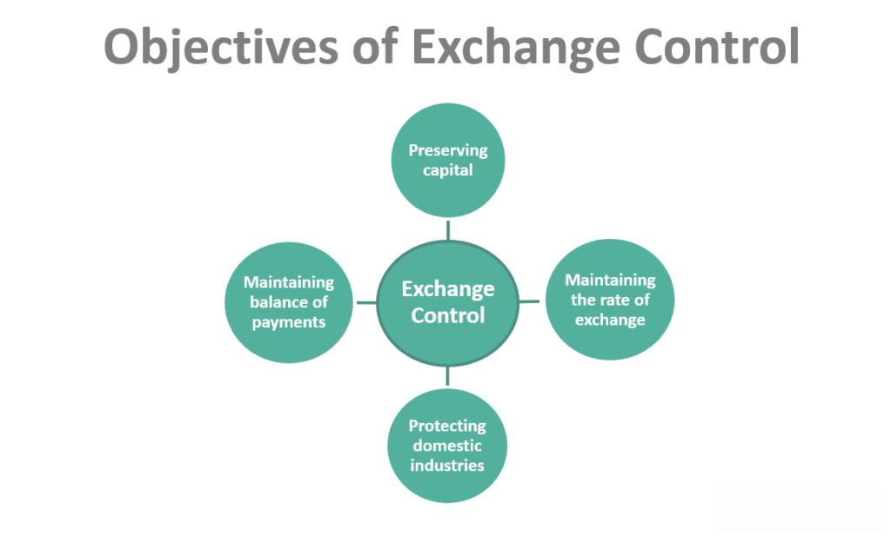

In recent years, the intricate interplay between foreign exchange, monetary policy, and currency intervention has garnered increased attention from both economists and investors. This focus is largely driven by the globalized nature of economies, where currency fluctuations can have significant impacts on international trade, investment flows, and economic stability. Foreign exchange (Forex) markets are influenced not only by supply and demand dynamics but also by strategic interventions orchestrated by central banks. These interventions aim to stabilize currencies, control inflation, or boost economic competitiveness, each with potential ramifications on domestic and international economic conditions.

Moreover, the advent of algorithmic trading has added a new layer of complexity to financial markets. By using computer programs to execute trades at unprecedented speeds and volumes, algorithmic trading has fundamentally altered market operations. With algorithms accounting for a significant portion of trading activities, they contribute to increased market liquidity and efficiency. However, they also introduce risks such as heightened volatility, challenging traditional intervention strategies employed by central banks.

This article seeks to explore the fundamental aspects of these interactions, emphasizing how they collectively shape the global economic landscape. By examining the strategies, objectives, and challenges associated with foreign exchange monetary policy and the rising influence of algorithmic trading, we aim to provide a comprehensive understanding of their roles in contemporary economic systems. Through this analysis, we highlight the necessity for innovative policy approaches that adapt to the ever-evolving complexities of the global forex environment.

## Table of Contents

## Understanding Foreign Exchange Intervention

Foreign exchange intervention is an essential monetary policy tool employed by central banks with the primary objective of influencing the exchange rate of their national currency. The necessity for such interventions arises when there is a misalignment in currency value that could disrupt economic stability. Central banks, particularly in developing nations, utilize these interventions not only to stabilize the financial markets but also to build or manage currency reserves. This process entails buying or selling foreign currencies in exchange for the domestic currency to affect its value directly.

The strategic deployment of foreign exchange intervention is closely tied to prevailing macroeconomic conditions and requires policymakers to exercise informed judgment. Factors such as inflation rates, fiscal policies, and international trade balances play critical roles in determining the need and timing for interventions. Policymakers must consider the economic environment comprehensively to ensure that interventions are well-timed and effective.

Instances of foreign exchange intervention can yield both positive and negative outcomes, illustrating the inherent risks and rewards associated with this approach. Successful interventions often lead to stabilized currency values, enhanced investor confidence, and favorable conditions for economic growth. For example, Japan's Ministry of Finance and the Bank of Japan have historically intervened in the yen market to prevent deflationary pressures and ensure export competitiveness.

Conversely, unsuccessful interventions can undermine a central bank's credibility and lead to adverse economic consequences. A notable example is the 1992 Black Wednesday event when the Bank of England was forced to withdraw the British pound from the European Exchange Rate Mechanism (ERM) after failing to stabilize the currency despite massive interventions. This incident not only led to significant financial losses but also damaged the reputation of the authorities involved.

Considering these aspects, central banks must carefully craft their intervention strategies, weighing potential risks against anticipated economic benefits. Establishing clear objectives, maintaining transparent communication with market participants, and continuously assessing economic indicators are pivotal to enhancing the efficacy of foreign exchange interventions. Through judicious management of these interventions, central banks strive to foster stable economic environments conducive to long-term growth and prosperity.

## The Role of Monetary Policy in Foreign Exchange

Monetary policy is an essential tool in shaping a nation's foreign exchange strategy, involving mechanisms such as interest rates and reserve requirements. Its significance cannot be understated, especially in economies deeply integrated into the global financial system. The primary objective of monetary policy in the context of foreign exchange is to create an environment conducive to economic stability and growth, while simultaneously ensuring the currency remains competitively valued.

Interest rates serve as a pivotal instrument in this regard. By adjusting interest rates, central banks can influence the flow of capital across borders due to yield differentials. A higher [interest rate](/wiki/interest-rate-trading-strategies) in a country typically attracts foreign capital, appreciating the national currency as demand rises. Conversely, lower interest rates may encourage capital outflow, leading to currency depreciation. Such adjustments can help soften the blow of external economic shocks by maintaining an optimal exchange rate that safeguards the economy against abrupt market fluctuations.

Achieving currency stability while promoting economic growth involves a delicate balancing act. Too high interest rates might control inflation and strengthen currency value but could stifle economic expansion. On the other hand, excessively low rates might spur economic activity but at the cost of higher inflation and potential currency devaluation. This balancing act necessitates precise and informed decision-making by policymakers.

Effective coordination between monetary policy and foreign exchange interventions is crucial. Interventions, whether through open market operations or direct currency manipulation, need to be seamlessly integrated with monetary policy goals such as inflation targeting or economic growth benchmarks. This requires comprehensive understanding and forecasting of both domestic economic indicators and global market dynamics.

The formulation of monetary policy cannot operate in isolation from global economic conditions. Domestic objectives should be aligned with international market reactions to craft policies that are not only effective in the local context but also resilient against external [volatility](/wiki/volatility-trading-strategies). This global awareness enhances the central bank's ability to respond to international currency movements and speculative attacks, safeguarding the national economy from potential adverse effects.

In summary, the calibration of monetary policy, considering interest rates and reserve requirements, plays a foundational role in a country's foreign exchange framework. Adept management and integration with foreign exchange interventions help align a country's economic objectives with the fluid dynamics of the global market, ultimately supporting long-term economic resilience and prosperity.

## Currency Intervention Strategies and Goals

Currency interventions are strategic actions taken by central banks to achieve specific macroeconomic objectives. These interventions can range from addressing short-term volatility in foreign exchange markets to enhancing the competitive positioning of a nation's exports. One of the principal motivations for currency interventions is to stabilize volatile markets, which can have broad economic implications if left unchecked. Market fluctuations can affect trade balances, investment flows, and ultimately, the domestic economy's health. By intervening, central banks aim to establish a stable environment conducive to predictable trade and investment patterns.

Central banks typically decide to intervene when their national currency deviates from its equilibrium value, creating misalignments with underlying economic fundamentals. Such discrepancies can arise from excessive speculation, shifts in market sentiment, or abrupt changes in capital flow dynamics. These situations can lead to an overvalued or undervalued currency, impacting trade competitiveness and economic growth. By realigning currency values, central banks aim to restore balance and prevent potential economic disruptions.

A notable example of strategic currency intervention is the Swiss National Bank's (SNB) action to peg the Swiss franc to the euro. In September 2011, to combat rising currency appreciation, the SNB set a minimum exchange rate of 1.20 francs per euro, effectively capping the franc's value against the euro. This intervention aimed to protect the Swiss economy from deflationary pressures and maintain export competitiveness. The peg was eventually abandoned in January 2015 due to sustained market pressures, illustrating both the efficacy and challenges of such interventions.

Interventions often have short-term objectives like [liquidity](/wiki/liquidity-risk-premium) provision and volatility reduction. By providing liquidity, central banks can alleviate market pressures that may lead to abrupt currency movements. Reducing volatility helps in minimizing the risk premium that investors might demand, fostering a more predictable economic environment. However, while addressing immediate concerns, central banks must also consider long-term economic strategies that harmonize their broader monetary policy aims. 

Balancing short-term interventions with long-term policy objectives is critical. Immediate economic needs may necessitate swift action, but sustaining currency stability requires an alignment with broader macroeconomic goals. Over-reliance on interventions can distort market signals and delay necessary structural adjustments, which are integral to economic health and resilience. Therefore, central banks must strategically deploy interventions, ensuring that they complement, rather than substitute, established monetary policies and economic reforms.

## Algorithmic Trading and Its Influence on the Forex Market

Algorithmic trading, often referred to as algo trading, revolutionizes the execution of trades by employing sophisticated computer programs designed to follow predefined criteria. These criteria are vast and varied, covering a wide range of market conditions, statistical models, and real-time data analysis. The introduction of [algorithmic trading](/wiki/algorithmic-trading) into the foreign exchange ([forex](/wiki/forex-system)) market has fundamentally altered trading dynamics, enhancing speed, [volume](/wiki/volume-trading-strategy), and efficiency in the process.

The primary advantage of algorithmic trading is its capability to execute transactions at speeds unattainable by human traders. This speed not only increases trading volume but also injects liquidity into the market, which is crucial for maintaining efficient price discovery and reducing transaction costs. Liquidity is particularly beneficial for forex markets, which are already known for their high levels of trading activity and tight spreads.

Despite its advantages, algorithmic trading can also introduce challenges, particularly in the form of increased volatility. The automated nature of algorithmic systems can lead to rapid shifts in currency prices if a large number of algorithms react simultaneously to market events or data releases. This volatility can complicate the efforts of central banks when they need to intervene in the forex market to stabilize their national currencies or correct imbalances.

Furthermore, algorithmic trading can help reduce human errors and emotional biases that traditionally affect trading decisions. By relying on data-driven models, algorithms remove the subjective elements of trading, focusing solely on objective criteria. However, this detachment from human intuition can be a double-edged sword. The absence of human judgment might lead to oversights in rapidly changing market conditions that were not anticipated by the algorithms.

Central banks, in particular, must now take into account the pervasive influence of algorithmic trading when formulating intervention strategies and monetary policies. The algorithms' ability to detect and act upon market inefficiencies at lightning speed means that traditional methods of intervention might need adaptations to remain effective. Policymakers must be cognizant of the potential for algorithms to amplify policy actions, either by inadvertently increasing market volatility or by accelerating trends that could counteract the intended effects of an intervention.

As algorithmic trading continues to evolve, with advancements in [artificial intelligence](/wiki/ai-artificial-intelligence) and [machine learning](/wiki/machine-learning), its impact on the forex market is poised to grow even more pronounced. Central banks and financial institutions must continue to adapt to these changes, ensuring that they remain effective in navigating a digitalized trading environment.

## Risks and Challenges of Foreign Exchange Interventions

Central banks frequently intervene in foreign exchange markets to adjust currency values and stabilize economic conditions. However, these interventions come with inherent risks and challenges that can affect both domestic and global financial stability.

One significant risk is the potential damage to a central bank's credibility if interventions do not achieve the intended objectives. Credibility is critical for a central bank because it underpins the trust that the public and markets have in the bank's ability to manage the economy effectively. For instance, if a central bank intervenes to strengthen its currency but fails, market participants may question its competence, potentially leading to increased volatility and reduced policy effectiveness.

Historical examples such as the 1992 Black Wednesday crisis in the United Kingdom demonstrate the adverse outcomes of failed interventions. During this event, the Bank of England attempted to maintain the pound sterling within the European Exchange Rate Mechanism (ERM) but was ultimately forced to withdraw after significant losses and market pressure, resulting in diminished market confidence.

Another challenge is the risk of developing a dependency on interventions. Frequent reliance on such measures can distort natural market mechanisms, limiting the ability of currencies to adjust to economic conditions through supply and demand. In the long term, this dependency can lead to imbalances that undermine financial stability.

Both developed and developing countries face the difficulty of avoiding unintended inflationary consequences when intervening in exchange markets. For example, if a central bank defends a currency by buying domestic assets, it can inadvertently expand the money supply, potentially leading to inflation. To mitigate these effects, it is essential for policymakers to balance intervention efforts with monetary policy adjustments, such as interest rate changes.

Effective communication is crucial to navigating these risks. By clearly articulating the rationale, goals, and strategies behind interventions, central banks can reduce market misinterpretations and avoid unnecessary speculation. Transparency in communication helps manage market expectations and supports the central bank's credibility.

In summary, while foreign exchange interventions are powerful tools, they come with significant risks and challenges. A well-considered approach that recognizes these pitfalls and incorporates clear communication and coordination with broader monetary policy is essential for maintaining economic stability.

## Conclusion

Foreign exchange, monetary policy, and algorithmic trading are deeply interconnected facets of the global economy. These areas collectively shape how economies function and respond to both domestic and global challenges. As technological advancements continue to unfold, particularly in algorithmic trading, central banks are faced with the task of adapting their strategies and tools to better manage these complexities. 

Understanding the complexities and subtleties of each component is essential for navigating the forex landscape. Foreign exchange markets are influenced by a myriad of factors ranging from central bank policies to algorithm-driven trading strategies. Monetary policy decisions regarding interest rates and reserve requirements have direct and indirect impacts on currency valuation, influencing trade balances and capital flows. Algorithmic trading, with its speed and volume, further intensifies this environment by altering liquidity and potentially heightening volatility. This interconnectedness necessitates a comprehensive understanding of how each element influences the others.

Future challenges will demand innovative solutions, drawing from both traditional economic theories and cutting-edge technologies. Central banks must continue to refine their strategies to address issues such as maintaining currency stability, supporting economic growth, and preventing undesired inflation. The collaboration between economic theory and technological innovation will be crucial in crafting effective policies that respond to the evolving dynamics of global markets.

Continued research and policy adaptation are critical to managing the balance between stability, growth, and global economic integration. Research into new economic models and algorithms will provide insights into optimizing policy outcomes. Additionally, policy adaptation must be responsive and flexible, allowing for rapid adjustments in response to unforeseen economic conditions. As globalization continues to deepen economic integration, the ability to manage these factors effectively becomes increasingly vital for ensuring sustainable economic development worldwide.

## References & Further Reading

[1]: Sarno, L., & Taylor, M. P. (2001). ["Official Intervention in the Foreign Exchange Market: Is it Effective and, If so, How Does it Work?"](https://www.aeaweb.org/articles?id=10.1257/jel.39.3.839) Journal of Economic Literature.

[2]: Neely, C. J. (2005). ["An analysis of recent studies of the effect of foreign exchange intervention."](https://files.stlouisfed.org/files/htdocs/wp/2005/2005-030.pdf) Federal Reserve Bank of St. Louis Review.

[3]: King, M. R., & Rime, D. (2010). ["The $4 trillion question: what explains FX growth since the 2007 survey?"](https://www.bis.org/publ/qtrpdf/r_qt1012e.pdf) Bank for International Settlements Quarterly Review.

[4]: Andersen, T. G., Bollerslev, T., & Dobrev, D. (2018). ["No-arbitrage pricing under leverage constraints in the foreign exchange market."](https://link.springer.com/chapter/10.1007/978-3-540-71297-8_24) Journal of Financial Economics.

[5]: Gehrig, T., & Menkhoff, L. (2020). ["The use of order flow in financial markets."](https://papers.ssrn.com/sol3/papers.cfm?abstract_id=304229) Financial Analysts Journal.

[6]: Chaboud, A. P., Chiquoine, B., Hjalmarsson, E., & Vega, C. (2014). ["Rise of the machines: Algorithmic trading in the foreign exchange market."](https://www.jstor.org/stable/43612951) The Journal of Finance.

[7]: Lyons, R. K. (2001). ["The Microstructure Approach to Exchange Rates"](https://direct.mit.edu/books/monograph/2004/The-Microstructure-Approach-to-Exchange-Rates) The MIT Press.

[8]: De Grauwe, P., & Grimaldi, M. (2006). ["The Exchange Rate in a Behavioural Finance Framework."](https://www.degruyter.com/document/doi/10.1515/9780691186993/html) Princeton University Press.

[9]: Baba, C., & Packer, F. (2009). ["Interventions could be costly to central banks."](https://www.annualreviews.org/content/journals/10.1146/annurev-financial-111620-022146) Bank for International Settlements Quarterly Review.

[10]: Taylor, J. B. (2009). ["The Financial Crisis and the Policy Responses: An Empirical Analysis of What Went Wrong"](https://www.nber.org/papers/w14631) National Bureau of Economic Research.