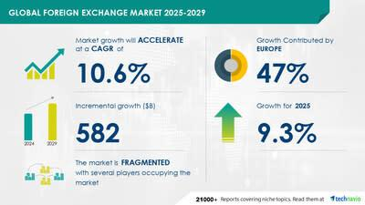

## Table of Contents

## What is the foreign exchange market?

The foreign exchange market, often called the forex market, is where people and businesses trade one country's money for another. It's like a big global marketplace that never sleeps, where you can exchange dollars for euros, yen for pounds, and so on. This market is important because it helps people buy things from other countries, invest in foreign businesses, or travel abroad.

The forex market is huge and works all the time, even on weekends and holidays. It's not in one place but spread all over the world, with trading happening in big cities like London, New York, and Tokyo. The prices of currencies change based on what's happening in the world, like economic news, political events, and even natural disasters. This means the value of money can go up or down quickly, making the forex market both exciting and risky.

## How did the foreign exchange market emerge?

The foreign exchange market started a long time ago when people from different places began trading with each other. In the old days, if someone from one country wanted something from another country, they had to trade their own money for the other country's money. This was the beginning of the foreign exchange market. As more countries got involved in trading, the need for a place to exchange money grew. By the 19th century, with the growth of international trade and the gold standard, the modern forex market began to take shape.

After World War II, the Bretton Woods system was created to help control the exchange rates between countries. This system lasted until the early 1970s when it was replaced by a system where currency values could float freely. This change made the [forex](/wiki/forex-system) market even bigger and more active. Today, with computers and the internet, trading can happen instantly from anywhere in the world, making the forex market a huge and busy place where billions of dollars are traded every day.

## What are the key factors that contributed to the growth of the foreign exchange market?

The growth of the foreign exchange market was helped by a few important things. One big thing was the increase in international trade. As more countries started trading with each other, they needed a way to change their money into other countries' money. This need made the forex market bigger. Another thing that helped was the gold standard in the 19th century. This was a system where countries used gold to set the value of their money, which made it easier to trade between countries and helped the forex market grow.

Another key [factor](/wiki/factor-investing) was the change from the Bretton Woods system to a system where currencies could float freely. Before the 1970s, countries' currencies were fixed to the U.S. dollar, but after that, they could change in value based on what was happening in the world. This made the forex market more exciting and active because the value of money could go up or down quickly. Finally, the use of computers and the internet has made trading easier and faster. Now, people can trade from anywhere at any time, which has made the forex market even bigger and busier.

## What are the main participants in the foreign exchange market?

The main participants in the foreign exchange market are banks, big companies, governments, and regular people like you and me. Banks are the biggest players because they help other people and businesses trade money. Big companies also use the forex market a lot because they need to buy and sell things in different countries, so they need to change their money into other currencies. Governments also take part in the forex market to control their country's money and make sure it stays stable.

Regular people like us can also join in the forex market, usually through something called a forex broker. These brokers help us trade money without having to go to a big bank. There are also other smaller players like hedge funds and investment firms that use the forex market to make money by guessing how currency values will change. All these different groups coming together make the forex market a busy and important place where a lot of money is traded every day.

## How does the foreign exchange market function?

The foreign exchange market works like a big global marketplace where people trade different countries' money. It's always open, 24 hours a day, from Monday to Friday, and it's not in one place but spread all over the world. People use it to buy things from other countries, invest in foreign businesses, or go on trips abroad. When someone wants to trade money, they usually go through a bank or a forex broker. These big players help make the trades happen quickly and easily. The prices of currencies change all the time based on what's happening in the world, like news about the economy, politics, or even natural disasters.

The main players in the forex market are banks, big companies, governments, and regular people. Banks are the biggest because they help others trade money. Big companies need the forex market to buy and sell things in different countries, so they change their money into other currencies. Governments use it to keep their country's money stable. Regular people can also join in, usually with the help of a forex broker. There are also other players like hedge funds and investment firms that try to make money by guessing how currency values will change. All these different groups coming together make the forex market a busy and important place where a lot of money is traded every day.

## What are the different types of foreign exchange transactions?

There are a few main types of foreign exchange transactions. One type is called a spot transaction. This is when people trade money right away, usually within two days. It's like going to a store and buying something with cash. Spot transactions are used a lot by people who need to pay for things in another country quickly.

Another type of transaction is called a forward transaction. This is when people agree to trade money at a certain price in the future, maybe a few months from now. It's like making a deal today for something you'll get later. Forward transactions are helpful for companies that want to know how much they'll have to pay for things in the future, so they can plan better.

There's also a type called a swap transaction. This is when people trade money now and agree to trade it back later. It's like borrowing money in one currency and then paying it back in another. Swaps are often used by banks and big companies to manage their money better and protect themselves from changes in currency values.

## What are the major currency pairs traded in the foreign exchange market?

The foreign exchange market has some major currency pairs that are traded a lot. The most popular one is the EUR/USD, which is the euro against the U.S. dollar. This pair is very important because the euro and the dollar are used a lot around the world. Another big pair is the USD/JPY, which is the U.S. dollar against the Japanese yen. Japan is a big economy, so this pair is also very active. The GBP/USD, which is the British pound against the U.S. dollar, is another major pair because the U.K. is a big trading country.

Other important pairs include the USD/CHF, which is the U.S. dollar against the Swiss franc. Switzerland is known for its strong and stable economy, so this pair is popular. The AUD/USD, which is the Australian dollar against the U.S. dollar, is also traded a lot because Australia has a lot of natural resources that other countries want to buy. These major pairs are watched closely by traders because they can tell us a lot about what's happening in the world economy.

## How has technology influenced the growth of the foreign exchange market?

Technology has made a big difference in the foreign exchange market. Before, people had to call banks or go to them to trade money, which could take a long time. Now, with computers and the internet, trading can happen very quickly. People can trade money from anywhere in the world, even from their homes. This has made the forex market much bigger and busier because more people can join in easily. Also, technology has made it easier to get information about what's happening in the world, which helps traders make better decisions about when to buy or sell currencies.

Another way technology has helped is by making trading safer and more reliable. There are now computer programs that can do trades automatically, which means they can happen very fast and without mistakes. These programs can also watch the market all the time and make trades when it's the best time, even if the trader is not awake. This has made the forex market more efficient and has helped it grow even more. Overall, technology has made the forex market easier to use, faster, and more accessible to everyone, which has led to its big growth.

## What role do central banks play in the foreign exchange market?

Central banks are really important in the foreign exchange market. They help keep their country's money stable. They do this by buying or selling their own currency. For example, if a central bank thinks its currency is too weak, it might sell some of its foreign money to buy its own currency, which can make it stronger. If they think it's too strong, they might do the opposite. This is called intervention, and it's a big way central banks can affect the forex market.

Central banks also set interest rates, which can change how people want to trade money. If a central bank raises interest rates, it can make its currency more attractive because people can earn more money by keeping it. This can make the currency's value go up. On the other hand, if they lower interest rates, it might make the currency less attractive, and its value could go down. By doing these things, central banks play a big role in what happens in the foreign exchange market every day.

## How do geopolitical events impact the foreign exchange market?

Geopolitical events can have a big impact on the foreign exchange market. When something important happens in the world, like a war, an election, or a big change in a country's government, it can make people worried about what will happen next. This worry can make them want to change their money into a different country's money that they think will be safer. For example, if there's a war in a country, people might sell that country's money and buy a more stable currency like the U.S. dollar or the Swiss franc. This can make the value of the war-torn country's money go down and the value of the safer currency go up.

These events can also change how people think about the future of different countries' economies. If a country has an election and the new leader wants to change a lot of things, it might make people unsure about what will happen to that country's money. They might decide to wait and see, or they might move their money to another country that seems more predictable. All these reactions to geopolitical events can make the forex market move a lot, sometimes very quickly. This is why traders always keep an eye on the news to see what might happen next in the world.

## What are the risks associated with trading in the foreign exchange market?

Trading in the foreign exchange market can be risky because the value of money can change a lot and very quickly. This is called currency risk. If you buy a currency and its value goes down, you can lose money. For example, if you buy euros with dollars and the euro gets weaker, you'll get fewer dollars back when you want to change your euros back. Another risk is called leverage risk. When you trade forex, you can borrow money to make bigger trades. This can help you make more money if things go well, but it can also make you lose a lot more if things go badly.

There's also something called [interest rate](/wiki/interest-rate-trading-strategies) risk. This happens when the interest rates in different countries change. If a country raises its interest rates, its currency might get stronger, and if it lowers them, its currency might get weaker. This can affect your trades in ways you might not expect. Another risk is called counterparty risk. This is the chance that the person or bank you're trading with might not be able to pay you back. Finally, there's [liquidity](/wiki/liquidity-risk-premium) risk. Sometimes, it can be hard to buy or sell a currency quickly because not enough people want to trade it at that time. All these risks mean that trading in the forex market can be exciting but also very tricky.

## What advanced strategies can be used to optimize trading in the foreign exchange market?

One advanced strategy for trading in the foreign exchange market is called technical analysis. This means looking at charts and past prices to guess where the currency might go next. Traders use different tools, like moving averages and trend lines, to find patterns in the market. They might also use something called an oscillator to see if a currency is overbought or oversold, which can help them decide when to buy or sell. Another strategy is called [algorithmic trading](/wiki/algorithmic-trading), where traders use computer programs to make trades automatically. These programs can look at a lot of information very quickly and make trades based on rules set by the trader. This can help take emotions out of trading and make decisions faster.

Another strategy is called [carry](/wiki/carry-trading) trading. This is when a trader borrows money in a currency with a low interest rate and then uses that money to buy a currency with a higher interest rate. The idea is to make money from the difference in interest rates. But this can be risky because if the currency you borrowed goes up in value, you might lose money when you have to pay it back. Hedging is another advanced strategy where traders try to protect themselves from losing money. They might do this by making another trade that will make money if their first trade loses money. For example, if you think the euro might go down, you could buy dollars as a hedge. This way, if the euro does go down, you might lose money on your euro trade but make money on your dollar trade.

## What are the types of algorithmic trading strategies?

Algorithmic trading strategies have become an indispensable part of the Forex market due to their ability to process vast amounts of data and execute trades with precision and speed. Here, we explore some of the predominant types of algorithmic trading strategies that traders employ.

Trend-following strategies capitalize on prevailing market trends. These strategies rely on technical indicators to inform trading decisions. One commonly used indicator is the moving average, which helps smooth out price data to identify the direction of the trend. For example, a simple moving average (SMA) can be calculated using the following formula:

$$
\text{SMA} = \frac{P_1 + P_2 + ... + P_n}{n}
$$

where $P_1, P_2, ..., P_n$ are the closing prices for a specified period $n$. Traders look for crossover points between short-term and long-term moving averages to signal potential buy or sell positions.

Arbitrage strategies involve exploiting price discrepancies of the same asset across different markets or forms. Forex traders might identify and act on slight discrepancies between exchange rates quoted on different platforms. These opportunities can be fleeting, thus requiring rapid identification and execution. The primary objective of [arbitrage](/wiki/arbitrage) is to lock in risk-free profits from these price differentials without having to speculate on market movements.

High-frequency trading ([HFT](/wiki/high-frequency-trading-strategies)) strategies deploy algorithms to execute a large number of orders at extremely fast speeds. These strategies depend on powerful computational tools and advanced networks to minimize latency, thereby gaining a competitive edge. HFT algorithms analyze multiple markets and financial instruments simultaneously to detect patterns or prices that traditional traders cannot. The significance of HFT lies in its ability to exploit small price movements, multiplying profits through the sheer [volume](/wiki/volume-trading-strategy) of transactions executed within fractions of a second.

In essence, each of these strategies leverages algorithmic precision to capture profits in the fast-paced Forex market. Traders choose strategies based on varying market conditions, technological capabilities, and individual risk appetites.

## References & Further Reading

[1]: Bergstra, J., Bardenet, R., Bengio, Y., & Kégl, B. (2011). ["Algorithms for Hyper-Parameter Optimization."](https://dl.acm.org/doi/10.5555/2986459.2986743) Advances in Neural Information Processing Systems 24.

[2]: ["Advances in Financial Machine Learning"](https://www.amazon.com/Advances-Financial-Machine-Learning-Marcos/dp/1119482089) by Marcos Lopez de Prado

[3]: ["Evidence-Based Technical Analysis: Applying the Scientific Method and Statistical Inference to Trading Signals"](https://www.amazon.com/Evidence-Based-Technical-Analysis-Scientific-Statistical/dp/0470008741) by David Aronson

[4]: ["Machine Learning for Algorithmic Trading"](https://github.com/stefan-jansen/machine-learning-for-trading) by Stefan Jansen

[5]: ["Quantitative Trading: How to Build Your Own Algorithmic Trading Business"](https://www.amazon.com/Quantitative-Trading-Build-Algorithmic-Business/dp/1119800064) by Ernest P. Chan