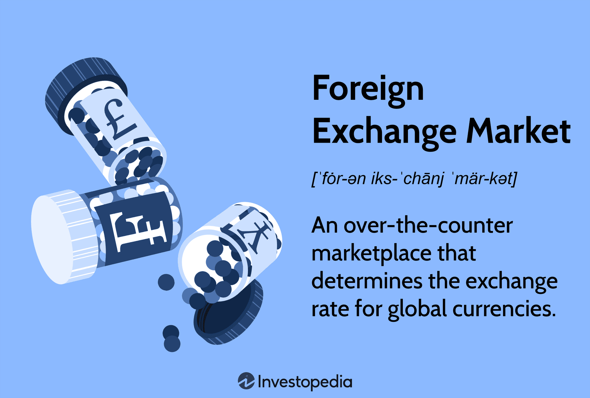

## Table of Contents

## What is the foreign exchange market?

The foreign exchange market, often called the forex market, is where people and businesses trade different currencies. It's like a big global marketplace where you can exchange one country's money for another's. This market is really important because it helps international trade and investments. For example, if a company in the U.S. wants to buy goods from Japan, it needs to convert its dollars into yen.

The forex market is the largest and most liquid financial market in the world. It operates 24 hours a day, five days a week, and involves participants from all over the globe. Unlike stock markets, there isn't a central location for forex trading; instead, it's done electronically over-the-counter (OTC), which means transactions happen directly between two parties. The main players in this market are banks, governments, and big companies, but individual traders can also participate through brokers.

## How does the foreign exchange market operate?

The foreign exchange market works like a big trading place where people and businesses swap one country's money for another's. It's open all the time during the week, so you can trade anytime from Monday to Friday. There's no one big building where it happens; instead, it's all done on computers and phones around the world. Banks, big companies, and even regular people can take part. They use special services or brokers to help them trade.

When someone wants to trade, they look at the price of one currency compared to another, which is called the exchange rate. If the rate is good, they might decide to buy or sell. For example, if you think the euro will get stronger against the dollar, you might buy euros with your dollars. The market is always moving because lots of things can change the value of money, like news about a country's economy or big events happening around the world. So, traders need to keep an eye on these changes to make smart trades.

## What are the main participants in the foreign exchange market?

The main participants in the foreign exchange market are banks, governments, big companies, and individual traders. Banks are the biggest players because they handle a lot of money moving around the world. They trade currencies to help their customers and also to make profits for themselves. Governments and central banks also play a big role. They might buy or sell their own country's money to keep it stable or to help their economy.

Big companies are another important group. They need to trade currencies to do business in different countries. For example, if a company in the U.S. wants to buy something from Japan, it needs to change its dollars into yen. Lastly, individual traders can also join in. They use brokers or online platforms to trade currencies, hoping to make a profit from changes in exchange rates. Even though they trade smaller amounts than banks or companies, there are so many of them that they can have a big impact on the market.

## What is the history of the foreign exchange market?

The foreign exchange market started a long time ago, even before money was used. People used to trade things like salt, spices, and other goods. When countries started using their own money, they needed a way to trade it with other countries' money. This led to the first foreign exchange markets. In the 19th century, the gold standard was used, which meant that the value of money was based on gold. This made trading between countries easier because everyone could agree on the value of gold.

After World War II, the Bretton Woods system was set up. This system fixed the value of currencies to the U.S. dollar, and the dollar was tied to gold. But in 1971, the U.S. stopped using the gold standard, and currencies started to float freely. This meant their values could change based on supply and demand. Since then, the foreign exchange market has grown a lot. Now, it's the biggest financial market in the world, with trading happening all the time, every day of the week.

## How has the foreign exchange market evolved over time?

The foreign exchange market has changed a lot over time. It started way back when people traded things like salt and spices instead of money. When countries began using their own money, they needed a way to trade it with other countries' money. This led to the first foreign exchange markets. In the 1800s, the gold standard came into play. This meant that the value of money was based on gold, which made trading between countries easier because everyone agreed on the value of gold.

After World War II, the Bretton Woods system was set up. This system fixed the value of currencies to the U.S. dollar, and the dollar was tied to gold. But in 1971, the U.S. stopped using the gold standard, and currencies started to float freely. This meant their values could go up or down based on supply and demand. Since then, the foreign exchange market has grown a lot. It's now the biggest financial market in the world, with trading happening all the time, every day of the week. Technology has also helped the market grow, making it easier for more people to trade from anywhere in the world.

## What are the most commonly traded currency pairs?

The foreign exchange market has some currency pairs that are traded a lot more than others. These are called the major currency pairs. The most commonly traded pair is the EUR/USD, which is the euro against the U.S. dollar. This pair is very popular because the euro and the dollar are used a lot around the world. Another big pair is the USD/JPY, which is the U.S. dollar against the Japanese yen. The yen is important because Japan has a big economy and a lot of trade happens with Japan.

Other major pairs include GBP/USD, which is the British pound against the U.S. dollar, and USD/CHF, which is the U.S. dollar against the Swiss franc. The Swiss franc is known for being a safe currency, so people trade it a lot when they want to be safe with their money. These pairs are called "majors" because they are the most liquid, meaning it's easy to buy and sell them. They also have the smallest difference between the buying and selling price, which is good for traders.

## What are the advantages of trading in the foreign exchange market?

Trading in the foreign exchange market has many advantages. One big advantage is that it's open all the time during the week. This means you can trade whenever you want, from Monday to Friday. It's also the biggest market in the world, so there are always lots of people buying and selling. This makes it easy to trade because you can always find someone to trade with. Another good thing is that you don't need a lot of money to start. You can trade with small amounts, which makes it easier for more people to join in.

Another advantage is that the foreign exchange market is very liquid. This means you can quickly buy or sell currencies without waiting. It also means the difference between the buying and selling price is small, which can save you money. Plus, there are many tools and resources available to help you trade better. You can use charts, news, and special software to make smarter decisions. All these things make the foreign exchange market a good place for people who want to trade currencies.

## What are the disadvantages and risks associated with the foreign exchange market?

Trading in the foreign exchange market can be risky. One big risk is that the market can be very unpredictable. The value of currencies can change quickly because of news, events, or even rumors. This means you could lose money if the market moves against you. Another risk is that you might use something called leverage, which lets you trade with more money than you actually have. While this can make you more money if things go well, it can also make you lose a lot more if they don't. It's like borrowing money to bet on the market, and if you guess wrong, you owe more than you started with.

Another disadvantage is that the foreign exchange market can be hard to understand. There are a lot of things that can affect currency values, like interest rates, economic reports, and even political events. If you don't know how these things work, it can be tough to make good trading decisions. Also, there are a lot of people and companies trying to make money in this market, and not all of them are honest. You might run into scams or bad brokers who don't have your best interests at heart. So, it's important to be careful and do your homework before you start trading.

## How does leverage work in the foreign exchange market, and what are its implications?

Leverage in the foreign exchange market lets you trade with more money than you actually have. It's like borrowing money from your broker to make bigger trades. For example, if you have $1,000 and use 100:1 leverage, you can trade with $100,000. This can make your profits bigger if the market moves in your favor. But it's risky because if the market moves against you, your losses can also be much bigger. If you lose more than your $1,000, you might have to pay back the difference to your broker.

Using leverage can be a double-edged sword. On one hand, it can help you make more money with less of your own cash. This is why many traders like it. On the other hand, it can lead to big losses if you're not careful. Because of this, it's important to understand how leverage works and to use it wisely. You should always have a plan and know how much you're willing to risk before you start trading with leverage.

## What are the key economic indicators that influence foreign exchange rates?

Economic indicators are like signs that tell us how a country's economy is doing. They can change how much people want to buy or sell a country's money, which affects exchange rates. Some important indicators are things like interest rates, inflation rates, and how much a country is growing economically, which is called GDP. When a country's interest rates go up, its currency might get stronger because more people want to invest there to get better returns. On the other hand, if inflation is high, it can make a currency weaker because people think the money will be worth less in the future.

Another key indicator is employment data, like the unemployment rate. If a lot of people have jobs, it can make the economy stronger and the currency more valuable. But if many people are out of work, it can hurt the economy and make the currency weaker. Trade balances also matter a lot. If a country exports more than it imports, it can make its currency stronger because other countries need to buy its money to pay for its goods. But if it imports more than it exports, its currency might get weaker. All these indicators can move exchange rates because they show how healthy a country's economy is.

## How do geopolitical events impact the foreign exchange market?

Geopolitical events can shake up the foreign exchange market a lot. These events, like wars, elections, or big policy changes, can make people feel unsure about what will happen next. When people are unsure, they might want to move their money to safer places. For example, if there's a war in a country, people might sell that country's money and buy a safer currency like the U.S. dollar or Swiss franc. This can make the war-torn country's currency weaker and the safe currency stronger.

These events can also change how people think about a country's future. If a new leader gets elected and people think they will make the economy better, the country's currency might get stronger. But if people think the new leader will make things worse, the currency might get weaker. Big policy changes, like new trade deals or sanctions, can also move exchange rates. For example, if a country puts sanctions on another, it can hurt the second country's economy and make its currency less valuable. So, keeping an eye on the news and understanding how these events might affect countries can help traders make better decisions in the foreign exchange market.

## What strategies can be used to manage risk in the foreign exchange market?

Managing risk in the foreign exchange market is important to protect your money. One way to do this is by using stop-loss orders. A stop-loss order is like a safety net that automatically sells your currency if its value drops to a certain point. This can help you limit how much you lose if the market moves against you. Another strategy is to not put all your money into one trade. By spreading your money across different currencies or trades, you can lower the risk of losing everything at once. This is called diversification.

Another good way to manage risk is to keep an eye on how much leverage you're using. Leverage can make your profits bigger, but it can also make your losses bigger. So, it's smart to use less leverage and only trade with money you can afford to lose. Also, staying informed about what's happening in the world can help you make better decisions. News about economies, politics, or big events can change currency values, so knowing these things can help you predict what might happen next and adjust your trades accordingly.

## References & Further Reading

[1]: Bergstra, J., Bardenet, R., Bengio, Y., & Kégl, B. (2011). ["Algorithms for Hyper-Parameter Optimization."](https://papers.nips.cc/paper/4443-algorithms-for-hyper-parameter-optimization) Advances in Neural Information Processing Systems 24.

[2]: ["Advances in Financial Machine Learning"](https://www.amazon.com/Advances-Financial-Machine-Learning-Marcos/dp/1119482089) by Marcos Lopez de Prado

[3]: ["Evidence-Based Technical Analysis: Applying the Scientific Method and Statistical Inference to Trading Signals"](https://www.amazon.com/Evidence-Based-Technical-Analysis-Scientific-Statistical/dp/0470008741) by David Aronson

[4]: ["Machine Learning for Algorithmic Trading"](https://github.com/PacktPublishing/Machine-Learning-for-Algorithmic-Trading-Second-Edition) by Stefan Jansen

[5]: ["Quantitative Trading: How to Build Your Own Algorithmic Trading Business"](https://www.amazon.com/Quantitative-Trading-Build-Algorithmic-Business/dp/1119800064) by Ernest P. Chan