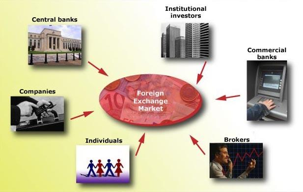

## Table of Contents

## What is the foreign exchange market?

The foreign exchange market, often called the forex market, is where people and businesses trade different currencies from around the world. It's like a big global marketplace where you can exchange one country's money for another's. This market is important because it helps people buy things from other countries, invest in foreign businesses, and manage money across borders.

The forex market is the largest and most liquid financial market in the world, meaning there's always a lot of money moving around. It operates 24 hours a day, five days a week, because different countries' markets open and close at different times. Most trading happens between big banks, governments, and other financial institutions, but regular people can also trade through brokers. The exchange rates, or the price at which one currency can be traded for another, change all the time based on things like interest rates, economic news, and political events.

## Who are the main participants in the foreign exchange market?

The main participants in the foreign exchange market are big banks, governments, and big companies. These big banks, called commercial banks, trade a lot of money every day. They help their customers, like other banks or big companies, to buy and sell different currencies. Governments also play a big role. They might want to change the value of their own money to help their country's economy. Big companies that do business in many countries need to use the forex market to pay for things they buy from other countries or to get money from selling things to other countries.

Another important group is the central banks. They are like the boss of all the money in a country. They can buy or sell their own currency to make it stronger or weaker. Hedge funds and other investors also participate. They try to make money by guessing which way currency values will go. Lastly, regular people can also join in, but usually through a broker who helps them trade. All these different groups make the [forex](/wiki/forex-system) market very busy and always changing.

## How do individuals participate in the foreign exchange market?

Individuals can join the foreign exchange market by using a special kind of company called a broker. These brokers help people trade different countries' money. To start, a person needs to open an account with a broker and put some money in it. Then, they can use special computer programs or apps to buy and sell currencies. It's a bit like playing a game, but with real money, and the goal is to buy a currency when it's cheap and sell it when it's more expensive.

Trading in the forex market can be exciting, but it's also risky. The prices of currencies can go up and down a lot, and if someone guesses wrong, they might lose money. That's why it's important for individuals to learn about how the market works and maybe even practice with pretend money first. Some people also use tools like stop-loss orders, which help limit how much money they might lose. Overall, while anyone can participate, it's wise to be careful and learn as much as possible before diving in.

## What are the roles of banks in the foreign exchange market?

Banks play a big role in the foreign exchange market. They are like the main players in a game where countries' money is traded. Big banks, called commercial banks, do a lot of trading every day. They help their customers, like other banks or big companies, to buy and sell different currencies. For example, if a company in the United States wants to buy something from Japan, it needs Japanese yen. The bank can help the company get yen by trading its US dollars.

Banks also help keep the market running smoothly. They make sure there's always enough money to trade, which is called [liquidity](/wiki/liquidity-risk-premium). When banks trade with each other, it helps set the prices for different currencies, known as exchange rates. Sometimes, banks even trade for their own benefit, trying to make a profit by guessing which way currency values will go. Overall, banks are very important because they help everyone else in the market do what they need to do.

## How do multinational corporations use the foreign exchange market?

Multinational corporations use the foreign exchange market to manage their money when they do business in different countries. These companies often need to pay for things they buy from other countries or get money from selling things to other countries. For example, if a company in the United States wants to buy parts from Germany, it needs euros. The company can go to a bank or a broker to trade its US dollars for euros. This way, the company can pay for the parts it needs to keep its business running.

These corporations also use the forex market to protect themselves from big changes in currency values. They might use something called hedging, which is like a safety net. For example, if a company knows it will need to pay a big bill in another currency in the future, it can make a deal now to buy that currency at today's price. This helps the company avoid losing money if the currency becomes more expensive later. By using the foreign exchange market, multinational corporations can keep their finances stable and focus on growing their business around the world.

## What is the impact of central banks on the foreign exchange market?

Central banks have a big impact on the foreign exchange market. They are like the bosses of money in their countries. One of the main things they do is set interest rates. When a central bank changes the [interest rate](/wiki/interest-rate-trading-strategies), it can make their country's money more or less attractive to people and businesses from other countries. For example, if a central bank raises the interest rate, it can make people want to buy that country's money because they can earn more from it. This can make the country's money stronger in the forex market.

Central banks also buy and sell their own currency to control its value. If a central bank thinks its money is getting too weak, it can use its reserves to buy its own currency. This makes the currency more valuable because there's more demand for it. On the other hand, if the central bank thinks its money is too strong, it can sell some of its currency to make it weaker. These actions by central banks can cause big changes in the forex market, affecting how much one country's money is worth compared to another's.

## How do hedge funds and other institutional investors participate in forex trading?

Hedge funds and other institutional investors participate in the foreign exchange market to make money. They do this by guessing which way currency values will go. If they think a currency will go up, they buy it, hoping to sell it later for more money. If they think it will go down, they might sell it now and buy it back later for less. These investors use a lot of data and special tools to make their guesses. They look at things like economic reports, interest rates, and even political news to decide when to buy or sell.

These big investors also use something called leverage, which means they can trade with more money than they actually have. This can make their profits bigger if they guess right, but it can also make their losses bigger if they guess wrong. Because hedge funds and institutional investors trade a lot of money, their actions can affect the whole forex market. When they all start buying or selling the same currency, it can make the price go up or down a lot. This is why they are important players in the forex market, even though they are not as big as banks or central banks.

## What are the different types of forex trading strategies used by participants?

Forex trading strategies are like different ways people play the game of trading currencies. One common strategy is called [scalping](/wiki/gamma-scalping). This is when traders make lots of small trades in a short time, trying to make a little bit of money from each one. They might only hold onto a currency for a few seconds or minutes. Another strategy is called [day trading](/wiki/day-trading-spy). Day traders buy and sell currencies within the same day, hoping to make money from small changes in price. They don't keep their trades overnight because they want to avoid the risks that can happen when markets are closed.

Another popular strategy is swing trading. Swing traders hold onto their trades for a few days or even weeks. They try to catch bigger moves in the market, but they still want to get in and out before the trend changes. Some traders use a strategy called position trading, where they hold onto their trades for months or even years. They are looking for big, long-term changes in currency values. Lastly, there's a strategy called [carry](/wiki/carry-trading) trading. This is when traders borrow money in a currency with a low interest rate and use it to buy a currency with a higher interest rate, hoping to make money from the difference in interest rates.

All these strategies have their own risks and rewards. Scalping and day trading can be exciting but stressful because the market moves so fast. Swing and position trading might be less stressful, but they need a lot of patience. Carry trading can be profitable if everything goes well, but it can also be risky if the currency values change suddenly. No matter which strategy someone chooses, it's important to understand the market and be ready for surprises.

## How does technology influence participation in the foreign exchange market?

Technology has made it much easier for people to join the foreign exchange market. In the past, only big banks and rich people could trade currencies because they had the tools and information needed. But now, thanks to the internet and special computer programs, anyone can trade from their own home. These programs, called trading platforms, let people buy and sell currencies with just a few clicks. They also show real-time prices and charts, helping traders make better decisions. Mobile apps mean that people can trade on their phones, making it even more convenient.

Technology also helps traders use smart strategies. There are computer programs called algorithms that can trade automatically based on rules set by the trader. These algorithms can watch the market all the time and make trades very quickly, which can be hard for a person to do. Also, technology brings a lot of information right to traders' screens. They can see news, economic reports, and other data that can affect currency prices. This helps them make more informed choices. Overall, technology has opened up the forex market to more people and made trading faster and smarter.

## What are the regulatory considerations for participants in the foreign exchange market?

People who trade in the foreign exchange market need to follow rules set by different countries. These rules are there to make sure the market is fair and safe for everyone. For example, in the United States, the Commodity Futures Trading Commission (CFTC) and the National Futures Association (NFA) keep an eye on forex trading. They make sure brokers and traders are honest and follow the law. Other countries have their own groups that do similar things. These rules can say who can trade, how much money someone needs to start trading, and what brokers need to tell their customers.

Regulations also help protect people from losing too much money. For example, some rules say that brokers must keep their customers' money safe and separate from their own money. This way, if the broker has problems, the customers' money is still safe. Also, some countries have rules about how much money someone can trade with, to stop them from taking too big of a risk. It's important for anyone trading in the forex market to know these rules and follow them, so they can trade safely and fairly.

## How do geopolitical events affect participation and strategies in the foreign exchange market?

Geopolitical events, like wars, elections, and trade deals, can shake up the foreign exchange market a lot. When something big happens in the world, it can make people and businesses feel unsure about the future. They might start buying or selling different currencies to protect their money or to try to make a profit. For example, if there's a war, people might want to buy a currency they think is safe, like the US dollar. This can make the dollar stronger and other currencies weaker.

Traders and investors need to keep an eye on the news and be ready to change their plans because of these events. If a country is about to have an important election, the value of its currency might go up and down a lot as people guess who will win and what that will mean for the economy. Some traders might use special strategies to make money from these changes, like betting that a currency will go down if there's bad news. But it's risky because geopolitical events can be hard to predict, and the market can move very quickly.

## What advanced tools and analytics do expert traders use to enhance their participation in the forex market?

Expert traders use special computer programs and tools to help them make better decisions in the forex market. These tools can analyze a lot of data very quickly, looking at things like past prices, economic reports, and even news from around the world. One important tool is called technical analysis software. This software helps traders see patterns in how currency prices move. It uses charts and graphs to show these patterns, making it easier for traders to guess where prices might go next. Another tool is called [fundamental analysis](/wiki/fundamental-analysis), which looks at big things like a country's economy and interest rates to understand why a currency's value might change.

Traders also use something called [algorithmic trading](/wiki/algorithmic-trading), which is when computers make trades automatically based on rules set by the trader. These algorithms can watch the market all the time and make trades much faster than a person could. This can help traders take advantage of small changes in prices. Another advanced tool is called a risk management system. This helps traders keep track of how much they might lose and set limits to stop them from losing too much money. All these tools and analytics help expert traders make smarter trades and manage their risks better in the fast-moving world of forex trading.

## References & Further Reading

[1]: Lyons, R. K. (2001). ["The Microstructure Approach to Exchange Rates."](https://direct.mit.edu/books/monograph/2004/The-Microstructure-Approach-to-Exchange-Rates) MIT Press.

[2]: Harris, L. (2003). ["Trading and Exchanges: Market Microstructure for Practitioners."](https://www.amazon.com/Trading-Exchanges-Market-Microstructure-Practitioners/dp/0195144708) Oxford University Press.

[3]: King, M. R., Osler, C. L., & Rime, D. (2012). ["Foreign Exchange Market Structure, Players and Evolution."](https://onlinelibrary.wiley.com/doi/10.1002/9781118445785.ch1) International Economic Review.

[4]: Aldridge, I. (2013). ["High-Frequency Trading: A Practical Guide to Algorithmic Strategies and Trading Systems."](https://www.amazon.com/High-Frequency-Trading-Practical-Algorithmic-Strategies/dp/1118343506) Wiley.

[5]: Chaboud, A. P., Chiquoine, B., Hjalmarsson, E., & Vega, C. (2014). ["Rise of the Machines: Algorithmic Trading in the Foreign Exchange Market."](https://www.jstor.org/stable/43612951) Review of Finance.

[6]: Treleaven, P., Galas, M., & Laptev, N. (2013). ["Algorithmic Trading: Challenges and Opportunities."](https://dl.acm.org/doi/10.1145/2500117) Computer Science Review.