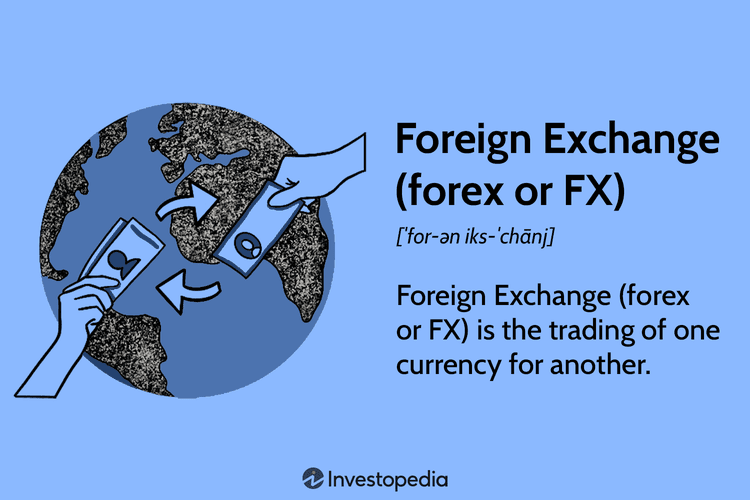

The currency market, commonly referred to as the foreign exchange or forex market, represents the largest financial market globally, with a daily trading volume that surpasses $6 trillion, dwarfing other financial markets. Unlike traditional stock markets, forex is decentralized and operates 24 hours a day, five days a week, facilitating currency exchanges across different time zones and continents. The forex market serves a fundamental role in the global economy, enabling currency conversion for international trade and investment purposes. Additionally, it attracts a diverse range of participants, including central banks, financial institutions, multinational corporations, and individual traders, each contributing to its dynamic and fluid nature.

In recent years, the landscape of forex trading has been transformed by technological advancements, leading to the emergence and proliferation of algorithmic trading. This form of trading employs complex algorithms and predetermined criteria to automate and execute trades at high speeds, offering numerous advantages over manual trading practices. Algorithmic trading has become an integral component of modern forex trading due to its potential to enhance efficiency, speed, and accuracy. By leveraging sophisticated algorithms, traders can capitalize on even the slightest market movements, execute large volumes of trades with minimal human intervention, and optimize their trading strategies based on vast amounts of data.

As the forex market continues to evolve, algorithmic trading represents a significant intersection between technology and finance, ushering in new opportunities and challenges. This article examines these developments within the forex market, emphasizing the benefits and risks associated with algorithmic trading in this vast financial arena.

## Table of Contents

## Understanding the Forex Market

Forex markets, known as the foreign exchange markets, are primarily concerned with the exchange of national currencies. As a cornerstone of global finance, forex markets enable the conversion and trading of currencies in varying volumes, depending on their quoted prices. This trading is crucial for international business, travel, and economic interactions, necessitating the fluid exchange of currencies globally.

The forex market operates on a decentralized structure, distinguishing itself from traditional financial markets that are typically centralized around established exchanges. Due to this decentralization, forex markets function continuously for 24 hours a day, five days a week, allowing constant trading from Monday to Friday across different time zones. This continuous operation is facilitated by the interconnection of a network spanning banks, financial entities, and currency exchanges globally.

As of recent estimates, the daily average trading volume in the forex market is approximately $6.6 trillion, highlighting its status as the largest financial market worldwide. This substantial volume is indicative of the vast number of transactions taking place each day, driven by the broad spectrum of market participants involved in forex trading.

The [forex](/wiki/forex-system) market comprises several key participants, including central banks, which play a vital role in controlling monetary policy and intervening in currency values when needed. Financial institutions such as investment banks also participate significantly by facilitating large-scale currency transactions and providing [liquidity](/wiki/liquidity-risk-premium). Corporations engage in forex markets primarily to manage foreign exchange risk related to business operations and international trade. Lastly, individual traders, ranging from professional fund managers to private speculators, participate in forex trading with the intent of benefiting from currency value fluctuations.

While the primary purpose of the forex market is the exchange of currencies for global business and commerce, speculation constitutes a major component of its daily activity. Speculators aim to profit from anticipated changes in currency exchange rates, employing various strategies to capitalize on market movements. This speculative nature can amplify market liquidity but also introduces higher [volatility](/wiki/volatility-trading-strategies) and potential risks.

In summary, the forex market's decentralized nature, round-the-clock operation, substantial trading [volume](/wiki/volume-trading-strategy), diverse participant base, and dual role in facilitating global trade and speculation distinctively position it as a pivotal component of the global financial system.

## Basics of Algorithmic Trading

Algorithmic trading involves the use of computer programs following a set of predefined rules to automate the trading process. This type of trading seeks to take advantage of the analytical and processing capabilities of computers to outperform human traders in terms of efficiency, speed, and accuracy. At its core, [algorithmic trading](/wiki/algorithmic-trading) is based on mathematical models and statistical analysis to determine the optimal timing and conditions for executing trades.

Several key types of algorithmic trading are employed within financial markets, including statistical algorithms, auto-hedging, algorithmic execution strategies, and direct market access. 

1. **Statistical Algorithms**: These rely on historical data analysis to identify profitable trading opportunities. By recognizing patterns and relationships between different financial instruments, these algorithms predict future price movements based on statistical evidence. A popular method in this category is the mean-reversion strategy, which assumes that the price of a security will return to its average over time.

2. **Auto-Hedging**: This involves the use of algorithms to automatically hedge against adverse market movements. Auto-hedging strategies aim to reduce the risk exposure associated with trading positions by taking offsetting positions in related securities. For instance, an algorithm can be programmed to buy a currency pair when a corresponding asset experiences volatility beyond a specific threshold, thus protecting against potential losses.

3. **Algorithmic Execution Strategies**: These strategies are vital for large institutional traders who need to execute large orders without disturbing the market price. Execution algorithms, such as the popular Volume-Weighted Average Price (VWAP) and Time-Weighted Average Price (TWAP) strategies, break down large orders into smaller chunks and execute them over time to minimize market impact.

4. **Direct Market Access (DMA)**: Through DMA, traders can trade on various exchanges using their algorithms without the need for intermediary brokers. This direct connection to the financial markets allows for faster execution times and reduced trading latency, which are crucial in high-frequency trading scenarios.

High-frequency trading ([HFT](/wiki/high-frequency-trading-strategies)) is a specialized form of algorithmic trading characterized by the rapid execution of a large number of orders within incredibly short time frames. By employing powerful algorithms and using advanced computing infrastructure, HFT traders take advantage of small price discrepancies for profit, executing trades in milliseconds or even microseconds. HFT strategies often exploit market inefficiencies and [arbitrage](/wiki/arbitrage) opportunities, significantly contributing to market liquidity but also raising concerns about market stability and fairness.

## Algorithmic Trading in Forex

Algorithmic trading has deeply transformed the forex market through automation and cost efficiency. The integration of algorithms in forex trading allows for instantaneous updates to currency pair prices, enabling banks to manage risk more effectively. By utilizing complex algorithms, financial institutions can adjust prices rapidly in response to market fluctuations, thereby minimizing potential losses from adverse price movements.

Moreover, speculative trading with algorithms takes advantage of arbitrage opportunities and exploits market inefficiencies. Arbitrage involves buying and selling currency pairs across different platforms or markets to profit from slight price discrepancies. Algorithms are ideally suited for this task due to their ability to process vast amounts of market data in real time. This capability ensures swift execution of trades, capturing opportunities that human traders might miss due to time constraints or lack of real-time processing capability.

For example, consider a scenario where a trader identifies a discrepancy in EUR/USD prices between two exchanges. An algorithm can be programmed to execute a buy on the cheaper exchange while simultaneously selling on the more expensive one. The profit from such a transaction is contingent on speed and precision, aspects where algorithmic trading excels.

Additionally, advancements in technology like [machine learning](/wiki/machine-learning) and [artificial intelligence](/wiki/ai-artificial-intelligence) have further enhanced the predictive power of trading algorithms. These technologies allow systems to adapt to market trends and potentially predict future price movements based on historical data and current events. The integration of such cutting-edge technology has increased the accuracy and profitability of trading strategies in the forex market.

While the benefits of algorithmic trading in forex are significant, they are accompanied by complexities and risks, such as issues related to liquidity and potential market disturbances during periods of extreme volatility. Nevertheless, the ongoing evolution of algorithmic trading, facilitated by continuous technological advancements, is expected to shape the future dynamics of the forex market.

## Risks and Challenges

Algorithmic trading, while offering numerous advantages, presents a range of risks and challenges that stakeholders in the forex market must navigate. Chief among these is market fragmentation, which can lead to reduced liquidity. Market fragmentation occurs when trading is spread thinly across multiple venues, each with different prices and liquidity levels, making it difficult for traders to execute large orders without affecting price levels. This issue is magnified by uneven access to sophisticated algorithmic technology, which can create disparities between well-equipped institutional traders and smaller participants.

High-frequency trading (HFT), a subset of algorithmic trading, has the potential to amplify market volatility, especially during periods of unpredictable events. HFT relies on executing large volumes of trades at incredibly rapid speeds, often capitalizing on minute price discrepancies. In volatile market conditions, these strategies can lead to rapid price swings, exacerbating existing market instability and potentially triggering a cascading effect of rapid buying and selling.

Regulatory concerns are also paramount in the algorithmic trading landscape. The complexity and opaqueness of algorithmic strategies can pose significant challenges for regulators who aim to ensure fair and transparent markets. Ensuring that all market participants have fair access to technology is essential to minimizing unfair advantages. Furthermore, regulatory measures must address the potential for market manipulation techniques that might be employed through algorithms, demanding sophisticated oversight and adaptive frameworks.

To mitigate these risks, increased transparency in algorithmic trading is imperative. This could be achieved through stricter reporting requirements for algorithmic trades and enhanced auditing systems for algorithm activities. Additionally, fostering an environment where technological advancements are equitably accessible can help to level the playing field, ensuring all participants, regardless of scale, can compete under fair conditions.

Overall, while the challenges posed by algorithmic trading in forex are significant, they are not insurmountable. With appropriate regulatory oversight and technological transparency, the risks associated with algorithmic trading can be effectively managed, allowing the forex market to benefit from the efficiencies inherent in these advanced trading mechanisms.

## Advantages of Forex Algo Trading

Algorithmic trading in the forex market presents multiple advantages that have significantly transformed trading practices. One of the primary benefits is increased precision and minimized market impact. Automated trading systems rely on optimized algorithms to execute trades at precise prices and volumes, decreasing the likelihood of human error and slippage. Such precision allows traders to achieve their desired execution prices more consistently, ultimately enhancing profit margins.

Another key advantage of forex algorithmic trading is enhanced efficiency. Traditionally, manual trading processes were time-consuming and prone to delays, often leading to missed opportunities. By automating these processes, traders can reduce execution time dramatically, allowing them to act on market opportunities almost instantaneously. This speed and efficiency can result in significant cost reductions as transaction fees are lowered and the need for extensive human resources is diminished. Trading costs are further reduced by eliminating temporary market inefficiencies, as algorithms can automatically detect and exploit arbitrage opportunities that might otherwise be unnoticed by manual traders.

Furthermore, algorithmic trading offers the capability to swiftly analyze large datasets, aiding in informed decision-making. The forex market generates massive quantities of data, ranging from historical prices to real-time economic indicators. Algorithms can process and interpret this data much faster than a human, providing trades based on comprehensive analysis and predefined criteria. This rapid analysis allows traders and institutions to develop strategies that respond dynamically to market conditions, potentially increasing profitability and reducing risk exposure.

In conclusion, the introduction of algorithmic trading in the forex market has led to significant improvements in the accuracy, efficiency, and analytical capabilities of trading strategies. By leveraging these technological advancements, traders can achieve better outcomes in a highly competitive and volatile market environment.

## The Future of Forex Algorithmic Trading

Continuous advancements in artificial intelligence (AI) and machine learning are poised to further enhance the sophistication of algorithmic trading in the forex market. These technologies enable the development of more complex models that can adapt to changing market conditions and improve decision-making processes. Machine learning algorithms, for instance, can analyze large datasets to identify patterns or predict price movements, leading to more informed trading strategies. The integration of AI into trading systems can also facilitate the deployment of adaptive algorithms that adjust to new information in real-time, thus enhancing the traders’ ability to capitalize on market opportunities.

The regulatory landscape surrounding forex algorithmic trading is also expected to evolve. Increased regulatory scrutiny can lead to greater transparency, fostering a more equitable environment for market participants. Regulators may implement policies ensuring fair access to advanced trading technology, which would help level the playing field for smaller traders or those with limited resources. Enhanced regulation could also mitigate potential risks associated with high-frequency trading, thereby contributing to market stability.

The synergy between technological advancements and regulatory developments is likely to result in more stable and liquid currency markets. Innovations in AI could improve liquidity prediction models, helping traders optimize execution strategies and reduce slippage. Moreover, transparent and fair trading environments may attract more participants, increasing overall market liquidity. As forex algorithmic trading continues to evolve, these factors are expected to play a significant role in shaping a more resilient and efficient forex market.

In summary, the future of forex algorithmic trading is promising, with AI and machine learning driving continued innovation. Regulatory measures are likely to enhance market integrity and accessibility, ensuring that technological progress benefits all participants. This convergence of technology and regulation could ultimately foster a more robust and dynamic currency trading ecosystem.

## References & Further Reading

[1]: Lyons, R. K. (2001). ["The Microstructure Approach to Exchange Rates."](https://direct.mit.edu/books/monograph/2004/The-Microstructure-Approach-to-Exchange-Rates) MIT Press.

[2]: Harris, L. (2003). ["Trading and Exchanges: Market Microstructure for Practitioners."](https://www.amazon.com/Trading-Exchanges-Market-Microstructure-Practitioners/dp/0195144708) Oxford University Press.

[3]: King, M. R., Osler, C. L., & Rime, D. (2012). ["Foreign Exchange Market Structure, Players and Evolution."](https://onlinelibrary.wiley.com/doi/10.1002/9781118445785.ch1) International Economic Review.

[4]: Aldridge, I. (2013). ["High-Frequency Trading: A Practical Guide to Algorithmic Strategies and Trading Systems."](https://www.amazon.com/High-Frequency-Trading-Practical-Algorithmic-Strategies/dp/1118343506) Wiley.

[5]: Chaboud, A. P., Chiquoine, B., Hjalmarsson, E., & Vega, C. (2014). ["Rise of the Machines: Algorithmic Trading in the Foreign Exchange Market."](https://www.jstor.org/stable/43612951) Review of Finance.

[6]: Treleaven, P., Galas, M., & Laptev, N. (2013). ["Algorithmic Trading: Challenges and Opportunities."](https://dl.acm.org/doi/10.1145/2500117) Computer Science Review.