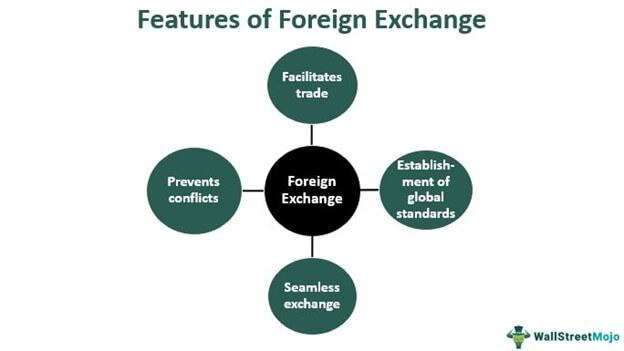

## Table of Contents

## What is the foreign exchange market?

The foreign exchange market, often called the forex market, is where people and businesses trade different currencies. It's the biggest financial market in the world, with lots of money changing hands every day. People use this market to buy and sell currencies when they travel, do business in other countries, or invest money.

The forex market works all the time, 24 hours a day, from Monday to Friday. It's not in one place but spread all over the world, with trading happening in major cities like London, New York, and Tokyo. The prices of currencies go up and down based on things like how well a country's economy is doing, what's happening in the news, and what people think will happen in the future.

## What are the main participants in the forex market?

The main participants in the forex market are banks, big companies, governments, and regular people like you and me. Banks are the biggest players because they handle a lot of money moving around the world. They help businesses and people change their money from one currency to another. Big companies also use the forex market a lot, especially if they buy or sell things in different countries. They need to change their money to pay for stuff or to bring their earnings back home.

Governments and central banks are also important in the [forex](/wiki/forex-system) market. They might buy or sell their own currency to help keep their economy stable. For example, if their currency is getting too weak, they might sell other currencies to buy their own and make it stronger. Regular people like us also use the forex market, but usually through banks or online platforms. We might need to change money for a trip abroad or to invest in another country's currency.

Sometimes, there are also speculators and hedge funds in the forex market. These are people or groups who try to make money by guessing how currency prices will change. They don't need the currencies for travel or business; they just want to buy low and sell high to make a profit.

## How does the spot market work in forex trading?

The spot market in forex trading is where people buy and sell currencies right away. It's called "spot" because the trade happens on the spot, or very quickly, usually within two days. When someone wants to trade on the spot market, they agree on a price with another person or a bank. This price is based on what's happening in the market at that moment. For example, if you want to buy euros with dollars, you'll look at the current exchange rate and make the trade at that rate.

Once the trade is agreed upon, the money doesn't move right away. Instead, it takes about two business days for the currencies to actually change hands. This short delay is to make sure everything is in order and to give time for the banks to process the transaction. During these two days, the exchange rate might change, but the trade is locked in at the rate you agreed on when you made the deal. So, the spot market is all about quick trades at the current rate, with a short wait before the money moves.

## What is a forward contract and how is it used in forex?

A forward contract is a special agreement in the forex market where two people or businesses decide to buy or sell a certain amount of currency at a set price, but they agree to do it at a future date, not right away. This is different from the spot market, where the trade happens quickly. With a forward contract, you can lock in today's exchange rate for a trade that will happen later, which can be helpful if you think the rate might change in a way that's bad for you.

People and businesses use forward contracts to protect themselves from changes in currency prices. For example, if a company knows it will need to pay for something in another currency in six months, it can use a forward contract to make sure it pays the current rate, even if the rate goes up later. This way, the company can plan its costs better and avoid surprises. Forward contracts are useful tools for managing risk in the forex market.

## What are the differences between spot and forward markets?

The spot market and the forward market are two ways to trade currencies, but they work differently. In the spot market, you trade currencies right away, or "on the spot." When you make a deal, you agree on a price based on what's happening in the market at that moment. The actual money moves within two business days, but the trade is locked in at the rate you agreed on when you made the deal. This is good if you need to change money quickly, like for a trip or to pay for something right away.

On the other hand, the forward market is about planning for the future. With a forward contract, you and another person or business agree to trade currencies at a set price, but you don't do it right away. Instead, you decide on a future date to make the trade. This is useful if you want to protect yourself from changes in currency prices. For example, if you know you'll need to pay for something in another currency in a few months, you can use a forward contract to lock in today's rate, so you don't have to worry if the rate changes later.

## How do currency swaps function in the forex market?

Currency swaps are a way for people or businesses to exchange one currency for another and then switch back later. It's like borrowing money in one currency and agreeing to pay it back in another currency at a set time. This can be helpful if a company needs money in a different currency for a while but wants to pay it back in their own currency later. For example, a U.S. company might swap dollars for euros now, use the euros for a project in Europe, and then swap back to dollars when the project is done.

The swap happens in two parts. First, the two sides agree to exchange currencies at the current exchange rate. This is called the "spot exchange." Then, they agree on a date in the future when they will swap back, and they also agree on the exchange rate for that future date. This future rate can be based on what they think the exchange rate will be, or they can use a forward contract to lock in today's rate. Currency swaps help businesses manage their money better and protect themselves from changes in currency prices.

## What role do futures and options play in forex trading?

Futures and options are important tools in forex trading that help people manage the risks of changing currency prices. A futures contract is like a promise to buy or sell a specific amount of currency at a set price on a future date. It's a bit like a forward contract, but futures are traded on special markets and are more standardized. People use futures to lock in today's exchange rate for a trade that will happen later. This can be helpful if you think the rate might go up or down in a way that's bad for you. For example, if you know you'll need to pay for something in another currency in six months, you can use a futures contract to make sure you pay today's rate, even if the rate changes later.

Options in forex trading give you the right, but not the obligation, to buy or sell a currency at a set price before a certain date. This is different from futures, where you have to make the trade. With options, you can choose to make the trade if it's good for you, or just let the option expire if it's not. There are two types of options: calls and puts. A call option lets you buy a currency at a set price, while a put option lets you sell it. People use options to protect themselves from bad changes in currency prices or to try to make money if they think the prices will move in a certain way. For example, if you think the value of a currency might go down, you can buy a put option to sell it at today's price and make a profit if the price does drop.

## How does leverage affect forex trading?

Leverage in forex trading lets you control a big amount of money with just a little bit of your own. It's like borrowing money from your broker to make bigger trades. For example, with a leverage of 100:1, you can control $100,000 with just $1,000 of your own money. This can make your profits bigger if the trade goes well, but it can also make your losses bigger if the trade goes badly. So, leverage is a powerful tool that can help you make more money, but it also makes trading riskier.

Because of leverage, small changes in currency prices can have a big effect on your money. If the price moves in your favor, you can make a lot more money than if you were trading without leverage. But if the price moves against you, you can lose a lot more too. That's why it's important to use leverage carefully and understand the risks. Many traders set limits on their trades to stop big losses, which can help manage the extra risk that comes with using leverage.

## What are the major trading strategies used in the forex market?

In the forex market, people use different strategies to try to make money. One common strategy is called "[trend following](/wiki/trend-following)." This means watching the market to see if a currency is going up or down over time. If a currency is going up, trend followers will buy it, hoping it will keep going up so they can sell it later for a profit. If it's going down, they might sell it or wait for a better time to buy. Another strategy is "range trading," where people look for times when a currency's price stays between two levels. They buy when the price is low and sell when it's high, trying to make money from the ups and downs within that range.

Another popular strategy is "[carry](/wiki/carry-trading) trading." This involves borrowing money in a currency with a low [interest rate](/wiki/interest-rate-trading-strategies) and using it to buy a currency with a higher interest rate. The idea is to make money from the difference in interest rates, but it can be risky if the exchange rate changes a lot. "Scalping" is a fast-paced strategy where traders make lots of small trades to take advantage of tiny price changes. They might only hold a trade for a few seconds or minutes, trying to make a little bit of money each time. Each of these strategies has its own risks and rewards, and traders choose the one that fits their goals and how much risk they're willing to take.

## How do electronic trading platforms impact forex trading?

Electronic trading platforms have changed the way people trade in the forex market. Before, trading was mostly done over the phone or through special computer systems that only big banks and institutions could use. Now, with electronic platforms, anyone with an internet connection can trade currencies easily. These platforms let you see real-time prices, make trades quickly, and manage your account all in one place. They also have tools like charts and indicators that help you understand the market better and make smarter trading decisions.

These platforms have made the forex market more open to everyone, not just big banks and professional traders. They've also made trading faster and more efficient. Because you can trade anytime and anywhere, it's easier to take advantage of opportunities in the market. But with more people trading, the market can be more competitive and sometimes more risky. Still, electronic trading platforms have made it simpler for people to get into forex trading and manage their trades on their own.

## What are the regulatory considerations for forex trading?

Forex trading is watched over by different rules and groups to make sure it's fair and safe. In the United States, the main group that looks after forex trading is the Commodity Futures Trading Commission (CFTC). They make sure that brokers and traders follow the rules. Another group, the National Futures Association (NFA), also helps by setting standards and checking that brokers are doing things right. These groups help protect people from fraud and make sure that the market works well.

In other countries, there are different groups that do similar things. For example, in the United Kingdom, the Financial Conduct Authority (FCA) keeps an eye on forex trading. They make sure that brokers are honest and that traders are treated fairly. It's important for anyone who wants to trade forex to know the rules in their country and to use brokers that are approved by these groups. This helps keep trading safe and fair for everyone.

## How do macroeconomic factors influence forex market mechanisms?

Macroeconomic factors, like how well a country's economy is doing, play a big role in the forex market. Things like interest rates, inflation, and how much a country is growing can make its currency stronger or weaker. For example, if a country raises its interest rates, it might attract more investors because they can earn more money from that country's currency. This can make the currency stronger. On the other hand, if a country has high inflation, its currency might get weaker because people will want to spend their money before prices go up even more.

Another important [factor](/wiki/factor-investing) is the overall health of the economy. If a country's economy is growing fast and creating lots of jobs, its currency might get stronger because people will feel good about investing there. But if the economy is doing badly, with lots of people out of work and businesses struggling, the currency might get weaker. News and events, like elections or big policy changes, can also shake up the forex market quickly because they can change what people think about a country's future.

## References & Further Reading

[1]: ["Triennial Central Bank Survey of Foreign Exchange and Over-the-counter (OTC) Derivatives Markets in 2019"](https://www.bis.org/statistics/rpfx22.htm) by Bank for International Settlements

[2]: Park, C. H., & Irwin, S. H. (2007). ["What Do We Know About the Profitability of Technical Analysis?"](https://onlinelibrary.wiley.com/doi/abs/10.1111/j.1467-6419.2007.00519.x) Review of Financial Studies

[3]: ["Forex Trading: The Basics of Forex Trading"](https://www.investopedia.com/articles/forex/11/why-trade-forex.asp) by BabyPips.com

[4]: Aldridge, I. (2009). ["High-Frequency Trading: A Practical Guide to Algorithmic Strategies and Trading Systems"](https://books.google.com/books/about/High_Frequency_Trading.html?id=8QpIsVUMhmEC) by Irene Aldridge

[5]: Chan, E. (2009). ["Quantitative Trading: How to Build Your Own Algorithmic Trading Business"](https://github.com/ftvision/quant_trading_echan_book)

[6]: Lopez de Prado, M. (2018). ["Advances in Financial Machine Learning"](https://www.amazon.com/Advances-Financial-Machine-Learning-Marcos/dp/1119482089) by Marcos Lopez de Prado