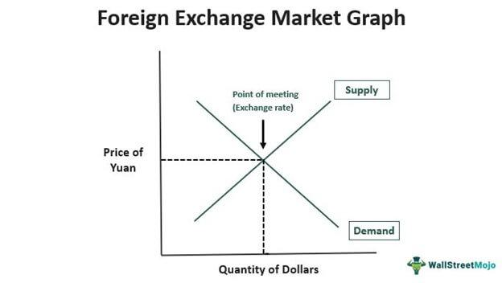

Forex trading, commonly referred to as foreign exchange, is a cornerstone of the global financial system. As the largest financial market worldwide, it facilitates the exchange of different currencies, allowing market participants to engage in the buying and selling of currency pairs. With a staggering daily trading volume exceeding $6.6 trillion, the forex market offers a vast array of opportunities for investors seeking to capitalize on currency fluctuations.

The modern forex arena has undergone significant transformations, driven largely by technological advancements. Historically reliant on human traders making decisions based on market analysis and speculation, the market has seen an influx of automated and algorithmic trading systems. These sophisticated technologies execute trades based on predefined parameters, minimizing the need for human intervention. This shift has enabled trades to occur at speeds and efficiencies previously unattainable by manual trading methods.



Algorithmic trading represents one of the most profound changes in forex trading, offering benefits such as enhanced trade accuracy and reduced execution times. By employing complex algorithms, traders can execute a multitude of transactions within fractions of a second, a feat impossible for human traders to achieve. This capability is crucial in a market characterized by its continuous operation across multiple time zones, making it accessible 24 hours a day.

The integration of these advanced trading systems has not only democratized access to the forex market but has also created a dynamic environment where both institutional and individual traders can compete on a more level playing field. As technology continues to evolve, the forex market is poised to become even more sophisticated, prompting traders to continually adapt and innovate their strategies to remain competitive.

## Table of Contents

## Understanding Forex Trading and Exchange Rates

Forex trading involves the simultaneous buying of one currency and selling of another, with the primary focus on profiting from fluctuations in exchange rates. These rates are driven by a myriad of factors, such as economic indicators, geopolitical developments, and market speculation. Economic indicators like Gross Domestic Product (GDP), unemployment rates, and inflation can directly influence national currencies. For example, a stronger-than-expected GDP growth rate can lead to an appreciation of that country's currency as it suggests economic strength. Geopolitical events, including elections, conflicts, and international agreements, can also cause volatility in the forex markets, affecting exchange rates significantly. Market speculation, driven by trader sentiment and expectations about future market movements, adds another layer of complexity to currency price dynamics.

Currencies in the forex market are traded in pairs, such as the Euro/US Dollar (EUR/USD). This pairing indicates the value of one euro in terms of US dollars, effectively expressing one currency's value against another. The quoted exchange rate reveals how much of the quote currency (in this case, USD) is needed to purchase one unit of the base currency (EUR).

The [forex](/wiki/forex-system) market operates continuously, 24 hours a day, five days a week. This is enabled by a decentralised structure comprising three major trading sessions—Asian, European, and North American. As a result, traders benefit from the flexibility to participate at any time, allowing them to capitalize on opportunities presented during volatile periods. Unlike stock markets, which have specific opening and closing times, the forex market's round-the-clock nature ensures high [liquidity](/wiki/liquidity-risk-premium) and the potential to take advantage of rapid price movements. This continuous operation enables the seamless transfer of currency flows and service of global trade and investment.

Fundamentally, forex trading involves analyzing both fundamental and technical factors to predict future movements in exchange rates. Fundamental analysis focuses on the macroeconomic indicators and geopolitical events mentioned above, while technical analysis involves studying charts and historical price patterns to forecast market trends. The interplay between these analyses and the fluctuating nature of exchange rates is what drives the forex market, offering myriad opportunities for traders to seek profits.

## The Rise of Algorithmic Trading in Forex

Algorithmic trading, or algo trading, utilizes sophisticated computer programs to conduct trading operations based on predefined criteria without human intervention. This innovation has significantly transformed forex trading by enhancing both the speed and precision of trade executions. The automation inherent in [algorithmic trading](/wiki/algorithmic-trading) minimizes human error, reduces transaction costs, and streamlines the trading process.

Algorithmic trading models vary widely in terms of complexity and underlying strategies. Simple strategies may deploy basic technical indicators like moving averages, which help in identifying trends and triggering buy or sell orders when certain conditions are met. For example, a moving average crossover strategy generates trading signals when a shorter-period moving average crosses a longer-period moving average. More advanced models integrate [machine learning](/wiki/machine-learning) and [artificial intelligence](/wiki/ai-artificial-intelligence) to adapt to market changes in real-time, improving predictive accuracy and decision-making.

High-frequency trading ([HFT](/wiki/high-frequency-trading-strategies)) is a specialized form of algorithmic trading characterized by the rapid execution of a large number of trades to exploit small market inefficiencies. HFT systems function at microsecond intervals and focus on capturing tiny price movements that are imperceptible over longer periods. This type of trading requires robust infrastructure, including low-latency networks and high-speed computers, to execute trades before market conditions change.

The impact of HFT within the forex market is profound, as it improves liquidity and tightens bid-ask spreads, benefiting both retail and institutional investors. By providing continuous [arbitrage](/wiki/arbitrage) opportunities, HFT algorithms help maintain efficient market pricing. However, the presence of HFT also necessitates advanced risk management strategies among market participants to navigate the rapid pace of trading and prevent systemic disruptions.

Advancements in computational power and big data analytics further enhance the capabilities of algorithmic trading systems, allowing them to process vast amounts of market data and execute trades with remarkable precision. As these technologies continue to evolve, the potential for improved trading outcomes in the forex market also increases, legitimizing algorithmic trading as a staple strategy among traders seeking to capitalize on the advantages it offers.

## Benefits of Algorithmic Trading

Algorithmic trading offers several clear advantages over traditional manual trading, particularly in terms of efficiency and objectivity. One of the most significant benefits is the elimination of psychological biases that often affect human traders. Emotions such as fear and greed can lead to irrational decision-making; however, algorithmic trading relies on pre-established criteria, ensuring decisions are made based on data-driven insights rather than emotional responses.

The speed and precision of algorithmic trading systems are unmatched by manual trading. Algorithms can execute trades in milliseconds, a crucial advantage in volatile markets where prices can change rapidly. This capability is especially beneficial for strategies involving arbitrage or for capturing fleeting market opportunities that human traders might miss due to slower reaction times.

Additionally, algorithmic trading provides the ability to backtest trading strategies on historical data. Backtesting involves running a trading strategy against past market data to assess its potential effectiveness without risking actual capital. This process helps traders refine their strategies, identify potential pitfalls, and optimize performance before deploying them in live market conditions. For instance, a simple moving average crossover strategy could be backtested using Python as follows:

```python
import pandas as pd

# Load historical data
data = pd.read_csv('historical_data.csv')

# Calculate moving averages
data['MA_short'] = data['Close'].rolling(window=50).mean()
data['MA_long'] = data['Close'].rolling(window=200).mean()

# Generate signals
data['Signal'] = 0
data['Signal'][50:] = np.where(data['MA_short'][50:] > data['MA_long'][50:], 1, 0)

# Calculate returns
data['Returns'] = data['Close'].pct_change()
data['Strategy_Returns'] = data['Signal'].shift(1) * data['Returns']

# Evaluate performance
performance = data['Strategy_Returns'].cumprod().iloc[-1]
print(f"Strategy Performance: {performance}")
```

This example showcases how traders can test the viability of a strategy, making adjustments as necessary to improve potential returns without incurring initial financial risks. Through such technological advancements, algorithmic trading contributes to a more systematic and analytical approach, offering traders tools to potentially enhance their success in the forex market.

## Risks and Challenges of Algorithmic Trading

Algorithmic trading, while offering numerous advantages, also comes with its share of risks and challenges that traders and institutions must carefully consider. One of the primary risks inherent in algorithmic trading is the potential for substantial financial losses due to programming errors or unforeseen market conditions. Algorithms are designed to follow specific rules and criteria, and any mistake in coding can lead to significant discrepancies in trade execution. For instance, erroneous algorithms might initiate incorrect trades, resulting in financial losses that could have been avoided with manual oversight.

Technical failures pose another significant risk in algorithmic trading. As trading systems increasingly depend on sophisticated technology, they become susceptible to software bugs, hardware malfunctions, network outages, and cyberattacks. These technological disruptions can prevent the execution of critical trades or cause unintended trading activities, subsequently impacting market stability and individual financial outcomes.

Regulatory concerns are also a critical consideration in algorithmic trading. The rapid and high-[volume](/wiki/volume-trading-strategy) nature of algorithmic trades can exacerbate market [volatility](/wiki/volatility-trading-strategies), leading to sharp fluctuations in asset prices. This was evident in events like the 2010 Flash Crash, where algorithmic trading was partially blamed for the abrupt and severe market drop [1]. In response, regulatory bodies have implemented measures such as circuit breakers and mandatory algorithm testing to mitigate such risks. However, the evolving nature of algorithms and financial markets means ongoing vigilance and adaptation are necessary to address potential regulatory challenges effectively.

Overall, while algorithmic trading enhances market efficiency, it requires robust risk management strategies and technological infrastructures to mitigate its associated risks. Traders and firms must be proactive in monitoring and adapting to technological developments and market conditions to ensure they can navigate these challenges effectively.

References:

[1] Kirilenko, A. A., Kyle, A. S., Samadi, M., & Tuzun, T. (2017). The Flash Crash: The Impact of High Frequency Trading on an Electronic Market. *The Journal of Finance*, 72(3), 967-998.

## Conclusion

The integration of algorithmic trading in the forex market is significantly altering the execution landscape, contributing to enhanced efficiency and promoting a more balanced competitive environment between retail and institutional investors. The ability of algorithms to process large volumes of data quickly and execute trades based on precise, predefined criteria enables all market participants to access similar opportunities. This democratization of trading approaches levels the playing field, as sophisticated strategies become more accessible beyond the confines of traditional financial powerhouses.

Nevertheless, while algorithmic trading presents distinct advantages, both traders and institutions must recognize and mitigate its associated risks. The complexities of developing and maintaining robust algorithms cannot be understated; programming errors or unforeseen market conditions can lead to considerable losses. Therefore, the implementation of comprehensive risk management strategies and rigorous testing procedures are crucial to safeguard against potential pitfalls. Ensuring systems are resilient and adaptable to volatility will enhance reliability and confidence in algorithmic solutions.

As technology continues to advance, it will be essential for market players to remain agile, incorporating emerging tools and innovative strategies to fully leverage the potential of forex trading. Continuous learning and adaptation will drive success in this evolving arena, allowing traders and institutions to capitalize on the efficiencies that algorithmic trading brings to the forex market. Embracing technological progression with a proactive approach will be key in navigating the future of forex trading.

## References & Further Reading

[1]: Kirilenko, A. A., Kyle, A. S., Samadi, M., & Tuzun, T. (2017). ["The Flash Crash: The Impact of High Frequency Trading on an Electronic Market."](https://www.jstor.org/stable/26652722) The Journal of Finance, 72(3), 967-998.

[2]: Bergstra, J., Bardenet, R., Bengio, Y., & Kégl, B. (2011). ["Algorithms for Hyper-Parameter Optimization."](https://dl.acm.org/doi/10.5555/2986459.2986743) Advances in Neural Information Processing Systems 24.

[3]: ["Advances in Financial Machine Learning"](https://www.amazon.com/Advances-Financial-Machine-Learning-Marcos/dp/1119482089) by Marcos Lopez de Prado.

[4]: ["Evidence-Based Technical Analysis: Applying the Scientific Method and Statistical Inference to Trading Signals"](https://www.amazon.com/Evidence-Based-Technical-Analysis-Scientific-Statistical/dp/0470008741) by David Aronson.

[5]: ["Machine Learning for Algorithmic Trading"](https://github.com/stefan-jansen/machine-learning-for-trading) by Stefan Jansen.

[6]: ["Quantitative Trading: How to Build Your Own Algorithmic Trading Business"](https://www.amazon.com/Quantitative-Trading-Build-Algorithmic-Business/dp/1119800064) by Ernest P. Chan.