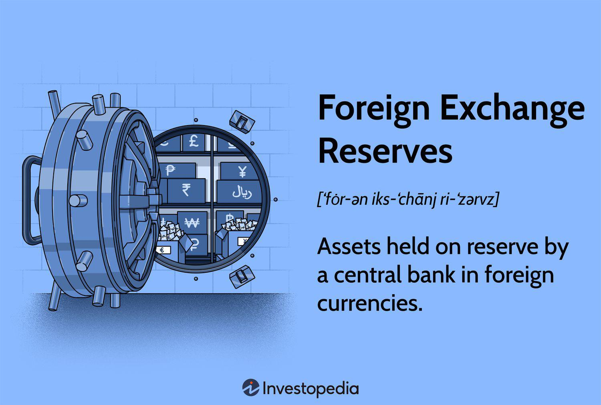

## Table of Contents

## What are foreign exchange reserves?

Foreign exchange reserves are assets held by a country's central bank or monetary authority in different currencies, mainly to support and stabilize the value of their own currency. These reserves can include foreign currencies, gold, and other assets like Special Drawing Rights (SDRs) from the International Monetary Fund (IMF). Countries build up these reserves to have enough foreign currency to pay for imports, manage their currency's value, and handle international financial obligations.

Having enough foreign exchange reserves is important for a country's economy. It helps the country deal with economic problems, like sudden drops in currency value or financial crises. For example, if a country's currency is losing value quickly, the central bank can use its reserves to buy its own currency and try to stop the fall. This can help keep the economy stable and maintain trust in the country's financial system.

## Why do countries hold foreign exchange reserves?

Countries hold foreign exchange reserves to keep their economies stable. These reserves are like a savings account in different currencies that a country can use when it needs to. For example, if a country needs to buy things from other countries, it can use its reserves to pay for those imports. This is important because it helps make sure the country can keep trading even if its own currency is weak.

Another reason countries hold foreign exchange reserves is to control the value of their own currency. If a country's currency starts to lose value quickly, the central bank can use its reserves to buy its own currency. This can help stop the currency from falling too much. By doing this, the country can keep its economy stable and make sure people trust its money.

In addition, foreign exchange reserves help countries handle financial emergencies. If there is a sudden crisis, like a big drop in the value of the country's currency or a problem with paying back loans, the reserves can be used to help fix these issues. This makes the country's financial system stronger and more able to deal with unexpected problems.

## What are the main components of foreign exchange reserves?

Foreign exchange reserves are made up of different things that a country keeps to help its economy. The main part of these reserves is foreign currencies. These are usually strong currencies like the US dollar, the euro, and the Japanese yen. Countries keep these currencies so they can use them to buy things from other countries or to help their own currency if it starts to lose value.

Another important part of foreign exchange reserves is gold. Countries keep gold because it is seen as a safe and valuable asset. Gold can be sold or used to get foreign currencies when needed. Besides foreign currencies and gold, countries also keep Special Drawing Rights (SDRs). These are like special money from the International Monetary Fund (IMF) that countries can use in emergencies.

In addition to these, foreign exchange reserves can include other assets like government bonds from other countries. These bonds are like loans that countries give to each other, and they can be sold to get foreign currency. All these parts together help countries keep their economies stable and ready for any financial problems that might come up.

## How are foreign exchange reserves managed?

Foreign exchange reserves are managed by a country's central bank or monetary authority. They keep an eye on the reserves to make sure there is enough money in different currencies to help the country's economy. The central bank decides when to buy or sell these currencies, gold, and other assets like Special Drawing Rights (SDRs) from the International Monetary Fund (IMF). They do this to keep the country's own currency stable and to be ready for any financial problems.

The central bank also uses the reserves to help with trade. If the country needs to buy things from other countries, it can use the reserves to pay for those imports. This is important because it helps keep trade going smoothly, even if the country's own currency is weak. The central bank might also use the reserves to help the country's currency if it starts to lose value quickly. By selling some of the reserves and buying their own currency, they can try to stop the fall and keep the economy stable.

## What is the role of central banks in managing foreign exchange reserves?

Central banks are in charge of managing a country's foreign exchange reserves. They keep track of how much money the country has in different currencies, like the US dollar or the euro, and make sure there is enough to help the country's economy. The central bank decides when to buy or sell these currencies, gold, and other assets like Special Drawing Rights (SDRs) from the International Monetary Fund (IMF). They do this to keep the country's own currency stable and to be ready for any financial problems that might come up.

The central bank also uses the reserves to help with trade. If the country needs to buy things from other countries, it can use the reserves to pay for those imports. This is important because it helps keep trade going smoothly, even if the country's own currency is weak. The central bank might also use the reserves to help the country's currency if it starts to lose value quickly. By selling some of the reserves and buying their own currency, they can try to stop the fall and keep the economy stable.

## How do foreign exchange reserves affect a country's economy?

Foreign exchange reserves can have a big impact on a country's economy. They help keep the country's currency stable. If the currency starts to lose value quickly, the central bank can use the reserves to buy the country's currency and stop it from falling too much. This makes people trust the country's money more, which helps keep the economy strong. Also, having enough reserves means the country can keep trading with other countries, even if its own currency is weak. This is important because it helps the country buy things it needs from other places.

Reserves also help the country handle financial emergencies. If there is a sudden problem, like a big drop in the value of the currency or trouble paying back loans, the country can use its reserves to fix these issues. This makes the country's financial system stronger and more able to deal with unexpected problems. By managing the reserves well, the central bank can keep the economy stable and help it grow over time.

## What are the risks associated with holding foreign exchange reserves?

Holding foreign exchange reserves can be risky for a country. One big risk is that the value of the currencies in the reserves can change. If the value of a currency like the US dollar goes down, the reserves lose value too. This means the country might not have as much money as it thought to help its economy. Also, keeping a lot of money in foreign currencies means the country is not using that money to grow its own economy. It's like saving money instead of spending it on things that could help the country get better.

Another risk is that holding too many reserves can make the country's economy less flexible. If the country is always trying to keep its currency stable by using its reserves, it might not be able to react quickly to new problems. This can make it harder for the country to deal with changes in the world economy. Plus, managing a lot of reserves costs money. The central bank has to pay people to watch the reserves and make sure they are safe. All these costs can add up and take away from other important things the country could be spending money on.

## How do countries determine the optimal level of foreign exchange reserves?

Countries figure out how much foreign exchange reserves they need by looking at a few important things. They think about how much they trade with other countries and how much money they need to buy things from abroad. They also look at how stable their own currency is and how likely it is to face big changes in value. If a country trades a lot and its currency can change a lot, it might need more reserves to be safe. They also think about any debts they have to pay back in foreign currencies. All these things help the country decide how much money to keep in reserves.

Another thing countries consider is how much risk they are willing to take. Some countries want to be very safe and keep a lot of reserves, even if it means not using that money to grow their economy. Other countries might be okay with having less reserves if it means they can spend more money on things like schools and roads. They also look at what other countries are doing and what experts suggest. By thinking about all these things, countries can find a good balance between having enough reserves to stay safe and using their money to help their economy grow.

## What is the impact of foreign exchange reserves on currency valuation?

Foreign exchange reserves can help keep a country's currency stable. If the currency starts to lose value quickly, the central bank can use the reserves to buy the country's currency. This can help stop the currency from falling too much. When people see that the central bank is using reserves to support the currency, they might trust it more. This can make the currency stronger and help the economy stay stable.

But, having too many reserves can also affect the currency's value. If a country keeps a lot of money in foreign currencies, it might not be using that money to grow its own economy. This can make the country's currency less flexible. Also, if the value of the currencies in the reserves goes down, the country's reserves lose value too. This can make it harder for the country to help its currency if it needs to. So, having the right amount of reserves is important for keeping the currency's value stable.

## How do international events influence foreign exchange reserve policies?

International events can change how countries manage their foreign exchange reserves. When there are big changes in the world, like a financial crisis or a war, countries might decide to keep more reserves to be safe. For example, if there is a big drop in the value of a major currency like the US dollar, countries might want to have more reserves in other currencies to protect themselves. Also, if there are problems with trade, like new rules or tariffs, countries might need more reserves to keep buying things from other places.

These events can also make countries change how they use their reserves. If there is a lot of uncertainty in the world, countries might use their reserves more often to keep their own currency stable. This can help stop the currency from losing value too quickly. But, if the world is calm and stable, countries might not need to use their reserves as much. They might even decide to keep less reserves and use that money to help their economy grow in other ways.

## What are the differences in foreign exchange reserve strategies between developed and developing countries?

Developed countries and developing countries often have different ways of managing their foreign exchange reserves. Developed countries usually have strong economies and stable currencies. They might not need to keep as many reserves because their currency is trusted around the world. Instead, they might focus on using their money to help their economy grow in other ways, like investing in new businesses or improving their infrastructure. They can also use their reserves to help other countries in need, showing their strength and stability on the global stage.

On the other hand, developing countries often face more risks and need more reserves to protect their economies. Their currencies can change a lot in value, so they need to keep more money in foreign currencies to help keep their own currency stable. This can be important for them to keep trading with other countries and to handle any sudden financial problems. Developing countries might also use their reserves to pay back loans in foreign currencies, which can be a big part of their strategy to stay financially stable.

In summary, while developed countries might have the luxury to keep fewer reserves and focus on growth, developing countries often need to keep more reserves to manage the risks they face. Both types of countries need to find the right balance between having enough reserves to be safe and using their money to help their economies grow.

## How have historical economic crises influenced the management of foreign exchange reserves?

Historical economic crises have shown countries why it's important to have enough foreign exchange reserves. For example, during the Asian Financial Crisis in the late 1990s, many countries in Asia saw their currencies lose value very quickly. This made it hard for them to pay for imports and handle their debts. After this crisis, these countries decided to keep more reserves to be safe. They learned that having a lot of reserves can help stop a currency from falling too much and can help a country deal with financial problems better.

The Global Financial Crisis of 2008 also changed how countries manage their reserves. Many countries saw that even big economies can face big problems. After this crisis, countries around the world started to keep more reserves to be ready for any new problems. They also started to keep their reserves in different currencies, not just the US dollar, to spread the risk. These crises taught countries that having enough reserves is like having a safety net for their economies, helping them stay strong even when the world faces big financial troubles.

## References & Further Reading

[1]: Chaboud, A. P., Chiquoine, B., Hjalmarsson, E., & Vega, C. (2014). ["Rise of the Machines: Algorithmic Trading in the Foreign Exchange Market."](https://www.jstor.org/stable/pdf/43612951.pdf) The Journal of Finance.

[2]: Dominguez, K. M. E. (1998). ["Central Bank Intervention and Exchange Rate Volatility."](https://www.sciencedirect.com/science/article/pii/S0261560697980554) Journal of International Money and Finance.

[3]: Ito, T., & McCauley, R. N. (Eds.). (2001). ["Exchange Rate Regimes in East Asia."](https://papers.ssrn.com/sol3/papers.cfm?abstract_id=3505368) National Bureau of Economic Research.

[4]: Lopez de Prado, M. (2018). ["Advances in Financial Machine Learning."](https://www.amazon.com/Advances-Financial-Machine-Learning-Marcos/dp/1119482089) Wiley.

[5]: Lyons, R. K. (2001). ["The Microstructure Approach to Exchange Rates."](https://direct.mit.edu/books/monograph/2004/The-Microstructure-Approach-to-Exchange-Rates) The MIT Press. 

[6]: Tang, H., & Garcia-Herrero, A. (2020). ["The Role of Foreign Exchange Reserves as a Shock Absorber."](https://iems.ust.hk/publications/thought-leadership-briefs/garcia-herrero-tan-deglobalisation-united-states-china-decoupling-tlb48) Journal of International Economics.