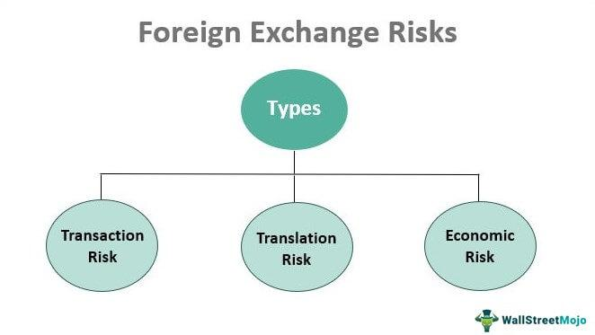

In the globalized business landscape, managing foreign exchange risk has become a critical task for companies engaged in international trade. Currency fluctuations can influence profitability, pricing strategies, and overall financial stability. Foreign exchange risk, or currency risk, emerges from the unpredictable fluctuations in exchange rates that can affect companies’ international financial transactions. It is a significant concern for multinational corporations, importers, exporters, and investors dealing with multi-currency portfolios.

This article explores strategies for hedging currency risk, with particular attention given to algorithmic trading solutions. Algorithmic trading, or algo trading, involves using automated, pre-programmed trading instructions to execute trades at optimal speeds and frequencies in response to market triggers. These solutions offer a powerful toolset for businesses seeking to navigate currency volatility. By utilizing sophisticated algorithms, companies can gain precision and efficiency in executing their forex hedging strategies, thereby mitigating the risks associated with exchange rate fluctuations.



Understanding how businesses can mitigate currency risk effectively involves analyzing the nature and types of this risk, observing the available hedging strategies, and recognizing the role of technology in enhancing these strategies. With advancements in trading technology, businesses can leverage algorithmic trading systems to maintain competitive operational efficiencies, ensuring they are not adversely affected by currency market movements. This combination of strategic hedging methods and algorithmic trading tools provides businesses with a robust framework for managing currency risk in today’s interconnected economy.

## Table of Contents

## Understanding Foreign Exchange Risk

Foreign exchange risk, often referred to as currency risk, arises from the variability in currency exchange rates that can impact the value of financial transactions conducted in international markets. This risk is a crucial consideration for businesses and investors engaged in cross-border activities, as fluctuations in exchange rates can lead to unpredictable gains or losses.

For importers, exchange rate volatility can affect the cost of purchasing goods and services from foreign suppliers. Similarly, exporters may encounter variations in revenue when their products or services are sold in foreign markets. Investors participating in international markets also face foreign exchange risk, as changes in exchange rates can impact the value of their foreign investments.

There are three primary types of foreign exchange risk: transaction risk, translation risk, and economic risk. 

1. **Transaction Risk**: This type of risk occurs when there is a delay between entering a contract and settling it. For example, assume a company agrees to buy goods priced in a foreign currency, and the payment is due three months later. Any unfavorable movement in the exchange rate during this period can increase the cost of the goods in terms of the company's domestic currency.

2. **Translation Risk**: Also known as accounting exposure, translation risk affects multinational companies that have subsidiaries operating in different countries. When these companies consolidate their financial statements, the financial results of foreign subsidiaries must be translated into the parent company's reporting currency. Exchange rate fluctuations can lead to changes in reported earnings and affect the balance sheet.

3. **Economic Risk**: This broader concept, sometimes referred to as operating exposure, relates to the impact of currency fluctuations on a company's market value and long-term cash flows. Economic risk affects a company's competitiveness, as changes in exchange rates can alter operating costs and sales prices, influencing market share and profitability.

Understanding these risks is essential for developing effective strategies to mitigate currency exposure and ensure the financial stability of entities operating in international markets.

## Types of Foreign Exchange Risk

Foreign exchange risk represents the potential financial loss due to fluctuations in currency exchange rates. It is vital for businesses involved in international transactions to understand the different types of foreign exchange risk, as these can directly impact financial outcomes. The principal forms of foreign exchange risk are transaction risk, translation risk, and economic risk.

Transaction risk arises when the value of a currency changes between the initiation of a contract and its settlement period. Companies involved in exports and imports frequently encounter transaction risk. For example, if a U.S. company agrees to purchase goods from a European supplier and intends to pay in euros in three months, any depreciation of the U.S. dollar (relative to the euro) during this period will increase the cost of the transaction. This risk can be expressed mathematically as:

$$
\text{Transaction Risk} = \left(\frac{\text{Amount in foreign currency}}{\text{Initial exchange rate}} - \frac{\text{Amount in foreign currency}}{\text{New exchange rate}}\right)
$$

Translation risk affects multinational companies that need to convert the financial statements of foreign subsidiaries into the parent company’s reporting currency. Currency exchange rate fluctuations can lead to discrepancies in the value of assets, liabilities, revenue, and expenses when consolidated into the main financial statements. This can sometimes result in an inaccurate reflection of a company's financial position and performance. While translation risk does not impact cash flow directly, it does affect the reported earnings and can influence investor perception.

Economic risk involves the broader impact of currency fluctuations on a company's market value and cash flows. Economic risk considers the long-term effect of exchange rate changes on the competitive position of a company. If a domestic currency strengthens considerably, it may render a company's products more expensive internationally, potentially reducing its market share. Conversely, a weakening domestic currency could make exports cheaper and more competitive, but increase the cost of imported materials. Economic risk is particularly challenging to manage due to its indirect and pervasive nature, influencing everything from pricing strategy to cost structure.

## Hedging Strategies for Currency Risk Management

Forward contracts are a fundamental tool in managing currency risk, offering companies the ability to establish an exchange rate for a specified future date. This is achieved through a private agreement between two parties. By locking in a predetermined rate, businesses can protect themselves against potential unfavorable movements in currency values, thus ensuring certainty in their international dealings. For example, if a U.S. company expects to receive payment in euros in six months, it can enter into a forward contract to convert that amount into dollars at today’s rate, regardless of future market fluctuations. 

Currency options enhance this protective measure by granting companies the right, but not the obligation, to execute a currency exchange at a specified rate before the option’s expiration. This flexibility allows businesses to benefit from favorable rate changes while providing a safety net against adverse shifts. There are two main types of options: call options (the right to buy) and put options (the right to sell). Options are particularly advantageous in volatile markets, offering strategic leverage without binding commitments.

Currency swaps serve a more complex role in foreign exchange risk management, facilitating the exchange of interest and principal payments in different currencies. Typically involving a series of cash flow exchanges, currency swaps are employed to manage both currency and [interest rate](/wiki/interest-rate-trading-strategies) risk over a prolonged period. For instance, a U.S.-based company with a euro-denominated loan might utilize a currency swap to opt for the stability of USD obligations. This involves agreeing to exchange fixed or floating interest payments in euros for those in USD with another party, effectively transforming the currency exposure of the initial loan.

In conclusion, each of these hedging strategies—forward contracts, currency options, and currency swaps—offers distinct advantages and applications, allowing companies to tailor their approach to specific risk profiles and market conditions. These financial instruments are invaluable in strategizing robust protection against the inherent uncertainties in foreign exchange markets.

## Role of Algorithmic Trading in Managing Currency Risk

Algorithmic trading leverages computer programs to automatically execute trades, enhancing the efficiency and precision of currency risk management. This technology facilitates the swift processing of large volumes of data and simultaneous execution of trades, which is essential for effective currency hedging. By utilizing predefined criteria and algorithms, these systems can rapidly respond to market conditions, thereby minimizing the latency associated with manual trading.

One of the primary advantages of [algorithmic trading](/wiki/algorithmic-trading) in [forex](/wiki/forex-system) hedging is its capability to diminish human biases and errors. Human traders are often influenced by emotional factors and cognitive biases, which can lead to suboptimal trading decisions. Algorithmic systems, on the other hand, adhere strictly to their programming, executing trades based on logical, pre-set rules devoid of emotional interference.

Moreover, algorithmic trading systems can implement dynamic hedging strategies that automatically adjust to shifting market conditions. For instance, an algorithm might be designed to hedge exposure only when [volatility](/wiki/volatility-trading-strategies) exceeds a certain threshold or when specific economic indicators are released. This adaptability ensures that hedging strategies remain aligned with current market trends, providing a more robust defense against currency risk.

The use of algorithms also allows for [backtesting](/wiki/backtesting) of trading strategies using historical data. This enables traders to validate and optimize their strategies before deploying them in live markets. Additionally, algorithmic trading can reduce transaction costs by optimizing trade execution, such as by minimizing slippage and exploiting [liquidity](/wiki/liquidity-risk-premium) efficient execution venues.

In Python, for instance, traders can utilize libraries such as NumPy for numerical computations, pandas for data manipulation, and trading-specific libraries like Zipline for backtesting their strategies. Below is a simple illustration of how Python might be used to execute a basic hedging strategy based on the moving average cross-over method:

```python
import numpy as np
import pandas as pd

# Sample exchange rate data
data = pd.DataFrame({
    'rate': [1.1, 1.2, 1.15, 1.1, 1.12, 1.18, 1.15]
})

# Calculate moving averages
data['short_mavg'] = data['rate'].rolling(window=3).mean()
data['long_mavg'] = data['rate'].rolling(window=5).mean()

# Generate buy/hedging signals (when short-term average crosses above long-term average)
data['signal'] = 0
data.loc[data['short_mavg'] > data['long_mavg'], 'signal'] = 1

print(data)
```

In this example, the algorithm identifies opportunities to hedge (represented by the signal column) based on the movement of exchange rates relative to their moving averages. This exemplifies how algorithmic systems can automate decision-making processes in currency risk management.

Overall, algorithmic trading represents a significant advancement in forex hedging, offering enhanced speed, accuracy, and adaptability, which are crucial in today’s volatile currency markets.

## Advantages of Using Algo Trading in Forex Hedging

Algorithmic trading offers several advantages in Forex hedging, primarily through enhanced efficiency and the ability to execute trades at unprecedented speeds. By deploying complex algorithms and computer programs, firms can achieve swift and precise execution of hedging strategies, ensuring that trades occur at optimal moments. This speed is crucial in the Forex market, where exchange rates can fluctuate sharply in response to economic news or geopolitical events. 

Moreover, algorithmic trading allows for backtesting and optimization of strategies using historical data. Backtesting involves simulating a trading strategy using past market data to evaluate its effectiveness, helping traders refine their approaches before deploying them in live markets. This process increases the likelihood of successful hedging by allowing companies to understand potential risks and rewards under varying market conditions. The Python library `[backtrader](/wiki/backtrader)` is commonly used for such purposes, enabling the testing and optimization of strategies. A simple backtesting setup might look like this:

```python
import backtrader as bt

class HedgingStrategy(bt.Strategy):
    def next(self):
        # Define trading logic here
        pass

data = bt.feeds.YahooFinanceData(dataname='EURUSD=X', fromdate=datetime(2020, 1, 1), todate=datetime(2021, 1, 1))
cerebro = bt.Cerebro()
cerebro.addstrategy(HedgingStrategy)
cerebro.adddata(data)
cerebro.run()
```

Finally, algorithmic trading significantly reduces transaction costs through optimized trade execution. Algorithms can break down large orders into smaller ones, executing them at the best possible prices across multiple venues. This minimizes the market impact and the potential for slippage, which occurs when the final price of a transaction differs from the expected price. By reducing these costs, companies can improve their overall hedging efficiency and maintain better control over profit margins. 

These advantages collectively make algorithmic trading a powerful tool in Forex hedging, enabling companies to manage currency risks more effectively and efficiently.

## Factors to Consider When Implementing Forex Hedging Strategies

When implementing Forex hedging strategies, several critical factors need careful consideration to ensure effectiveness and mitigate potential losses. These factors include assessing risk tolerance, understanding the regulatory landscape, and continuously monitoring and adjusting strategies in response to market dynamics.

**Assessing Risk Tolerance and Financial Capacity**

Risk tolerance is a fundamental aspect that dictates the extent and nature of hedging activities a company undertakes. Each business has a different risk profile depending on its financial health, market position, and strategic objectives. Companies must determine how much risk they are willing and able to absorb without jeopardizing financial stability. This involves quantifying potential losses from currency fluctuations and evaluating if the firm has adequate financial capacity or reserves to bear these risks. A common measure is the value-at-risk (VaR), which estimates the maximum expected loss over a specified period at a given confidence level. For example, a daily VaR of $100,000 at a 95% confidence level implies that there is a 5% chance of losing more than $100,000 in one day due to currency movements.

**Understanding the Regulatory Environment**

Compliance with regulatory requirements is essential when executing Forex hedging strategies. Foreign exchange markets are subject to regulations that vary by jurisdiction, affecting how companies can trade currencies and use derivatives. Businesses need to ensure their hedging activities comply with laws and regulations, such as those related to derivatives reporting, tax implications, and capital requirements. For instance, the Dodd-Frank Act in the United States imposes specific rules on the trading of over-the-counter derivatives, which can impact how companies manage currency risk.

**Continuous Monitoring and Adjustment**

Forex markets are inherently volatile, necessitating the continuous monitoring of hedging positions. This includes maintaining awareness of economic indicators, geopolitical events, and market trends that could influence currency exchange rates. Businesses should employ strategies that allow for dynamic adjustments to hedges based on real-time data and changing conditions. Algorithmic trading systems can be advantageous as they automate the process of monitoring market changes and recalibrating hedging strategies promptly. These systems utilize algorithms to analyze vast datasets and execute trades automatically, ensuring that the hedging strategy remains aligned with the company’s risk management goals.

In summary, assessing risk tolerance, understanding regulatory requirements, and continuous adaptation to market changes are vital for the successful implementation of Forex hedging strategies. Each element contributes to safeguarding the company against currency risk, enabling more stable financial outcomes in an unpredictable global market.

## Common Mistakes to Avoid in Forex Hedging

In the field of foreign exchange (Forex) hedging, certain common mistakes can undermine the effectiveness of risk management strategies. One such error is over-hedging, which can lead to unnecessary costs. Over-hedging occurs when a company covers more risk than necessary, often due to miscalculating the exposure or failing to update the hedge when circumstances change. This excessive hedging can tie up capital and result in paying excessive premiums or fees, thus eroding the potential savings from mitigating currency risk.

Neglecting transaction costs is another frequent oversight. Transaction costs, including broker fees, spreads, and slippage, can significantly impact the net effectiveness of hedging strategies. While formulating hedging plans, businesses must account for these expenses to ensure that their strategies remain economically viable. Overlooking these costs can result in unexpected financial outlays, reducing the net benefits of the hedging process.

Additionally, failing to adapt hedging strategies in response to changing market conditions can render a strategy ineffective. Financial markets are inherently volatile, and static strategies that do not account for dynamic shifts in currency values can expose companies to residual risks. Successful hedging requires continual monitoring and adjustment of positions to align with market movements. For instance, if a company initially hedges based on projected exchange rates and those projections change due to geopolitical events or economic reports, the company must adjust its position to remain protected.

In summary, avoiding these common mistakes—over-hedging, neglecting transaction costs, and failing to adjust strategies proactively—can enhance the robustness and effectiveness of Forex hedging efforts.

## Conclusion

Effective currency risk management is crucial for companies engaged in international trade. Currency fluctuations can pose significant threats to profitability and financial stability, making it imperative for businesses to adopt robust hedging strategies. One of the most advanced methods for managing currency risk is the use of algorithmic trading, which offers a blend of speed and accuracy that traditional methods might lack.

Algorithmic trading automates the trading process, executing hedging strategies swiftly and effectively. These systems analyze market data in real time, allowing businesses to respond to currency movements with precision. This automation minimizes human errors and biases, ensuring a more consistent application of hedging techniques. Moreover, the implementation of algorithmic trading enables dynamic hedging strategies that continuously adapt to evolving market conditions, thus maintaining the effectiveness of the risk management approach.

In addition to operational speed, algorithmic trading provides the opportunity to backtest and optimize strategies using historical data. This capability helps businesses refine their hedging techniques, identifying the most effective strategies while reducing transaction costs. Optimized trade execution leads to lower costs, enhancing the overall efficiency of the hedging process.

By understanding and implementing appropriate hedging techniques, companies can safeguard against the uncertain nature of currency fluctuations. This proactive approach not only protects financial outcomes but also contributes to the long-term sustainability and growth of businesses operating in international markets. Consequently, incorporating algorithmic trading into currency risk management strategies is a step forward, ensuring businesses remain resilient amid global economic shifts.

## FAQ

### FAQ

**What is foreign exchange risk, and why is it important?**

Foreign exchange risk, or currency risk, is the potential for financial losses due to changes in exchange rates. This kind of risk arises when businesses engage in international operations, such as exporting, importing, or investing across borders. When exchange rates fluctuate, they can affect the value of future cash flows in foreign currencies, impacting a company's profitability and financial health. This risk is important because failing to manage it can lead to increased costs, reduced revenues, and unexpected financial situations that can jeopardize a firm's competitive position in the global market.

**How do different types of foreign exchange risk affect businesses?**

Businesses face several types of foreign exchange risk:

- **Transaction Risk**: This occurs when there is an exchange rate change between the time a deal is made and the time it is settled. For example, if a company agrees to pay a supplier in a foreign currency three months from now, a depreciation of the home currency in that time period increases the cost in home currency terms.

- **Translation Risk**: This affects companies with international subsidiaries. When consolidating financial statements, exchange rate fluctuations can change the reported assets, liabilities, and earnings. For example, if a European subsidiary reports profits in euros, a weaker euro against the home currency reduces those profits when consolidated in the home currency.

- **Economic Risk**: This involves the broader impact of exchange rate changes on a company's market value and cash flows. A sudden change in currency could make local products cheaper for foreign buyers, affecting competitive advantage, or conversely, reduce the local purchasing power for importing raw materials.

**What are the main benefits of using algorithmic trading in Forex hedging?**

Algorithmic trading provides significant advantages for Forex hedging by leveraging advanced computational methods and data analysis. The main benefits include:

- **Efficiency and Speed**: Algorithmic systems can execute trades much faster than human traders, ensuring timely responses to market changes and thereby protecting investments from adverse currency movements.

- **Backtesting and Optimization**: Algorithms can be rigorously tested using historical data, allowing businesses to refine and optimize their hedging strategies before deploying them in live markets, minimizing the risk of ineffective hedging.

- **Reduced Transaction Costs**: By optimizing trade execution, algorithmic trading often improves pricing and reduces the costs associated with currency transactions, contributing to better financial outcomes for hedging strategies.

These benefits make algorithmic trading a powerful tool for managing the inherent uncertainties of the Forex market, allowing companies to focus on their core operations with reduced financial risk exposure.

## References & Further Reading

[1]: ["Advances in Financial Machine Learning"](https://www.amazon.com/Advances-Financial-Machine-Learning-Marcos/dp/1119482089) by Marcos Lopez de Prado

[2]: ["Algorithmic Trading: Winning Strategies and Their Rationale"](https://github.com/prabakar2610/TradingBooks/blob/master/Algorithmic%20Trading%20-%20Winning%20Strategies%20and%20Their%20Rationale%202013.pdf) by Ernie Chan

[3]: ["Quantitative Trading: How to Build Your Own Algorithmic Trading Business"](https://books.google.com/books/about/Quantitative_Trading.html?id=j70yEAAAQBAJ) by Ernest P. Chan

[4]: ["Currency Risk Management: A Handbook for Financial Managers, Brokers, and Consultants"](https://www.amazon.com/Currency-Risk-Management-Financial-Consultants/dp/0814404391) by Gary Shoup

[5]: ["Foreign Exchange Management"](https://www.newyorkfed.org/financial-services-and-infrastructure/financial-market-infrastructure-and-reform/managing-foreign-exchange/) by G. Matthysen