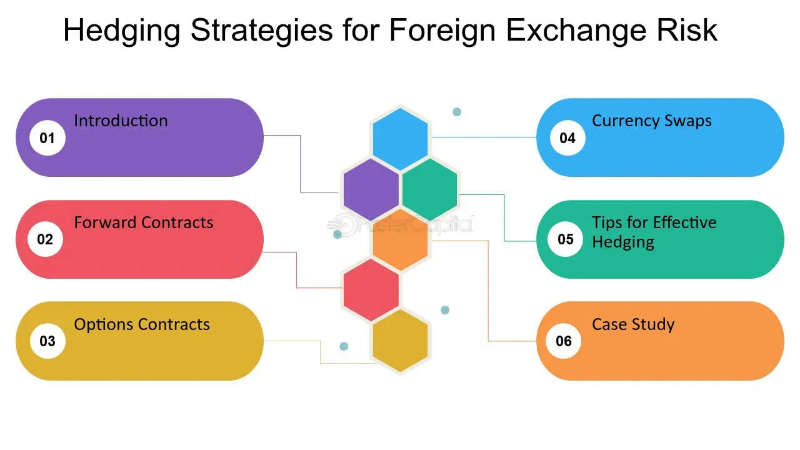

## Table of Contents

## What is foreign exchange risk?

Foreign exchange risk, also known as currency risk, is the possibility that changes in currency exchange rates will affect the value of your investments or business dealings. When you deal with money in different countries, the value of one currency compared to another can change. If you have money in a foreign currency, and that currency becomes worth less compared to your home currency, you could lose money.

For example, if you are a business that buys goods from another country, you might have to pay in that country's currency. If the value of that currency goes up before you pay, it will cost you more in your own currency. This can make your products more expensive or reduce your profits. To manage this risk, businesses and investors often use different strategies, like buying financial products that protect against changes in currency values.

## Why is foreign exchange risk important for businesses and investors?

Foreign exchange risk is important for businesses and investors because it can affect their money and profits. When a business buys things from another country, they often have to pay in that country's money. If the value of that money goes up, the business has to spend more of its own money to buy the same things. This can make their products more expensive or cut into their profits. For investors, if they have money in a different currency and that currency loses value, their investment will be worth less when they change it back to their own currency.

To deal with foreign exchange risk, businesses and investors need to think about it when making plans and decisions. They might use special financial tools, like forward contracts or options, to protect themselves from big changes in currency values. By understanding and managing this risk, they can make better choices about where to invest or how to buy and sell things across borders. This helps them keep their money safe and their businesses running smoothly.

## What are the different types of foreign exchange risk?

There are three main types of foreign exchange risk: transaction risk, translation risk, and economic risk. Transaction risk happens when a business or person has to make or receive payments in a different currency. If the exchange rate changes between the time the deal is made and the time the money is paid or received, it can affect the amount of money they get or have to pay. For example, if a company agrees to buy something in euros but the euro gets stronger before they pay, they'll end up paying more in their own currency.

Translation risk is about how a company's financial statements look when they have to change the value of their foreign assets and debts into their home currency. This can make their financial reports look different even if nothing has really changed in their business. For example, if a company has a factory in another country, the value of that factory in their home currency can go up or down depending on the exchange rate, which can affect how much money they seem to have.

Economic risk is the hardest to see because it's about how changes in exchange rates can affect a company's future earnings and market position. If a company sells things in a country where the currency is getting weaker, their products might become more expensive for people in that country, and they might lose customers. On the other hand, if their costs are in a currency that's getting weaker, it could help them make more money. Companies need to think about these risks when they plan for the future.

## How can foreign exchange risk impact a company's financial performance?

Foreign exchange risk can hurt a company's financial performance in many ways. If a company has to buy things from another country and pay in that country's money, a change in the exchange rate can make those things more expensive. This means the company might have to charge more for its products, which could make customers buy less. Or, the company might have to accept lower profits because the cost of goods went up. Also, if a company has money in a different currency and that currency loses value, the company will have less money when it changes it back to its own currency. This can make it harder for the company to pay its bills or invest in new projects.

Another way foreign exchange risk can affect a company is through its financial reports. If a company has assets or debts in another country, it has to change the value of those things into its home currency to make its financial statements. If the exchange rate changes, the value of those assets or debts can go up or down, making the company's financial reports look different. This can confuse investors or make it hard for the company to get loans. Over time, big changes in exchange rates can also change how well a company can compete in the market. If a company's costs go up because of a weak currency, it might have to raise prices and lose customers. Or, if its costs go down because of a strong currency, it might be able to lower prices and gain more customers.

## What are the basic strategies for managing foreign exchange risk?

One way to manage foreign exchange risk is by using forward contracts. A forward contract is like a promise to buy or sell a certain amount of money at a set price on a future date. This can help a company know exactly how much it will cost to buy things from another country, even if the exchange rate changes. Another way is to use options, which give a company the right, but not the obligation, to buy or sell a currency at a set price. This can protect the company if the exchange rate moves against them, but they don't have to use it if the rate stays the same or moves in their favor.

Another strategy is called natural hedging. This means a company tries to match its income and costs in the same currency. For example, if a company earns money in euros and also has to pay for things in euros, the exchange rate won't affect them as much. Companies can also use currency swaps, where they exchange money with another company and agree to swap it back later. This can help them manage their cash flow and reduce the risk of big changes in exchange rates.

Finally, companies can diversify their operations across different countries. By doing business in many places, a company can spread out its risk. If the currency in one country goes down, the company might still make money in another country where the currency is doing better. This way, the company can balance out the ups and downs of different currencies and protect its overall financial health.

## What is hedging and how does it help in managing foreign exchange risk?

Hedging is a way to protect against the risk of losing money because of changes in currency values. Imagine you're a business that needs to buy things from another country, and you have to pay in that country's money. If the value of that money goes up before you pay, it will cost you more. To avoid this, you can use hedging. Hedging is like buying insurance for your money. It helps you lock in a price for the currency you need, so you know exactly how much you'll have to pay, no matter what happens to the exchange rate.

One common way to hedge is by using forward contracts. A forward contract lets you agree to buy or sell a certain amount of money at a set price on a future date. This means you can plan your costs and know exactly how much you'll need to pay for your goods, even if the exchange rate changes. Another way is to use options, which give you the right, but not the obligation, to buy or sell currency at a set price. This can protect you if the exchange rate moves against you, but you don't have to use it if the rate stays the same or moves in your favor. By using these tools, businesses can manage their foreign exchange risk and keep their finances stable.

## What are the common financial instruments used for hedging foreign exchange risk?

One common financial instrument for hedging foreign exchange risk is a forward contract. A forward contract is an agreement to buy or sell a certain amount of currency at a set price on a future date. This helps businesses know exactly how much they will need to pay or receive in the future, even if the exchange rate changes. For example, if a company knows it will need to buy euros in six months, it can use a forward contract to lock in today's exchange rate and avoid the risk of the euro becoming more expensive.

Another tool is an option. An option gives the buyer the right, but not the obligation, to buy or sell currency at a set price before a certain date. This can protect a business if the exchange rate moves against them, but they don't have to use it if the rate stays the same or moves in their favor. For instance, if a company is worried that the dollar might get weaker, it can buy an option to sell dollars at a good rate, and if the dollar stays strong, they can simply not use the option.

A third instrument is a currency swap. In a currency swap, two parties exchange currencies for a certain period and agree to swap them back later. This can help businesses manage their cash flow and reduce the risk of big changes in exchange rates. For example, a company might swap dollars for euros now and agree to swap them back in a year, helping them plan their finances more predictably.

## How do forward contracts work in hedging foreign exchange risk?

Forward contracts are like agreements where you promise to buy or sell a certain amount of money at a set price on a future date. This helps businesses know exactly how much they will need to pay or receive in the future, even if the exchange rate changes. For example, if a company knows it will need to buy euros in six months, it can use a forward contract to lock in today's exchange rate. This way, they don't have to worry about the euro becoming more expensive before they pay for their goods.

Using forward contracts can really help businesses manage their foreign exchange risk. By locking in the exchange rate, a company can plan its costs and budget more easily. If the exchange rate moves against them, the forward contract protects them from losing more money. This makes their financial planning more stable and predictable, which is important for keeping their business running smoothly.

## What are the advantages and disadvantages of using options for foreign exchange hedging?

Options can be really helpful for businesses that want to protect themselves from changes in currency values. When you buy an option, you get the right, but not the obligation, to buy or sell a certain amount of money at a set price before a certain date. This means you can use the option if the exchange rate moves against you, but if the rate stays the same or moves in your favor, you don't have to use it. This flexibility can be a big advantage because it lets you take advantage of good exchange rates while still being protected from bad ones. Options also let you know the most you could lose upfront, which can make planning easier.

However, options also have some downsides. One big disadvantage is that they can be expensive. You have to pay a fee, called a premium, to buy an option, and if you don't end up using it, you lose that money. Also, options can be complicated to understand and use, especially if you're not used to dealing with them. This means you might need to spend time learning how they work or hire someone to help you, which can add to your costs. So while options can be a good way to manage foreign exchange risk, you need to think carefully about whether the benefits are worth the costs.

## How can a company implement a comprehensive foreign exchange risk management policy?

A company can implement a comprehensive foreign exchange risk management policy by first understanding its exposure to currency risks. This means figuring out how much of its business involves dealing with money from other countries, like buying things or selling products abroad. Once the company knows where its risks are, it can decide on the best ways to manage them. This might include using financial tools like forward contracts, options, or currency swaps to protect against changes in exchange rates. It's also important for the company to set clear goals for its risk management, like how much risk it's willing to take and what levels of currency changes it wants to protect against.

Another important part of a good foreign exchange risk management policy is to keep an eye on things and be ready to change plans if needed. The company should regularly check how well its hedging strategies are working and make adjustments if the market changes. This might mean using different financial tools or changing how much risk the company is willing to take. It's also a good idea to teach everyone in the company about foreign exchange risk and how to manage it, so everyone understands the plan and can help make it work. By doing all these things, a company can protect itself from big losses due to changes in currency values and keep its finances stable.

## What are the advanced techniques used in foreign exchange risk hedging?

One advanced technique for hedging foreign exchange risk is using currency swaps. A currency swap is when two parties agree to exchange currencies now and then swap them back later. This can help a company manage its cash flow and reduce the risk of big changes in exchange rates. For example, a company might swap dollars for euros now and agree to swap them back in a year. This way, they can plan their finances more predictably, knowing exactly how much they'll need in the future.

Another technique is using exotic options, which are more complex than regular options. Exotic options can be tailored to a company's specific needs, like setting up different conditions for when the option can be used or how much it will pay out. This can give a company more flexibility in managing its foreign exchange risk. For instance, a company might use a barrier option, which only becomes active if the exchange rate hits a certain level. This can be useful if the company wants protection against extreme changes in currency values but doesn't want to pay for protection against smaller changes.

Finally, some companies use dynamic hedging, which involves constantly adjusting their hedging strategies based on market conditions. This means they might buy and sell financial instruments like options or futures more frequently to keep their risk at a desired level. Dynamic hedging can be more effective at managing risk, but it also requires more time and resources to monitor and adjust. It's like driving a car where you're always making small adjustments to stay on course, rather than setting the steering wheel once and hoping for the best.

## How do multinational corporations tailor their hedging strategies to different types of foreign exchange exposures?

Multinational corporations have to deal with different kinds of foreign exchange risks, like transaction risk, translation risk, and economic risk. For transaction risk, which happens when a company has to make or receive payments in a different currency, they might use forward contracts to lock in the exchange rate. This way, they know exactly how much they'll need to pay or receive in the future, even if the exchange rate changes. For translation risk, which affects how their financial statements look when they change the value of foreign assets and debts into their home currency, they might use currency swaps. This helps them manage how their financial reports look without big changes due to exchange rate movements.

For economic risk, which is about how changes in exchange rates can affect a company's future earnings and market position, multinational corporations might use a mix of strategies. They might use options to protect against big changes in currency values, but they don't have to use them if the rates stay stable or move in their favor. They might also use natural hedging by trying to match their income and costs in the same currency. For example, if a company earns money in euros and also has to pay for things in euros, the exchange rate won't affect them as much. By using these different strategies, multinational corporations can tailor their hedging to manage each type of foreign exchange exposure effectively.

## What are the types of foreign exchange risk?

Foreign exchange risk represents the potential financial loss due to fluctuations in currency exchange rates. It is vital for businesses involved in international transactions to understand the different types of foreign exchange risk, as these can directly impact financial outcomes. The principal forms of foreign exchange risk are transaction risk, translation risk, and economic risk.

Transaction risk arises when the value of a currency changes between the initiation of a contract and its settlement period. Companies involved in exports and imports frequently encounter transaction risk. For example, if a U.S. company agrees to purchase goods from a European supplier and intends to pay in euros in three months, any depreciation of the U.S. dollar (relative to the euro) during this period will increase the cost of the transaction. This risk can be expressed mathematically as:

$$
\text{Transaction Risk} = \left(\frac{\text{Amount in foreign currency}}{\text{Initial exchange rate}} - \frac{\text{Amount in foreign currency}}{\text{New exchange rate}}\right)
$$

Translation risk affects multinational companies that need to convert the financial statements of foreign subsidiaries into the parent company’s reporting currency. Currency exchange rate fluctuations can lead to discrepancies in the value of assets, liabilities, revenue, and expenses when consolidated into the main financial statements. This can sometimes result in an inaccurate reflection of a company's financial position and performance. While translation risk does not impact cash flow directly, it does affect the reported earnings and can influence investor perception.

Economic risk involves the broader impact of currency fluctuations on a company's market value and cash flows. Economic risk considers the long-term effect of exchange rate changes on the competitive position of a company. If a domestic currency strengthens considerably, it may render a company's products more expensive internationally, potentially reducing its market share. Conversely, a weakening domestic currency could make exports cheaper and more competitive, but increase the cost of imported materials. Economic risk is particularly challenging to manage due to its indirect and pervasive nature, influencing everything from pricing strategy to cost structure.

## References & Further Reading

[1]: ["Advances in Financial Machine Learning"](https://www.amazon.com/Advances-Financial-Machine-Learning-Marcos/dp/1119482089) by Marcos Lopez de Prado

[2]: ["Algorithmic Trading: Winning Strategies and Their Rationale"](https://github.com/prabakar2610/TradingBooks/blob/master/Algorithmic%20Trading%20-%20Winning%20Strategies%20and%20Their%20Rationale%202013.pdf) by Ernie Chan

[3]: ["Quantitative Trading: How to Build Your Own Algorithmic Trading Business"](https://books.google.com/books/about/Quantitative_Trading.html?id=j70yEAAAQBAJ) by Ernest P. Chan

[4]: ["Currency Risk Management: A Handbook for Financial Managers, Brokers, and Consultants"](https://www.amazon.com/Currency-Risk-Management-Financial-Consultants/dp/0814404391) by Gary Shoup

[5]: ["Foreign Exchange Management"](https://www.newyorkfed.org/financial-services-and-infrastructure/financial-market-infrastructure-and-reform/managing-foreign-exchange/) by G. Matthysen