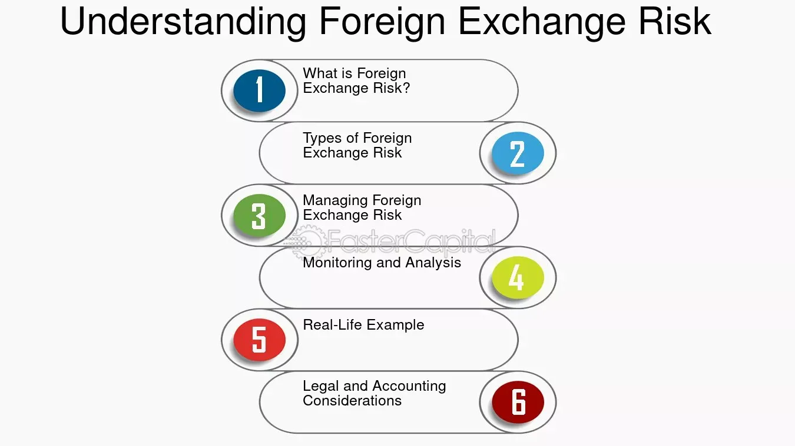

## Table of Contents

## What is a foreign fund?

A foreign fund is a type of investment fund that invests in assets from countries other than the investor's home country. These funds allow people to diversify their investments by putting money into different markets around the world. This can help spread risk because if one market goes down, another might go up.

Foreign funds can focus on specific regions, like Europe or Asia, or they can be global, investing in many different countries. They can include stocks, bonds, or other types of investments. By investing in a foreign fund, people can gain exposure to international companies and economies, which might offer opportunities not available in their home country. However, investing in foreign funds also comes with risks, like currency fluctuations and political instability in other countries.

## How does a foreign fund differ from a domestic fund?

A foreign fund and a domestic fund are different mainly because of where they invest their money. A foreign fund puts money into assets from other countries, like stocks or bonds from companies outside the investor's home country. This means if you live in the United States, a foreign fund might invest in companies in Japan or Germany. On the other hand, a domestic fund invests only in assets from the investor's own country. So, if you're in the U.S., a domestic fund would only buy stocks or bonds from American companies.

The main reason people choose foreign funds is to spread their investment risk. By investing in different countries, they can balance out losses in one market with gains in another. For example, if the U.S. market goes down, a foreign fund investing in Europe might still do well. However, foreign funds also come with extra risks, like changes in currency values or political problems in other countries. Domestic funds, while they can still go up and down with the market, don't have these extra risks because they stay within one country. So, choosing between a foreign and a domestic fund depends on how much risk you're willing to take and how you want to spread your investments.

## What are the primary mechanisms through which foreign funds operate?

Foreign funds work by collecting money from investors and using that money to buy assets like stocks and bonds from other countries. When you invest in a foreign fund, you're giving your money to the fund manager. The manager then uses that money to buy investments in different countries, hoping to make a profit. The fund might focus on one region, like Europe, or it could spread out across the world. The goal is to grow the money by [picking](/wiki/asset-class-picking) good investments in other countries.

Foreign funds also have to deal with things like currency changes and different rules in other countries. If the value of the currency in the country where the fund invests goes up or down, it can affect how much money the fund makes. For example, if the fund buys stocks in Japan and the yen gets stronger, the value of those stocks in your home currency might go up. Also, the fund manager has to follow the laws and regulations of the countries they invest in, which can be tricky. This is why foreign funds can be riskier than domestic funds, but they also offer a chance to make money in different parts of the world.

## What are the benefits of investing in foreign funds?

Investing in foreign funds can help you spread out your risk. When you put money into different countries, you're not relying on just one place to do well. If the market in your own country goes down, the markets in other countries might still be doing okay. This can help protect your money because if one part of your investment goes down, another part might go up. Plus, you can take advantage of opportunities that aren't available in your home country. For example, if there's a booming industry in another country, you can invest in that through a foreign fund.

Another benefit is that you can learn about different economies and industries around the world. By investing in foreign funds, you get a chance to see how companies in other countries work and grow. This can be really interesting and can help you make better investment choices. Also, foreign funds can sometimes offer higher returns than domestic funds because they can tap into fast-growing markets. But remember, with the chance for higher returns comes more risk, so it's important to think carefully about how much risk you're willing to take.

## What are the common types of foreign funds available to investors?

There are a few common types of foreign funds that investors can choose from. One type is called a global fund. A global fund can invest in companies from all around the world, including the investor's home country. This type of fund gives you a lot of variety because it can pick the best opportunities from any country. Another type is an international fund, which is similar but doesn't invest in the investor's home country. So, if you live in the U.S., an international fund would invest in companies outside the U.S.

Another common type is a regional fund, which focuses on a specific part of the world, like Europe or Asia. This can be good if you think that a particular region will do well. There are also country-specific funds, which invest only in one country. For example, a Japan fund would only buy stocks and bonds from companies in Japan. Each type of foreign fund has its own way of spreading out risk and trying to make money, so it's important to pick the one that fits your goals and how much risk you're willing to take.

## How can one invest in foreign funds?

To invest in foreign funds, you can start by talking to a financial advisor or using an online investment platform. They can help you find the right foreign fund that matches what you want to do with your money. You'll need to fill out some forms and maybe set up an account. Once you've done that, you can put money into the fund. The fund manager will then use your money to buy stocks or bonds from other countries.

After you've invested, you can keep an eye on how the fund is doing through regular reports or by checking the fund's performance online. Some funds let you add more money over time, or you might choose to take some money out if you need it. Remember, investing in foreign funds can be riskier than sticking to your own country, so it's a good idea to think about how much risk you're okay with before you start.

## What are the risks associated with investing in foreign funds?

Investing in foreign funds can be riskier than sticking to funds in your own country. One big risk is currency risk. This means that if the value of the currency in the country where the fund invests goes down compared to your home currency, your investment could lose value even if the stocks or bonds are doing well. Another risk is political risk. If there's a change in government or new laws in the countries where the fund invests, it could affect the value of your investment. For example, if a new law makes it harder for foreign investors to own stocks, the fund might have to sell at a loss.

There's also the risk of economic instability in other countries. If the economy in a country where the fund invests goes into a recession, the value of your investment could drop. Plus, foreign funds might not be as easy to understand as domestic funds because you have to keep up with news and events in other countries. This can make it harder to know if you're making a good investment. So, while foreign funds can offer a chance to make more money, they come with extra risks that you need to think about before you invest.

## How do currency fluctuations impact foreign fund investments?

Currency fluctuations can really affect your investments in foreign funds. When you invest in a foreign fund, your money is used to buy stocks or bonds in another country. If the value of that country's currency goes up compared to your home currency, your investment could be worth more when you convert it back. But if the value of the foreign currency goes down, your investment could lose value, even if the stocks or bonds are doing well. This is called currency risk.

For example, let's say you live in the U.S. and you invest in a fund that buys stocks in Japan. If the Japanese yen gets stronger compared to the U.S. dollar, the value of your investment in dollars goes up. But if the yen gets weaker, the value of your investment in dollars goes down. This can make it hard to predict how much money you'll actually get back from your foreign fund. So, currency fluctuations add another layer of risk to foreign fund investments, and it's something you need to think about before you invest.

## What role do geopolitical factors play in the performance of foreign funds?

Geopolitical factors can have a big impact on how well foreign funds do. These factors include things like wars, political changes, or new laws in the countries where the fund invests. If a country where the fund has investments goes through a political crisis or a war, it can make the stock market in that country go down. This means the value of the fund's investments could drop, and you might lose money. Also, if a new government comes in and changes the rules about foreign investments, it could make it harder for the fund to keep its money in that country. This could force the fund to sell its investments at a loss.

On top of that, geopolitical tensions between countries can affect trade and the economy. For example, if two countries where the fund invests start having problems with each other, it could lead to trade restrictions or sanctions. This can hurt the companies the fund has invested in, which in turn can lower the value of the fund. So, when you invest in foreign funds, you need to keep an eye on what's happening in the world because geopolitical events can shake things up and affect your investment.

## How can diversification through foreign funds affect an investment portfolio?

Diversification through foreign funds can help spread out the risk in your investment portfolio. When you invest in different countries, you're not putting all your eggs in one basket. If the market in your own country goes down, the markets in other countries might still be doing well. This can help protect your money because if one part of your investment goes down, another part might go up. By investing in foreign funds, you can take advantage of opportunities that aren't available in your home country, like booming industries or fast-growing economies.

However, adding foreign funds to your portfolio also comes with extra risks. Things like changes in currency values or political problems in other countries can affect how much money you make. If the value of the currency in the country where the fund invests goes down compared to your home currency, your investment could lose value. Also, if there's a war or a new government that changes the rules, it could hurt the companies the fund has invested in. So, while foreign funds can help you diversify and possibly make more money, they also add more risk to your portfolio. It's important to think about how much risk you're willing to take before you invest in foreign funds.

## What are the tax implications of investing in foreign funds?

Investing in foreign funds can make your taxes a bit more complicated. When you invest in a foreign fund, you might have to pay taxes in the country where the fund is based. This is called foreign withholding tax. It's taken out of any dividends or interest you earn before you get the money. Also, when you sell your investment in a foreign fund, you might have to pay capital gains tax in your home country. The rules can be different depending on where you live and where the fund is, so it's a good idea to talk to a tax advisor to understand what you might owe.

On top of the foreign taxes, you'll also have to report your foreign investments on your tax return at home. This means you need to keep good records of what you've earned and paid in taxes abroad. Some countries have tax treaties that can help lower the amount of tax you pay, but you need to know the details. It can get tricky, so it's important to understand how your foreign fund investments will affect your taxes and plan accordingly.

## What advanced strategies can be used to mitigate risks in foreign fund investments?

One advanced strategy to mitigate risks in foreign fund investments is currency hedging. This means using financial tools to protect against changes in currency values. For example, if you're investing in a fund that buys stocks in Europe, you could use a currency hedge to protect against the euro getting weaker compared to your home currency. This can help make sure that currency fluctuations don't hurt your investment as much. It's like putting up an umbrella to shield your money from the rain of currency changes.

Another strategy is to diversify not just across countries but also across different types of investments. Instead of putting all your money into one foreign fund, you could spread it out over several funds that invest in different regions or industries. This way, if one market or sector goes down, the others might still do well. It's like not putting all your eggs in one basket. You could also look into funds that focus on stable, well-established companies in other countries, which might be less risky than newer or smaller companies.

Lastly, staying informed about geopolitical events and economic trends can help you make better decisions. By keeping an eye on what's happening in the world, you can adjust your investments before big changes happen. For example, if you see that a country where your fund invests is about to have an election that could change the economy, you might decide to move some of your money to a safer place. It's like watching the weather forecast so you can prepare for a storm. Talking to a financial advisor who knows about foreign investments can also help you come up with a plan to manage the risks.

## What are the mechanisms of funds and how do they work?

Fund mechanisms are integral to the structure and operation of various investment funds, such as mutual funds, Exchange-Traded Funds (ETFs), and captive funds. These mechanisms are designed to enable efficient fund management, mitigate risks, and ensure compliance with regulatory standards. Understanding these mechanisms involves examining the operational dynamics, asset allocation strategies, and management tools employed within these funds.

### Mutual Funds

A mutual fund pools money from various investors to purchase a diversified portfolio of stocks, bonds, or other securities. They are managed by professional portfolio managers who make investment decisions based on the fund's objectives. The success of a mutual fund largely depends on effective asset allocation—distributing investments across various asset classes to balance risk and return. This involves using quantitative models and algorithms to optimize the portfolio, considering factors such as market conditions and investor goals. 

Mathematically, the process of asset allocation can be described by the Modern Portfolio Theory (MPT), which uses the following optimization equation to minimize risk for a given level of expected return:

$$
\min \sigma_p = \sqrt{\sum_{i=1}^{n}\sum_{j=1}^{n} w_i w_j \sigma_{ij} }
$$

Where:
- $\sigma_p$ is the portfolio standard deviation (risk).
- $w_i, w_j$ are the weights of assets $i$ and $j$ in the portfolio.
- $\sigma_{ij}$ is the covariance between assets $i$ and $j$.

### Exchange-Traded Funds (ETFs)

ETFs are investment funds that trade on stock exchanges, similar to individual stocks. They offer the benefit of combining the diversification of mutual funds with the trading flexibility of stocks. ETFs are structured around a specific index, commodity, or other asset class. Their operational mechanism involves tracking the performance of an index and relying on sophisticated data analytics for rebalancing the holdings in line with index changes.

The key to managing an [ETF](/wiki/etf-trading-strategies) is maintaining its price closely aligned with its net asset value (NAV). This is achieved through a process called [arbitrage](/wiki/arbitrage), where authorized participants can exchange the ETF shares for the underlying assets and vice versa, which helps in correcting any price discrepancies.

### Captive Funds

Captive funds are typically subsidiaries established by a parent company to manage and invest its assets. These funds often cater to niche market segments and are tailored to achieve specific business objectives of the parent company. The mechanisms in place for captive funds revolve around strategic asset management, tailored risk assessments, and alignment with the overarching corporate strategy.

### Role in Risk Mitigation and Regulatory Compliance

The mechanisms established within these funds ensure risk mitigation through diversification, asset allocation, and strategic investment approaches. Compliance with evolving regulatory requirements is integral to fund management, necessitating continuous monitoring and adoption of compliant operational practices.

Regulatory bodies like the Securities and Exchange Commission (SEC) in the United States provide frameworks and guidelines that these funds must adhere to, ensuring transparency, fiduciary responsibility, and protection of investor interests. Advanced compliance technologies and practices, including automated reporting and auditing systems, are employed to streamline these processes and reduce the risk of non-compliance.

In summary, fund mechanisms are crucial for the structure and efficient operations of various investment funds. Their role in ensuring effective asset management and adherence to regulatory compliance is vital for both protecting investor interests and optimizing fund performance.

## References & Further Reading

Chen, J. 'Foreign Fund: What It Is, How It Works, Risks.' Investopedia. This resource provides a comprehensive overview of foreign funds, detailing how they function and outlining the associated risks investors face when investing in international markets.

Jansen, S. 'Machine Learning for Algorithmic Trading.' This book offers insights into how [machine learning](/wiki/machine-learning) techniques are applied in [algorithmic trading](/wiki/algorithmic-trading), presenting models and strategies that can enhance trading accuracy and efficiency.

Johnson, B. 'Algorithmic Trading and DMA.' An in-depth exploration of algorithmic trading and Direct Market Access (DMA), this text covers the mechanics behind automated trading systems and their application in modern financial markets.

OECD. 'Foreign Direct Investment Statistics: Data, Analysis and Forecasts.' The Organisation for Economic Co-operation and Development provides statistical data and analysis on foreign direct investments. This resource is crucial for understanding global investment trends and the regulatory environments impacting international funds.

