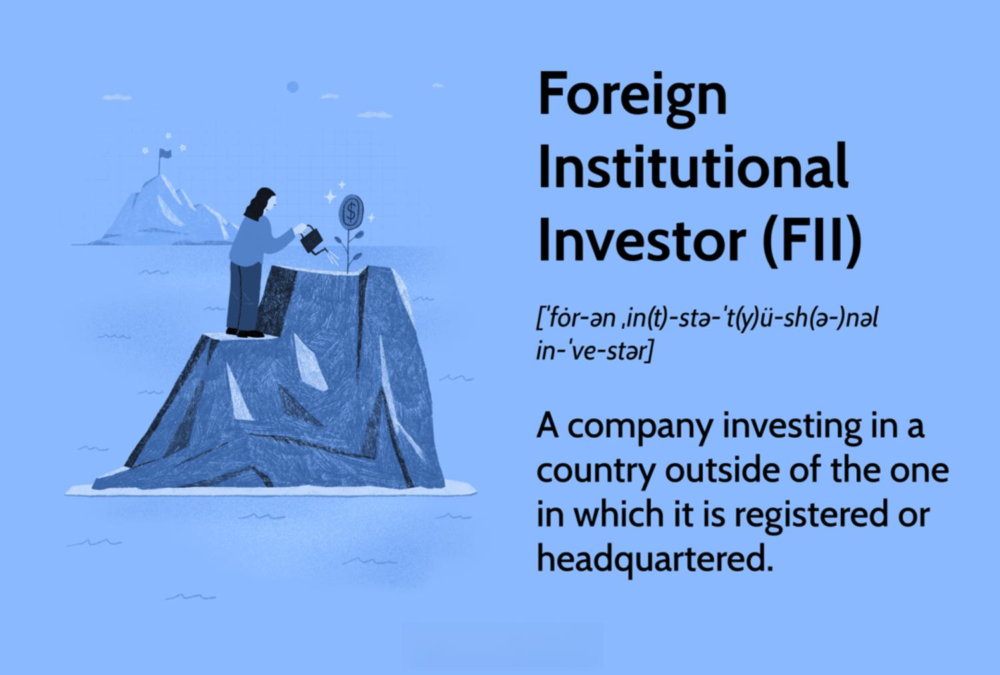

The landscape of global investment has drastically transformed over the years, guided by the movement and management of capital across borders. Central to this transformation are Foreign Institutional Investors (FIIs), which have emerged as dominant players in the global financial system. These entities, encompassing pension funds, investment banks, hedge funds, and mutual funds, exert significant influence on economies worldwide, with a pronounced impact on emerging markets. Countries such as India and China have been particularly affected, as FIIs bring not only much-needed capital but also the potential for substantial economic acceleration.

The advent of algorithmic trading has further reshaped this dynamic. By employing sophisticated algorithms, FIIs can execute trades at unprecedented speeds and volumes, thereby adding layers of complexity to financial transactions. This technological innovation does not merely enhance the capability of FIIs but also alters the traditional paradigms of trading, demanding adaptive measures from regulatory bodies to maintain market integrity.

In this article, we explore the regulations governing FII investments, the implications of algorithmic trading, and their combined impact on global financial markets. Understanding these elements is crucial, as they help illuminate the evolving nature of international investment and the strategic responses required to harness their benefits while mitigating associated risks.

## Table of Contents

## What Are Foreign Institutional Investors (FIIs)?

Foreign Institutional Investors (FIIs) are large-scale institutional investors that invest in financial markets beyond their country of origin. These entities include pension funds, investment banks, hedge funds, and mutual funds, which collectively manage significant amounts of capital. By extending their investment activities across national borders, FIIs contribute to the flow of capital between countries and often serve as pivotal players in international finance.

FIIs have a pronounced impact on emerging market economies such as India and China. They provide much-needed capital that supports infrastructure development, business expansion, and overall economic growth. The infusion of foreign investments can stimulate local stock markets, enhance liquidity, and drive growth in various sectors dependent on capital influx. This, in turn, can lead to elevated confidence levels among local investors and contribute to the development of more robust financial markets.

Given the considerable potential influence of FIIs on domestic economies, countries typically impose regulatory mechanisms to maintain stability. These measures often include restrictions on the ownership percentage and the scale of investments that FIIs can hold in domestic entities. Such regulations aim to safeguard national interests and prevent any one foreign entity or group of entities from accumulating excessive power over local markets.

Despite their many benefits, the presence of FIIs also entails risks. One significant concern is the [volatility](/wiki/volatility-trading-strategies) associated with their investments. FIIs have the flexibility to move substantial amounts of capital quickly, and in times of economic uncertainty or perceived instability, they may withdraw investments rapidly. Such capital flight can have adverse effects on the host country's economy, potentially leading to stock market downturns and exacerbating financial crises. 

The dual impact of FIIs—as catalysts for growth and sources of potential risk—necessitates careful regulatory oversight. Policymakers must balance the need to attract foreign capital with safeguards to protect against abrupt economic disruptions. This ongoing balancing act is critical to maintaining financial stability while leveraging the benefits of FII-enabled growth in emerging markets.

## Current FII Investment Regulations

Foreign Institutional Investors (FIIs) face a variety of investment regulations designed to balance the influx of foreign capital with the stability and integrity of domestic financial markets. Countries like India have historically imposed restrictions on the proportion of ownership that FIIs can hold in local companies. In India, the typical cap is set at 24% of the paid-up capital of a company. However, this limit can be extended to 49% or even 74% upon receiving approval from the company’s board of directors and passing a special resolution at the general meeting. These measures are implemented to protect domestic industries from excessive foreign influence while still attracting valuable foreign capital.

In contrast, China has taken significant steps to liberalize its market to attract FIIs, particularly by abolishing quotas on stock and bond investments. This approach aims to enhance foreign capital inflow by providing greater access to China's extensive financial markets. The removal of these quotas is a strategic move to diversify the investor base and ensure ample capital [liquidity](/wiki/liquidity-risk-premium) to sustain the country's economic growth.

Despite these liberalizations, specific regulations are necessary to maintain market stability and prevent potential economic destabilization. In both countries, these regulations are crafted to promote diversity, encourage competition, and prevent excessive market control by foreign entities. For instance, the implementation of rules requiring FIIs to invest a portion of their funds in government bonds or maintain a certain percentage in reserve currencies helps to mitigate rapid capital flight risks during economic downturns.

Additionally, registration with national regulatory bodies is mandatory for FIIs to operate legally within these markets. In India, the Securities and Exchange Board of India (SEBI) serves as the primary regulatory authority overseeing FII activities. SEBI's framework ensures FIIs comply with local laws, promote transparency, and maintain fair market practices. This registration process not only facilitates government oversight but also aids in monitoring foreign investments, ensuring they align with the country’s economic objectives.

In summary, while the removal of investment barriers in countries like India and China has made them attractive destinations for FIIs, the accompanying regulations are crucial to safeguarding the economic ecosystem's equilibrium. These frameworks aim to maximize the benefits of foreign investment while minimizing potential disruptions or market imbalances.

## Algorithmic Trading and Its Influence

Algorithmic trading refers to the use of computer-driven algorithms to execute trading orders based on predefined criteria, enabling transactions to be conducted at high speeds and volumes. This method leverages sophisticated data analytics and [machine learning](/wiki/machine-learning) models, allowing traders, particularly Foreign Institutional Investors (FIIs), to optimize their investment strategies by identifying patterns and executing trades more efficiently. These automated systems analyze vast quantities of market data to make rapid, objective trading decisions.

The primary advantage of [algorithmic trading](/wiki/algorithmic-trading) is increased market liquidity and reduced transaction costs. By automating the trading process, it minimizes human error and emotional bias, effectively streamlining execution. Additionally, the speed of algorithmic trading allows FIIs to capitalize quickly on market opportunities that align with their investment strategies.

However, the increased automation and speed introduce certain risks. Market volatility can be exacerbated by high-frequency trading, where algorithms execute a large number of orders within fractions of a second. This has occasionally led to unintended market events, such as flash crashes, where rapid selling causes a steep, brief drop in security prices, affecting overall market stability.

To mitigate these risks, regulatory bodies worldwide are updating policies and oversight mechanisms. Regulations are increasingly focusing on controlling high-frequency trading activities to prevent market manipulations and ensure stability. These measures often include requiring more detailed disclosures from traders, introducing circuit breakers to halt trading during extreme volatility, and deploying algorithms designed to detect and curtail destabilizing trading patterns.

As algorithmic trading continues to evolve, maintaining a balance between leveraging its benefits and managing its risks remains a priority for both regulatory agencies and financial market participants.

## Regional Analysis: India and China

India and China have emerged as significant recipients of Foreign Institutional Investor (FII) capital, largely due to their robust economic growth and evolving financial markets. In India, the Securities and Exchange Board of India (SEBI) has played a pivotal role in creating a structured regulatory environment that appeals to foreign investors. This involves clear guidelines on investment caps, mandatory registration of FIIs, and periodic updates to the regulatory framework to ensure transparency and market stability. The Indian stock market's high growth potential, coupled with reforms in economic policies, makes it an attractive destination for global capital. Measures such as increasing the investment limits and relaxing tax norms have further enhanced India's appeal to FIIs.

In contrast, China has strategically adjusted its policies to accommodate and attract FII participation by progressively lifting investment quotas. The removal of these quotas marks a strategic shift towards openness, aimed at integrating more with global financial systems. The Chinese government has implemented policies to streamline investor access and ensure that foreign investments contribute to sustained economic growth. Initiatives like the Stock Connect program between Shanghai, Shenzhen, and Hong Kong stock exchanges exemplify efforts to enhance market access for international investors.

Both India and China are grappling with the challenge of luring foreign investments while safeguarding their local industries against potential over-reliance on foreign capital. This necessitates a delicate balance where regulatory mechanisms are continually adapted to manage the risks associated with high FII flows, such as market volatility and economic influence. Both nations have shown a willingness to modify their regulatory landscapes, reflecting strategic adjustments to align with global market norms.

The ability to attract FII while protecting domestic interests demonstrates an ongoing commitment by India and China to foster stable and growth-oriented financial environments. These adjustments not only ensure national economic interests but also contribute to maintaining a favorable investment climate. As global economic dynamics evolve, the experience of India and China offers valuable insights into effectively managing FII capital and highlights the importance of agile regulatory responses.

## Benefits and Challenges of FII Investments

Foreign Institutional Investors (FIIs) play a pivotal role in the global financial ecosystem by bringing in essential foreign capital that can catalyze economic growth within host economies. This infusion of capital often contributes to strengthening foreign reserves and diversifying investment portfolios. However, the involvement of FIIs poses certain challenges that need careful management and regulatory oversight.

One of the primary benefits of FII investments lies in their potential to fuel economic growth. By providing substantial foreign capital, FIIs enable emerging economies to fund infrastructure projects, support industrial development, and enhance overall economic productivity. These investments not only help improve the infrastructure of the host country but also create jobs and foster innovation within various sectors.

FIIs also contribute to diversifying investment portfolios, both for individual investors and institutional bodies. Their presence introduces a broader spectrum of investment options and financial instruments, allowing for improved portfolio diversification. This diversification can result in more balanced risk-adjusted returns for investors, thereby promoting financial stability.

Despite these benefits, the challenges associated with FII investments primarily revolve around managing equity volatility and the risk of over-dependence on foreign capital. The infusion of FII capital can sometimes lead to fluctuating stock markets, as their investment decisions can create significant upward or downward pressures on asset prices. For instance, a sudden withdrawal of FII investments during economic downturns can trigger a rapid decline in stock prices, leading to market instability.

Moreover, there is a risk that domestic entities might become overly reliant on foreign investments, which can undermine local financial autonomy. This reliance can pose a vulnerability if global economic conditions shift unfavorably, potentially leading to a sharp outflow of foreign capital. Such capital flight can exacerbate economic downturns, resulting in severe repercussions for the host country’s financial stability.

Regulatory bodies play a crucial role in mitigating these risks through adaptive measures that ensure stable financial environments. These measures include setting limits on FII ownership in domestic companies, requiring registration with national regulatory agencies, and imposing capital controls to manage exposure to foreign capital flows. By continuously monitoring and adjusting these regulations, authorities aim to strike a balance between attracting FII investments and safeguarding domestic economies from potential disruptions.

Effective regulation is essential to maintain market confidence and financial stability. For example, the Securities and Exchange Board of India (SEBI) regulates FII activities to prevent market manipulation and promote transparency, while similar bodies in other nations undertake equivalent responsibilities. By fostering a robust regulatory framework, countries can maximize the benefits of FII investments while minimizing associated risks, thus ensuring sustained economic development.

## Conclusion

Foreign Institutional Investments (FIIs) continue to be integral to global financial markets, bringing both substantial opportunities and inherent challenges. They are pivotal in funneling foreign capital into markets, thereby catalyzing economic growth and enhancing liquidity. At the same time, the benefits of FIIs are accompanied by challenges, such as the potential for rapid and large-scale capital withdrawals which can destabilize local economies.

The advancement of algorithmic trading has further amplified the capabilities of FIIs. By employing sophisticated algorithms, FIIs can execute high-speed, high-[volume](/wiki/volume-trading-strategy) trades, optimized by advanced data analytics and machine learning models. This technological innovation enhances market efficiencies and can lead to reduced transaction costs. Nonetheless, the rapid pace and complexity of algorithmic trading necessitate stringent regulatory oversight to mitigate risks such as market volatility and flash crashes. Regulatory bodies worldwide are increasingly focusing on controlling high-frequency trading activities to safeguard market stability.

India and China exemplify how effectively managed economic policies can attract and regulate FII flows. India's strategic regulatory framework, underpinned by the Securities and Exchange Board of India (SEBI), creates a structured environment conducive to FII investments. Similarly, China’s proactive measures, such as removing investment quotas, have made it more welcoming to foreign capital. Both countries face the ongoing challenge of balancing the influx of foreign investments with the protection of local industries from excessive foreign influence. Their adaptive policy frameworks are critical in managing this balance.

The future trajectory of FII investments will largely depend on the ability of regulatory frameworks to evolve in response to technological advancements. As market dynamics continue to change with technological progression, the role of adaptive and forward-thinking regulations will be crucial in continuing to attract FII while maintaining financial stability. Ensuring that these frameworks are robust enough to manage both the opportunities and risks associated with FIIs will be essential in sustaining healthy financial markets globally.

## References & Further Reading

[1]: Ganguli, S. (2003). ["FIIs and Indian Stock Market"](https://www.researchgate.net/publication/272664757_FIIs_and_Indian_Stock_Market_A_Causality_Investigation). Social Science Research Network.

[2]: Allen, F., & Gale, D. (2000). ["Financial Contagion."](https://www.journals.uchicago.edu/doi/10.1086/262109) The Review of Financial Studies, 14(1), 1-33.

[3]: Chan, E. P. (2009). ["Quantitative Trading: How to Build Your Own Algorithmic Trading Business"](https://github.com/ftvision/quant_trading_echan_book). Wiley.

[4]: Lopez de Prado, M. (2018). ["Advances in Financial Machine Learning"](https://www.amazon.com/Advances-Financial-Machine-Learning-Marcos/dp/1119482089). Wiley.

[5]: Jones, C. M. (2013). ["What Do We Know About High-Frequency Trading?"](https://www.wsj.com/public/resources/documents/HFT0324.pdf) Journal of Financial Markets, 16(1), 3-10.

[6]: Patel, S. A., & Sarkar, A. (1998). ["Stock Market Crises in Emerging Markets"](https://papers.ssrn.com/sol3/papers.cfm?abstract_id=76168). National Bureau of Economic Research.

[7]: Shleifer, A., & Summers, L. H. (1990). ["The Noise Trader Approach to Finance"](https://www.aeaweb.org/articles?id=10.1257/jep.4.2.19) Journal of Economic Perspectives, 4(2), 19-33.

[8]: Jansen, S. (2018). ["Machine Learning for Algorithmic Trading"](https://github.com/stefan-jansen/machine-learning-for-trading). Packt Publishing.

[9]: McCauley, R. N. (2008). ["Integrating China into the Global Financial System"](https://www.bu.edu/gdp/files/2021/02/McCauley2021_Article_TheGlobalDomainOfTheDollarEigh.pdf). Bank for International Settlements Papers No. 66.

[10]: Madhavan, A. (2012). ["Exchange-Traded Funds, Market Structure, and the Flash Crash"](https://www.tandfonline.com/doi/abs/10.2469/faj.v68.n4.6) Review of Financial Studies, 25(11), 3305–3333.